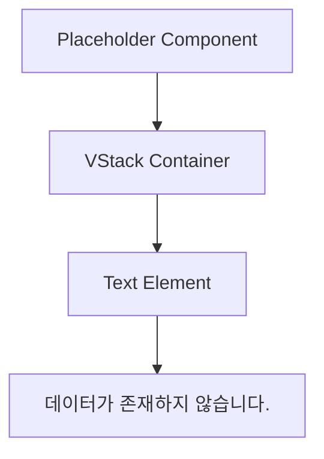
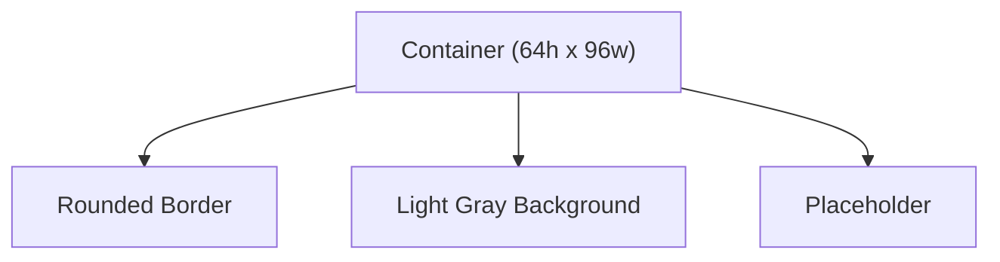
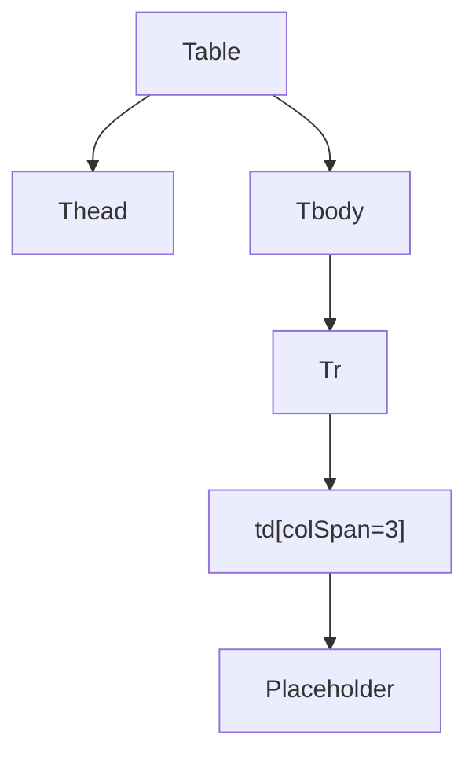
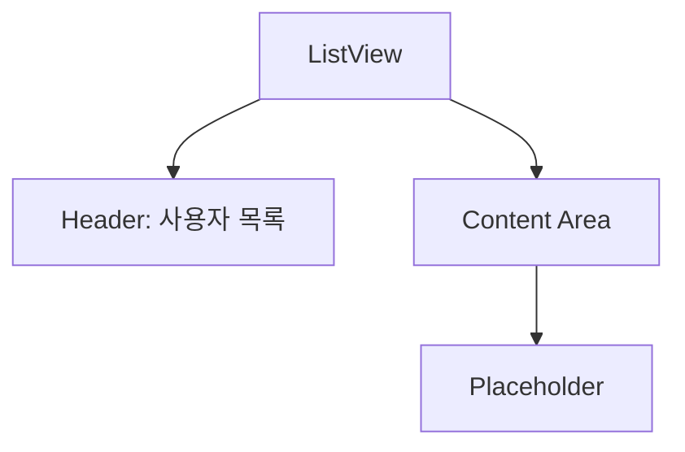
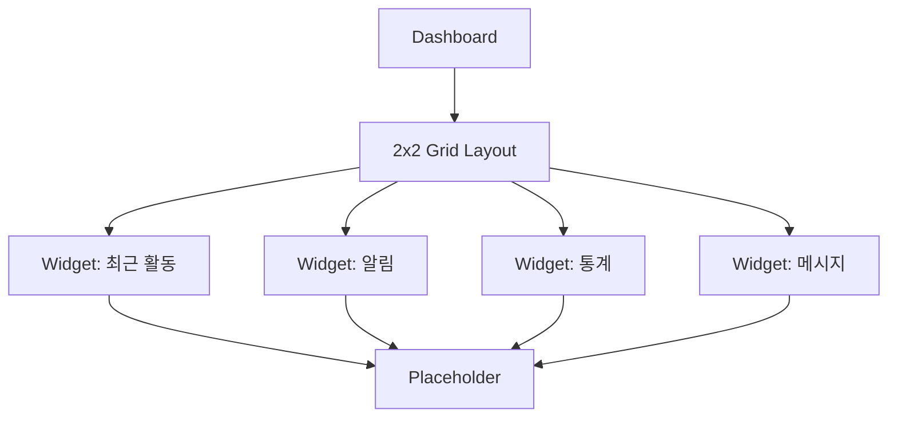

# Placeholder Component

<cite>
**Referenced Files in This Document**   
- [Placeholder.tsx](file://packages/ui/src/components/ui/Placeholder/Placeholder.tsx)
- [Placeholder.stories.tsx](file://packages/ui/src/components/ui/Placeholder/Placeholder.stories.tsx)
</cite>

## Table of Contents
1. [Introduction](#introduction)
2. [Core Implementation](#core-implementation)
3. [Visual Design and Styling](#visual-design-and-styling)
4. [Usage Examples](#usage-examples)
5. [Integration with Application State](#integration-with-application-state)
6. [Common Issues and Best Practices](#common-issues-and-best-practices)

## Introduction
The Placeholder component is a UI element designed to display a message when no data is available in a given context. It serves as a visual indicator for empty states across various application interfaces such as lists, tables, and content areas. The component is implemented in the shared UI library and provides a consistent way to communicate the absence of data to users.

**Section sources**
- [Placeholder.tsx](file://packages/ui/src/components/ui/Placeholder/Placeholder.tsx#L1-L10)
- [Placeholder.stories.tsx](file://packages/ui/src/components/ui/Placeholder/Placeholder.stories.tsx#L1-L145)

## Core Implementation
The Placeholder component is a functional React component that renders a centered message indicating the absence of data. It uses two core UI primitives: VStack for vertical layout alignment and Text for displaying the message content. The component is designed to take up full width of its container while centering its content both horizontally and vertically.

The implementation is minimal and focused, containing only the essential elements needed to convey the empty state. The message text is hardcoded in Korean as "데이터가 존재하지 않습니다." which translates to "Data does not exist."

**Diagram sources**
- [Placeholder.tsx](file://packages/ui/src/components/ui/Placeholder/Placeholder.tsx#L4-L10)

**Section sources**
- [Placeholder.tsx](file://packages/ui/src/components/ui/Placeholder/Placeholder.tsx#L1-L10)

## Visual Design and Styling
The Placeholder component employs a clean and minimalist visual design focused on readability and consistency. It uses VStack to create a vertically centered layout that works well in various container sizes and contexts. The text is styled with a gray color (text-gray-500) to distinguish it from primary content while maintaining sufficient contrast for readability.

The component's styling emphasizes:
- Centered alignment within its container
- Full width occupation to maintain layout consistency
- Subtle text color that indicates secondary/inactive content
- Responsive design that adapts to different container dimensions

The design follows accessibility guidelines by ensuring adequate color contrast between the text and background in typical usage scenarios.

**Section sources**
- [Placeholder.tsx](file://packages/ui/src/components/ui/Placeholder/Placeholder.tsx#L6-L8)

## Usage Examples
The Placeholder component can be used in various contexts where empty states need to be communicated to users. The following examples demonstrate common usage patterns:

### In Container Context
When displayed within a defined container, the Placeholder maintains proper spacing and alignment, showing how it integrates with bordered or styled containers.

**Diagram sources**
- [Placeholder.stories.tsx](file://packages/ui/src/components/ui/Placeholder/Placeholder.stories.tsx#L38-L40)

### In Table Context
The component can be used within table cells, typically with colspan to span multiple columns when no data rows are available.

**Diagram sources**
- [Placeholder.stories.tsx](file://packages/ui/src/components/ui/Placeholder/Placeholder.stories.tsx#L66-L68)

### In List View Context
For list-based interfaces, the Placeholder can be used within a card-like container that has a header section and content area.

**Diagram sources**
- [Placeholder.stories.tsx](file://packages/ui/src/components/ui/Placeholder/Placeholder.stories.tsx#L90-L92)

### In Dashboard Context
Multiple instances of the Placeholder can be used across different sections of a dashboard layout to indicate empty states in various widgets simultaneously.

**Diagram sources**
- [Placeholder.stories.tsx](file://packages/ui/src/components/ui/Placeholder/Placeholder.stories.tsx#L109-L122)

**Section sources**
- [Placeholder.stories.tsx](file://packages/ui/src/components/ui/Placeholder/Placeholder.stories.tsx#L35-L134)

## Integration with Application State
While the current implementation displays a static message, the Placeholder component can be integrated with application state management systems to display context-specific messages based on various conditions:

- **Data Loading Status**: Could be enhanced to show different messages during loading vs. no data states
- **User Permissions**: Could display permission-specific messages when users lack access to certain data
- **Search Results**: Could be adapted to show "No matching results found" for empty search queries
- **Feature Availability**: Could indicate when features are not yet available during development

The component's current simplicity makes it easy to extend with props for dynamic message content, icons, or action buttons as needed by different application contexts.

## Common Issues and Best Practices
### Maintaining Visual Consistency
Ensure consistent styling across different placeholder types by:
- Using the same text color and typography
- Maintaining uniform spacing and alignment
- Applying consistent container styles when used in cards or bordered areas

### Handling Action Buttons
While the current implementation doesn't include action buttons, if extended:
- Position buttons below the text message
- Use appropriate button styling for primary actions
- Ensure adequate spacing between elements
- Consider mobile responsiveness for button placement

### Ensuring Responsiveness
The component naturally adapts to different screen sizes due to its flex-based layout, but when used in complex layouts:
- Test across various device sizes
- Ensure text remains readable at smaller widths
- Verify centering works correctly in constrained spaces
- Check for overflow issues in narrow containers

### Accessibility Considerations
To enhance accessibility:
- Ensure sufficient color contrast between text and background
- Consider adding ARIA labels for screen readers
- Maintain proper heading hierarchy when used with surrounding content
- Ensure keyboard navigation isn't disrupted by placeholder elements

**Section sources**
- [Placeholder.tsx](file://packages/ui/src/components/ui/Placeholder/Placeholder.tsx#L1-L10)
- [Placeholder.stories.tsx](file://packages/ui/src/components/ui/Placeholder/Placeholder.stories.tsx#L1-L145)