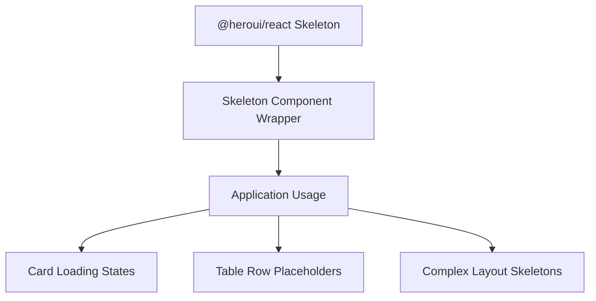
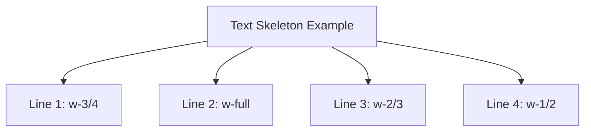
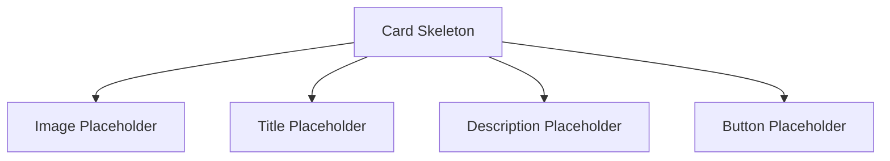
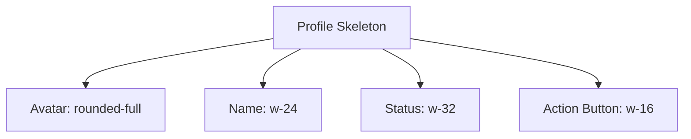
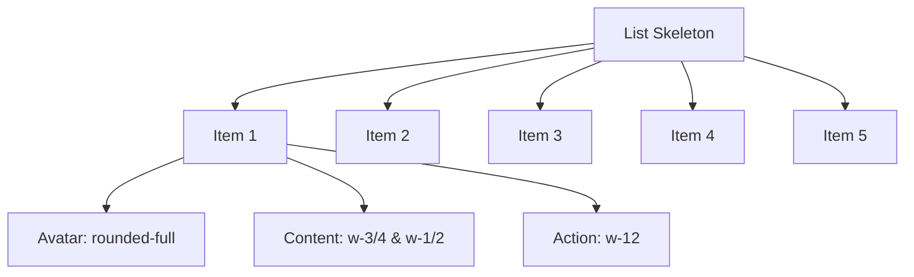
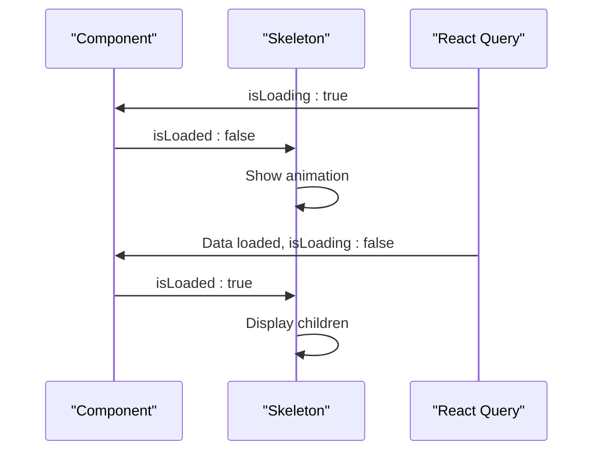

# Skeleton Component

<cite>
**Referenced Files in This Document**   
- [Skeleton.tsx](file://packages/ui/src/components/ui/Skeleton/Skeleton.tsx)
- [Skeleton.stories.tsx](file://packages/ui/src/components/ui/Skeleton/Skeleton.stories.tsx)
</cite>

## Table of Contents
1. [Introduction](#introduction)
2. [Core Implementation](#core-implementation)
3. [Component Props](#component-props)
4. [Usage Examples](#usage-examples)
5. [Integration with Loading States](#integration-with-loading-states)
6. [Accessibility Features](#accessibility-features)
7. [Performance Considerations](#performance-considerations)
8. [Responsive Design](#responsive-design)
9. [Troubleshooting Guide](#troubleshooting-guide)

## Introduction

The Skeleton component is a loading placeholder that displays a visual representation of content while data is being fetched. It provides a smooth user experience by indicating that content is loading without leaving blank spaces. The component is built on top of the `@heroui/react` library's Skeleton component, serving as a wrapper that standardizes its usage across the application.

This documentation details the implementation, props, usage patterns, and integration strategies for the Skeleton component, with a focus on practical applications in various UI contexts.

**Section sources**
- [Skeleton.stories.tsx](file://packages/ui/src/components/ui/Skeleton/Skeleton.stories.tsx#L5-L13)

## Core Implementation

The Skeleton component is implemented as a simple wrapper around the `@heroui/react` Skeleton component. It imports the base Skeleton component and its props interface, then re-exports it with the project's naming convention. This approach allows for consistent styling and behavior across the application while maintaining the underlying functionality and performance optimizations of the original implementation.

The implementation follows a minimalist pattern, avoiding unnecessary complexity while providing all the functionality needed for loading state visualization. This wrapper pattern also enables future customization if specific project requirements emerge.

**Diagram sources**
- [Skeleton.tsx](file://packages/ui/src/components/ui/Skeleton/Skeleton.tsx#L1-L5)

**Section sources**
- [Skeleton.tsx](file://packages/ui/src/components/ui/Skeleton/Skeleton.tsx#L1-L5)

## Component Props

The Skeleton component accepts the following props that control its appearance and behavior:

| Prop Name | Type | Default Value | Description |
|---------|------|---------------|-------------|
| isLoaded | boolean | false | Controls whether the skeleton animation is displayed or the actual content is shown |
| children | ReactNode | undefined | The actual content to display when loading is complete |
| className | string | undefined | Additional CSS classes for custom styling of the skeleton element |

The component inherits all props from the `@heroui/react` Skeleton component, allowing for extensive customization through Tailwind CSS classes applied via the `className` prop. This includes control over width, height, border radius, and other visual properties.

**Section sources**
- [Skeleton.stories.tsx](file://packages/ui/src/components/ui/Skeleton/Skeleton.stories.tsx#L18-L31)

## Usage Examples

### Text Skeletons

For displaying loading states of text content, the Skeleton component can be used with various width configurations to represent different text lengths:

**Diagram sources**
- [Skeleton.stories.tsx](file://packages/ui/src/components/ui/Skeleton/Skeleton.stories.tsx#L68-L75)

### Card Skeleton

For card-based layouts, multiple Skeleton components can be combined to create a complete placeholder that matches the final card structure:

**Diagram sources**
- [Skeleton.stories.tsx](file://packages/ui/src/components/ui/Skeleton/Skeleton.stories.tsx#L85-L100)

### Profile Skeleton

Profile cards with avatars can be represented using circular skeletons for the avatar and rectangular ones for text content:

**Diagram sources**
- [Skeleton.stories.tsx](file://packages/ui/src/components/ui/Skeleton/Skeleton.stories.tsx#L111-L121)

### List Skeleton

For lists, the Skeleton component can be used within a mapping function to create multiple identical loading items:

**Diagram sources**
- [Skeleton.stories.tsx](file://packages/ui/src/components/ui/Skeleton/Skeleton.stories.tsx#L132-L152)

**Section sources**
- [Skeleton.stories.tsx](file://packages/ui/src/components/ui/Skeleton/Skeleton.stories.tsx#L67-L163)

## Integration with Loading States

The Skeleton component integrates seamlessly with React Query's loading states and global application loading indicators. By binding the `isLoaded` prop to the loading state of a query, the component automatically transitions from the skeleton animation to the actual content when data becomes available.

In the interactive example provided in the stories, a simulated loading state demonstrates this behavior with a 2-second delay before showing the actual content. This pattern can be directly applied to real data fetching scenarios where the loading state from React Query's `isLoading` flag is passed to the `isLoaded` prop.

**Diagram sources**
- [Skeleton.stories.tsx](file://packages/ui/src/components/ui/Skeleton/Skeleton.stories.tsx#L165-L208)

**Section sources**
- [Skeleton.stories.tsx](file://packages/ui/src/components/ui/Skeleton/Skeleton.stories.tsx#L165-L218)

## Accessibility Features

The Skeleton component maintains accessibility during loading states by properly managing screen reader behavior. When `isLoaded` is false, the component ensures that no content is announced to screen readers, preventing confusion about missing information. Once content is loaded and `isLoaded` becomes true, the actual content becomes accessible to assistive technologies.

The component also maintains proper focus management, ensuring that interactive elements within the skeleton (when loaded) are keyboard accessible. This is particularly important for button placeholders that become functional when the actual content is displayed.

**Section sources**
- [Skeleton.stories.tsx](file://packages/ui/src/components/ui/Skeleton/Skeleton.stories.tsx#L198-L205)

## Performance Considerations

The Skeleton component is optimized for performance, leveraging the underlying implementation from `@heroui/react`. The animation is implemented using CSS transitions rather than JavaScript, ensuring smooth performance even on low-end devices.

For server-side rendering scenarios, the component handles hydration correctly by initially rendering the skeleton state and then transitioning to the loaded state when appropriate. This prevents content layout shifts and provides a consistent user experience across different rendering environments.

To optimize performance in complex layouts with multiple skeleton instances, it's recommended to conditionally render entire sections rather than individual skeleton components when possible, reducing the overall component tree complexity during loading states.

**Section sources**
- [Skeleton.tsx](file://packages/ui/src/components/ui/Skeleton/Skeleton.tsx#L1-L5)

## Responsive Design

The Skeleton component is fully responsive and can be styled using Tailwind CSS classes to adapt to different screen sizes. By using responsive width classes (e.g., `w-full sm:w-3/4 md:w-1/2`), the skeleton placeholders can adjust their size based on the viewport, maintaining a consistent layout across devices.

The component inherits all responsive capabilities from the underlying `@heroui/react` implementation, including support for different aspect ratios, flexible heights, and adaptive border radii. This allows for creating realistic placeholders that match the final content's responsive behavior.

**Section sources**
- [Skeleton.stories.tsx](file://packages/ui/src/components/ui/Skeleton/Skeleton.stories.tsx#L70-L74)

## Troubleshooting Guide

### Animation Performance Issues

If experiencing performance issues with the skeleton animation on low-end devices, ensure that the component is not being unnecessarily re-rendered. Since the animation is CSS-based, it should not cause performance bottlenecks under normal circumstances.

### Server-Side Rendering Issues

For server-side rendering scenarios, ensure that the initial state of `isLoaded` is consistent between server and client to avoid hydration mismatches. If data is available on the server, set `isLoaded` to true to render the actual content directly.

### Screen Reader Compatibility

If screen reader users are experiencing issues, verify that the content within the `children` prop is properly structured with appropriate semantic HTML elements and ARIA attributes when `isLoaded` becomes true.

**Section sources**
- [Skeleton.stories.tsx](file://packages/ui/src/components/ui/Skeleton/Skeleton.stories.tsx#L165-L208)
- [Skeleton.tsx](file://packages/ui/src/components/ui/Skeleton/Skeleton.tsx#L1-L5)