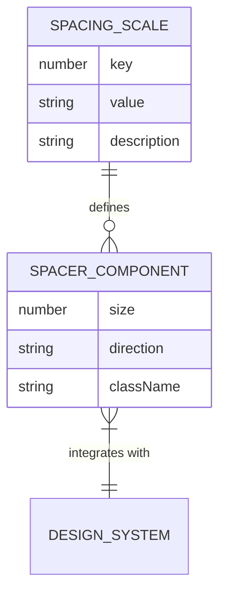
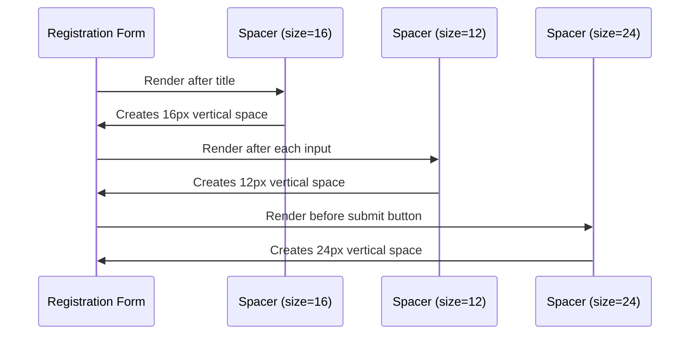
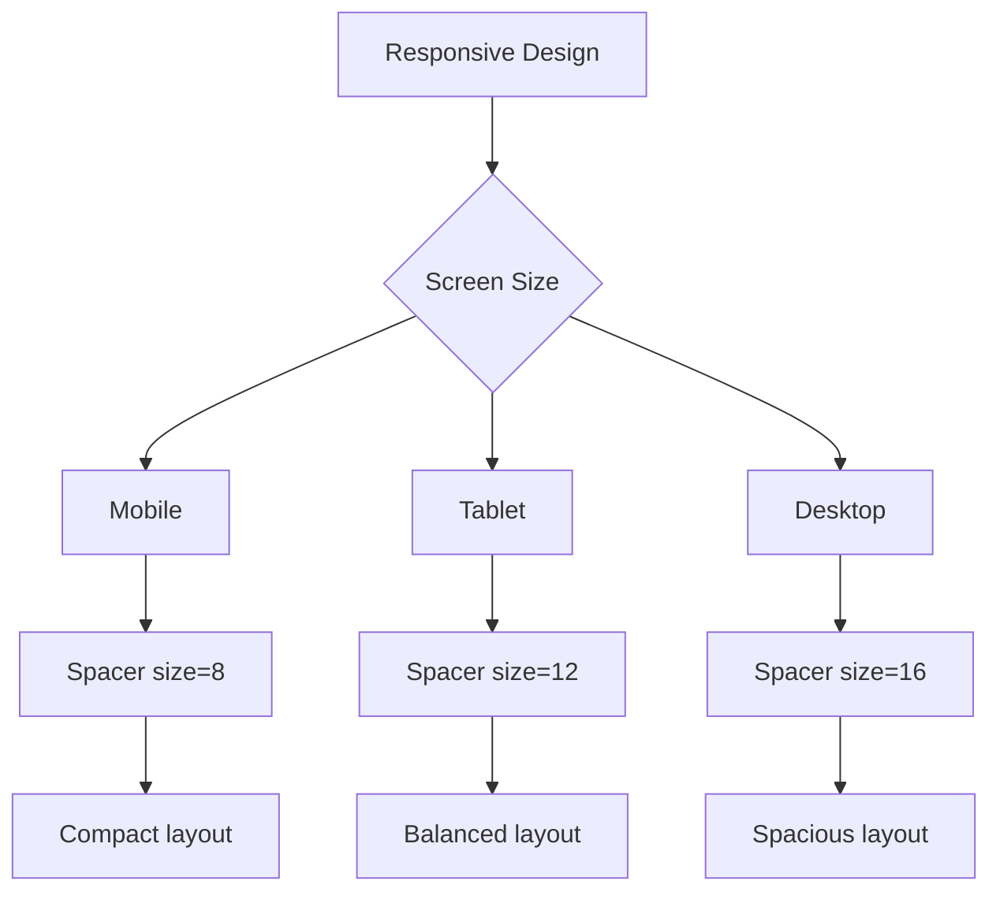

# Spacer Component

<cite>
**Referenced Files in This Document**   
- [Spacer.tsx](file://packages/ui/src/components/ui/surfaces/Spacer/Spacer.tsx)
- [Spacer.stories.tsx](file://packages/ui/src/components/ui/surfaces/Spacer/Spacer.stories.tsx)
- [tokens.ts](file://packages/design-system/src/theme/tokens.ts)
- [VStack.tsx](file://packages/ui/src/components/ui/surfaces/VStack/VStack.tsx)
</cite>

## Table of Contents
1. [Introduction](#introduction)
2. [Core Implementation](#core-implementation)
3. [Props Documentation](#props-documentation)
4. [Design System Integration](#design-system-integration)
5. [Usage Examples](#usage-examples)
6. [Responsive Design Patterns](#responsive-design-patterns)
7. [Layout Integration Guidelines](#layout-integration-guidelines)
8. [Best Practices](#best-practices)

## Introduction
The Spacer component is a utility component designed to create consistent, configurable spacing between elements in the user interface. It serves as a fundamental building block for maintaining visual rhythm and proper layout composition across the application. The component provides a simple, declarative way to add space between UI elements while ensuring alignment with the design system's spacing scale.

The Spacer component is particularly valuable in scenarios where CSS margin-based spacing might lead to inconsistent results or when working within flex and grid layouts where collapsing margins can create unexpected spacing issues. By using a dedicated spacer element, developers can achieve predictable and maintainable spacing throughout the application.

## Core Implementation

The Spacer component is implemented as a simple React functional component that creates an empty div with configurable dimensions. The implementation leverages Tailwind CSS's spacing utilities through dynamic class generation, allowing for pixel-perfect control over spacing while maintaining compatibility with the design system's token-based approach.

The component's core logic determines whether to apply width or height based on the direction prop, then generates the appropriate Tailwind class using bracket notation for arbitrary values. This approach provides maximum flexibility while keeping the implementation lightweight and performant.

**Section sources**
- [Spacer.tsx](file://packages/ui/src/components/ui/surfaces/Spacer/Spacer.tsx#L1-L20)

## Props Documentation

The Spacer component accepts the following props to control its behavior and appearance:

- **size**: Controls the amount of space created by the component. Accepts a number representing pixels, with a default value of 4. This prop allows for precise control over spacing, enabling developers to specify exact pixel values that align with the design system's spacing scale.

- **direction**: Determines the orientation of the spacer. Accepts "horizontal" or "vertical" values, with "vertical" as the default. This prop enables the component to create space either as width (for horizontal spacing) or height (for vertical spacing) between elements.

- **className**: Allows for additional CSS classes to be applied to the spacer element. This is useful for debugging (adding background colors to visualize the spacer) or applying additional styling when needed.

```mermaid
flowchart TD
A[Spacer Component] --> B{Props}
B --> C[size: number = 4]
B --> D[direction: 'horizontal' | 'vertical' = 'vertical']
B --> E[className: string = ""]
C --> F[Generates spacing class]
D --> F
F --> G[Creates div with calculated dimensions]
G --> H[Returns invisible spacer element]
```

**Diagram sources**
- [Spacer.tsx](file://packages/ui/src/components/ui/surfaces/Spacer/Spacer.tsx#L1-L20)

**Section sources**
- [Spacer.tsx](file://packages/ui/src/components/ui/surfaces/Spacer/Spacer.tsx#L1-L20)

## Design System Integration

The Spacer component is designed to work seamlessly with the application's design system, which defines a comprehensive spacing scale based on Tailwind CSS conventions. The design system's spacing tokens provide a consistent foundation for UI spacing, ensuring visual harmony across all components and layouts.

The spacing scale follows a rem-based system that translates to pixel values for practical use:

- 1 = 0.25rem (4px)
- 2 = 0.5rem (8px) 
- 3 = 0.75rem (12px)
- 4 = 1rem (16px)
- 5 = 1.25rem (20px)
- 6 = 1.5rem (24px)
- 8 = 2rem (32px)
- 10 = 2.5rem (40px)
- 12 = 3rem (48px)
- 16 = 4rem (64px)
- 20 = 5rem (80px)
- 24 = 6rem (96px)

While the Spacer component accepts pixel values directly, these values should align with the design system's spacing scale to maintain consistency. For example, using size values of 8, 12, 16, 24, or 32 ensures that spacing adheres to the established design language.

The component's integration with the design system ensures that spacing decisions are not arbitrary but are instead based on a deliberate, systematic approach that contributes to a cohesive user experience.



**Diagram sources**
- [tokens.ts](file://packages/design-system/src/theme/tokens.ts#L53-L67)
- [Spacer.tsx](file://packages/ui/src/components/ui/surfaces/Spacer/Spacer.tsx#L1-L20)

**Section sources**
- [tokens.ts](file://packages/design-system/src/theme/tokens.ts#L53-L67)

## Usage Examples

### Layout Composition
The Spacer component is ideal for creating vertical or horizontal space between UI elements in a layout. For vertical spacing between content sections:

```jsx
<div>
  <Header />
  <Spacer size={24} />
  <MainContent />
  <Spacer size={24} />
  <Footer />
</div>
```

For horizontal spacing between side-by-side elements:

```jsx
<div className="flex">
  <Sidebar />
  <Spacer size={16} direction="horizontal" />
  <MainPanel />
</div>
```

### Form Field Separation
In form layouts, the Spacer component ensures consistent spacing between form fields, submit buttons, and other elements:

```jsx
<form>
  <h3>Registration Form</h3>
  <Spacer size={16} />
  <input type="text" placeholder="First Name" />
  <Spacer size={12} />
  <input type="text" placeholder="Last Name" />
  <Spacer size={12} />
  <input type="email" placeholder="Email" />
  <Spacer size={24} />
  <button type="submit">Sign Up</button>
</form>
```

### Responsive Design Patterns
The Spacer component can be used in responsive layouts where spacing needs to adapt to different screen sizes. While the component itself doesn't have built-in responsive properties, it can be combined with conditional rendering:

```jsx
<div>
  <Content />
  {isMobile ? (
    <Spacer size={12} />
  ) : (
    <Spacer size={24} />
  )}
  <RelatedContent />
</div>
```



**Diagram sources**
- [Spacer.stories.tsx](file://packages/ui/src/components/ui/surfaces/Spacer/Spacer.stories.tsx#L144-L182)
- [Spacer.tsx](file://packages/ui/src/components/ui/surfaces/Spacer/Spacer.tsx#L1-L20)

**Section sources**
- [Spacer.stories.tsx](file://packages/ui/src/components/ui/surfaces/Spacer/Spacer.stories.tsx#L144-L182)

## Responsive Design Patterns

The Spacer component supports responsive design by allowing developers to adjust spacing based on screen size or device characteristics. While the component doesn't have built-in responsive properties, it can be effectively used in responsive layouts through several patterns.

One common approach is to use media queries or responsive hooks to conditionally render different spacer sizes:

```jsx
const ResponsiveLayout = () => {
  const isSmallScreen = useMediaQuery('(max-width: 768px)');
  
  return (
    <div>
      <Header />
      <Spacer size={isSmallScreen ? 8 : 16} />
      <Content />
      <Spacer size={isSmallScreen ? 8 : 24} />
      <Footer />
    </div>
  );
};
```

Another pattern involves using the Spacer component in conjunction with responsive container components like VStack, which can automatically adjust their gap spacing based on breakpoints:

```jsx
<VStack gap={isMobile ? 2 : 4}>
  <Item>Content 1</Item>
  <Item>Content 2</Item>
  <Item>Content 3</Item>
</VStack>
```

The Spacer component can also be used to create visual hierarchy in responsive layouts, where spacing increases on larger screens to improve readability and content separation, while maintaining a more compact layout on smaller screens.



**Diagram sources**
- [Spacer.stories.tsx](file://packages/ui/src/components/ui/surfaces/Spacer/Spacer.stories.tsx)
- [VStack.tsx](file://packages/ui/src/components/ui/surfaces/VStack/VStack.tsx#L9)

**Section sources**
- [Spacer.stories.tsx](file://packages/ui/src/components/ui/surfaces/Spacer/Spacer.stories.tsx)
- [VStack.tsx](file://packages/ui/src/components/ui/surfaces/VStack/VStack.tsx#L9)

## Layout Integration Guidelines

### Flex Layouts and Collapsing Margins
When using the Spacer component in flex layouts, it provides a reliable alternative to CSS margins, which can sometimes collapse in unexpected ways. Unlike margin-based spacing, the Spacer component creates actual space as a DOM element, preventing margin collapse issues:

```jsx
<div className="flex">
  <div>Item 1</div>
  <Spacer size={16} direction="horizontal" />
  <div>Item 2</div>
  <Spacer size={16} direction="horizontal" />
  <div>Item 3</div>
</div>
```

### Grid Systems
In CSS Grid layouts, the Spacer component can be used to create space between grid items when the grid gap property is not sufficient or when more granular control is needed:

```jsx
<div className="grid grid-cols-3">
  <div>Content</div>
  <Spacer size={24} />
  <div className="col-span-2">Wide Content</div>
</div>
```

### Maintaining Visual Rhythm
To maintain visual rhythm across different screen sizes, follow these guidelines:
- Use consistent spacing values from the design system's scale
- Establish a vertical rhythm by using multiples of the base spacing unit (4px or 8px)
- Consider the relationship between typography line height and spacing
- Use larger spacing values to create visual hierarchy and separation between major content sections

The Spacer component should be used intentionally to create meaningful separation between content, rather than as a general layout tool. It's particularly effective for:
- Separating major content sections
- Creating breathing room around interactive elements
- Establishing visual hierarchy in complex layouts
- Maintaining consistent spacing in dynamic or conditional layouts

```mermaid
classDiagram
class Spacer {
+size : number
+direction : string
+className : string
+render() : JSX.Element
}
class VStack {
+gap : number
+alignItems : string
+justifyContent : string
}
class HStack {
+gap : number
+alignItems : string
+justifyContent : string
}
Spacer --> VStack : "complements"
Spacer --> HStack : "complements"
VStack --> "flex" : "uses"
HStack --> "flex" : "uses"
```

**Diagram sources**
- [Spacer.tsx](file://packages/ui/src/components/ui/surfaces/Spacer/Spacer.tsx#L1-L20)
- [VStack.tsx](file://packages/ui/src/components/ui/surfaces/VStack/VStack.tsx#L1-L75)

**Section sources**
- [Spacer.tsx](file://packages/ui/src/components/ui/surfaces/Spacer/Spacer.tsx#L1-L20)
- [VStack.tsx](file://packages/ui/src/components/ui/surfaces/VStack/VStack.tsx#L1-L75)

## Best Practices

1. **Consistent Spacing Values**: Always use spacing values that align with the design system's scale (4, 8, 12, 16, 24, 32, etc.) to maintain visual consistency across the application.

2. **Semantic Spacing**: Choose spacer sizes based on the semantic relationship between elements. Use smaller spaces (4-8px) for closely related elements and larger spaces (24-32px) for separating major content sections.

3. **Accessibility**: The Spacer component includes `aria-hidden="true"` to ensure it doesn't interfere with screen readers, as it's purely a visual element with no semantic meaning.

4. **Performance**: The component is lightweight and has minimal impact on performance, making it safe to use liberally throughout the application.

5. **Debugging**: When debugging layout issues, temporarily add a background color to the spacer using the className prop to visualize the space it creates.

6. **Responsive Design**: Combine the Spacer component with responsive hooks or media queries to adjust spacing based on screen size, ensuring optimal layout on all devices.

7. **Alternative to Margin**: Use the Spacer component instead of CSS margins when you need predictable spacing that won't collapse in flex layouts or when working with complex nested components.

8. **Documentation**: When using non-standard spacing values, add comments to explain the rationale, especially if the spacing serves a specific design purpose.

By following these best practices, developers can leverage the Spacer component to create well-structured, visually appealing layouts that adhere to the design system's principles and provide a consistent user experience across the application.

**Section sources**
- [Spacer.tsx](file://packages/ui/src/components/ui/surfaces/Spacer/Spacer.tsx#L1-L20)
- [Spacer.stories.tsx](file://packages/ui/src/components/ui/surfaces/Spacer/Spacer.stories.tsx)