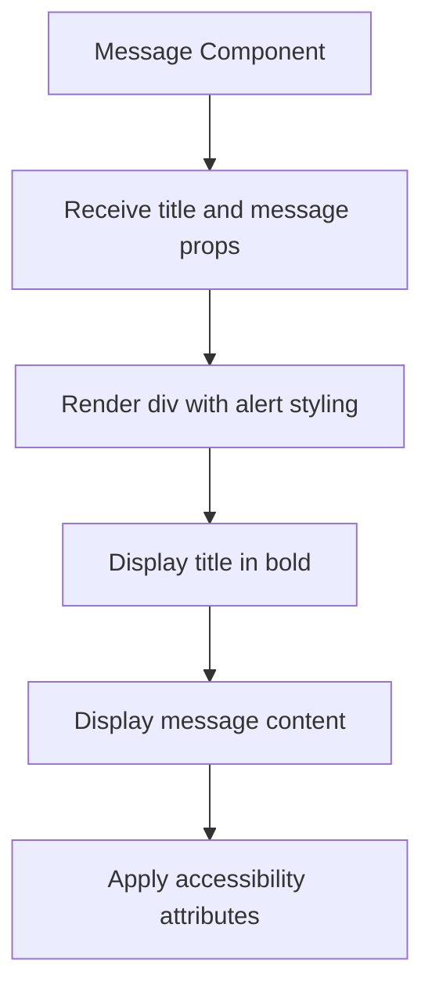
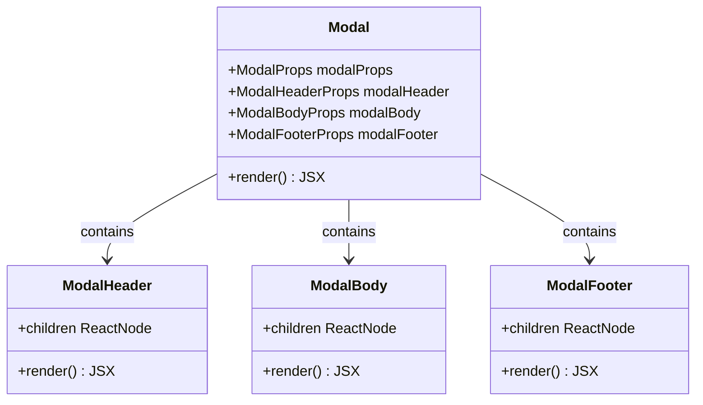
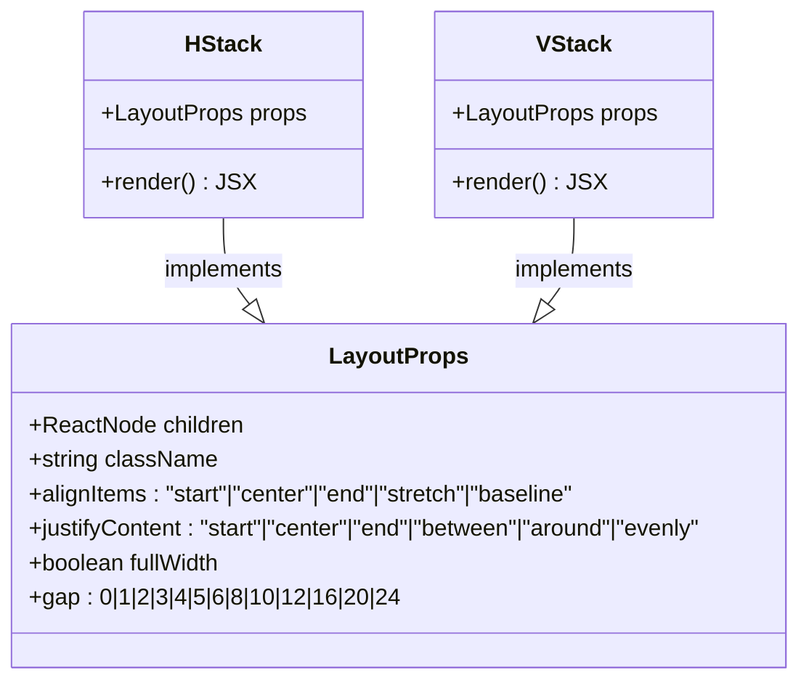

# Utility Components

<cite>
**Referenced Files in This Document**   
- [Skeleton.tsx](file://packages/ui/src/components/ui/Skeleton/Skeleton.tsx)
- [Placeholder.tsx](file://packages/ui/src/components/ui/Placeholder/Placeholder.tsx)
- [Message.tsx](file://packages/ui/src/components/ui/Message/Message.tsx)
- [Modal.tsx](file://packages/ui/src/components/layout/Modal/Modal.tsx)
- [Spacer.tsx](file://packages/ui/src/components/ui/Spacer/Spacer.tsx)
- [HStack.tsx](file://packages/ui/src/components/ui/HStack/HStack.tsx)
- [VStack.tsx](file://packages/ui/src/components/ui/VStack/VStack.tsx)
- [index.ts](file://packages/ui/src/components/ui/index.ts)
</cite>

## Table of Contents
1. [Introduction](#introduction)
2. [Core Utility Components](#core-utility-components)
3. [Layout Components](#layout-components)
4. [State and Loading Management](#state-and-loading-management)
5. [Accessibility Features](#accessibility-features)
6. [Integration with Application State](#integration-with-application-state)
7. [Common Issues and Solutions](#common-issues-and-solutions)
8. [Conclusion](#conclusion)

## Introduction
The shared-frontend library provides a comprehensive set of utility components designed to enhance user experience, streamline development, and ensure consistency across applications. This document details the implementation, use cases, and design patterns for key utility components including Skeleton, Placeholder, Message, Modal, Spacer, HStack, and VStack. These components address common UI challenges related to loading states, error conditions, and complex layouts while maintaining accessibility and responsive design principles.

## Core Utility Components

### Skeleton Component
The Skeleton component provides visual placeholders during content loading, creating a smoother user experience by indicating where content will appear. It wraps the @heroui/react Skeleton component, inheriting its animation and styling capabilities.

The component accepts standard SkeletonProps and renders a placeholder element that transitions to the actual content when loading completes. It's commonly used to represent text lines, images, and buttons in card layouts or list items, maintaining layout stability during data fetching.

**Section sources**
- [Skeleton.tsx](file://packages/ui/src/components/ui/Skeleton/Skeleton.tsx)

### Placeholder Component
The Placeholder component displays a standardized message when no data is available. It renders a centered VStack container with a Text element showing "데이터가 존재하지 않습니다." (No data exists) in gray text.

This component serves as a consistent empty state indicator across applications, preventing blank areas in the UI and providing users with clear feedback about the absence of data. It can be easily customized by wrapping it with additional styling or replacing the text content.

**Section sources**
- [Placeholder.tsx](file://packages/ui/src/components/ui/Placeholder/Placeholder.tsx)

### Message Component
The Message component displays informational alerts with a title and message content. It features a blue left border, light blue background, and blue text, following standard alert design patterns.

Accepting title and message props, this component creates accessible alerts with proper ARIA roles. The styling emphasizes important information while maintaining visual hierarchy within the interface. It's typically used for system notifications, form validation feedback, or instructional content.

**Diagram sources**
- [Message.tsx](file://packages/ui/src/components/ui/Message/Message.tsx)

**Section sources**
- [Message.tsx](file://packages/ui/src/components/ui/Message/Message.tsx)

## Layout Components

### Modal Component
The Modal component provides a wrapper around the base modal functionality from @heroui/react. It standardizes modal presentation with predefined properties including scroll behavior, size (5xl), and default open state.

The component accepts modalHeader, modalBody, and modalFooter props to customize different sections of the modal. It uses ModalContent, ModalHeader, ModalBody, and ModalFooter from the base library to structure the modal layout, ensuring consistency in modal appearance and behavior across the application.

**Diagram sources**
- [Modal.tsx](file://packages/ui/src/components/layout/Modal/Modal.tsx)

**Section sources**
- [Modal.tsx](file://packages/ui/src/components/layout/Modal/Modal.tsx)

### Spacer Component
The Spacer component creates configurable empty space in the UI using pixel-based measurements. It accepts size (default 4), direction ("horizontal" or "vertical"), and className props to control its dimensions and styling.

This utility component provides precise control over spacing, complementing the gap-based spacing in HStack and VStack components. The direction prop determines whether the spacer affects width (horizontal) or height (vertical), with the size prop setting the pixel dimension. The component includes aria-hidden="true" for accessibility, indicating it's purely decorative.

**Section sources**
- [Spacer.tsx](file://packages/ui/src/components/ui/Spacer/Spacer.tsx)

### HStack and VStack Components
The HStack and VStack components provide flexible layout containers for horizontal and vertical arrangements respectively. Both components use class-variance-authority (cva) to generate Tailwind CSS classes based on props, enabling consistent styling across the application.

HStack creates horizontal flex containers with configurable alignment, justification, width, and gap properties. VStack functions similarly but with flex-col orientation for vertical layouts. Both components support various alignment options (start, center, end, stretch, baseline) and justification options (start, center, end, between, around, evenly), with predefined gap values corresponding to Tailwind's spacing scale.

**Diagram sources**
- [HStack.tsx](file://packages/ui/src/components/ui/HStack/HStack.tsx)
- [VStack.tsx](file://packages/ui/src/components/ui/VStack/VStack.tsx)

**Section sources**
- [HStack.tsx](file://packages/ui/src/components/ui/HStack/HStack.tsx)
- [VStack.tsx](file://packages/ui/src/components/ui/VStack/VStack.tsx)

## State and Loading Management
The utility components work together to manage various application states, particularly loading and empty states. The Skeleton component addresses loading states by providing animated placeholders that maintain layout integrity while data loads. This prevents layout shifts and provides visual feedback that content is being prepared.

The Placeholder component handles empty states when data queries return no results. Together with the Message component, they create a comprehensive system for communicating state to users. These components can be integrated with global loading states through context providers, allowing components to respond to application-wide loading indicators.

For example, a data grid might use Skeleton components when the loading flag is active, switch to actual data when available, and render a Placeholder when the data array is empty. This creates a seamless user experience across different data states without requiring developers to implement state handling logic in each component.

**Section sources**
- [Skeleton.tsx](file://packages/ui/src/components/ui/Skeleton/Skeleton.tsx)
- [Placeholder.tsx](file://packages/ui/src/components/ui/Placeholder/Placeholder.tsx)
- [Message.tsx](file://packages/ui/src/components/ui/Message/Message.tsx)

## Accessibility Features
All utility components incorporate accessibility best practices. The Message component uses role="alert" to notify assistive technologies of important information. The Spacer component includes aria-hidden="true" since it serves only a visual purpose and contains no meaningful content.

The HStack and VStack components maintain native accessibility of their children by not introducing additional ARIA roles that might interfere with screen readers. The Modal component inherits accessibility features from @heroui/react, including proper focus management and keyboard navigation.

Text elements within these components use appropriate semantic HTML and contrast ratios to ensure readability. The consistent use of standardized components across the application creates a predictable experience for users of assistive technologies, reducing cognitive load and improving navigation efficiency.

**Section sources**
- [Message.tsx](file://packages/ui/src/components/ui/Message/Message.tsx)
- [Spacer.tsx](file://packages/ui/src/components/ui/Spacer/Spacer.tsx)
- [HStack.tsx](file://packages/ui/src/components/ui/HStack/HStack.tsx)
- [VStack.tsx](file://packages/ui/src/components/ui/VStack/VStack.tsx)

## Integration with Application State
The utility components integrate with application state management through props and context. They can respond to global loading states, notification systems, and user preferences. For example, the Skeleton component's isLoaded prop can be connected to a global loading indicator in a state management store.

The Message component can be used within notification systems to display alerts triggered by application events. Modal components can be controlled by state variables that determine visibility, allowing them to be opened or closed programmatically in response to user actions or system events.

These components are designed to be composable, allowing developers to build higher-level abstractions that encapsulate specific state management patterns. For instance, a DataContainer component might combine Skeleton, Placeholder, and Message components with conditional rendering based on loading, error, and empty state flags from a data fetching hook.

**Section sources**
- [Skeleton.tsx](file://packages/ui/src/components/ui/Skeleton/Skeleton.tsx)
- [Placeholder.tsx](file://packages/ui/src/components/ui/Placeholder/Placeholder.tsx)
- [Message.tsx](file://packages/ui/src/components/ui/Message/Message.tsx)
- [Modal.tsx](file://packages/ui/src/components/layout/Modal/Modal.tsx)

## Common Issues and Solutions

### Modal Stacking
When multiple modals are needed simultaneously, the current Modal component implementation may create stacking issues. Developers should implement a modal stack management system using context to coordinate multiple modal layers, ensuring proper z-index ordering and focus management.

### Accessibility Traps
While individual components follow accessibility guidelines, improper usage can create traps. For example, placing interactive elements within a Spacer component would violate accessibility principles. Developers should ensure that only the appropriate components contain interactive content and that keyboard navigation flows logically through the interface.

### Performance Considerations
Animation-heavy components like Skeleton can impact performance when used excessively. The skeleton animations should be optimized and potentially disabled for users who prefer reduced motion, respecting the prefers-reduced-motion media query. Implementing virtualization for lists containing skeleton items can also improve performance.

### Responsive Layout Challenges
The fixed gap values in HStack and VStack may not adapt well to all screen sizes. Consider extending these components to accept responsive gap configurations or creating variants for different breakpoints to ensure optimal spacing across devices.

**Section sources**
- [Skeleton.tsx](file://packages/ui/src/components/ui/Skeleton/Skeleton.tsx)
- [Spacer.tsx](file://packages/ui/src/components/ui/Spacer/Spacer.tsx)
- [HStack.tsx](file://packages/ui/src/components/ui/HStack/HStack.tsx)
- [VStack.tsx](file://packages/ui/src/components/ui/VStack/VStack.tsx)

## Conclusion
The utility components in the shared-frontend library provide essential building blocks for creating consistent, accessible, and user-friendly interfaces. By standardizing common UI patterns like loading states, empty states, messaging, and layout structures, these components reduce development time and ensure visual consistency across applications.

The components are designed with composability in mind, allowing developers to combine them in various ways to address complex UI requirements. Their integration with state management systems enables responsive interfaces that adapt to different data states and user interactions.

By following the documented patterns and being aware of potential issues like modal stacking and accessibility traps, development teams can leverage these utility components to create high-quality user experiences efficiently and consistently.