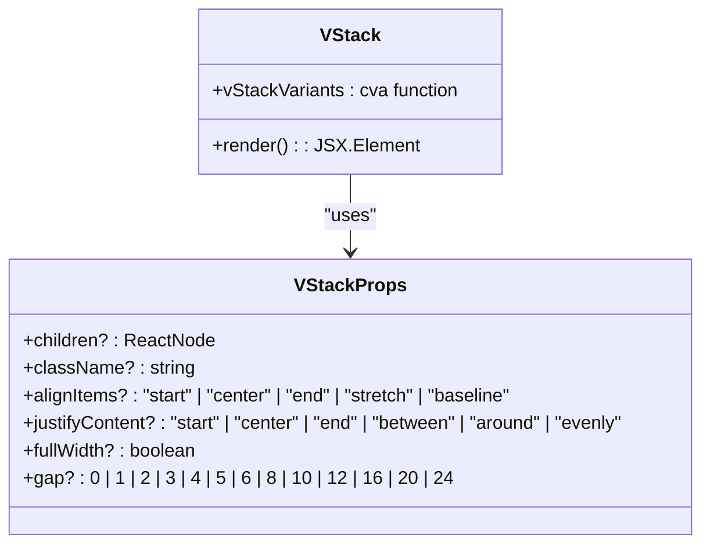
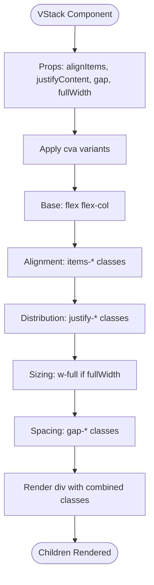
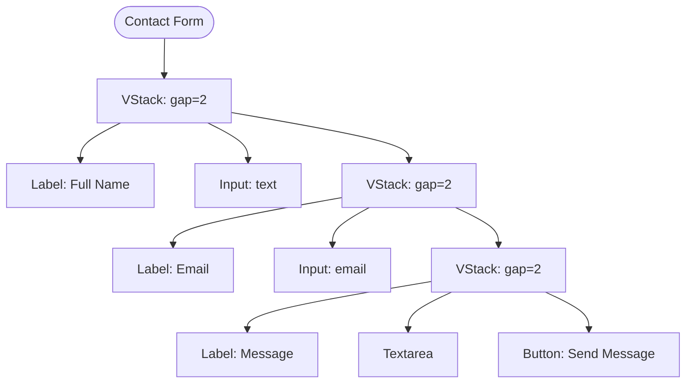
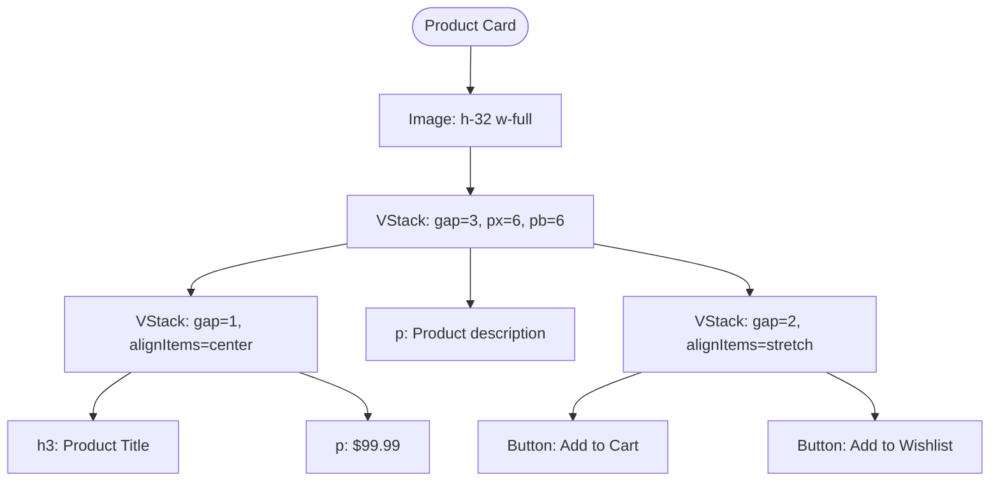
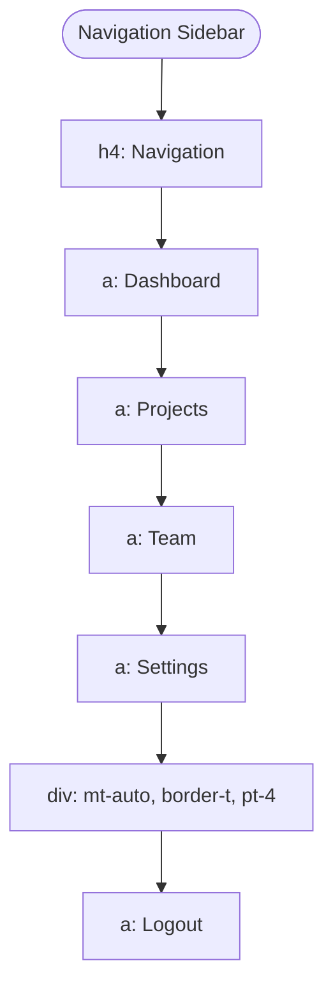
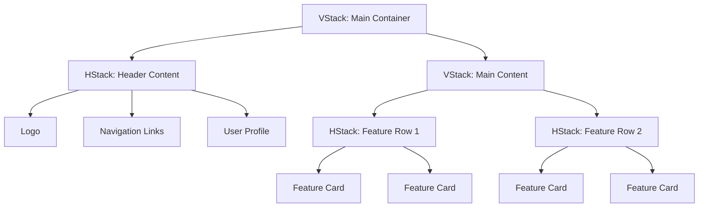
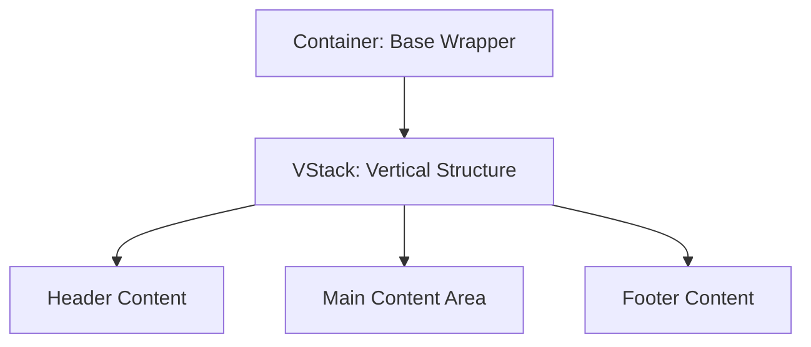
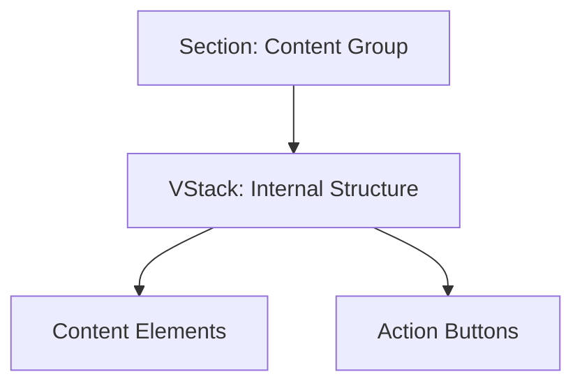
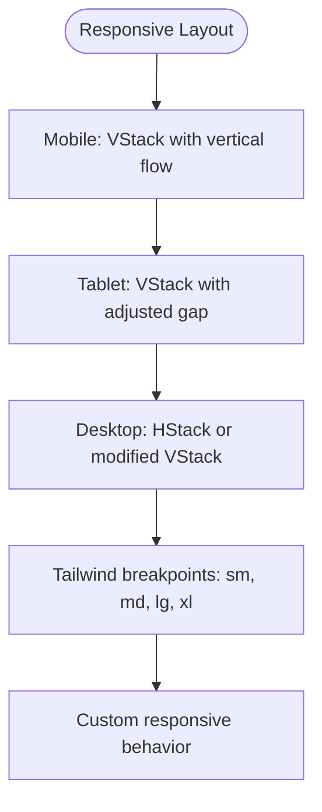

# VStack Component

<cite>
**Referenced Files in This Document**   
- [VStack.tsx](file://packages/ui/src/components/ui/surfaces/VStack/VStack.tsx)
- [VStack.stories.tsx](file://packages/ui/src/components/ui/surfaces/VStack/VStack.stories.tsx)
- [HStack.tsx](file://packages/ui/src/components/ui/surfaces/HStack/HStack.tsx)
- [Container.tsx](file://packages/ui/src/components/ui/surfaces/Container/Container.tsx)
- [Main.tsx](file://packages/ui/src/components/ui/layouts/Main/Main.tsx)
- [Table.tsx](file://packages/ui/src/components/ui/layouts/Table/Table.tsx)
- [Section.tsx](file://packages/ui/src/components/ui/surfaces/Section/Section.tsx)
- [Spacer.tsx](file://packages/ui/src/components/ui/surfaces/Spacer/Spacer.tsx)
</cite>

## Table of Contents
1. [Introduction](#introduction)
2. [Core Implementation](#core-implementation)
3. [Props and Configuration](#props-and-configuration)
4. [Practical Usage Examples](#practical-usage-examples)
5. [Integration with Other Layout Components](#integration-with-other-layout-components)
6. [Responsive Behavior and Scrolling](#responsive-behavior-and-scrolling)
7. [Best Practices and Common Issues](#best-practices-and-common-issues)

## Introduction

The VStack component is a fundamental layout utility in the shared-frontend library that enables vertical arrangement of child elements using CSS Flexbox. It provides a clean, semantic way to create vertical stacks with configurable spacing, alignment, and distribution options. The component is built using Tailwind CSS utility classes through the class-variance-authority (cva) library, ensuring consistent styling across the application.

As a core building block for UI composition, VStack is used throughout the application for form layouts, card content organization, navigation menus, and complex nested UI structures. Its implementation follows modern React patterns with TypeScript for type safety and predictable behavior.

**Section sources**
- [VStack.tsx](file://packages/ui/src/components/ui/surfaces/VStack/VStack.tsx#L1-L74)
- [VStack.stories.tsx](file://packages/ui/src/components/ui/surfaces/VStack/VStack.stories.tsx#L1-L436)

## Core Implementation

The VStack component is implemented as a simple wrapper around a div element with flexbox styling. It uses the class-variance-authority library to generate CSS classes based on component props, providing a type-safe and efficient way to handle different configuration options.

The core implementation establishes a vertical flex container with configurable properties for alignment, spacing, and distribution. The component applies the "flex flex-col" base classes to create a vertical flex container, then conditionally applies additional classes based on the provided props.

**Diagram sources**
- [VStack.tsx](file://packages/ui/src/components/ui/surfaces/VStack/VStack.tsx#L3-L74)

**Section sources**
- [VStack.tsx](file://packages/ui/src/components/ui/surfaces/VStack/VStack.tsx#L1-L74)

## Props and Configuration

The VStack component provides several props to control its layout behavior:

### Alignment Props

| Prop | Values | Description | Default |
|------|--------|-------------|---------|
| alignItems | "start", "center", "end", "stretch", "baseline" | Controls horizontal alignment of child elements | "stretch" |
| justifyContent | "start", "center", "end", "between", "around", "evenly" | Controls vertical distribution of child elements | "start" |

### Spacing and Sizing Props

| Prop | Values | Description | Default |
|------|--------|-------------|---------|
| gap | 0, 1, 2, 3, 4, 5, 6, 8, 10, 12, 16, 20, 24 | Controls spacing between child elements in pixels (Tailwind spacing units) | 4 |
| fullWidth | boolean | When true, makes the stack take full width of its container | false |
| className | string | Additional CSS classes to apply to the stack | "" |

The component uses Tailwind's gap utilities to control spacing between children, with predefined values that correspond to common spacing requirements. The gap values are mapped to Tailwind's gap classes (e.g., gap-0, gap-1, gap-4, etc.).

**Diagram sources**
- [VStack.tsx](file://packages/ui/src/components/ui/surfaces/VStack/VStack.tsx#L14-L55)

**Section sources**
- [VStack.tsx](file://packages/ui/src/components/ui/surfaces/VStack/VStack.tsx#L3-L74)

## Practical Usage Examples

The VStack component is versatile and can be used in various UI patterns across the application.

### Form Layouts

VStack is ideal for creating structured form layouts with consistent spacing between form elements. The component ensures proper vertical alignment and spacing between labels, inputs, and buttons.

**Diagram sources**
- [VStack.stories.tsx](file://packages/ui/src/components/ui/surfaces/VStack/VStack.stories.tsx#L292-L313)

### Card Content Organization

For card components, VStack provides a clean way to organize content with proper spacing and alignment. It can be nested within other VStack components to create complex card layouts with headers, content sections, and action buttons.

**Diagram sources**
- [VStack.stories.tsx](file://packages/ui/src/components/ui/surfaces/VStack/VStack.stories.tsx#L328-L360)

### List Items and Navigation

VStack is commonly used for creating navigation menus and list items with consistent spacing and alignment. The component's ability to stretch items to full width makes it ideal for sidebar navigation and menu systems.

**Diagram sources**
- [VStack.stories.tsx](file://packages/ui/src/components/ui/surfaces/VStack/VStack.stories.tsx#L375-L403)

**Section sources**
- [VStack.stories.tsx](file://packages/ui/src/components/ui/surfaces/VStack/VStack.stories.tsx#L61-L435)

## Integration with Other Layout Components

The VStack component works seamlessly with other layout components in the shared-frontend library to create complex, responsive UIs.

### With HStack for Grid-like Layouts

VStack and HStack can be combined to create grid-like layouts where VStack handles the vertical structure and HStack handles horizontal arrangements within each row.

**Section sources**
- [HStack.tsx](file://packages/ui/src/components/ui/surfaces/HStack/HStack.tsx#L3-L83)
- [VStack.tsx](file://packages/ui/src/components/ui/surfaces/VStack/VStack.tsx#L3-L74)

### With Container for Page Layouts

The Container component serves as a base wrapper, while VStack provides the vertical structure within it. This combination is used in various layout components like MainLayout and TableLayout.

**Section sources**
- [Container.tsx](file://packages/ui/src/components/ui/surfaces/Container/Container.tsx#L1-L14)
- [Main.tsx](file://packages/ui/src/components/ui/layouts/Main/Main.tsx#L1-L12)
- [Table.tsx](file://packages/ui/src/components/ui/layouts/Table/Table.tsx#L1-L12)

### With Section for Content Grouping

The Section component uses VStack internally to create grouped content areas with consistent styling and spacing. This pattern is used to organize content into logical sections with borders and padding.

**Section sources**
- [Section.tsx](file://packages/ui/src/components/ui/surfaces/Section/Section.tsx#L1-L15)
- [VStack.tsx](file://packages/ui/src/components/ui/surfaces/VStack/VStack.tsx#L3-L74)

## Responsive Behavior and Scrolling

While the VStack component itself doesn't include built-in responsive breakpoints or scrolling behavior, it works well with CSS classes to handle these concerns.

### Handling Long Content

When content exceeds the viewport height, VStack relies on parent containers to manage scrolling behavior. Common patterns include:

- Using fixed height containers with overflow-y-auto
- Applying flex-1 to allow the stack to grow and shrink
- Using CSS classes like "max-h-screen" and "overflow-y-auto" for scrollable content

### Responsive Design

The component integrates with Tailwind's responsive prefixes to enable different behaviors at different breakpoints. For example:

- Using "md:flex-row" to change from vertical to horizontal layout on larger screens
- Adjusting gap values with "sm:gap-2 md:gap-4" for different spacing at different breakpoints
- Controlling width with "w-full sm:w-auto" for responsive width behavior

The Spacer component complements VStack by providing flexible spacing that can be adjusted based on the layout requirements.

**Section sources**
- [Spacer.tsx](file://packages/ui/src/components/ui/surfaces/Spacer/Spacer.tsx#L1-L21)
- [VStack.tsx](file://packages/ui/src/components/ui/surfaces/VStack/VStack.tsx#L3-L74)

## Best Practices and Common Issues

### Best Practices

1. **Use appropriate gap values**: Choose gap values that provide adequate spacing without excessive whitespace
2. **Combine with HStack for complex layouts**: Use VStack for vertical structure and HStack for horizontal arrangements
3. **Leverage fullWidth prop**: Use fullWidth={true} when you want the stack to take the full width of its container
4. **Nest VStack components**: It's common to nest VStack components for complex layouts with multiple levels of organization

### Common Issues and Solutions

1. **Content exceeding viewport height**: Apply overflow-y-auto to parent containers when content might exceed the viewport height
2. **Inconsistent spacing**: Use consistent gap values across similar components for visual harmony
3. **Alignment issues**: Ensure proper use of alignItems and justifyContent props to achieve the desired layout
4. **Responsive behavior**: Combine VStack with Tailwind's responsive classes to create layouts that work across device sizes

The VStack component is a fundamental building block in the shared-frontend library, providing a reliable and flexible way to create vertical layouts. Its simple API and integration with Tailwind CSS make it easy to use while providing powerful layout capabilities.

**Section sources**
- [VStack.tsx](file://packages/ui/src/components/ui/surfaces/VStack/VStack.tsx#L1-L74)
- [VStack.stories.tsx](file://packages/ui/src/components/ui/surfaces/VStack/VStack.stories.tsx#L1-L436)
- [HStack.tsx](file://packages/ui/src/components/ui/surfaces/HStack/HStack.tsx#L3-L83)
- [Spacer.tsx](file://packages/ui/src/components/ui/surfaces/Spacer/Spacer.tsx#L1-L21)