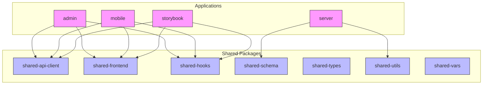
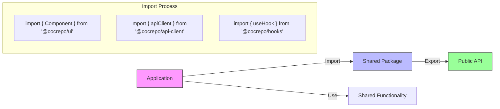
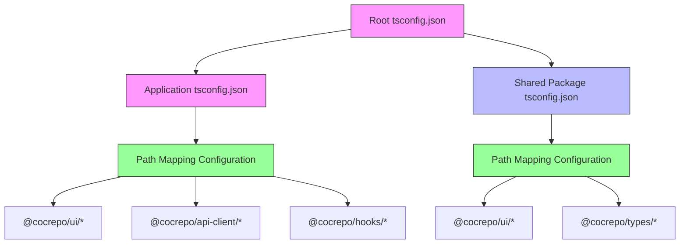
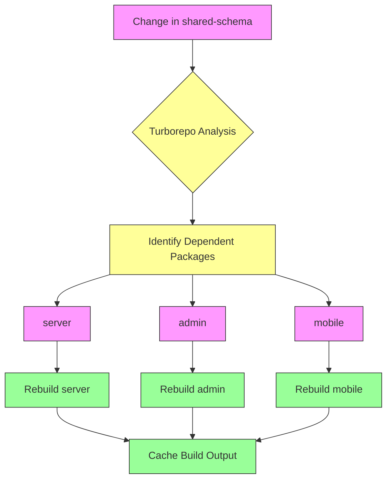
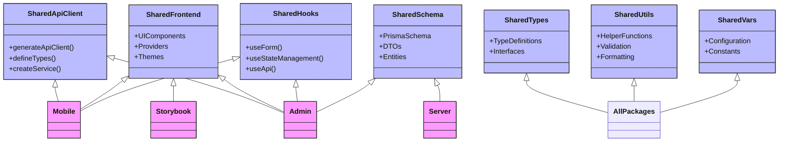
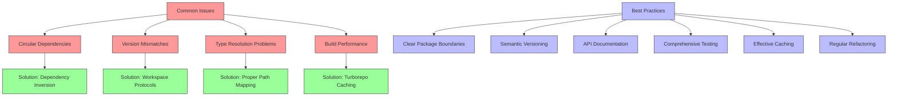

# Cross-Package Dependencies and Imports

<cite>
**Referenced Files in This Document**   
- [package.json](file://package.json)
- [turbo.json](file://turbo.json)
- [pnpm-workspace.yaml](file://pnpm-workspace.yaml)
- [tsconfig.json](file://tsconfig.json)
- [packages/shared-api-client/package.json](file://packages/shared-api-client/package.json)
- [packages/shared-frontend/package.json](file://packages/shared-frontend/package.json)
- [packages/shared-hooks/package.json](file://packages/shared-hooks/package.json)
- [packages/shared-schema/package.json](file://packages/shared-schema/package.json)
- [packages/shared-types/package.json](file://packages/shared-types/package.json)
- [packages/shared-utils/package.json](file://packages/shared-utils/package.json)
- [packages/shared-vars/package.json](file://packages/shared-vars/package.json)
- [apps/admin/package.json](file://apps/admin/package.json)
- [apps/mobile/package.json](file://apps/mobile/package.json)
- [apps/server/package.json](file://apps/server/package.json)
- [apps/storybook/package.json](file://apps/storybook/package.json)
- [apps/admin/tsconfig.json](file://apps/admin/tsconfig.json)
- [apps/mobile/tsconfig.json](file://apps/mobile/tsconfig.json)
- [apps/server/tsconfig.json](file://apps/server/tsconfig.json)
- [apps/storybook/tsconfig.json](file://apps/storybook/tsconfig.json)
- [packages/shared-api-client/tsconfig.json](file://packages/shared-api-client/tsconfig.json)
- [packages/shared-frontend/tsconfig.json](file://packages/shared-frontend/tsconfig.json)
- [packages/shared-hooks/tsconfig.json](file://packages/shared-hooks/tsconfig.json)
- [packages/shared-schema/tsconfig.json](file://packages/shared-schema/tsconfig.json)
- [packages/shared-types/tsconfig.json](file://packages/shared-types/tsconfig.json)
- [packages/shared-utils/tsconfig.json](file://packages/shared-utils/tsconfig.json)
- [packages/shared-vars/tsconfig.json](file://packages/shared-vars/tsconfig.json)
</cite>

## Table of Contents
1. [Introduction](#introduction)
2. [Workspace Structure and Package Management](#workspace-structure-and-package-management)
3. [Cross-Package Import Patterns](#cross-package-import-patterns)
4. [TypeScript Configuration for Path Mapping](#typescript-configuration-for-path-mapping)
5. [Dependency Graph and Build Orchestration](#dependency-graph-and-build-orchestration)
6. [Shared Package Examples](#shared-package-examples)
7. [Common Issues and Best Practices](#common-issues-and-best-practices)
8. [Conclusion](#conclusion)

## Introduction
The prj-core monorepo implements a sophisticated cross-package dependency system that enables code sharing across multiple applications through shared packages. This documentation details how applications import functionality from shared packages using workspace protocols and package aliases, the TypeScript configuration that enables path mapping and type resolution, and how Turborepo orchestrates builds across the dependency graph. The system is designed to promote code reuse, maintain consistency across applications, and optimize development workflows.

**Section sources**
- [package.json](file://package.json)
- [turbo.json](file://turbo.json)
- [pnpm-workspace.yaml](file://pnpm-workspace.yaml)

## Workspace Structure and Package Management

The prj-core repository follows a monorepo architecture with a clear separation between applications and shared packages. The workspace is managed using pnpm and defined in the pnpm-workspace.yaml file, which specifies that all packages under apps/* and packages/* are part of the workspace. This configuration enables workspace protocols for cross-package imports.

The package.json at the root level defines the overall project configuration and scripts that leverage Turborepo for task orchestration. The workspace uses package aliases (e.g., @cocrepo/api-client, @cocrepo/schema) that map to the shared packages in the packages directory, allowing applications to import shared functionality using these aliases rather than relative paths.

**Diagram sources**
- [pnpm-workspace.yaml](file://pnpm-workspace.yaml)
- [package.json](file://package.json)

**Section sources**
- [pnpm-workspace.yaml](file://pnpm-workspace.yaml)
- [package.json](file://package.json)

## Cross-Package Import Patterns

Applications in the prj-core monorepo import functionality from shared packages using workspace protocols and package aliases. The import pattern follows the convention of using the package name as defined in each shared package's package.json file. For example, components from shared-frontend are imported using @cocrepo/ui, while API client functionality is imported using @cocrepo/api-client.

The import system leverages pnpm's workspace protocol, which allows packages to depend on each other without needing to publish them to a registry. This enables seamless development workflows where changes in shared packages are immediately available to dependent applications. The package.json files of the applications list their dependencies on shared packages using the workspace:* protocol, which ensures that the local version of the package is used during development.

**Diagram sources**
- [apps/admin/package.json](file://apps/admin/package.json)
- [apps/mobile/package.json](file://apps/mobile/package.json)
- [apps/server/package.json](file://apps/server/package.json)
- [packages/shared-api-client/package.json](file://packages/shared-api-client/package.json)
- [packages/shared-frontend/package.json](file://packages/shared-frontend/package.json)
- [packages/shared-hooks/package.json](file://packages/shared-hooks/package.json)

**Section sources**
- [apps/admin/package.json](file://apps/admin/package.json)
- [apps/mobile/package.json](file://apps/mobile/package.json)
- [apps/server/package.json](file://apps/server/package.json)
- [packages/shared-api-client/package.json](file://packages/shared-api-client/package.json)
- [packages/shared-frontend/package.json](file://packages/shared-frontend/package.json)
- [packages/shared-hooks/package.json](file://packages/shared-hooks/package.json)

## TypeScript Configuration for Path Mapping

The TypeScript configuration in prj-core enables path mapping and type resolution across packages through a combination of tsconfig.json files at different levels of the project hierarchy. The root tsconfig.json provides a base configuration that is extended by individual applications and shared packages.

Each application and shared package has its own tsconfig.json file that extends the appropriate base configuration and defines path mappings for easier imports. The path mapping system allows developers to use absolute imports instead of relative paths, improving code readability and maintainability. For example, instead of using complex relative paths like ../../../shared/components, developers can use @cocrepo/ui/components.

The TypeScript configuration also ensures proper type resolution across package boundaries. When a shared package is imported, TypeScript can resolve the types defined in that package, providing accurate type checking and IntelliSense in the consuming application. This is achieved through the combination of path mappings, declaration files, and proper export configurations in the shared packages.

**Diagram sources**
- [tsconfig.json](file://tsconfig.json)
- [apps/admin/tsconfig.json](file://apps/admin/tsconfig.json)
- [apps/mobile/tsconfig.json](file://apps/mobile/tsconfig.json)
- [apps/server/tsconfig.json](file://apps/server/tsconfig.json)
- [apps/storybook/tsconfig.json](file://apps/storybook/tsconfig.json)
- [packages/shared-api-client/tsconfig.json](file://packages/shared-api-client/tsconfig.json)
- [packages/shared-frontend/tsconfig.json](file://packages/shared-frontend/tsconfig.json)
- [packages/shared-hooks/tsconfig.json](file://packages/shared-hooks/tsconfig.json)
- [packages/shared-schema/tsconfig.json](file://packages/shared-schema/tsconfig.json)
- [packages/shared-types/tsconfig.json](file://packages/shared-types/tsconfig.json)
- [packages/shared-utils/tsconfig.json](file://packages/shared-utils/tsconfig.json)
- [packages/shared-vars/tsconfig.json](file://packages/shared-vars/tsconfig.json)

**Section sources**
- [tsconfig.json](file://tsconfig.json)
- [apps/admin/tsconfig.json](file://apps/admin/tsconfig.json)
- [apps/mobile/tsconfig.json](file://apps/mobile/tsconfig.json)
- [apps/server/tsconfig.json](file://apps/server/tsconfig.json)
- [apps/storybook/tsconfig.json](file://apps/storybook/tsconfig.json)
- [packages/shared-api-client/tsconfig.json](file://packages/shared-api-client/tsconfig.json)
- [packages/shared-frontend/tsconfig.json](file://packages/shared-frontend/tsconfig.json)
- [packages/shared-hooks/tsconfig.json](file://packages/shared-hooks/tsconfig.json)
- [packages/shared-schema/tsconfig.json](file://packages/shared-schema/tsconfig.json)
- [packages/shared-types/tsconfig.json](file://packages/shared-types/tsconfig.json)
- [packages/shared-utils/tsconfig.json](file://packages/shared-utils/tsconfig.json)
- [packages/shared-vars/tsconfig.json](file://packages/shared-vars/tsconfig.json)

## Dependency Graph and Build Orchestration

Turborepo plays a critical role in managing the dependency graph and orchestrating builds across the prj-core monorepo. The turbo.json configuration file defines the tasks and their dependencies, enabling efficient and correct build ordering. When changes are made to shared packages, Turborepo automatically determines which applications need to be rebuilt based on the dependency graph.

The dependency graph is explicitly defined in the turbo.json file, with each task specifying its dependencies through the "dependsOn" field. For example, the server application depends on the shared-schema and shared-utils packages, so when either of these packages changes, the server application will be rebuilt. This dependency tracking ensures that applications always use the latest version of their dependencies.

Turborepo also provides caching for build tasks, which significantly improves build performance. When a task has been executed before with the same inputs, Turborepo can reuse the cached output instead of re-executing the task. This is particularly beneficial for shared packages, as their build output can be cached and reused across multiple applications.

**Diagram sources**
- [turbo.json](file://turbo.json)

**Section sources**
- [turbo.json](file://turbo.json)

## Shared Package Examples

The prj-core monorepo contains several shared packages that provide functionality to multiple applications. These packages follow a consistent structure and export pattern, making them easy to use across different applications.

The shared-api-client package generates TypeScript types and API client code from OpenAPI specifications, providing type-safe access to backend APIs. Applications import this package to make API calls without needing to manually define request and response types.

The shared-frontend package contains reusable UI components and providers that are used across the admin, mobile, and storybook applications. This ensures a consistent user interface and behavior across different parts of the system.

The shared-hooks package provides custom React hooks that encapsulate common functionality, such as form handling and state management. These hooks can be imported and used in any application that uses React.

The shared-schema package contains Prisma schema definitions, DTOs, and entities that are shared between the backend server and other packages that need to understand the data model.

**Diagram sources**
- [packages/shared-api-client/package.json](file://packages/shared-api-client/package.json)
- [packages/shared-frontend/package.json](file://packages/shared-frontend/package.json)
- [packages/shared-hooks/package.json](file://packages/shared-hooks/package.json)
- [packages/shared-schema/package.json](file://packages/shared-schema/package.json)
- [packages/shared-types/package.json](file://packages/shared-types/package.json)
- [packages/shared-utils/package.json](file://packages/shared-utils/package.json)
- [packages/shared-vars/package.json](file://packages/shared-vars/package.json)
- [apps/admin/package.json](file://apps/admin/package.json)
- [apps/mobile/package.json](file://apps/mobile/package.json)
- [apps/server/package.json](file://apps/server/package.json)
- [apps/storybook/package.json](file://apps/storybook/package.json)

**Section sources**
- [packages/shared-api-client/package.json](file://packages/shared-api-client/package.json)
- [packages/shared-frontend/package.json](file://packages/shared-frontend/package.json)
- [packages/shared-hooks/package.json](file://packages/shared-hooks/package.json)
- [packages/shared-schema/package.json](file://packages/shared-schema/package.json)
- [packages/shared-types/package.json](file://packages/shared-types/package.json)
- [packages/shared-utils/package.json](file://packages/shared-utils/package.json)
- [packages/shared-vars/package.json](file://packages/shared-vars/package.json)

## Common Issues and Best Practices

When working with cross-package dependencies in a monorepo, several common issues can arise. One of the most frequent problems is circular dependencies, where two or more packages depend on each other directly or indirectly. This can cause build failures and runtime errors. To avoid circular dependencies, it's important to design packages with clear responsibilities and use dependency inversion when necessary.

Version mismatches can also occur when different applications depend on different versions of the same shared package. In a monorepo with workspace protocols, this is less likely to happen, but it's still important to ensure that all applications use compatible versions of shared packages.

Type resolution problems can occur when TypeScript cannot properly resolve types from shared packages. This is usually caused by incorrect path mappings or missing declaration files. Ensuring that shared packages have proper tsconfig.json configurations and export their types correctly can prevent these issues.

Best practices for managing cross-package dependencies include:
- Maintaining a clear separation of concerns between packages
- Using semantic versioning for shared packages
- Documenting the public API of shared packages
- Writing comprehensive tests for shared packages
- Using Turborepo's caching and task orchestration effectively
- Regularly reviewing and refactoring the dependency graph

**Diagram sources**
- [turbo.json](file://turbo.json)
- [pnpm-workspace.yaml](file://pnpm-workspace.yaml)
- [tsconfig.json](file://tsconfig.json)

**Section sources**
- [turbo.json](file://turbo.json)
- [pnpm-workspace.yaml](file://pnpm-workspace.yaml)
- [tsconfig.json](file://tsconfig.json)

## Conclusion
The cross-package dependency system in prj-core provides a robust foundation for code sharing and reuse across multiple applications. By leveraging workspace protocols, package aliases, and Turborepo's task orchestration, the monorepo enables efficient development workflows and ensures consistency across applications. The TypeScript configuration with path mapping simplifies imports and enables proper type resolution, while the explicit dependency graph ensures correct build ordering and caching. Following best practices for package design and dependency management helps avoid common issues and maintains the health of the codebase as it grows.