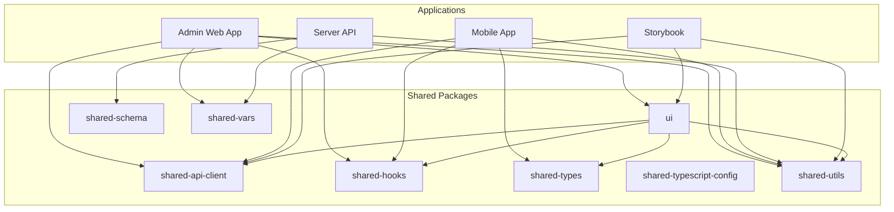
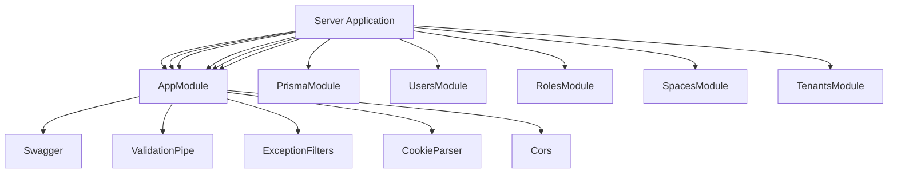
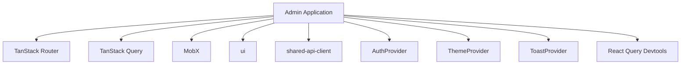
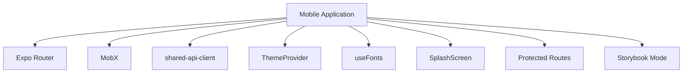
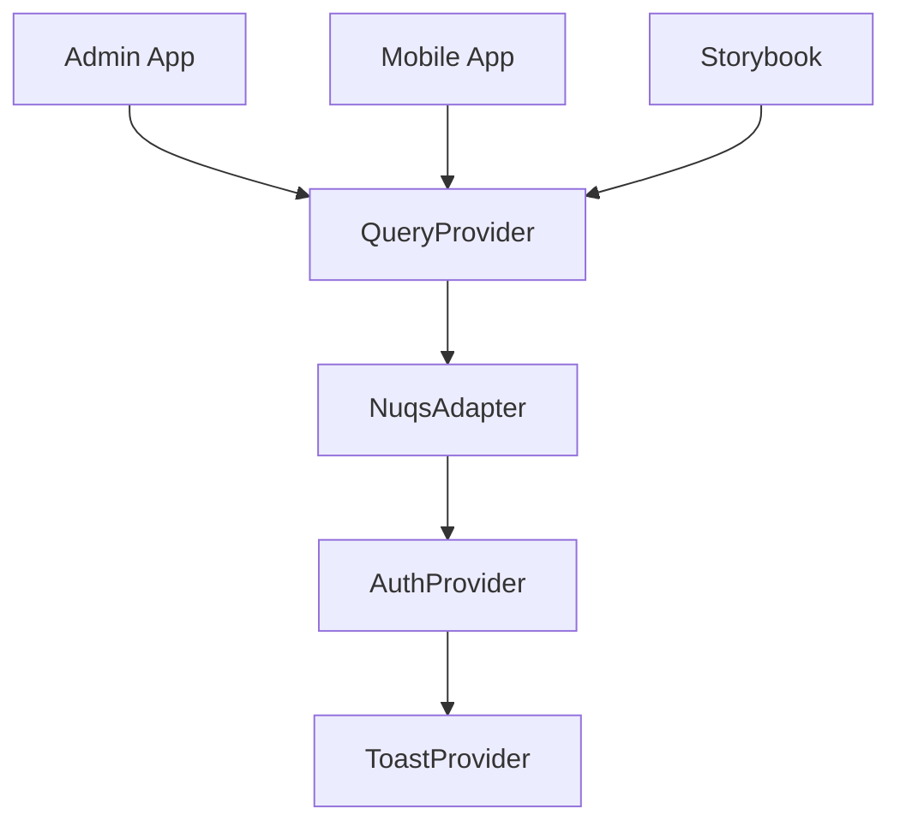
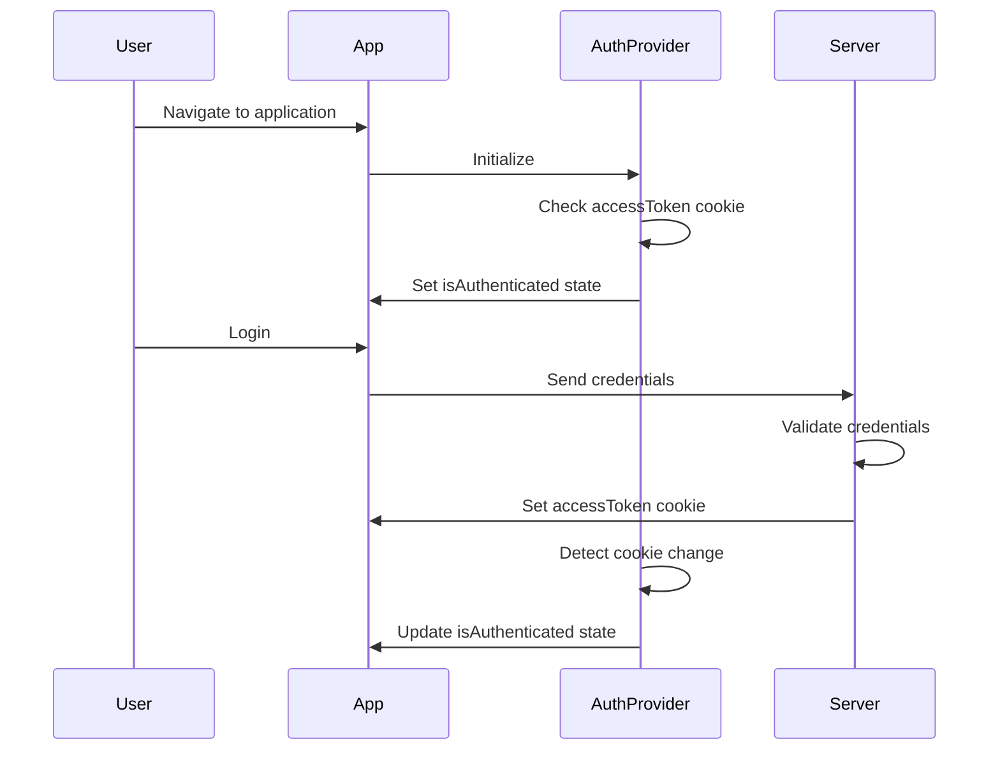
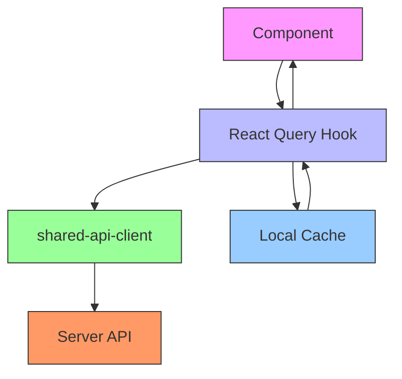
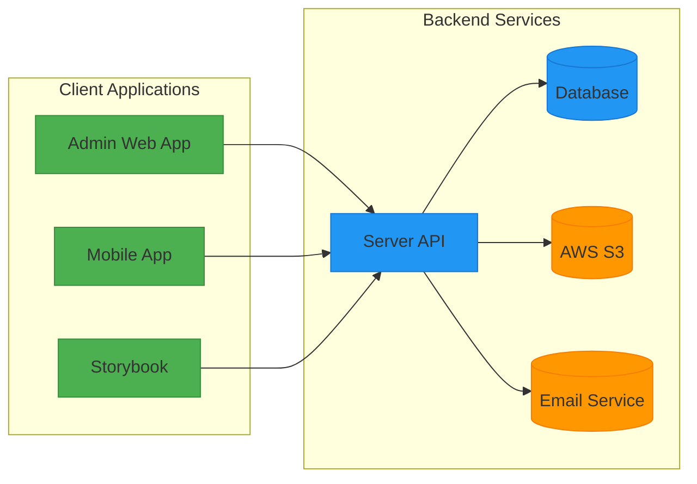
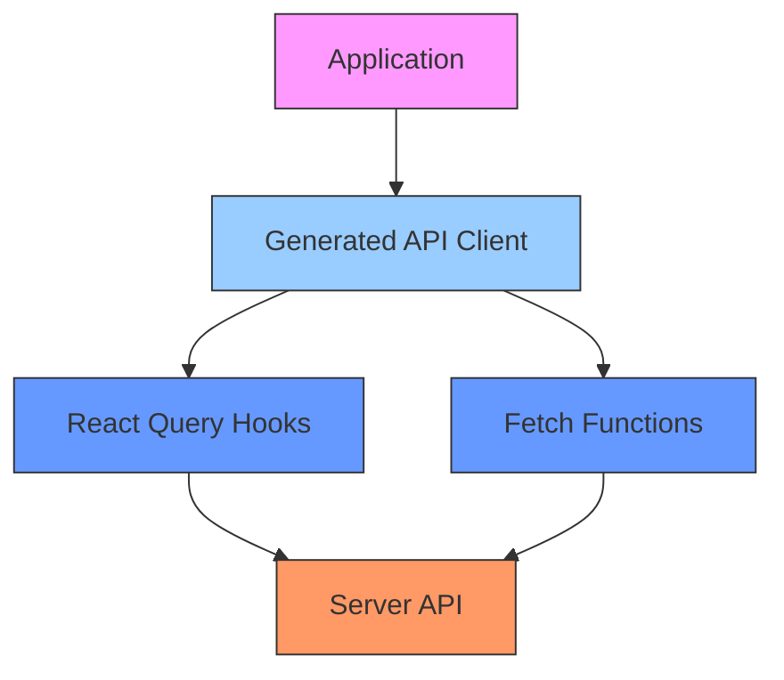

# Monorepo Architecture

<cite>
**Referenced Files in This Document**   
- [package.json](file://package.json)
- [pnpm-workspace.yaml](file://pnpm-workspace.yaml)
- [turbo.json](file://turbo.json)
- [apps/server/package.json](file://apps/server/package.json)
- [apps/admin/package.json](file://apps/admin/package.json)
- [apps/mobile/package.json](file://apps/mobile/package.json)
- [packages/shared-api-client/package.json](file://packages/shared-api-client/package.json)
- [packages/ui/package.json](file://packages/ui/package.json)
- [packages/shared-schema/package.json](file://packages/shared-schema/package.json)
- [apps/server/src/main.ts](file://apps/server/src/main.ts)
- [apps/admin/src/main.tsx](file://apps/admin/src/main.tsx)
- [apps/mobile/src/app/_layout.tsx](file://apps/mobile/src/app/_layout.tsx)
- [packages/ui/src/provider/AppProviders/AppProviders.tsx](file://packages/ui/src/provider/AppProviders/AppProviders.tsx)
- [packages/ui/src/provider/QueryProvider/QueryProvider.tsx](file://packages/ui/src/provider/QueryProvider/QueryProvider.tsx)
- [packages/ui/src/provider/AuthProvider/AuthProvider.tsx](file://packages/ui/src/provider/AuthProvider/AuthProvider.tsx)
</cite>

## Table of Contents

1. [Introduction](#introduction)
2. [Project Structure](#project-structure)
3. [Monorepo Configuration](#monorepo-configuration)
4. [Application Architecture](#application-architecture)
5. [Shared Packages](#shared-packages)
6. [Component Interactions and Data Flow](#component-interactions-and-data-flow)
7. [System Context and Integration Patterns](#system-context-and-integration-patterns)
8. [Technical Decisions and Trade-offs](#technical-decisions-and-trade-offs)
9. [Infrastructure and Deployment](#infrastructure-and-deployment)
10. [Cross-Cutting Concerns](#cross-cutting-concerns)

## Introduction

The prj-core monorepo implements a modern full-stack architecture using a monorepo approach to manage multiple applications and shared packages. This documentation provides a comprehensive overview of the architectural design, component interactions, and technical decisions that define the system. The architecture is built around three primary applications: an admin web interface, a mobile application, and a backend server, all sharing common code through a collection of reusable packages. The monorepo leverages Turborepo for task orchestration and pnpm workspaces for efficient package management, enabling streamlined development, testing, and deployment workflows across the entire codebase.

## Project Structure

The prj-core repository follows a standard monorepo structure with two main directories: `apps` and `packages`. The `apps` directory contains four distinct applications: admin (web administration interface), mobile (React Native application), server (NestJS backend API), and storybook (UI component documentation). The `packages` directory contains eight shared packages that provide reusable functionality across applications, including API clients, frontend components, hooks, schema definitions, types, TypeScript configurations, utilities, and shared variables. This structure enables code sharing while maintaining clear boundaries between applications and shared components.



**Diagram sources**

- [project_structure](file://)

**Section sources**

- [project_structure](file://)

## Monorepo Configuration

### pnpm Workspaces Configuration

The monorepo uses pnpm workspaces for package management, as defined in the `pnpm-workspace.yaml` configuration file. The workspace includes all packages under the `apps/*` and `packages/*` directories, enabling seamless cross-package dependencies using workspace protocols. The configuration also defines a catalog of shared dependencies with specific versions, ensuring consistency across all packages and applications. This approach eliminates version drift and simplifies dependency management across the monorepo.

```yaml
packages:
  - apps/*
  - packages/*
catalog:
  "@biomejs/biome": ^2.1.4
  "@heroui/react": ^2.8.2
  "@prisma/client": ^6.11.1
  # ... additional catalog entries
```

**Section sources**

- [pnpm-workspace.yaml](file://pnpm-workspace.yaml)

### Turborepo Task Orchestration

Turborepo is used for task orchestration across the monorepo, as configured in the `turbo.json` file. The pipeline defines common tasks such as build, test, lint, format, and start:dev, with appropriate outputs and dependencies. The build task has dependencies on upstream builds (`^build`), enabling incremental builds and efficient caching. Test tasks are configured with coverage output, while development tasks are marked as persistent. The configuration also specifies global dependencies (environment files) and environment variables (NODE_ENV) that affect caching.

```json
{
  "globalDependencies": ["**/.env.*local"],
  "globalEnv": ["NODE_ENV"],
  "tasks": {
    "build": {
      "outputs": [
        "dist/**",
        ".next/**",
        "!.next/cache/**",
        "storybook-static/**"
      ],
      "dependsOn": ["^build"],
      "env": ["NODE_ENV"]
    },
    "test": {
      "outputs": ["coverage/**"],
      "dependsOn": []
    },
    "start:dev": {
      "cache": false,
      "persistent": true
    }
  }
}
```

**Section sources**

- [turbo.json](file://turbo.json)

### Root Package Configuration

The root `package.json` file defines the monorepo's top-level scripts and devDependencies. It specifies pnpm as the package manager and includes scripts that delegate to Turborepo for task execution across the workspace. The scripts include build, clean, development start, linting, formatting, testing, and Storybook execution. This centralized script management allows consistent execution of common tasks across all packages and applications from the repository root.

```json
{
  "name": "core",
  "private": true,
  "version": "0.0.0",
  "packageManager": "pnpm@10.13.1",
  "scripts": {
    "build": "turbo build",
    "clean": "turbo clean",
    "start:dev": "turbo start:dev --no-cache  --continue",
    "lint": "turbo lint",
    "lint:fix": "turbo lint:fix",
    "format": "turbo format",
    "test": "turbo test",
    "storybook": "pnpm -C apps/mobile storybook"
  }
}
```

**Section sources**

- [package.json](file://package.json)

## Application Architecture

### Server Application (NestJS)

The server application is a NestJS backend API that provides services to the frontend applications. It uses a modular architecture with feature modules for different domain entities such as users, roles, spaces, and sessions. The application is configured with global pipes for validation, filters for exception handling, and middleware for cookie parsing. It integrates with Prisma for database access and exposes a Swagger UI for API documentation. The server enables CORS for multiple development origins and uses pino for logging.



**Section sources**

- [apps/server/package.json](file://apps/server/package.json)
- [apps/server/src/main.ts](file://apps/server/src/main.ts)

### Admin Web Application (React)

The admin application is a React web interface built with Vite and TypeScript. It uses React Router for routing, TanStack Query for data fetching, and MobX for state management. The application leverages shared components from the ui package and uses the shared API client for backend communication. It is configured with Storybook for component documentation and testing. The UI is built with Tailwind CSS and includes drag-and-drop functionality via @dnd-kit.



**Section sources**

- [apps/admin/package.json](file://apps/admin/package.json)
- [apps/admin/src/main.tsx](file://apps/admin/src/main.tsx)

### Mobile Application (React Native)

The mobile application is a React Native app built with Expo Router for navigation. It uses the same state management (MobX) and API client (shared-api-client) as the web applications, ensuring consistency across platforms. The application supports custom fonts and includes a splash screen that remains visible until assets are loaded. It uses Expo's built-in navigation stack with protected routes for authentication. The app is configured to run Storybook for component development when the EXPO_PUBLIC_STORYBOOK environment variable is set.



**Section sources**

- [apps/mobile/package.json](file://apps/mobile/package.json)
- [apps/mobile/src/app/\_layout.tsx](file://apps/mobile/src/app/_layout.tsx)

## Shared Packages

### shared-api-client

The shared-api-client package is an automatically generated API client and types from OpenAPI specifications using Orval. It provides type-safe access to the server API endpoints using Axios and React Query. The package is configured with different code generation configurations for development, staging, and production environments. It exports React Query hooks for each API endpoint, enabling consistent data fetching patterns across applications.

```json
{
  "name": "@shared/api-client",
  "scripts": {
    "codegen:dev": "orval --config orval.dev.config.js",
    "codegen:stg": "orval --config orval.stg.config.js",
    "codegen:prod": "orval --config orval.prod.config.js",
    "build": "tsup"
  },
  "dependencies": {
    "@tanstack/react-query": "5.83.0",
    "axios": "catalog:"
  }
}
```

**Section sources**

- [packages/shared-api-client/package.json](file://packages/shared-api-client/package.json)

### ui

The ui package is a UI component library that provides reusable components, providers, and utilities for React applications. It includes providers for authentication, state management, and UI services such as toasts. The package exports a composite AppProviders component that wraps applications with all necessary context providers. It depends on various UI libraries and is designed to be consumed directly in source form by applications.

```typescript
export const AppProviders = (props: AppProvidersProps) => {
	return (
		<QueryProvider>
			<NuqsAdapter>
				<AuthProvider>{children}</AuthProvider>
				<ToastProvider placement="bottom-center" />
			</NuqsAdapter>
		</QueryProvider>
	);
};
```

**Section sources**

- [packages/ui/package.json](file://packages/ui/package.json)
- [packages/ui/src/provider/AppProviders/AppProviders.tsx](file://packages/ui/src/provider/AppProviders/AppProviders.tsx)

### shared-schema

The shared-schema package contains shared data models, DTOs, and Prisma schema definitions used across the monorepo. It includes entity definitions, DTOs for API requests and responses, enums, and utility functions for data manipulation. The package is used by the server application for database operations and type definitions, and can be consumed by frontend applications for type consistency. It includes Prisma configuration and seed data management scripts.

```json
{
  "name": "@shared/schema",
  "scripts": {
    "generate": "prisma generate",
    "db:push": "prisma db push",
    "db:pull": "prisma db pull",
    "db:studio": "prisma studio",
    "db:migrate": "prisma migrate dev"
  },
  "devDependencies": {
    "@prisma/client": "^6.11.1",
    "prisma": "catalog:"
  }
}
```

**Section sources**

- [packages/shared-schema/package.json](file://packages/shared-schema/package.json)

## Component Interactions and Data Flow

### Provider Hierarchy and State Management

The applications use a consistent provider hierarchy for state management and service access. The ui package provides a unified provider stack that includes QueryProvider for data fetching, NuqsAdapter for URL-based state management, AuthProvider for authentication state, and ToastProvider for notifications. This consistent pattern ensures that all applications have the same foundational services available through context.



**Diagram sources**

- [packages/ui/src/provider/AppProviders/AppProviders.tsx](file://packages/ui/src/provider/AppProviders/AppProviders.tsx)
- [packages/ui/src/provider/QueryProvider/QueryProvider.tsx](file://packages/ui/src/provider/QueryProvider/QueryProvider.tsx)
- [packages/ui/src/provider/AuthProvider/AuthProvider.tsx](file://packages/ui/src/provider/AuthProvider/AuthProvider.tsx)

### Authentication Flow

The authentication system uses cookies to maintain session state across applications. The AuthProvider component checks for the presence of an accessToken cookie on initialization and periodically thereafter. When a user logs in, the server sets the accessToken cookie, which is then detected by the AuthProvider to update the authentication state. This cookie-based approach enables shared authentication state between the admin web app and mobile app when running in web view contexts.



**Diagram sources**

- [packages/ui/src/provider/AuthProvider/AuthProvider.tsx](file://packages/ui/src/provider/AuthProvider/AuthProvider.tsx)
- [apps/server/src/main.ts](file://apps/server/src/main.ts)

### Data Fetching Pattern

Applications use a consistent data fetching pattern through the shared-api-client package, which provides React Query hooks for all API endpoints. This pattern ensures type safety, automatic caching, and consistent error handling across applications. The QueryProvider from ui configures the QueryClient with default settings and includes React Query Devtools for debugging.



**Diagram sources**

- [packages/ui/src/provider/QueryProvider/QueryProvider.tsx](file://packages/ui/src/provider/QueryProvider/QueryProvider.tsx)
- [packages/shared-api-client/package.json](file://packages/shared-api-client/package.json)

## System Context and Integration Patterns

### System Architecture Overview

The prj-core system consists of three main applications that interact with a central server API, which in turn communicates with a database and external services. The admin web application provides a management interface, the mobile application offers a native experience, and both consume the same API endpoints. The server acts as the central hub for business logic, data persistence, and integration with external services like AWS S3 for file storage.



**Diagram sources**

- [project_structure](file://)

### API Integration Pattern

The API integration follows a consistent pattern across applications using the shared-api-client package. This package generates type-safe API clients from OpenAPI specifications, providing both Axios-based functions and React Query hooks for each endpoint. This dual approach allows for flexibility in usage patterns while maintaining type safety and consistency. The generated code includes models for request and response payloads, ensuring that frontend and backend contracts remain synchronized.



**Section sources**

- [packages/shared-api-client/package.json](file://packages/shared-api-client/package.json)

## Technical Decisions and Trade-offs

### Monorepo Benefits and Challenges

The monorepo approach provides several benefits including simplified dependency management, consistent tooling across projects, and easier code sharing. By using pnpm workspaces and a dependency catalog, the team ensures version consistency across all packages and applications. Turborepo enables efficient task orchestration with intelligent caching, reducing build and test times. However, this approach also introduces complexity in repository management and requires careful consideration of package boundaries to avoid tight coupling.

**Section sources**

- [pnpm-workspace.yaml](file://pnpm-workspace.yaml)
- [turbo.json](file://turbo.json)

### State Management Strategy

The architecture uses MobX for state management in React applications, chosen for its simplicity and reactivity model. Unlike Redux, MobX allows for more direct state manipulation while still providing reactivity through observables. The ui package provides a consistent provider setup that includes MobX with mobx-react-lite for React integration. This approach reduces boilerplate code compared to Redux while maintaining predictable state updates through the use of actions and reactions.

**Section sources**

- [apps/admin/package.json](file://apps/admin/package.json)
- [apps/mobile/package.json](file://apps/mobile/package.json)
- [packages/ui/package.json](file://packages/ui/package.json)

### API Client Generation

The decision to use Orval for API client generation from OpenAPI specifications ensures type safety and consistency between frontend and backend. When API endpoints change, the client code is automatically regenerated, reducing the risk of runtime errors due to API contract mismatches. This approach also eliminates the need for manual API client maintenance. The trade-off is a build-time dependency on the OpenAPI specification and a learning curve for developers unfamiliar with code generation tools.

**Section sources**

- [packages/shared-api-client/package.json](file://packages/shared-api-client/package.json)

## Infrastructure and Deployment

### Development Environment

The development environment is configured to support multiple applications simultaneously. The server runs on port 3005 with CORS configured for various development origins used by the admin and mobile applications. Each application has its own development server with hot module replacement. The monorepo structure allows developers to work on shared packages and applications simultaneously, with changes to shared packages immediately available to applications through pnpm's workspace linking.

**Section sources**

- [apps/server/src/main.ts](file://apps/server/src/main.ts)

### Build and Deployment Pipeline

The build pipeline is orchestrated by Turborepo, which coordinates tasks across the monorepo with intelligent caching. The build task depends on upstream builds, ensuring that shared packages are built before applications that depend on them. Applications are built to their respective dist directories, with outputs configured in turbo.json. The deployment topology likely involves separate deployment of the server application to a Node.js environment and the frontend applications to static hosting or app stores.

**Section sources**

- [turbo.json](file://turbo.json)

## Cross-Cutting Concerns

### Code Sharing Strategy

The monorepo implements a comprehensive code sharing strategy through the packages directory. Shared functionality is organized into focused packages based on responsibility: shared-api-client for API integration, ui for UI components, shared-hooks for React hooks, shared-schema for data models, and so on. This modular approach allows applications to import only the functionality they need, reducing bundle sizes. The workspace protocol in package.json files enables seamless linking between packages during development.

**Section sources**

- [project_structure](file://)

### Versioning and Dependency Management

The monorepo uses a combination of pnpm workspaces and a dependency catalog to manage versions consistently. The catalog in pnpm-workspace.yaml defines specific versions for commonly used dependencies, ensuring that all packages and applications use the same versions. Shared packages use workspace:\* dependencies to reference other shared packages, enabling immediate access to changes without publishing. This approach simplifies dependency management but requires careful coordination when updating shared packages that are used by multiple applications.

**Section sources**

- [pnpm-workspace.yaml](file://pnpm-workspace.yaml)

### Testing Strategy

The testing strategy varies by package type. Applications use Vitest for unit and integration testing, with the server application also using Jest for end-to-end tests. The ui package includes Vitest configuration for component testing, while the shared-schema package includes database integration tests. The monorepo structure allows for consistent testing tools across packages, with Turborepo orchestrating test execution across the entire codebase.

**Section sources**

- [packages/ui/package.json](file://packages/ui/package.json)
- [packages/shared-schema/package.json](file://packages/shared-schema/package.json)
- [apps/server/package.json](file://apps/server/package.json)
