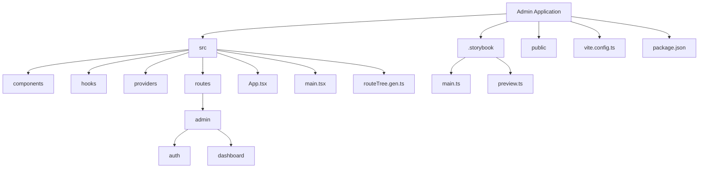
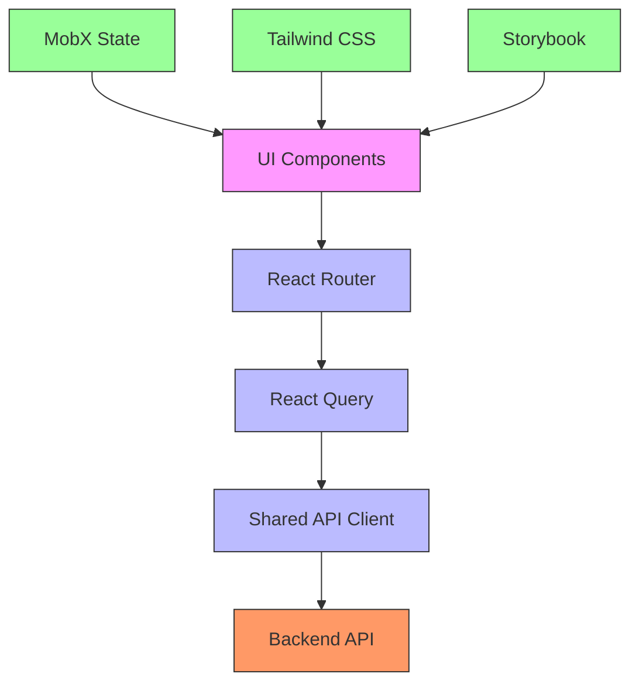
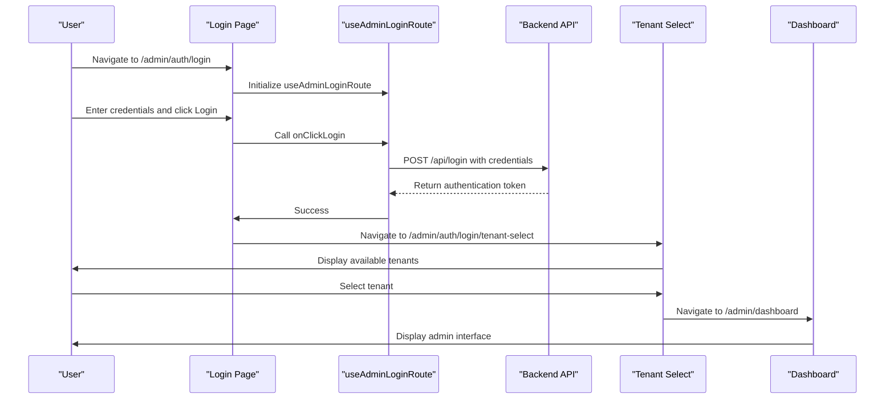
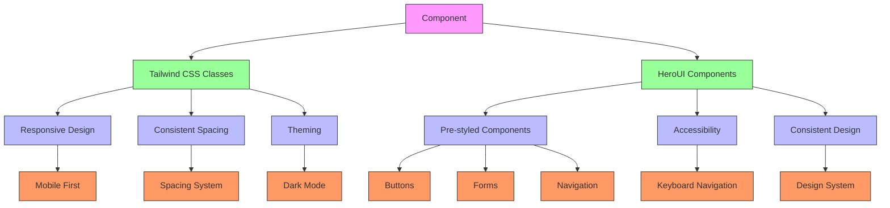
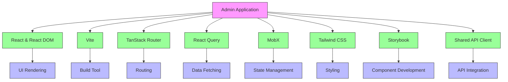

# Admin Application

<cite>
**Referenced Files in This Document**   
- [package.json](file://apps/admin/package.json)
- [vite.config.ts](file://apps/admin/vite.config.ts)
- [main.tsx](file://apps/admin/src/main.tsx)
- [App.tsx](file://apps/admin/src/App.tsx)
- [routeTree.gen.ts](file://apps/admin/src/routeTree.gen.ts)
- [useAdminLoginRoute.ts](file://apps/admin/src/hooks/useAdminLoginRoute.ts)
- [useAdminTenantSelectRoute.ts](file://apps/admin/src/hooks/useAdminTenantSelectRoute.ts)
- [.storybook/main.ts](file://apps/admin/.storybook/main.ts)
- [auth.tsx](file://apps/admin/src/routes/admin/auth.tsx)
- [dashboard.tsx](file://apps/admin/src/routes/admin/dashboard.tsx)
- [login.tsx](file://apps/admin/src/routes/admin/auth/login.tsx)
- [tenant-select.tsx](file://apps/admin/src/routes/admin/auth/login/tenant-select.tsx)
- [Providers.tsx](file://apps/admin/src/providers/Providers.tsx)
</cite>

## Table of Contents
1. [Introduction](#introduction)
2. [Project Structure](#project-structure)
3. [Core Components](#core-components)
4. [Architecture Overview](#architecture-overview)
5. [Detailed Component Analysis](#detailed-component-analysis)
6. [Dependency Analysis](#dependency-analysis)
7. [Performance Considerations](#performance-considerations)
8. [Troubleshooting Guide](#troubleshooting-guide)
9. [Conclusion](#conclusion)

## Introduction
The Admin Application in prj-core is a React-based frontend application built with Vite as the build tool. It serves as the administrative interface for managing users, spaces, categories, and other core entities in the system. The application follows a modern architecture with a clear separation of concerns, leveraging React Query for data fetching, MobX for state management, and Tailwind CSS for styling. This documentation provides a comprehensive overview of the application's architecture, routing structure, authentication flow, and development workflow.

## Project Structure

The Admin Application follows a well-organized directory structure that promotes maintainability and scalability. The application is located in the `apps/admin` directory and contains the following key components:



**Diagram sources**
- [vite.config.ts](file://apps/admin/vite.config.ts)
- [package.json](file://apps/admin/package.json)

**Section sources**
- [package.json](file://apps/admin/package.json)
- [vite.config.ts](file://apps/admin/vite.config.ts)

## Core Components

The Admin Application consists of several core components that work together to provide a seamless administrative experience. These include the routing system, authentication hooks, UI components, and the shared API client. The application uses a component-based architecture where each feature is encapsulated in its own module, promoting reusability and maintainability.

**Section sources**
- [App.tsx](file://apps/admin/src/App.tsx)
- [main.tsx](file://apps/admin/src/main.tsx)
- [Providers.tsx](file://apps/admin/src/providers/Providers.tsx)

## Architecture Overview

The Admin Application follows a modern React architecture with a clear separation of concerns. The application is built on top of Vite, which provides fast development server startup and hot module replacement. The architecture consists of several key layers:



**Diagram sources**
- [App.tsx](file://apps/admin/src/App.tsx)
- [vite.config.ts](file://apps/admin/vite.config.ts)
- [Providers.tsx](file://apps/admin/src/providers/Providers.tsx)

## Detailed Component Analysis

### Routing Structure

The Admin Application uses TanStack Router for routing, which provides type-safe routing and code splitting capabilities. The routing structure is defined in the `routeTree.gen.ts` file, which is automatically generated based on the file structure in the `src/routes` directory. This approach follows a file-based routing convention, where each directory and file corresponds to a route in the application.

```mermaid
graph TD
A[/] --> B[/admin]
B --> C[/admin/auth]
B --> D[/admin/dashboard]
C --> E[/admin/auth/login]
E --> F[/admin/auth/login/tenant-select]
D --> G[/admin/dashboard/user-service]
D --> H[/admin/dashboard/space-service]
G --> I[/admin/dashboard/user-service/users]
H --> J[/admin/dashboard/space-service/grounds]
H --> K[/admin/dashboard/space-service/categories]
J --> L[/admin/dashboard/space-service/grounds/$groundId]
L --> M[/admin/dashboard/space-service/grounds/$groundId/detail]
L --> N[/admin/dashboard/space-service/grounds/$groundId/modify]
L --> O[/admin/dashboard/space-service/grounds/$groundId/create]
M --> P[/admin/dashboard/space-service/grounds/$groundId/detail/info]
M --> Q[/admin/dashboard/space-service/grounds/$groundId/detail/members]
J --> R[/admin/dashboard/space-service/grounds/$groundId]
K --> S[/admin/dashboard/space-service/categories/$categoryId]
style A fill:#f9f,stroke:#333
style B fill:#bbf,stroke:#333
style C fill:#bbf,stroke:#333
style D fill:#bbf,stroke:#333
style E fill:#bbf,stroke:#333
style F fill:#bbf,stroke:#333
style G fill:#bbf,stroke:#333
style H fill:#bbf,stroke:#333
style I fill:#bbf,stroke:#333
style J fill:#bbf,stroke:#333
style K fill:#bbf,stroke:#333
style L fill:#bbf,stroke:#333
style M fill:#bbf,stroke:#333
style N fill:#bbf,stroke:#333
style O fill:#bbf,stroke:#333
style P fill:#bbf,stroke:#333
style Q fill:#bbf,stroke:#333
style R fill:#bbf,stroke:#333
style S fill:#bbf,stroke:#333
```

**Diagram sources**
- [routeTree.gen.ts](file://apps/admin/src/routeTree.gen.ts)
- [auth.tsx](file://apps/admin/src/routes/admin/auth.tsx)
- [dashboard.tsx](file://apps/admin/src/routes/admin/dashboard.tsx)

**Section sources**
- [routeTree.gen.ts](file://apps/admin/src/routeTree.gen.ts)
- [auth.tsx](file://apps/admin/src/routes/admin/auth.tsx)
- [dashboard.tsx](file://apps/admin/src/routes/admin/dashboard.tsx)

### Authentication Flow

The authentication flow in the Admin Application is implemented using custom React hooks that encapsulate the login and tenant selection logic. The flow consists of two main steps: user authentication and tenant selection. This two-step process allows users to authenticate with their credentials and then select which tenant they want to manage.



**Diagram sources**
- [useAdminLoginRoute.ts](file://apps/admin/src/hooks/useAdminLoginRoute.ts)
- [login.tsx](file://apps/admin/src/routes/admin/auth/login.tsx)
- [tenant-select.tsx](file://apps/admin/src/routes/admin/auth/login/tenant-select.tsx)

**Section sources**
- [useAdminLoginRoute.ts](file://apps/admin/src/hooks/useAdminLoginRoute.ts)
- [login.tsx](file://apps/admin/src/routes/admin/auth/login.tsx)
- [tenant-select.tsx](file://apps/admin/src/routes/admin/auth/login/tenant-select.tsx)

### UI Styling with Tailwind CSS

The Admin Application uses Tailwind CSS for styling, which provides a utility-first approach to CSS. This allows developers to style components directly in the JSX using utility classes, eliminating the need for separate CSS files. The application also leverages HeroUI components, which are pre-styled React components that follow the design system.



**Diagram sources**
- [dashboard.tsx](file://apps/admin/src/routes/admin/dashboard.tsx)
- [login.tsx](file://apps/admin/src/routes/admin/auth/login.tsx)

### Storybook for Component Development

Storybook is integrated into the Admin Application to facilitate component development and testing. It provides an isolated environment where UI components can be developed and tested independently of the application. This allows developers to focus on the visual aspects of components without worrying about application state or data fetching.

```mermaid
graph TD
A[Storybook] --> B[Component Isolation]
A --> C[Visual Testing]
A --> D[Documentation]
A --> E[Design System]
B --> F[Develop components in isolation]
B --> G[Test edge cases]
B --> H[Verify responsive behavior]
C --> I[Visual regression testing]
C --> J[Accessibility testing]
C --> K[Interaction testing]
D --> L[Auto-generated documentation]
D --> M[Usage examples]
D --> N[Props documentation]
E --> O[Consistent UI patterns]
E --> P[Reusable components]
E --> Q[Design token management]
style A fill:#f9f,stroke:#333
style B fill:#9f9,stroke:#333
style C fill:#9f9,stroke:#333
style D fill:#9f9,stroke:#333
style E fill:#9f9,stroke:#333
style F fill:#bbf,stroke:#333
style G fill:#bbf,stroke:#333
style H fill:#bbf,stroke:#333
style I fill:#bbf,stroke:#333
style J fill:#bbf,stroke:#333
style K fill:#bbf,stroke:#333
style L fill:#bbf,stroke:#333
style M fill:#bbf,stroke:#333
style N fill:#bbf,stroke:#333
style O fill:#bbf,stroke:#333
style P fill:#bbf,stroke:#333
style Q fill:#bbf,stroke:#333
```



**Diagram sources**
- [.storybook/main.ts](file://apps/admin/.storybook/main.ts)

## Dependency Analysis

The Admin Application has a well-defined dependency structure that separates runtime dependencies from development dependencies. The application leverages several key libraries for different purposes:



**Diagram sources**
- [package.json](file://apps/admin/package.json)

**Section sources**
- [package.json](file://apps/admin/package.json)
- [vite.config.ts](file://apps/admin/vite.config.ts)

## Performance Considerations

The Admin Application is designed with performance in mind. Several strategies are employed to ensure a fast and responsive user experience:

1. **Vite Build Tool**: The application uses Vite as the build tool, which provides fast development server startup and hot module replacement.
2. **Code Splitting**: TanStack Router automatically implements code splitting based on the route structure, ensuring that only the necessary code is loaded for each page.
3. **React Query**: The application uses React Query for data fetching, which provides caching, deduplication, and background refetching capabilities.
4. **Lazy Loading**: Components are lazy-loaded when possible to reduce initial bundle size.
5. **Optimized Rendering**: MobX is used for state management, which provides fine-grained reactivity and minimizes unnecessary re-renders.

These performance optimizations ensure that the Admin Application remains fast and responsive even as the codebase grows.

## Troubleshooting Guide

When developing or maintaining the Admin Application, several common issues may arise. This section provides guidance on troubleshooting these issues:

1. **Routing Issues**: If routes are not working as expected, ensure that the `routeTree.gen.ts` file is up to date. This file is automatically generated based on the file structure in the `src/routes` directory.
2. **Authentication Problems**: If authentication is not working, verify that the shared API client is properly configured and that the backend API is accessible.
3. **Styling Issues**: If Tailwind CSS classes are not being applied correctly, ensure that the classes are included in the content configuration in the `tailwind.config.js` file.
4. **Storybook Errors**: If Storybook is not working correctly, check the `.storybook/main.ts` configuration file and ensure that the stories glob pattern is correct.
5. **Build Failures**: If the application fails to build, check the Vite configuration in `vite.config.ts` and ensure that all dependencies are properly installed.

By following these troubleshooting guidelines, developers can quickly identify and resolve common issues in the Admin Application.

## Conclusion

The Admin Application in prj-core is a well-architected React application that leverages modern tools and best practices to provide a robust administrative interface. The application uses Vite as the build tool, TanStack Router for routing, React Query for data fetching, MobX for state management, and Tailwind CSS for styling. The authentication flow is implemented using custom hooks that encapsulate the login and tenant selection logic. Storybook is integrated for component development and testing. The application's architecture promotes maintainability, scalability, and developer productivity. By following the patterns and practices outlined in this documentation, developers can effectively contribute to and extend the Admin Application.