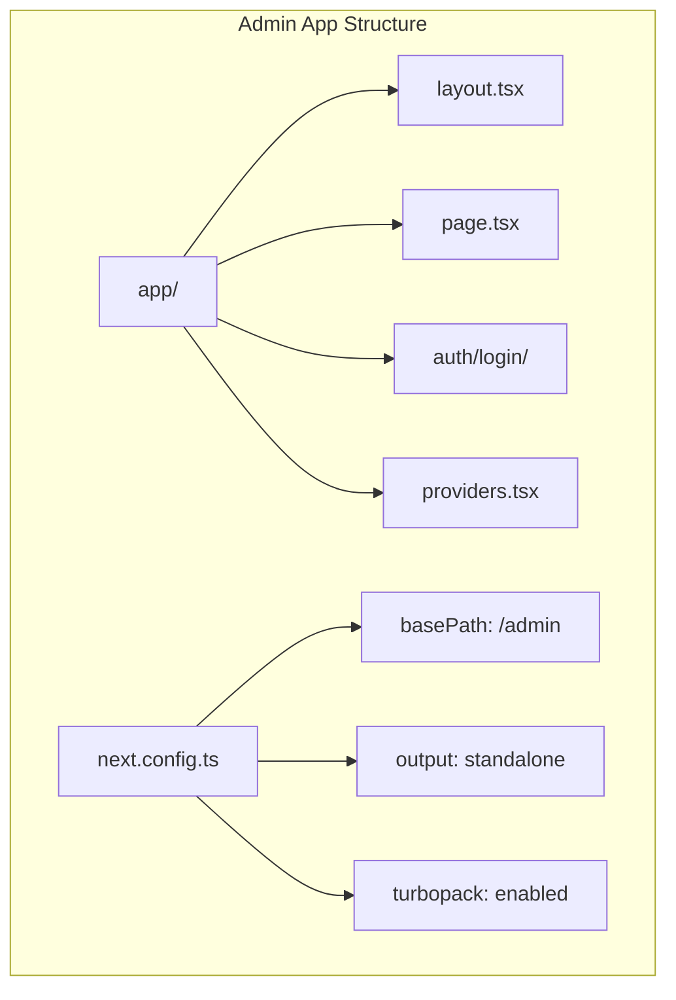
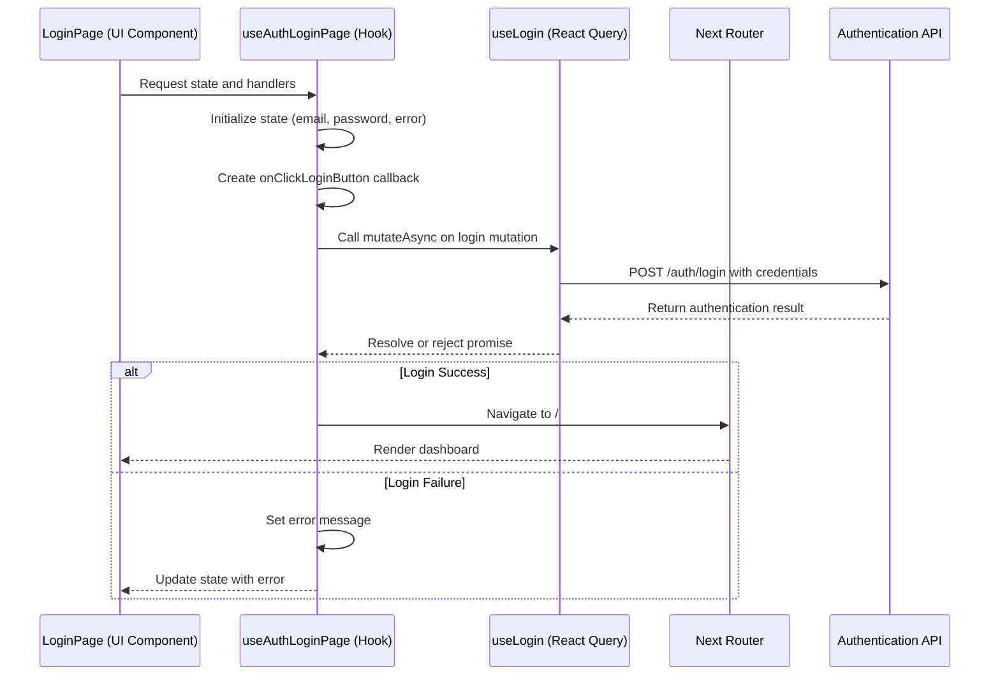
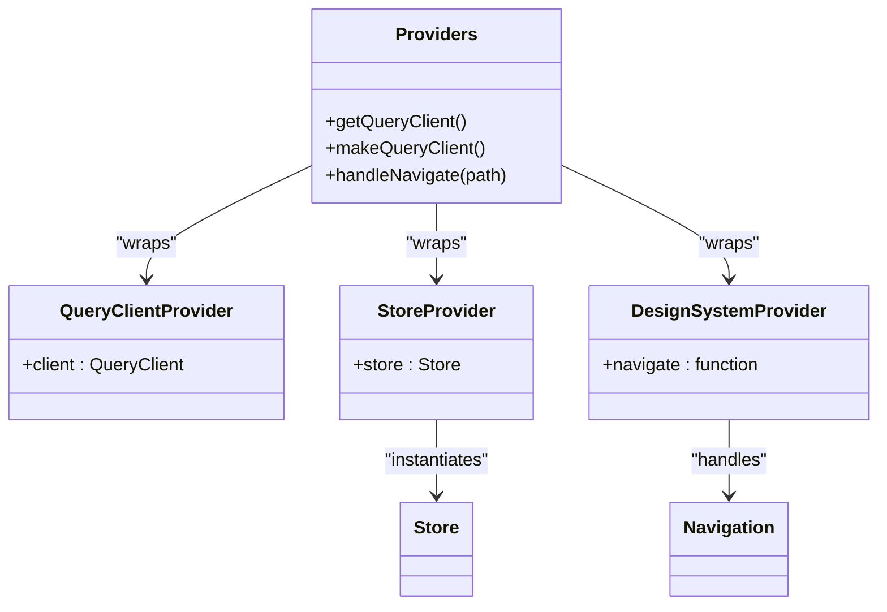

# Admin Application Migration to Next.js

<cite>
**Referenced Files in This Document**   
- [next.config.ts](file://apps/admin/next.config.ts)
- [package.json](file://apps/admin/package.json)
- [layout.tsx](file://apps/admin/app/layout.tsx)
- [page.tsx](file://apps/admin/app/page.tsx)
- [providers.tsx](file://apps/admin/app/providers.tsx)
- [auth/login/page.tsx](file://apps/admin/app/auth/login/page.tsx)
- [auth/login/hooks/useAuthLoginPage.tsx](file://apps/admin/app/auth/login/hooks/useAuthLoginPage.tsx)
- [tsconfig.json](file://apps/admin/tsconfig.json)
- [globals.d.ts](file://apps/admin/globals.d.ts)
- [next-env.d.ts](file://apps/admin/next-env.d.ts)
- [packages/design-system/src/provider/DesignSystemProvider.tsx](file://packages/design-system/src/provider/DesignSystemProvider.tsx)
- [packages/store/src/providers/StoreProvider.tsx](file://packages/store/src/providers/StoreProvider.tsx)
</cite>

## Table of Contents
1. [Introduction](#introduction)
2. [Project Structure](#project-structure)
3. [Core Components](#core-components)
4. [Architecture Overview](#architecture-overview)
5. [Detailed Component Analysis](#detailed-component-analysis)
6. [Dependency Analysis](#dependency-analysis)
7. [Performance Considerations](#performance-considerations)
8. [Troubleshooting Guide](#troubleshooting-guide)
9. [Conclusion](#conclusion)

## Introduction
This document provides a comprehensive analysis of the Admin Application migration to Next.js, focusing on the architectural changes, component structure, and integration patterns implemented in the new framework. The migration leverages Next.js 16 with Turbopack for improved development experience and standalone deployment capabilities.

## Project Structure

The Admin application follows a Next.js App Router structure with a monorepo setup, utilizing workspace dependencies for shared packages. The application is configured with a basePath of "/admin" to support deployment under a subpath.



**Diagram sources**
- [next.config.ts](file://apps/admin/next.config.ts#L1-L28)
- [app/layout.tsx](file://apps/admin/app/layout.tsx#L1-L23)

**Section sources**
- [next.config.ts](file://apps/admin/next.config.ts#L1-L28)
- [package.json](file://apps/admin/package.json#L1-L48)
- [tsconfig.json](file://apps/admin/tsconfig.json#L1-L43)

## Core Components

The Admin application's core components include the Root Layout, Providers setup, and authentication flow. The application uses a provider pattern to manage global state, query clients, and design system configuration. The login flow is implemented as a client component that integrates with the shared UI library and API package.

**Section sources**
- [layout.tsx](file://apps/admin/app/layout.tsx#L1-L23)
- [providers.tsx](file://apps/admin/app/providers.tsx#L1-L62)
- [page.tsx](file://apps/admin/app/page.tsx#L1-L8)

## Architecture Overview

The Admin application architecture follows a modern React pattern with Next.js App Router, leveraging several key technologies:

1. **State Management**: MobX through the @cocrepo/store package
2. **Data Fetching**: React Query via @tanstack/react-query
3. **UI Components**: Shared design system and UI components
4. **Authentication**: API integration through @cocrepo/api
5. **Monorepo Integration**: Workspace dependencies for shared packages

```mermaid
graph TD
A[Client Browser] --> B[Next.js App Router]
B --> C[Root Layout]
C --> D[Providers]
D --> E[DesignSystemProvider]
D --> F[StoreProvider]
D --> G[QueryClientProvider]
E --> H[@cocrepo/design-system]
F --> I[@cocrepo/store]
G --> J[@tanstack/react-query]
K[LoginPage] --> L[@cocrepo/ui]
K --> M[@cocrepo/api]
M --> N[Authentication API]
```

**Diagram sources**
- [providers.tsx](file://apps/admin/app/providers.tsx#L1-L62)
- [packages/store/src/providers/StoreProvider.tsx](file://packages/store/src/providers/StoreProvider.tsx#L1-L16)
- [packages/design-system/src/provider/DesignSystemProvider.tsx](file://packages/design-system/src/provider/DesignSystemProvider.tsx)

## Detailed Component Analysis

### Authentication Login Component Analysis

The authentication login component follows a clean separation of concerns pattern, with the UI component separated from the business logic. The component uses a custom hook to manage state and authentication logic, while rendering a shared UI component from the design system.

#### For API/Service Components:


**Diagram sources**
- [auth/login/page.tsx](file://apps/admin/app/auth/login/page.tsx#L1-L22)
- [auth/login/hooks/useAuthLoginPage.tsx](file://apps/admin/app/auth/login/hooks/useAuthLoginPage.tsx#L1-L59)

**Section sources**
- [auth/login/page.tsx](file://apps/admin/app/auth/login/page.tsx#L1-L22)
- [auth/login/hooks/useAuthLoginPage.tsx](file://apps/admin/app/auth/login/hooks/useAuthLoginPage.tsx#L1-L59)

### Providers Analysis

The providers setup implements a multi-layered provider pattern to manage different aspects of the application state and configuration. This approach allows for separation of concerns while ensuring that all necessary context is available to child components.



**Diagram sources**
- [providers.tsx](file://apps/admin/app/providers.tsx#L1-L62)
- [packages/store/src/providers/StoreProvider.tsx](file://packages/store/src/providers/StoreProvider.tsx#L1-L16)

## Dependency Analysis

The Admin application has a well-defined dependency structure, leveraging the monorepo workspace to share common packages across applications. The transpilePackages configuration in next.config.ts ensures that workspace packages are properly processed during the build.

```mermaid
graph TD
A[Admin App] --> B[@cocrepo/api]
A --> C[@cocrepo/design-system]
A --> D[@cocrepo/store]
A --> E[@cocrepo/toolkit]
A --> F[@cocrepo/hook]
A --> G[@cocrepo/type]
A --> H[@cocrepo/ui]
A --> I[@tanstack/react-query]
A --> J[mobx]
A --> K[next]
B --> L[API Services]
C --> M[Design System]
D --> N[State Management]
E --> O[Utility Functions]
F --> P[Custom Hooks]
G --> Q[Type Definitions]
H --> R[UI Components]
```

**Diagram sources**
- [package.json](file://apps/admin/package.json#L1-L48)
- [next.config.ts](file://apps/admin/next.config.ts#L1-L28)

**Section sources**
- [package.json](file://apps/admin/package.json#L1-L48)
- [next.config.ts](file://apps/admin/next.config.ts#L1-L28)

## Performance Considerations

The Admin application is configured for optimal performance with several key settings:

1. **Standalone Output**: The application is configured to output in standalone mode for Docker deployment, reducing the Docker image size by only including necessary files.

2. **Turbopack Integration**: Development uses Turbopack for faster builds and hot module replacement.

3. **Query Caching**: React Query is configured with a staleTime of 60 seconds to prevent unnecessary refetching on the client.

4. **Package Transpilation**: Workspace packages are explicitly listed in transpilePackages to ensure proper processing.

5. **Typed Routes**: The typedRoutes option is enabled for better type safety with route handling.

**Section sources**
- [next.config.ts](file://apps/admin/next.config.ts#L1-L28)
- [providers.tsx](file://apps/admin/app/providers.tsx#L1-L62)

## Troubleshooting Guide

Common issues and solutions for the Admin application:

1. **Module Not Found Errors**: Ensure all workspace packages are properly linked and listed in transpilePackages in next.config.ts.

2. **Type Errors**: Run `npm run type-check` to verify TypeScript compilation.

3. **Authentication Flow Issues**: Check that the router.push("/") navigation is working correctly in the useAuthLoginPage hook.

4. **Styling Issues**: Verify that globals.css is imported in layout.tsx and that the DesignSystemProvider is properly configured.

5. **State Persistence Problems**: Ensure the StoreProvider is wrapping all components that need access to global state.

**Section sources**
- [tsconfig.json](file://apps/admin/tsconfig.json#L1-L43)
- [next-env.d.ts](file://apps/admin/next-env.d.ts#L1-L7)
- [globals.d.ts](file://apps/admin/globals.d.ts#L1-L2)

## Conclusion

The migration of the Admin application to Next.js represents a significant architectural improvement, leveraging modern React patterns and Next.js features. The application benefits from improved developer experience with Turbopack, better performance with standalone output, and enhanced type safety with typed routes. The component structure follows best practices with clear separation of concerns between UI, business logic, and state management. The integration with shared monorepo packages ensures consistency across applications while maintaining flexibility for application-specific requirements.