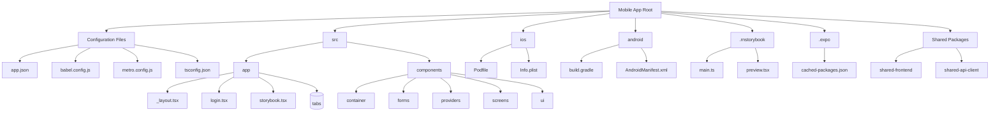
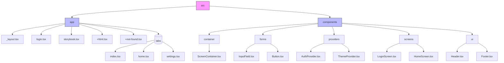
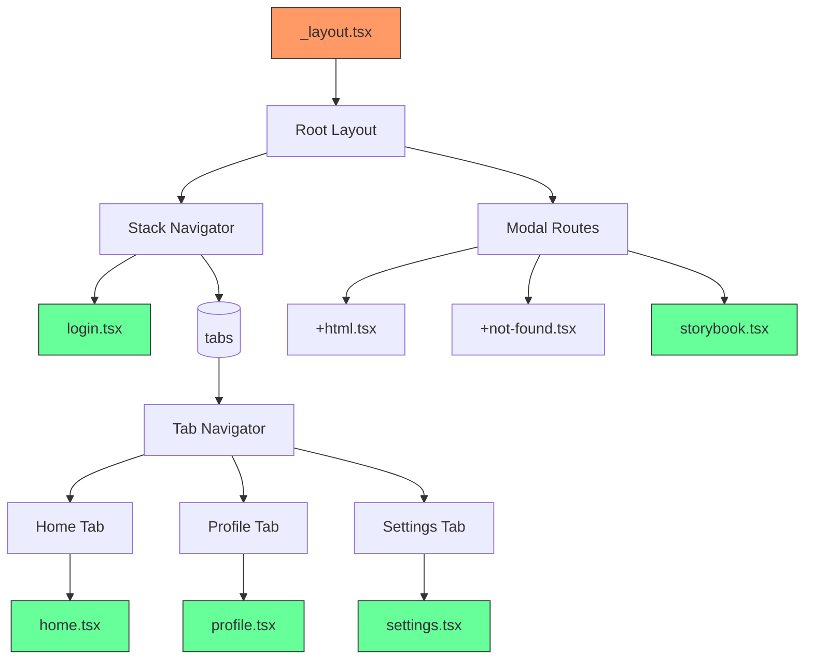
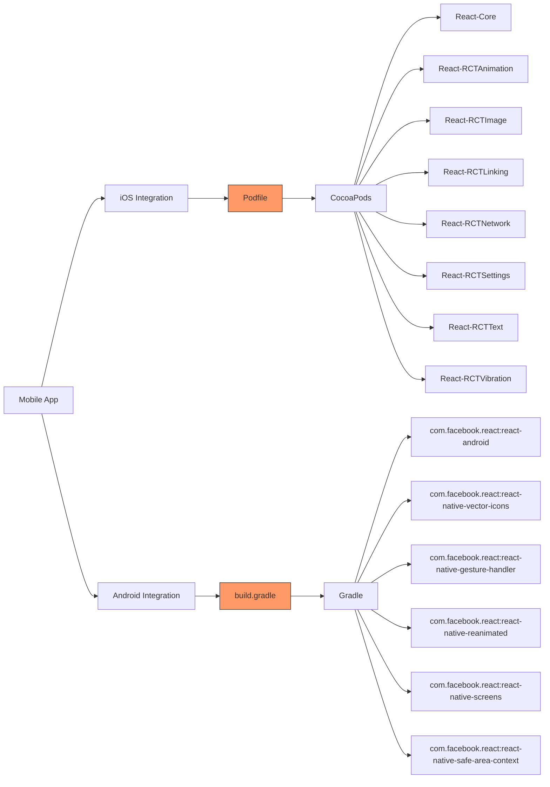
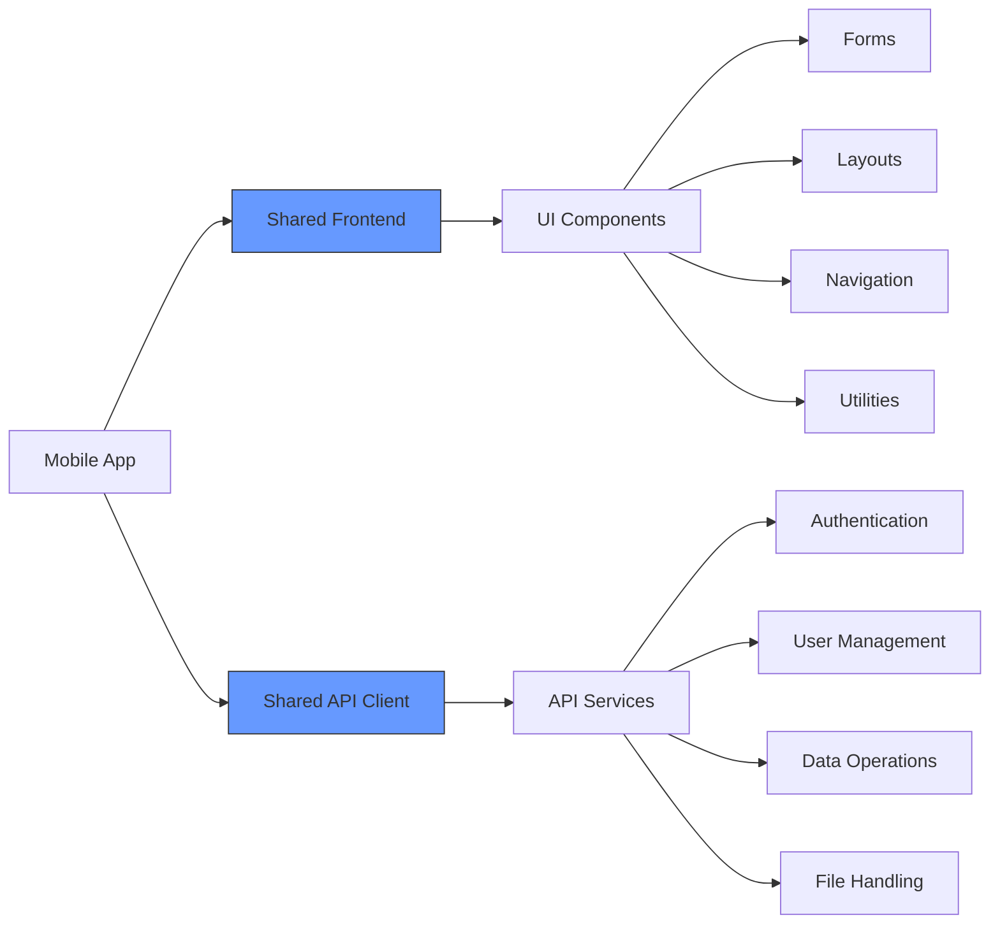
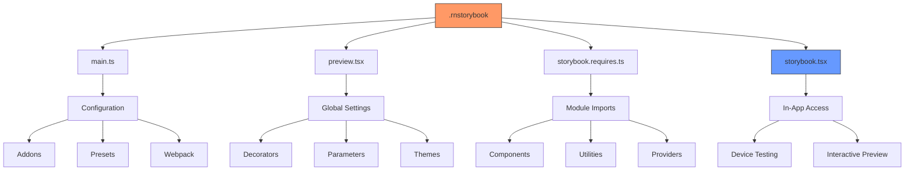
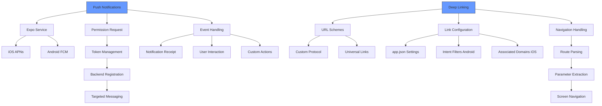
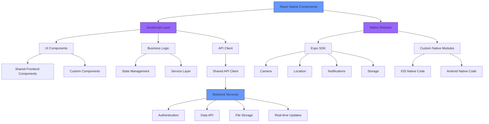
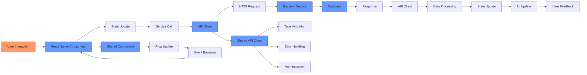

# Mobile Application

<cite>
**Referenced Files in This Document**   
- [package.json](file://apps/mobile/package.json)
- [app.json](file://apps/mobile/app.json)
- [babel.config.js](file://apps/mobile/babel.config.js)
- [metro.config.js](file://apps/mobile/metro.config.js)
- [tsconfig.json](file://apps/mobile/tsconfig.json)
- [src/app/_layout.tsx](file://apps/mobile/src/app/_layout.tsx)
- [src/app/login.tsx](file://apps/mobile/src/app/login.tsx)
- [src/app/storybook.tsx](file://apps/mobile/src/app/storybook.tsx)
- [src/components/index.ts](file://apps/mobile/src/components/index.ts)
- [android/app/src/main/AndroidManifest.xml](file://apps/mobile/android/app/src/main/AndroidManifest.xml)
- [ios/mobile/Info.plist](file://apps/mobile/ios/mobile/Info.plist)
- [packages/shared-frontend/src/components](file://packages/shared-frontend/src/components)
- [packages/shared-api-client/src](file://packages/shared-api-client/src)
- [.rnstorybook/main.ts](file://apps/mobile/.rnstorybook/main.ts)
- [ios/Podfile](file://apps/mobile/ios/Podfile)
- [android/app/build.gradle](file://apps/mobile/android/app/build.gradle)
</cite>

## Table of Contents
1. [Introduction](#introduction)
2. [Project Structure](#project-structure)
3. [React Native Foundation with Expo](#react-native-foundation-with-expo)
4. [Directory Structure](#directory-structure)
5. [Navigation System](#navigation-system)
6. [Native Module Integration](#native-module-integration)
7. [Shared Components and API Client](#shared-components-and-api-client)
8. [Storybook for Mobile Development](#storybook-for-mobile-development)
9. [Push Notifications and Deep Linking](#push-notifications-and-deep-linking)
10. [Native UI Components](#native-ui-components)
11. [Development and Testing Workflow](#development-and-testing-workflow)
12. [Architecture Diagrams](#architecture-diagrams)

## Introduction
The Mobile Application in prj-core is a cross-platform mobile solution built using React Native with Expo for efficient development across iOS and Android platforms. This application leverages the power of React Native to create native-like experiences while maintaining a single codebase. The architecture is designed to maximize code reuse through shared components and API clients with other applications in the ecosystem, particularly the admin web application. The mobile app integrates closely with native modules through iOS Pods and Android Gradle configurations to access platform-specific features and optimize performance. It utilizes Expo's managed workflow to simplify the development process while allowing for custom native code when needed. The application follows a modular structure with clear separation of concerns between UI components, business logic, and data management. This documentation provides a comprehensive overview of the mobile application's architecture, highlighting its key components, integration points, and development practices.

## Project Structure
The mobile application follows a well-organized directory structure that separates concerns and promotes code reusability. At the root level, the application contains configuration files for Expo, Babel, Metro, and TypeScript, which define the build and development environment. The `src` directory houses the main application code, organized into `app` and `components` subdirectories. The `app` directory follows React Navigation's file-based routing system, with each file or directory representing a route in the application. The `_layout.tsx` file serves as the root layout component, providing shared UI elements and providers across all screens. The `components` directory contains reusable UI components that can be shared across different parts of the application. Native platform configurations are maintained in the `ios` and `android` directories, with iOS using CocoaPods for dependency management and Android using Gradle. The `.rnstorybook` directory contains configuration for Storybook, enabling isolated component development and testing. The application also leverages shared packages from the monorepo, including `shared-frontend` for UI components and `shared-api-client` for API interactions, ensuring consistency across platforms.

**Diagram sources**
- [app.json](file://apps/mobile/app.json)
- [babel.config.js](file://apps/mobile/babel.config.js)
- [metro.config.js](file://apps/mobile/metro.config.js)
- [tsconfig.json](file://apps/mobile/tsconfig.json)
- [src/app/_layout.tsx](file://apps/mobile/src/app/_layout.tsx)
- [ios/Podfile](file://apps/mobile/ios/Podfile)
- [android/app/build.gradle](file://apps/mobile/android/app/build.gradle)
- [packages/shared-frontend/src](file://packages/shared-frontend/src)
- [packages/shared-api-client/src](file://packages/shared-api-client/src)

**Section sources**
- [app.json](file://apps/mobile/app.json)
- [babel.config.js](file://apps/mobile/babel.config.js)
- [metro.config.js](file://apps/mobile/metro.config.js)
- [tsconfig.json](file://apps/mobile/tsconfig.json)
- [src/app/_layout.tsx](file://apps/mobile/src/app/_layout.tsx)
- [ios/Podfile](file://apps/mobile/ios/Podfile)
- [android/app/build.gradle](file://apps/mobile/android/app/build.gradle)

## React Native Foundation with Expo
The mobile application is built on React Native with Expo, leveraging Expo's managed workflow to accelerate development and simplify the build process. Expo provides a comprehensive set of pre-configured native modules and services that enable rapid development without requiring direct native code manipulation in most cases. The application uses Expo SDK to access native device features such as camera, location, notifications, and biometric authentication through JavaScript APIs. This approach allows developers to focus on building application logic rather than managing complex native build configurations. The Expo Router is used for navigation, providing a file-based routing system that automatically generates routes based on the file structure in the `app` directory. This convention-based approach reduces boilerplate code and makes the navigation structure more predictable and maintainable. The application benefits from Expo's over-the-air (OTA) updates, which allow for rapid deployment of bug fixes and feature updates without requiring users to download new versions from app stores. Expo's development server enables fast refresh and instant updates during development, significantly improving developer productivity. The application also leverages Expo's pre-built UI components and utilities, which are optimized for performance and provide a native-like experience across both iOS and Android platforms.

**Section sources**
- [package.json](file://apps/mobile/package.json)
- [app.json](file://apps/mobile/app.json)
- [babel.config.js](file://apps/mobile/babel.config.js)
- [metro.config.js](file://apps/mobile/metro.config.js)

## Directory Structure
The mobile application follows a structured directory organization that promotes scalability and maintainability. The root directory contains essential configuration files including `app.json` for Expo-specific settings, `babel.config.js` for Babel transformations, `metro.config.js` for the Metro bundler configuration, and `tsconfig.json` for TypeScript settings. The `src` directory serves as the main container for application code, divided into `app` and `components` subdirectories. The `app` directory implements the file-based routing system, where each file or directory represents a route in the application. Special files like `_layout.tsx` define layout components that wrap child routes, while `+html.tsx` and `+not-found.tsx` handle HTML shell and 404 routing respectively. The `(tabs)` directory contains tab-based navigation screens, organizing related functionality into a tabbed interface. The `components` directory houses reusable UI components organized by category such as `container`, `forms`, `providers`, `screens`, and `ui`. This categorization follows a logical grouping that makes components easy to locate and reuse. The `index.ts` file in the components directory serves as a barrel file, re-exporting components for convenient importing elsewhere in the application. Platform-specific configurations are maintained in the `ios` and `android` directories, with iOS using CocoaPods for dependency management and Android using Gradle for build configuration.

**Diagram sources**
- [src/app/_layout.tsx](file://apps/mobile/src/app/_layout.tsx)
- [src/app/login.tsx](file://apps/mobile/src/app/login.tsx)
- [src/app/storybook.tsx](file://apps/mobile/src/app/storybook.tsx)
- [src/components/index.ts](file://apps/mobile/src/components/index.ts)

**Section sources**
- [src/app/_layout.tsx](file://apps/mobile/src/app/_layout.tsx)
- [src/app/login.tsx](file://apps/mobile/src/app/login.tsx)
- [src/app/storybook.tsx](file://apps/mobile/src/app/storybook.tsx)
- [src/components/index.ts](file://apps/mobile/src/components/index.ts)

## Navigation System
The mobile application implements a robust navigation system using Expo Router, which provides a file-based routing approach that automatically generates routes based on the file structure in the `app` directory. This convention-based system eliminates the need for manual route configuration and makes the navigation structure more predictable and maintainable. The `_layout.tsx` file serves as the root layout component, wrapping all child routes with shared UI elements such as headers, footers, and providers. This layout component can also handle authentication checks and redirect users to appropriate screens based on their login status. The application supports multiple navigation patterns including stack navigation for sequential screens, tab navigation for top-level sections, and modal navigation for temporary interfaces. The `(tabs)` directory contains tab-based navigation screens, organizing related functionality into a tabbed interface that persists across multiple screens. Deep linking is supported through Expo's linking configuration, allowing the application to handle custom URL schemes and universal links. The navigation system is designed to be type-safe using TypeScript, providing autocomplete and compile-time checking for route parameters and navigation actions. This ensures that navigation errors are caught during development rather than at runtime.

**Diagram sources**
- [src/app/_layout.tsx](file://apps/mobile/src/app/_layout.tsx)
- [src/app/login.tsx](file://apps/mobile/src/app/login.tsx)
- [src/app/storybook.tsx](file://apps/mobile/src/app/storybook.tsx)
- [src/app/(tabs)/index.tsx](file://apps/mobile/src/app/(tabs)/index.tsx)

**Section sources**
- [src/app/_layout.tsx](file://apps/mobile/src/app/_layout.tsx)
- [src/app/login.tsx](file://apps/mobile/src/app/login.tsx)
- [src/app/storybook.tsx](file://apps/mobile/src/app/storybook.tsx)
- [src/app/(tabs)/index.tsx](file://apps/mobile/src/app/(tabs)/index.tsx)

## Native Module Integration
The mobile application integrates with native modules through both iOS CocoaPods and Android Gradle configurations, enabling access to platform-specific features and optimized performance. For iOS, the application uses CocoaPods as specified in the `ios/Podfile`, which manages native dependencies and their versions. The Podfile includes essential React Native dependencies such as React-Core, React-RCTAnimation, React-RCTImage, and other core modules that provide native functionality. Additional native modules can be added to the Podfile as needed, with CocoaPods handling the installation and linking process. For Android, the application uses Gradle as specified in the `android/app/build.gradle` file, which defines dependencies, build configurations, and signing settings. The build.gradle file includes React Native dependencies and can be extended to include additional native libraries. The integration process is streamlined through Expo's autolinking feature, which automatically links native modules without requiring manual configuration in most cases. When custom native code is required, developers can create native modules in Objective-C/Swift for iOS or Java/Kotlin for Android, exposing them to JavaScript through React Native's native module system. This hybrid approach allows the application to leverage the performance benefits of native code while maintaining the productivity benefits of JavaScript development.

**Diagram sources**
- [ios/Podfile](file://apps/mobile/ios/Podfile)
- [android/app/build.gradle](file://apps/mobile/android/app/build.gradle)

**Section sources**
- [ios/Podfile](file://apps/mobile/ios/Podfile)
- [android/app/build.gradle](file://apps/mobile/android/app/build.gradle)

## Shared Components and API Client
The mobile application leverages shared components and an API client from the monorepo's package ecosystem to ensure consistency and reduce duplication across platforms. The application imports UI components from the `shared-frontend` package, which contains a library of reusable React components designed for both web and mobile applications. These components are built with responsive design principles, adapting their appearance and behavior based on the platform and screen size. The shared components include form elements, layout containers, navigation elements, and utility components that follow a consistent design system. For API interactions, the mobile application uses the `shared-api-client` package, which provides a type-safe interface for communicating with the backend services. This client is generated from OpenAPI specifications using Orval, ensuring that the API contracts are always up-to-date and type-safe. The shared API client handles authentication, error handling, and request/response transformations consistently across all applications. By using these shared packages, the mobile application benefits from centralized maintenance, consistent user experiences, and reduced development time. Updates to shared components or API contracts are automatically propagated to the mobile application through version updates, ensuring that all platforms remain synchronized.

**Diagram sources**
- [packages/shared-frontend/src/components](file://packages/shared-frontend/src/components)
- [packages/shared-api-client/src](file://packages/shared-api-client/src)

**Section sources**
- [packages/shared-frontend/src/components](file://packages/shared-frontend/src/components)
- [packages/shared-api-client/src](file://packages/shared-api-client/src)

## Storybook for Mobile Development
The mobile application utilizes Storybook through the `.rnstorybook` directory to facilitate component-driven development and testing. Storybook provides an isolated environment for developing and documenting UI components without running the entire application. The `main.ts` configuration file in the `.rnstorybook` directory defines the addons, presets, and webpack configuration for the Storybook instance. The `preview.tsx` file configures global decorators and parameters that apply to all stories, such as theme providers, authentication state, and viewport settings. The `storybook.requires.ts` file imports all necessary modules and components that Storybook needs to render the stories. The application includes a `storybook.tsx` screen in the `app` directory, which serves as an entry point to access Storybook within the running application. This allows developers and designers to view and interact with components directly on a physical device or simulator. Storybook stories are written for individual components, demonstrating their various states, props, and interactions. This approach enables rapid iteration on UI components, ensures visual consistency, and serves as living documentation for the component library. The integration with Storybook also supports automated visual regression testing, helping to catch unintended UI changes during development.

**Diagram sources**
- [.rnstorybook/main.ts](file://apps/mobile/.rnstorybook/main.ts)
- [.rnstorybook/preview.tsx](file://apps/mobile/.rnstorybook/preview.tsx)
- [.rnstorybook/storybook.requires.ts](file://apps/mobile/.rnstorybook/storybook.requires.ts)
- [src/app/storybook.tsx](file://apps/mobile/src/app/storybook.tsx)

**Section sources**
- [.rnstorybook/main.ts](file://apps/mobile/.rnstorybook/main.ts)
- [.rnstorybook/preview.tsx](file://apps/mobile/.rnstorybook/preview.tsx)
- [.rnstorybook/storybook.requires.ts](file://apps/mobile/.rnstorybook/storybook.requires.ts)
- [src/app/storybook.tsx](file://apps/mobile/src/app/storybook.tsx)

## Push Notifications and Deep Linking
The mobile application implements push notifications and deep linking to enhance user engagement and provide seamless navigation experiences. Push notifications are configured through Expo's notification service, which handles the registration, delivery, and display of notifications on both iOS and Android platforms. The application requests permission from users to receive notifications and manages notification tokens for each device. These tokens are sent to the backend server, which can then target specific users or groups with personalized notifications. The application handles notification events such as receipt, interaction, and dismissal through event listeners, allowing for custom behavior when users engage with notifications. Deep linking is implemented using Expo's linking configuration, which allows the application to respond to custom URL schemes and universal links. This enables users to open specific screens or content within the application directly from external sources such as emails, websites, or other applications. The deep linking configuration is defined in the `app.json` file, specifying the URL schemes and universal links that the application should handle. The navigation system is designed to interpret deep link parameters and route users to the appropriate screens with the correct context, creating a seamless transition from external links to in-app content.

**Diagram sources**
- [app.json](file://apps/mobile/app.json)
- [ios/mobile/Info.plist](file://apps/mobile/ios/mobile/Info.plist)
- [android/app/src/main/AndroidManifest.xml](file://apps/mobile/android/app/src/main/AndroidManifest.xml)

**Section sources**
- [app.json](file://apps/mobile/app.json)
- [ios/mobile/Info.plist](file://apps/mobile/ios/mobile/Info.plist)
- [android/app/src/main/AndroidManifest.xml](file://apps/mobile/android/app/src/main/AndroidManifest.xml)

## Native UI Components
The mobile application incorporates native UI components to provide platform-specific user experiences and leverage native performance optimizations. These components are implemented using React Native's native module system, which allows JavaScript code to communicate with native code written in Objective-C/Swift for iOS and Java/Kotlin for Android. The application uses native UI components for critical performance areas such as lists, animations, and complex gestures, where native implementations provide superior performance compared to pure JavaScript solutions. For example, the application may use `FlatList` or `SectionList` components that are backed by native collection views on both platforms. The application also leverages native navigation components that follow platform-specific design guidelines, such as iOS's navigation bar with back swipe gestures and Android's bottom navigation with material design patterns. Custom native UI components can be created when specific functionality is not available through existing libraries, exposing them to JavaScript through React Native's bridge. These components are designed to be reusable and can be integrated into the shared component library for use across multiple applications. The use of native UI components ensures that the application feels natural and familiar to users on each platform while maintaining a high level of performance and responsiveness.

**Section sources**
- [src/components/ui](file://apps/mobile/src/components/ui)
- [ios](file://apps/mobile/ios)
- [android](file://apps/mobile/android)

## Development and Testing Workflow
The mobile application follows a comprehensive development and testing workflow that ensures code quality, functionality, and performance. The development process begins with setting up the local environment using Expo CLI, which provides tools for starting the development server, building standalone apps, and managing credentials. Developers use the Expo Go app on physical devices or simulators to preview changes in real-time, taking advantage of fast refresh for rapid iteration. The application leverages TypeScript for type safety, catching potential errors during development rather than at runtime. ESLint and Prettier are configured to enforce code style consistency and identify potential issues. Storybook is used for component-driven development, allowing UI components to be developed and tested in isolation. The testing strategy includes unit tests for business logic and utility functions, integration tests for component interactions, and end-to-end tests for critical user flows. Jest is used as the testing framework, with React Native Testing Library for component testing. The application also supports visual regression testing through Storybook, helping to catch unintended UI changes. For performance testing, the application uses React Native's built-in performance monitoring tools and Expo's profiling features to identify bottlenecks and optimize rendering. The workflow concludes with building and distributing test versions through Expo's internal distribution or app store testing services, allowing for comprehensive testing before production release.

**Section sources**
- [package.json](file://apps/mobile/package.json)
- [babel.config.js](file://apps/mobile/babel.config.js)
- [metro.config.js](file://apps/mobile/metro.config.js)
- [tsconfig.json](file://apps/mobile/tsconfig.json)
- [.eslintrc.js](file://apps/mobile/.eslintrc.js)
- [.prettierrc](file://apps/mobile/.prettierrc)

## Architecture Diagrams

### Component Architecture
The following diagram illustrates the relationship between React Native components, native modules, and backend services in the mobile application:

**Diagram sources**
- [src/app](file://apps/mobile/src/app)
- [src/components](file://apps/mobile/src/components)
- [packages/shared-frontend](file://packages/shared-frontend)
- [packages/shared-api-client](file://packages/shared-api-client)
- [ios](file://apps/mobile/ios)
- [android](file://apps/mobile/android)

### Data Flow Diagram
The following diagram shows the data flow between the mobile application, shared packages, and backend services:

**Diagram sources**
- [src/app](file://apps/mobile/src/app)
- [src/components](file://apps/mobile/src/components)
- [packages/shared-api-client](file://packages/shared-api-client)
- [packages/shared-frontend](file://packages/shared-frontend)