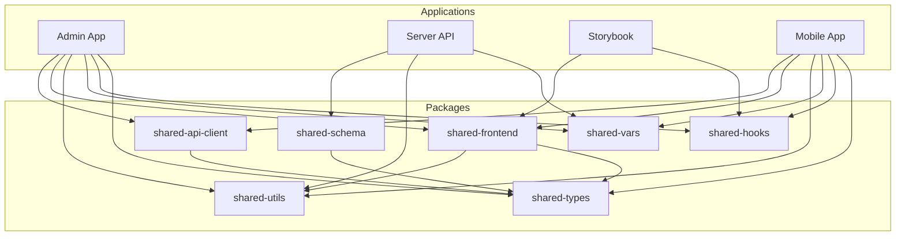

# Monorepo Structure

<cite>
**Referenced Files in This Document**   
- [package.json](file://package.json)
- [pnpm-workspace.yaml](file://pnpm-workspace.yaml)
- [turbo.json](file://turbo.json)
- [README.md](file://README.md)
- [apps/admin/package.json](file://apps/admin/package.json)
- [apps/server/package.json](file://apps/server/package.json)
- [apps/storybook/package.json](file://apps/storybook/package.json)
- [packages/api-client/package.json](file://packages/api-client/package.json)
- [packages/ui/package.json](file://packages/ui/package.json)
- [packages/toolkit/package.json](file://packages/toolkit/package.json)
- [packages/constants/package.json](file://packages/constants/package.json)
- [packages/schema/package.json](file://packages/schema/package.json)
</cite>

## Table of Contents
1. [Introduction](#introduction)
2. [Project Structure](#project-structure)
3. [Applications Overview](#applications-overview)
4. [Shared Packages](#shared-packages)
5. [Dependency Management](#dependency-management)
6. [Development Workflow](#development-workflow)
7. [Build and Optimization](#build-and-optimization)
8. [Architecture Diagram](#architecture-diagram)

## Introduction
The prj-core monorepo is a modern full-stack reservation platform architecture designed for fitness, hair, massage, and other service domains. Built with Turborepo and pnpm workspace, this monorepo maximizes code reuse and development efficiency while maintaining clear separation between applications and shared components. The architecture follows domain-driven design principles with strong typing throughout the stack using TypeScript and Prisma.

**Section sources**
- [README.md](file://README.md#L1-L50)

## Project Structure
The prj-core monorepo follows a clear directory structure with two main top-level directories: `apps` and `packages`. The `apps` directory contains all standalone applications that can be built and deployed independently, while the `packages` directory contains reusable shared components that can be consumed across multiple applications.

The root of the repository contains configuration files for the monorepo tooling, including `package.json` for workspace scripts, `pnpm-workspace.yaml` for workspace package definitions, and `turbo.json` for build optimization and task orchestration. This structure enables independent development of applications while promoting code reuse through shared packages.

**Section sources**
- [README.md](file://README.md#L117-L162)
- [pnpm-workspace.yaml](file://pnpm-workspace.yaml#L1-L3)

## Applications Overview
The monorepo contains four main applications in the `apps` directory, each serving a distinct purpose in the development and deployment workflow.

### Admin Application
The admin application is a React-based web application built with Vite that provides administrative functionality for the platform. It serves as the primary interface for managing reservations, users, and system configuration. The application uses TanStack Router for type-safe routing and integrates with shared packages for state management, UI components, and API communication.

**Section sources**
- [apps/admin/package.json](file://apps/admin/package.json#L1-L69)
- [README.md](file://README.md#L122-L128)

### Server Application
The server application is a NestJS backend API that provides the core business logic and data access layer for the platform. Built with Node.js and TypeScript, it uses Prisma as an ORM for PostgreSQL database interactions. The server exposes RESTful endpoints for all platform functionality and implements role-based access control (RBAC) for security.

**Section sources**
- [apps/server/package.json](file://apps/server/package.json#L1-L102)
- [README.md](file://README.md#L128-L134)

### Mobile Application
The mobile application is a React Native application that provides a mobile interface for end users to book and manage reservations. It uses Expo for development and deployment, allowing for cross-platform compatibility between iOS and Android devices. The mobile app shares business logic and UI components with other applications through the shared packages.

**Section sources**
- [README.md](file://README.md#L134-L135)

### Storybook Application
The Storybook application provides a living style guide and UI component documentation for the platform. It allows developers and designers to view, test, and document UI components in isolation from the main applications. This ensures consistency in design and behavior across all applications that consume the shared UI components.

**Section sources**
- [apps/storybook/package.json](file://apps/storybook/package.json#L1-L57)
- [README.md](file://README.md#L134-L135)

## Shared Packages
The `packages` directory contains reusable components that are shared across multiple applications in the monorepo. These packages promote code reuse, ensure consistency, and reduce duplication across the codebase.

### API Client Package
The shared-api-client package contains automatically generated API clients and types from OpenAPI specifications using Orval. This package provides type-safe access to the server API endpoints and is consumed by frontend applications to ensure end-to-end type safety between client and server.

**Section sources**
- [packages/api-client/package.json](file://packages/api-client/package.json#L1-L56)
- [README.md](file://README.md#L137-L138)

### UI Components Package
The shared-frontend package contains reusable UI components built with React and styled using Tailwind CSS. These components follow a consistent design system and are used across all frontend applications to maintain visual and behavioral consistency. The package includes layout components, form elements, and interactive UI elements.

**Section sources**
- [packages/ui/package.json](file://packages/ui/package.json#L1-L100)
- [README.md](file://README.md#L155-L155)

### Utility Toolkit Package
The shared-utils package contains common utility functions used across the codebase. These utilities include functions for date/time manipulation, environment detection, path handling, form validation, and logging. By centralizing these utilities, the package ensures consistent behavior across all applications.

**Section sources**
- [packages/toolkit/package.json](file://packages/toolkit/package.json#L1-L56)
- [README.md](file://README.md#L153-L153)

### Constants Package
The shared-vars package contains shared configuration values and constants used across applications. This includes API endpoints, route names, and other configuration values that need to be consistent across the codebase. Centralizing these values prevents duplication and makes updates easier.

**Section sources**
- [packages/constants/package.json](file://packages/constants/package.json#L1-L31)
- [README.md](file://README.md#L138-L138)

### Schema Package
The shared-schema package contains the Prisma schema, DTOs (Data Transfer Objects), and entity definitions that define the data model for the entire platform. This package serves as the single source of truth for data structures and is consumed by both the server application and API clients to ensure consistency between database, backend, and frontend.

**Section sources**
- [README.md](file://README.md#L141-L151)

## Dependency Management
The monorepo uses pnpm workspaces to manage dependencies across applications and packages. The `pnpm-workspace.yaml` file defines the workspace patterns, including `apps/*` and `packages/*`, which allows all applications and packages to be linked together within the monorepo.

Shared packages use workspace protocols (e.g., `workspace:^0.3.0`) in their package.json files to reference other local packages, enabling seamless development without the need to publish packages to a registry. This approach allows for immediate testing of changes across the entire codebase.

The monorepo also maintains a catalog of common dependencies in the `pnpm-workspace.yaml` file, ensuring consistent versions of third-party libraries across all applications and packages. This prevents version conflicts and ensures that all components use compatible versions of shared dependencies.

**Section sources**
- [pnpm-workspace.yaml](file://pnpm-workspace.yaml#L1-L59)
- [apps/server/package.json](file://apps/server/package.json#L27-L28)
- [packages/ui/package.json](file://packages/ui/package.json#L49-L52)

## Development Workflow
The development workflow in the prj-core monorepo is optimized for productivity and consistency using Turborepo for task orchestration. The `turbo.json` configuration file defines a comprehensive set of tasks for building, testing, linting, and formatting code across the entire monorepo.

Developers can run tasks at different levels of granularity, from individual packages to the entire workspace. For example, `pnpm build:server` builds only the server application, while `pnpm build:packages` builds all shared packages. The root `build` task orchestrates the entire build process with proper dependency ordering.

The monorepo also includes specialized scripts for version management and release automation. The `version:patch`, `version:minor`, and `version:major` scripts update package versions according to semantic versioning, while the `release:patch`, `release:minor`, and `release:major` scripts automate the complete release process including building, publishing, and updating dependencies.

**Section sources**
- [package.json](file://package.json#L6-L38)
- [turbo.json](file://turbo.json#L1-L167)
- [README.md](file://README.md#L298-L337)

## Build and Optimization
The build process in the prj-core monorepo is optimized using Turborepo's caching and task orchestration capabilities. The `turbo.json` configuration defines inputs and outputs for each task, enabling intelligent caching that prevents unnecessary rebuilds when source files haven't changed.

Build tasks are configured with proper dependencies to ensure correct execution order. For example, the server application depends on the schema and toolkit packages, so these packages are built first before the server application is built. This dependency graph is automatically managed by Turborepo.

The monorepo also includes optimization for development workflows. Persistent tasks like `start:dev` are configured to run continuously with proper caching disabled to ensure that changes are immediately reflected. Global dependencies like environment files and workspace configuration are monitored to trigger appropriate rebuilds when they change.

**Section sources**
- [turbo.json](file://turbo.json#L1-L167)
- [package.json](file://package.json#L7-L12)

## Architecture Diagram
The following diagram illustrates the relationship between applications and shared packages in the prj-core monorepo:

**Diagram sources**
- [package.json](file://package.json)
- [apps/admin/package.json](file://apps/admin/package.json)
- [apps/server/package.json](file://apps/server/package.json)
- [apps/storybook/package.json](file://apps/storybook/package.json)
- [packages/api-client/package.json](file://packages/api-client/package.json)
- [packages/ui/package.json](file://packages/ui/package.json)
- [packages/toolkit/package.json](file://packages/toolkit/package.json)
- [packages/constants/package.json](file://packages/constants/package.json)
- [packages/schema/package.json](file://packages/schema/package.json)

**Section sources**
- [README.md](file://README.md#L164-L203)
- [package.json](file://package.json)