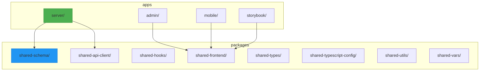
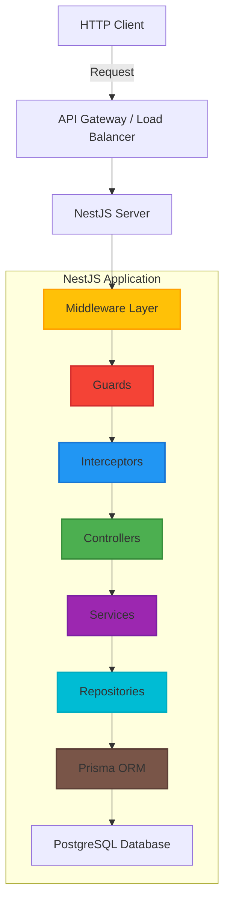
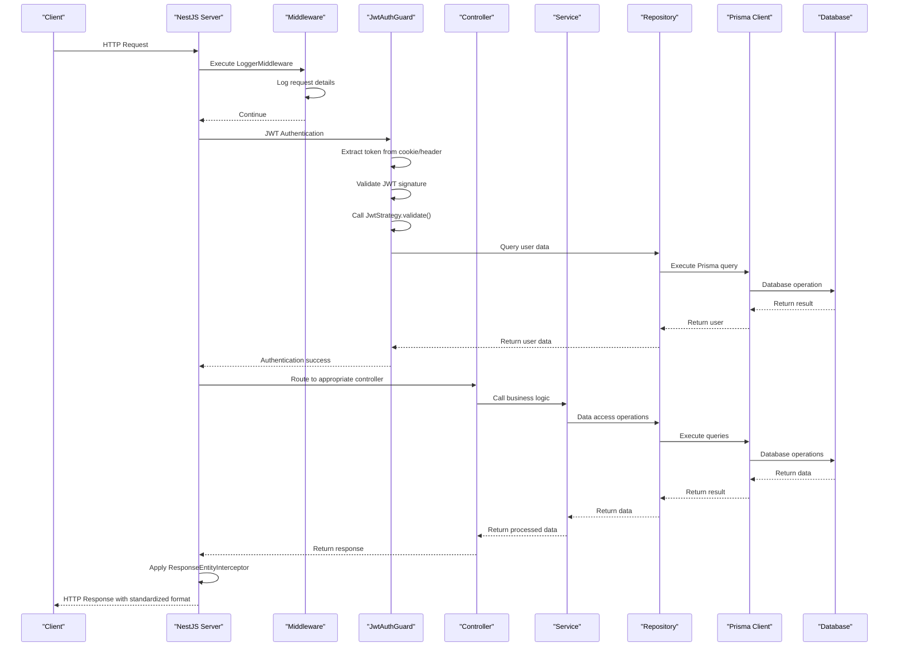
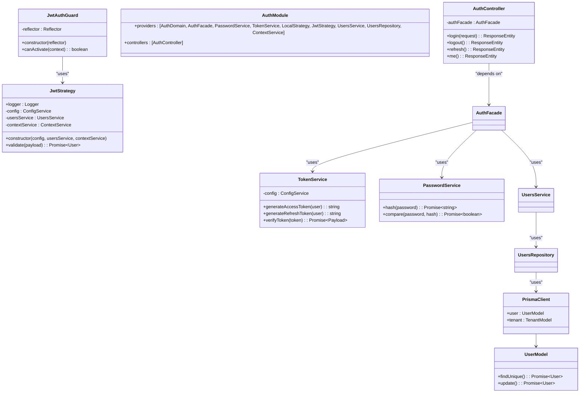
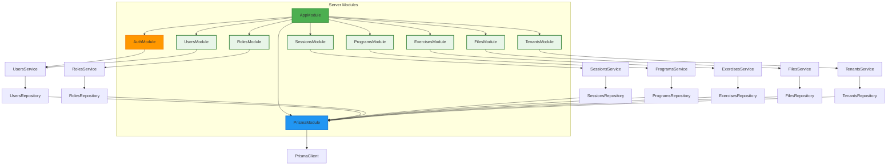

# Server Application

<cite>
**Referenced Files in This Document**   
- [main.ts](file://apps/server/src/main.ts)
- [setNestApp.ts](file://apps/server/src/setNestApp.ts)
- [app.module.ts](file://apps/server/src/module/app.module.ts)
- [auth.module.ts](file://apps/server/src/module/auth.module.ts)
- [jwt.strategy.ts](file://apps/server/src/shared/strategy/jwt.strategy.ts)
- [response-entity.interceptor.ts](file://apps/server/src/shared/interceptor/response-entity.interceptor.ts)
- [logger.middleware.ts](file://apps/server/src/shared/middleware/logger.middleware.ts)
- [prisma-logger.middleware.ts](file://apps/server/src/shared/middleware/prisma-logger.middleware.ts)
- [Dockerfile](file://apps/server/Dockerfile)
- [jest.config.js](file://apps/server/jest.config.js)
- [test/app.e2e-spec.ts](file://apps/server/test/app.e2e-spec.ts)
</cite>

## Table of Contents
1. [Introduction](#introduction)
2. [Project Structure](#project-structure)
3. [Core Components](#core-components)
4. [Architecture Overview](#architecture-overview)
5. [Detailed Component Analysis](#detailed-component-analysis)
6. [Dependency Analysis](#dependency-analysis)
7. [Performance Considerations](#performance-considerations)
8. [Troubleshooting Guide](#troubleshooting-guide)
9. [Conclusion](#conclusion)

## Introduction
The Server Application in prj-core is a NestJS backend that provides a modular, scalable architecture for handling API requests, authentication, and database operations. Built with a domain-driven design approach, the application organizes functionality into discrete modules that correspond to business domains such as users, roles, sessions, and tenants. The backend integrates with Prisma ORM through a shared schema package for type-safe database interactions and implements a robust authentication system using JWT strategy with cookie-based token storage. The architecture emphasizes clean separation of concerns through controllers, services, and repositories, while leveraging NestJS features like guards, interceptors, and middleware for cross-cutting concerns. Comprehensive testing with Jest and containerization via Docker ensure reliability and deployment consistency across environments.

## Project Structure

**Diagram sources**
- [app.module.ts](file://apps/server/src/module/app.module.ts)
- [package.json](file://apps/server/package.json)

**Section sources**
- [app.module.ts](file://apps/server/src/module/app.module.ts)
- [package.json](file://apps/server/package.json)

## Core Components

The server application's core components follow NestJS architectural patterns with a clear separation between modules, controllers, services, and repositories. The application bootstraps through main.ts, which configures global settings including Swagger documentation, CORS, and middleware. The modular organization allows for domain-specific functionality to be encapsulated in dedicated modules such as UsersModule, RolesModule, and SessionsModule, each containing their respective controllers and services. The shared module provides cross-cutting concerns like authentication guards, interceptors, and decorators that are used throughout the application. Prisma integration is centralized in the PrismaModule, providing a consistent interface for database operations across all domains. The response handling system uses a ResponseEntityInterceptor to standardize API responses, ensuring consistent formatting and metadata across all endpoints.

**Section sources**
- [main.ts](file://apps/server/src/main.ts)
- [app.module.ts](file://apps/server/src/module/app.module.ts)
- [setNestApp.ts](file://apps/server/src/setNestApp.ts)

## Architecture Overview

**Diagram sources**
- [main.ts](file://apps/server/src/main.ts)
- [setNestApp.ts](file://apps/server/src/setNestApp.ts)
- [app.module.ts](file://apps/server/src/module/app.module.ts)

## Detailed Component Analysis

### Request Flow Analysis

**Diagram sources**
- [main.ts](file://apps/server/src/main.ts)
- [setNestApp.ts](file://apps/server/src/setNestApp.ts)
- [jwt.strategy.ts](file://apps/server/src/shared/strategy/jwt.strategy.ts)
- [response-entity.interceptor.ts](file://apps/server/src/shared/interceptor/response-entity.interceptor.ts)

**Section sources**
- [main.ts](file://apps/server/src/main.ts)
- [setNestApp.ts](file://apps/server/src/setNestApp.ts)
- [jwt.strategy.ts](file://apps/server/src/shared/strategy/jwt.strategy.ts)

### Authentication System Analysis

**Diagram sources**
- [auth.module.ts](file://apps/server/src/module/auth.module.ts)
- [jwt.strategy.ts](file://apps/server/src/shared/strategy/jwt.strategy.ts)
- [jwt.auth-guard.ts](file://apps/server/src/shared/guard/jwt.auth-guard.ts)

**Section sources**
- [auth.module.ts](file://apps/server/src/module/auth.module.ts)
- [jwt.strategy.ts](file://apps/server/src/shared/strategy/jwt.strategy.ts)

## Dependency Analysis

**Diagram sources**
- [app.module.ts](file://apps/server/src/module/app.module.ts)
- [auth.module.ts](file://apps/server/src/module/auth.module.ts)

**Section sources**
- [app.module.ts](file://apps/server/src/module/app.module.ts)

## Performance Considerations

The server application implements several performance optimization strategies. The global ValidationPipe with transform and whitelist options ensures efficient data validation and sanitization while preventing overposting attacks. The ClassSerializerInterceptor automatically strips properties marked with @Exclude() decorators, reducing payload sizes for API responses. Prisma query logging through the client extension system provides visibility into database query performance without impacting production environments. The use of global guards and interceptors minimizes redundant code execution across endpoints. The modular architecture enables lazy loading of features, reducing initial application startup time. The JWT authentication strategy extracts tokens from both cookies and Authorization headers, providing flexibility while maintaining security. The ResponseEntityInterceptor standardizes response formatting in a single location, eliminating the need for manual response structuring in individual controllers.

## Troubleshooting Guide

Common issues in the server application typically relate to authentication, database connectivity, or configuration. When authentication fails, check that the JWT secret in the configuration matches between token generation and validation. For database issues, verify that the Prisma client is properly initialized and that the database connection string is correct. If endpoints return unexpected responses, ensure that the ResponseEntityInterceptor is properly configured and that controllers are not manually wrapping responses. For CORS-related issues, confirm that the origin settings in main.ts match the client application's domain. When debugging performance problems, enable Prisma query logging to identify slow database operations. For testing issues, ensure that the test environment variables are properly configured and that the test database is correctly seeded. The comprehensive logging system, including request logging and JWT strategy debugging messages, provides valuable insights for diagnosing issues in both development and production environments.

**Section sources**
- [main.ts](file://apps/server/src/main.ts)
- [setNestApp.ts](file://apps/server/src/setNestApp.ts)
- [logger.middleware.ts](file://apps/server/src/shared/middleware/logger.middleware.ts)
- [prisma-logger.middleware.ts](file://apps/server/src/shared/middleware/prisma-logger.middleware.ts)

## Conclusion

The Server Application in prj-core demonstrates a well-architected NestJS backend with a modular design that promotes maintainability and scalability. The integration of Prisma ORM through a shared schema package ensures type safety and consistency across the application. The authentication system, built on JWT strategy with cookie-based storage, provides secure user management with role-based access control. The comprehensive use of NestJS features like guards, interceptors, and middleware enables clean separation of concerns and reusable cross-cutting functionality. The testing setup with Jest supports both unit and end-to-end testing, ensuring code quality and reliability. Containerization through Docker facilitates consistent deployment across environments. This architecture provides a solid foundation for adding new features and scaling the application to meet growing demands.