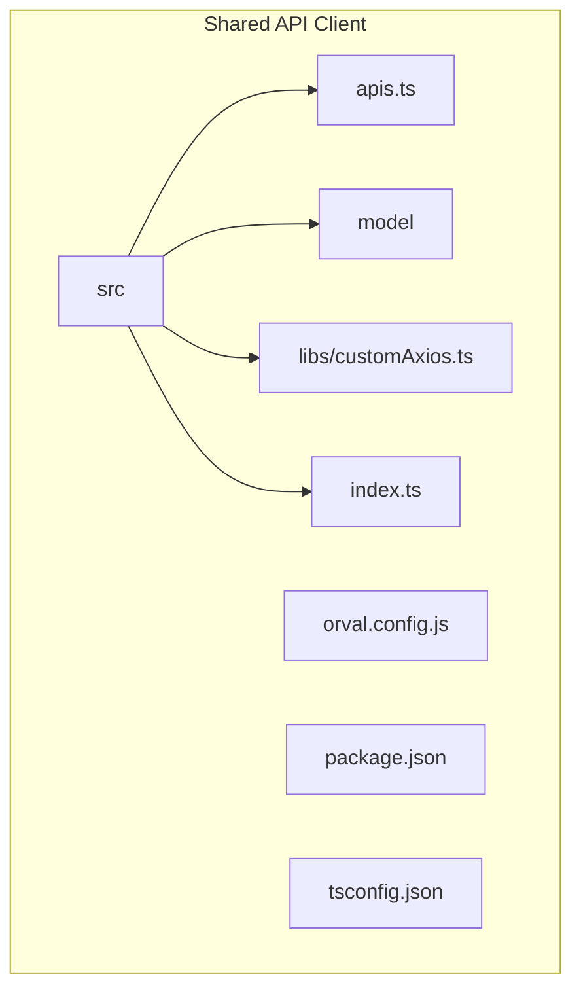
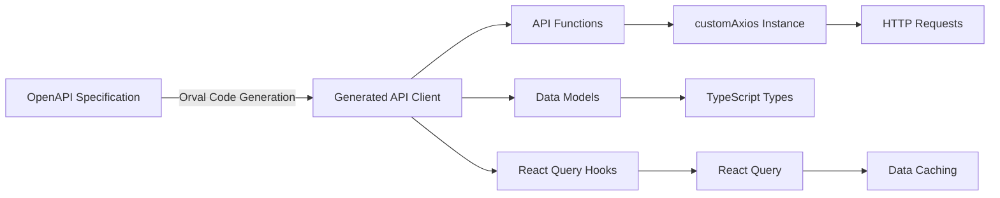
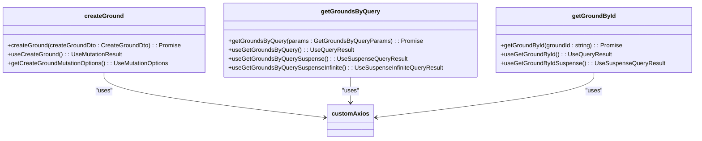
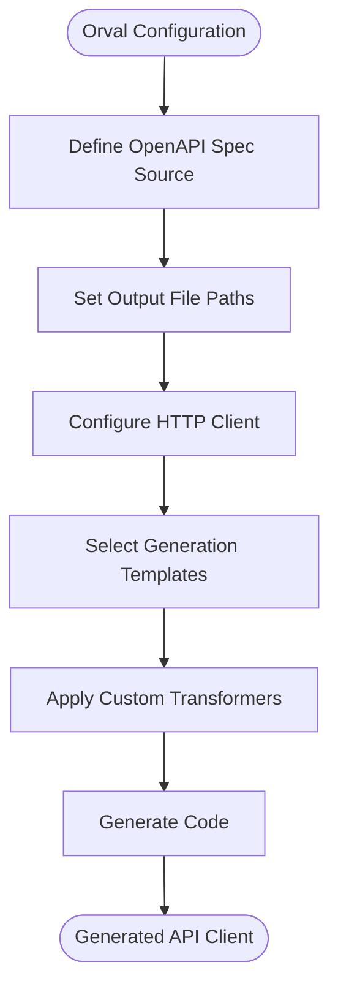

# Shared API Client

<cite>
**Referenced Files in This Document**   
- [apis.ts](file://packages/api-client/src/apis.ts)
- [index.ts](file://packages/api-client/src/index.ts)
- [customAxios.ts](file://packages/api-client/src/libs/customAxios.ts)
- [package.json](file://packages/api-client/package.json)
- [orval.config.js](file://packages/api-client/orval.config.js)
</cite>

## Table of Contents
1. [Introduction](#introduction)
2. [Project Structure](#project-structure)
3. [Core Components](#core-components)
4. [Architecture Overview](#architecture-overview)
5. [Detailed Component Analysis](#detailed-component-analysis)
6. [Dependency Analysis](#dependency-analysis)
7. [Performance Considerations](#performance-considerations)
8. [Troubleshooting Guide](#troubleshooting-guide)
9. [Conclusion](#conclusion)

## Introduction
The Shared API Client is a centralized, auto-generated TypeScript client library that provides type-safe access to backend API endpoints for frontend applications within the prj-core monorepo. Built using Orval, this package consumes OpenAPI specifications to generate API functions, data models, and React Query hooks, enabling consistent and reliable API consumption across both admin and mobile applications. This documentation details the architecture, generation process, structure, and usage patterns of the shared API client, including its environment-specific configurations and update workflow.

## Project Structure

The Shared API Client package follows a structured organization that separates generated code from configuration and utility components:



**Diagram sources**
- [package.json](file://packages/api-client/package.json#L1-L56)
- [index.ts](file://packages/api-client/src/index.ts#L1-L13)

**Section sources**
- [package.json](file://packages/api-client/package.json#L1-L56)

## Core Components

The Shared API Client consists of several core components that work together to provide a seamless API consumption experience. The package is auto-generated from OpenAPI specifications using Orval, producing type-safe API functions, data models, and React Query hooks. These components are designed to be consumed by both the admin and mobile applications, ensuring consistency in API interactions across the platform. The client uses a custom Axios instance for HTTP communication and leverages React Query for data fetching, caching, and state management.

**Section sources**
- [apis.ts](file://packages/api-client/src/apis.ts#L1-L800)
- [index.ts](file://packages/api-client/src/index.ts#L1-L13)

## Architecture Overview

The Shared API Client architecture is built around the principle of code generation from OpenAPI specifications. Orval processes the OpenAPI spec to generate TypeScript code that includes API functions, data models, and React Query hooks. The generated code is then consumed by frontend applications through a clean, type-safe interface. The architecture includes a custom Axios instance for HTTP communication, which is configured to handle authentication and error handling consistently across all API calls.



**Diagram sources**
- [apis.ts](file://packages/api-client/src/apis.ts#L1-L800)
- [customAxios.ts](file://packages/api-client/src/libs/customAxios.ts#L1-L10)

## Detailed Component Analysis

### API Generation and Structure
The Shared API Client is auto-generated from OpenAPI specifications using Orval, which transforms the API contract into type-safe TypeScript code. This process creates three main artifacts: API functions for direct HTTP calls, data models representing request and response payloads, and React Query hooks for declarative data fetching in React components. The generated code ensures type safety throughout the API consumption process, reducing runtime errors and improving developer experience.

#### Generated API Functions
The API functions are generated to match the endpoints defined in the OpenAPI specification. Each endpoint produces multiple variants of functions to support different React Query patterns, including standard queries, mutations, suspense queries, and infinite queries. These functions are type-safe and include JSDoc comments that describe their purpose and parameters.



**Diagram sources**
- [apis.ts](file://packages/api-client/src/apis.ts#L177-L323)
- [customAxios.ts](file://packages/api-client/src/libs/customAxios.ts#L1-L10)

#### Data Models and Types
The data models are generated from the OpenAPI specification's schema definitions, creating TypeScript interfaces and types that represent the structure of API requests and responses. These models ensure type safety throughout the application, preventing runtime errors caused by incorrect data structures. The models include response wrappers, request payloads, and various utility types that support the API functions.

**Section sources**
- [apis.ts](file://packages/api-client/src/apis.ts#L35-L166)
- [model](file://packages/api-client/src/model)

### Configuration and Environment Management
The Shared API Client uses Orval configuration files to manage code generation and environment-specific settings. The configuration defines the OpenAPI specification source, output structure, and generation options. While the current implementation shows a single orval.config.js file, the architecture supports environment-specific configurations for development, staging, and production environments, allowing for different API endpoints, authentication methods, or feature flags in each environment.

#### Orval Configuration
The Orval configuration file specifies how the OpenAPI specification is processed and what code is generated. It includes settings for the input specification, output file paths, and generation templates. The configuration also defines the HTTP client to be used (in this case, a custom Axios instance) and any custom transformers that modify the generated code.



**Diagram sources**
- [package.json](file://packages/api-client/package.json#L23-L30)
- [orval.config.js](file://packages/api-client/orval.config.js)

**Section sources**
- [package.json](file://packages/api-client/package.json#L23-L30)

## Dependency Analysis

The Shared API Client has a minimal set of dependencies that are essential for its functionality. The package relies on Axios for HTTP communication and React Query for data fetching and state management. These dependencies are specified in the package.json file and are managed through the monorepo's package manager. The client also depends on TypeScript for type checking and Orval for code generation, though these are typically devDependencies.

```mermaid
graph LR
A[Shared API Client] --> B[@tanstack/react-query]
A --> C[axios]
A --> D[orval]
A --> E[typescript]
B --> F[Data Fetching]
C --> G[HTTP Client]
D --> H[Code Generation]
E --> I[Type Checking]
```

**Diagram sources**
- [package.json](file://packages/api-client/package.json#L31-L39)

**Section sources**
- [package.json](file://packages/api-client/package.json#L31-L39)

## Performance Considerations

The Shared API Client is designed with performance in mind, leveraging React Query's built-in caching, deduplication, and background refetching capabilities. By using React Query hooks, the client automatically caches API responses and deduplicates identical requests, reducing unnecessary network calls. The generated code also supports suspense and infinite queries, enabling efficient data loading patterns in React applications. The use of a custom Axios instance allows for centralized configuration of request/response interceptors, which can be used for performance monitoring, caching, or compression.

## Troubleshooting Guide

When encountering issues with the Shared API Client, consider the following common problems and solutions:

1. **Type errors in generated code**: Ensure the OpenAPI specification is valid and up-to-date. Regenerate the client code using the codegen script.
2. **Network errors**: Verify the API endpoint URLs and authentication tokens. Check the customAxios configuration for correct base URLs and headers.
3. **Missing API endpoints**: Ensure the OpenAPI specification includes the desired endpoints and regenerate the client code.
4. **React Query hook issues**: Verify that the QueryClient is properly configured in the application and that the hooks are used within a QueryClientProvider.

**Section sources**
- [customAxios.ts](file://packages/api-client/src/libs/customAxios.ts#L1-L10)
- [apis.ts](file://packages/api-client/src/apis.ts#L1-L800)

## Conclusion

The Shared API Client provides a robust, type-safe solution for API consumption across the prj-core monorepo. By leveraging Orval to generate code from OpenAPI specifications, the client ensures consistency, reduces errors, and improves developer productivity. The architecture supports environment-specific configurations and integrates seamlessly with React Query for efficient data fetching and state management. This centralized approach enables both the admin and mobile applications to consume APIs in a consistent manner, reducing duplication and improving maintainability.