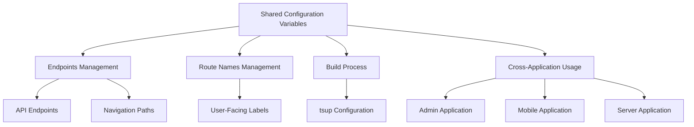
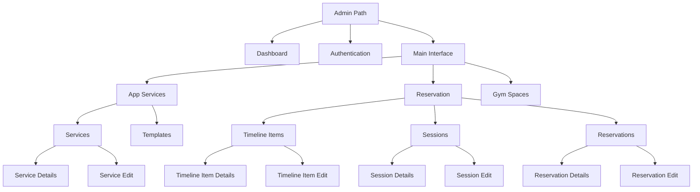

# Shared Configuration Variables

<cite>
**Referenced Files in This Document**   
- [endpoints.ts](file://packages/constants/src/endpoints.ts)
- [route-names.ts](file://packages/constants/src/route-names.ts)
- [tsup.config.ts](file://packages/constants/tsup.config.ts)
- [index.ts](file://packages/constants/index.ts)
- [package.json](file://packages/constants/package.json)
</cite>

## Table of Contents
1. [Introduction](#introduction)
2. [Package Overview](#package-overview)
3. [Core Configuration Files](#core-configuration-files)
4. [Endpoints Structure](#endpoints-structure)
5. [Route Names Structure](#route-names-structure)
6. [Build Process](#build-process)
7. [Usage Examples](#usage-examples)
8. [Update Workflow](#update-workflow)
9. [Best Practices](#best-practices)

## Introduction
The Shared Configuration Variables package in prj-core provides a centralized solution for managing environment-agnostic configuration values across multiple applications. This documentation details the package's role in standardizing API endpoints and route names, ensuring consistency in routing and API consumption throughout the application ecosystem.

## Package Overview
The Shared Configuration Variables package serves as a single source of truth for critical application configuration values. By centralizing these constants, the package eliminates duplication and ensures consistency across all applications within the monorepo. The package is designed to be environment-agnostic, focusing on structural constants rather than environment-specific values.



**Diagram sources**
- [endpoints.ts](file://packages/constants/src/endpoints.ts)
- [route-names.ts](file://packages/constants/src/route-names.ts)
- [tsup.config.ts](file://packages/constants/tsup.config.ts)

**Section sources**
- [package.json](file://packages/constants/package.json)
- [index.ts](file://packages/constants/index.ts)

## Core Configuration Files
The package consists of two primary configuration files that serve distinct purposes in the application architecture. These files are designed to work together to provide a comprehensive configuration solution for routing and navigation.

### Endpoints File
The endpoints.ts file contains all URL paths used for application navigation and API routing. These constants define the structural hierarchy of the application's routing system.

### Route Names File
The route-names.ts file contains user-facing labels for routes, providing a consistent naming convention across the application interface.

**Section sources**
- [endpoints.ts](file://packages/constants/src/endpoints.ts)
- [route-names.ts](file://packages/constants/src/route-names.ts)

## Endpoints Structure
The endpoints.ts file defines a comprehensive hierarchy of URL paths for the application. These constants follow a structured naming convention that reflects the application's navigation architecture.

The file organizes endpoints by functional areas such as administration, authentication, services, spaces, timelines, sessions, reservations, templates, users, groups, and categories. Each endpoint is defined as a constant with a descriptive name, making it easy to understand its purpose and location within the application structure.

The endpoints include both static paths and dynamic routes with parameters (indicated by :parameterName syntax), allowing for flexible routing patterns while maintaining consistency across the application.



**Diagram sources**
- [endpoints.ts](file://packages/constants/src/endpoints.ts)

**Section sources**
- [endpoints.ts](file://packages/constants/src/endpoints.ts)

## Route Names Structure
The route-names.ts file defines a constant object containing user-facing labels for various routes in the application. This approach ensures consistent labeling across different parts of the application and provides type safety through TypeScript's const assertions.

The route names are organized in a logical hierarchy that mirrors the application's functional areas, including administration, authentication, dashboard, user service, space service, categories, groups, and other key features. Each name is defined as a descriptive string that clearly indicates its purpose in the user interface.

This structure enables consistent localization and makes it easier to update user-facing text across the entire application by modifying a single source.

```mermaid
graph TD
A[ROUTE_NAMES] --> B[ADMIN: "관리자"]
A --> C[AUTH: "인증"]
A --> D[LOGIN: "로그인"]
A --> E[TENANT_SELECT: "테넌트 선택"]
A --> F[TENANT: "테넌트"]
A --> G[DASHBOARD: "대시보드"]
A --> H[USER_SERVICE: "유저 서비스"]
A --> I[USERS: "유저"]
A --> J[SPACE_SERVICE: "공간 서비스"]
A --> K[GROUND: "그라운드"]
A --> L[GROUNDS: "그라운트 리스트"]
A --> M[GROUND_EDIT: "그라운드 편집"]
A --> N[CATEGORIES: "카테고리 리스트"]
A --> O[CATEGORY: "카테고리"]
A --> P[CATEGORY_EDIT: "카테고리 편집"]
A --> Q[CATEGORY_ADD: "카테고리 추가"]
A --> R[GROUPS: "그룹 리스트"]
A --> S[GROUP: "그룹"]
A --> T[GROUP_EDIT: "그룹 편집"]
```

**Diagram sources**
- [route-names.ts](file://packages/constants/src/route-names.ts)

**Section sources**
- [route-names.ts](file://packages/constants/src/route-names.ts)

## Build Process
The package uses tsup for its build process, configured through the tsup.config.ts file. This configuration enables the package to be compiled into multiple module formats for broad compatibility.

The build configuration specifies:
- Entry point: ./index.ts
- Output formats: ES modules and CommonJS
- Output directory: ./dist
- Automatic cleaning of the output directory (except during watch mode)
- Source map generation
- Type declaration file generation

The package.json file defines the build scripts and export configuration, making the package consumable in both ES module and CommonJS environments through the exports field.

```mermaid
graph TD
A[Source Files] --> B[tsup Build Process]
B --> C[ES Module Output]
B --> D[CommonJS Output]
B --> E[Type Declarations]
B --> F[Source Maps]
C --> G[dist/index.mjs]
D --> H[dist/index.js]
E --> I[dist/index.d.ts]
F --> J[dist/*.map]
K[package.json] --> L[Exports Configuration]
L --> M["import": "./dist/index.mjs"]
L --> N["require": "./dist/index.js"]
```

**Diagram sources**
- [tsup.config.ts](file://packages/constants/tsup.config.ts)
- [package.json](file://packages/constants/package.json)

**Section sources**
- [tsup.config.ts](file://packages/constants/tsup.config.ts)
- [package.json](file://packages/constants/package.json)

## Usage Examples
Applications consume the shared configuration variables through standard ES module imports. The index.ts file re-exports all constants from the source files, providing a clean import interface.

Applications use these constants for various purposes:
- Setting up route configurations in routing libraries
- Building API request URLs
- Creating navigation menus and breadcrumbs
- Generating dynamic links throughout the application

The type-safe nature of the constants ensures that developers receive proper autocomplete and error checking in their IDEs, reducing the likelihood of routing errors.

**Section sources**
- [index.ts](file://packages/constants/index.ts)

## Update Workflow
Updating configuration values in the shared package follows a structured workflow to ensure backward compatibility and minimize disruptions to dependent applications.

When updating configuration values:
1. Assess the impact of the change on all dependent applications
2. For breaking changes, implement the new values alongside the old ones temporarily
3. Update documentation to reflect the changes
4. Communicate changes to teams working on dependent applications
5. After all applications have migrated, remove deprecated values in a subsequent release

For non-breaking additions, simply add the new constants and update the package version accordingly.

The package follows semantic versioning, with major version increments indicating breaking changes that may affect routing compatibility.

**Section sources**
- [package.json](file://packages/constants/package.json)

## Best Practices
To maximize the effectiveness of the Shared Configuration Variables package, follow these best practices:

1. Always use the defined constants instead of hardcoded strings for routes and endpoints
2. Organize new constants logically within the existing structure
3. Use descriptive names that clearly indicate the purpose of the constant
4. Maintain consistency in naming conventions and path structures
5. Consider the impact on all dependent applications when making changes
6. Document new constants with clear comments explaining their purpose
7. Use parameterized routes for dynamic segments to maintain flexibility
8. Regularly review and refactor the configuration as the application evolves

By adhering to these practices, teams can ensure that the shared configuration remains a reliable and maintainable foundation for the entire application ecosystem.