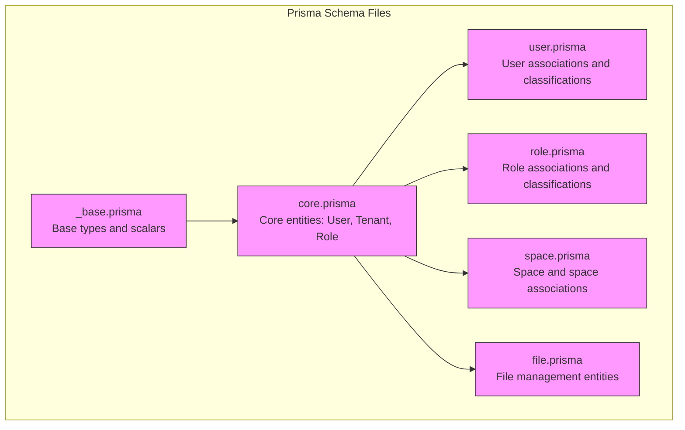
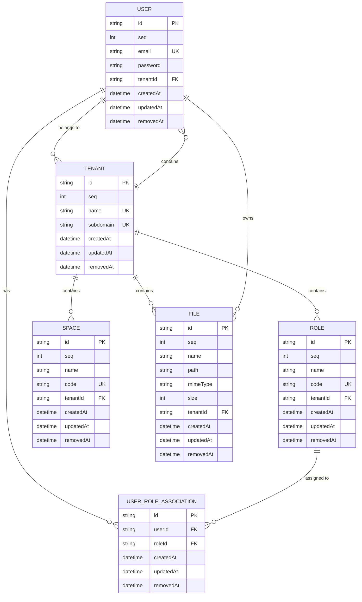
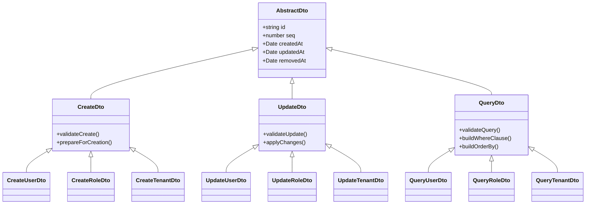
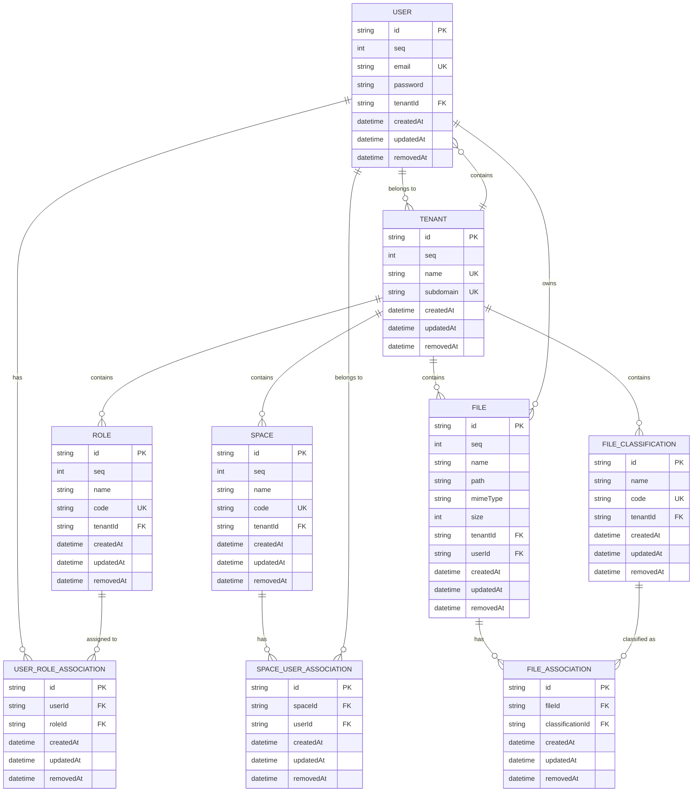
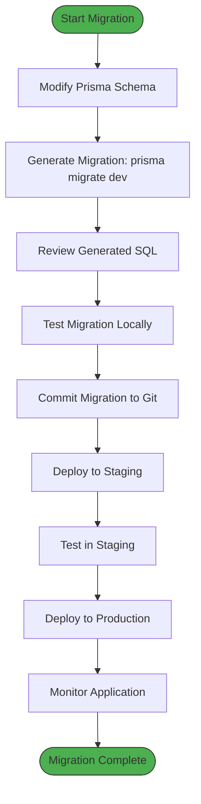
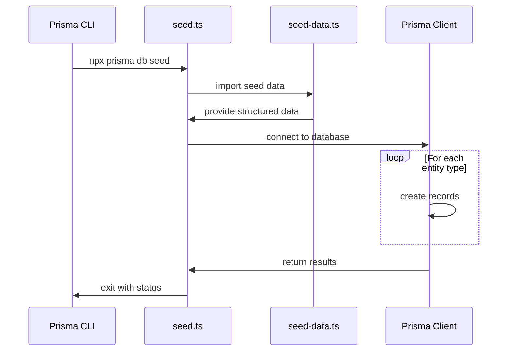
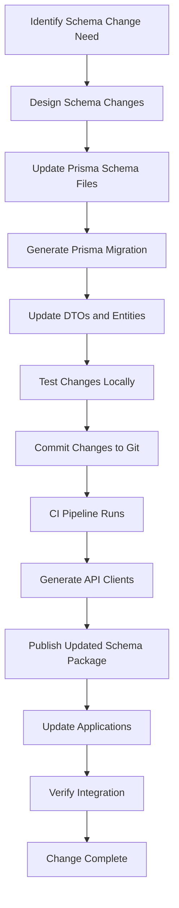

# Shared Database Schema

<cite>
**Referenced Files in This Document**   
- [core.prisma](file://packages/schema/prisma/schema/core.prisma)
- [user.prisma](file://packages/schema/prisma/schema/user.prisma)
- [role.prisma](file://packages/schema/prisma/schema/role.prisma)
- [space.prisma](file://packages/schema/prisma/schema/space.prisma)
- [file.prisma](file://packages/schema/prisma/schema/file.prisma)
- [abstract.entity.ts](file://packages/schema/src/entity/abstract.entity.ts)
- [abstract.dto.ts](file://packages/schema/src/dto/abstract.dto.ts)
- [user.entity.ts](file://packages/schema/src/entity/user.entity.ts)
- [role.entity.ts](file://packages/schema/src/entity/role.entity.ts)
- [tenant.entity.ts](file://packages/schema/src/entity/tenant.entity.ts)
- [create-user.dto.ts](file://packages/schema/src/dto/create/create-user.dto.ts)
- [update-user.dto.ts](file://packages/schema/src/dto/update/update-user.dto.ts)
- [query-user.dto.ts](file://packages/schema/src/dto/query/query-user.dto.ts)
- [seed.ts](file://packages/schema/prisma/seed.ts)
- [seed-data.ts](file://packages/schema/prisma/seed-data.ts)
</cite>

## Table of Contents
1. [Introduction](#introduction)
2. [Prisma Schema Structure](#prisma-schema-structure)
3. [Core Entities and Relationships](#core-entities-and-relationships)
4. [Entity Field Types and Constraints](#entity-field-types-and-constraints)
5. [Data Transfer Object Patterns](#data-transfer-object-patterns)
6. [Database Schema Diagram](#database-schema-diagram)
7. [Migration Workflow](#migration-workflow)
8. [Seed Data Management](#seed-data-management)
9. [Development Workflow](#development-workflow)
10. [Conclusion](#conclusion)

## Introduction

The Shared Database Schema in prj-core provides a centralized data model definition using Prisma ORM. This documentation details the schema structure, entity relationships, DTO patterns, and development workflows for managing the database across the monorepo. The schema supports multi-tenancy with comprehensive user, role, tenant, and content management entities, enabling consistent data access patterns across all applications.

## Prisma Schema Structure

The Prisma schema is organized into modular files within the `packages/schema/prisma/schema/` directory, following a domain-driven design approach. The schema files are separated by functional domains to improve maintainability and reduce merge conflicts.

**Diagram sources**
- [core.prisma](file://packages/schema/prisma/schema/core.prisma)
- [user.prisma](file://packages/schema/prisma/schema/user.prisma)
- [role.prisma](file://packages/schema/prisma/schema/role.prisma)

**Section sources**
- [core.prisma](file://packages/schema/prisma/schema/core.prisma#L1-L50)
- [user.prisma](file://packages/schema/prisma/schema/user.prisma#L1-L30)

## Core Entities and Relationships

The database schema defines several core entities with well-defined relationships to support the application's functionality. The primary entities include User, Role, Tenant, and various content management entities.

**Diagram sources**
- [core.prisma](file://packages/schema/prisma/schema/core.prisma#L100-L200)
- [user.prisma](file://packages/schema/prisma/schema/user.prisma#L50-L100)
- [role.prisma](file://packages/schema/prisma/schema/role.prisma#L40-L90)

**Section sources**
- [user.entity.ts](file://packages/schema/src/entity/user.entity.ts#L1-L50)
- [role.entity.ts](file://packages/schema/src/entity/role.entity.ts#L1-L45)
- [tenant.entity.ts](file://packages/schema/src/entity/tenant.entity.ts#L1-L40)

## Entity Field Types and Constraints

The schema defines consistent field types and constraints across all entities, following established patterns for data integrity and performance optimization.

### Common Field Patterns

The schema implements several reusable field patterns through the base schema and abstract entities:

- **ID Fields**: UUID strings with `@id` and `@default(uuid())` attributes
- **Sequence Fields**: Auto-incrementing integers for ordering
- **Timestamp Fields**: createdAt, updatedAt, and removedAt for audit tracking
- **Tenant Isolation**: tenantId field on all tenant-scoped entities
- **Unique Constraints**: UK (Unique Key) constraints on business identifiers
- **Foreign Keys**: Properly defined relationships with referential actions

### Field Type Reference

| Entity | Field | Type | Constraints | Purpose |
|--------|-------|------|-------------|---------|
| User | id | String | @id, @default(uuid()) | Primary identifier |
| User | email | String | @unique, @email | Unique login credential |
| User | password | String | @password | Hashed authentication |
| Tenant | subdomain | String | @unique, @subdomain | Tenant URL identifier |
| Role | code | String | @unique | Machine-readable identifier |
| Space | code | String | @unique | System identifier |
| File | mimeType | String | @mimeType | Content type classification |
| All | seq | Int | @default(autoincrement()) | Ordering sequence |
| All | createdAt | DateTime | @default(now()) | Creation timestamp |
| All | updatedAt | DateTime | @updatedAt | Last modification |
| All | removedAt | DateTime | nullable | Soft delete marker |

**Section sources**
- [abstract.entity.ts](file://packages/schema/src/entity/abstract.entity.ts#L1-L23)
- [core.prisma](file://packages/schema/prisma/schema/core.prisma#L10-L50)
- [user.prisma](file://packages/schema/prisma/schema/user.prisma#L10-L40)

## Data Transfer Object Patterns

The schema package implements a comprehensive DTO (Data Transfer Object) pattern to standardize data transfer between layers and applications. DTOs are organized by operation type with consistent naming conventions.

### DTO Architecture

The DTO system follows the Repository Pattern with three main operation types:

**Diagram sources**
- [abstract.dto.ts](file://packages/schema/src/dto/abstract.dto.ts#L1-L19)
- [create-user.dto.ts](file://packages/schema/src/dto/create/create-user.dto.ts#L1-L30)
- [update-user.dto.ts](file://packages/schema/src/dto/update/update-user.dto.ts#L1-L30)

### Create DTO Pattern

Create DTOs extend the base DTO pattern with validation decorators and business logic for new entity creation:

- **Validation**: Field-level validation using class-validator decorators
- **Transformation**: Automatic data transformation and normalization
- **Security**: Exclusion of sensitive fields like passwords from responses
- **Defaults**: Automatic setting of default values where applicable

### Update DTO Pattern

Update DTOs implement partial update semantics with careful handling of optional fields:

- **Partial Updates**: Support for PATCH operations with optional fields
- **Null Handling**: Explicit null values for field clearing
- **Versioning**: Optional optimistic locking with version numbers
- **Audit**: Automatic update timestamp management

### Query DTO Pattern

Query DTOs provide a type-safe interface for database queries with filtering, sorting, and pagination:

- **Filtering**: Type-safe query parameters with validation
- **Sorting**: Enum-based sort order definitions
- **Pagination**: Standardized offset/limit or cursor-based pagination
- **Projection**: Field selection for optimized queries

**Section sources**
- [abstract.dto.ts](file://packages/schema/src/dto/abstract.dto.ts#L1-L19)
- [create-user.dto.ts](file://packages/schema/src/dto/create/create-user.dto.ts#L1-L50)
- [update-user.dto.ts](file://packages/schema/src/dto/update/update-user.dto.ts#L1-L50)
- [query-user.dto.ts](file://packages/schema/src/dto/query/query-user.dto.ts#L1-L50)

## Database Schema Diagram

The complete database schema illustrates the relationships between all core entities in the system.

**Diagram sources**
- [core.prisma](file://packages/schema/prisma/schema/core.prisma)
- [user.prisma](file://packages/schema/prisma/schema/user.prisma)
- [role.prisma](file://packages/schema/prisma/schema/role.prisma)
- [space.prisma](file://packages/schema/prisma/schema/space.prisma)
- [file.prisma](file://packages/schema/prisma/schema/file.prisma)

## Migration Workflow

The Prisma Migrate workflow provides a structured approach to database schema evolution with version control and team collaboration.

### Migration Process

**Diagram sources**
- [prisma.config.ts](file://packages/schema/prisma.config.ts#L1-L20)
- [migration_lock.toml](file://packages/schema/prisma/migrations/migration_lock.toml#L1-L4)

### Migration Commands

The migration workflow uses standard Prisma CLI commands with project-specific configurations:

- **Development**: `npx prisma migrate dev --name <migration-name>` creates and applies migrations during development
- **Production**: `npx prisma migrate deploy` applies pending migrations in production environments
- **Status Check**: `npx prisma migrate status` verifies the migration state across environments
- **Rollback**: Manual SQL rollback scripts are generated for critical migrations

Migrations are stored in the `packages/schema/prisma/migrations/` directory with timestamped folders containing the migration SQL files. The `migration_lock.toml` file ensures consistency across development environments.

**Section sources**
- [migration_lock.toml](file://packages/schema/prisma/migrations/migration_lock.toml#L1-L4)
- [prisma.config.ts](file://packages/schema/prisma.config.ts#L1-L30)

## Seed Data Management

The seed data system provides consistent initial data for development, testing, and production environments.

### Seed Architecture

**Diagram sources**
- [seed.ts](file://packages/schema/prisma/seed.ts#L1-L50)
- [seed-data.ts](file://packages/schema/prisma/seed-data.ts#L1-L50)

### Seed Implementation

The seed process is implemented in two main files:

1. **seed.ts**: The entry point that orchestrates the seeding process, connecting to the database and applying the data
2. **seed-data.ts**: Contains the actual seed data structured by entity type with relationships preserved

The seeding process follows these steps:
1. Clear existing data (optional, based on environment)
2. Create tenants with their configurations
3. Create roles with permission sets
4. Create users and assign to tenants
5. Assign roles to users
6. Create spaces and other content entities
7. Establish all necessary associations

Seed data is environment-aware, providing different datasets for development, staging, and production environments. The process is idempotent, allowing safe re-execution without creating duplicate records.

**Section sources**
- [seed.ts](file://packages/schema/prisma/seed.ts#L1-L60)
- [seed-data.ts](file://packages/schema/prisma/seed-data.ts#L1-L60)

## Development Workflow

The development workflow for modifying the data model and generating updated clients across the monorepo is standardized and automated.

### Schema Modification Process

**Diagram sources**
- [schema](file://packages/schema/prisma/schema/)
- [dto](file://packages/schema/src/dto/)
- [entity](file://packages/schema/src/entity/)

### Client Generation

When the schema changes, API clients are automatically generated for all applications using the Orval configuration:

1. **Type Generation**: Prisma Client types are generated from the updated schema
2. **DTO Synchronization**: Create, Update, and Query DTOs are updated to reflect schema changes
3. **API Client Generation**: Orval generates typed API clients for frontend applications
4. **Package Publishing**: The updated schema package is published to the monorepo
5. **Application Updates**: Applications update their dependency on the schema package

The process ensures type safety across the entire stack, from database to frontend, with minimal manual intervention. All applications benefit from the latest schema changes with proper type checking.

**Section sources**
- [orval.config.js](file://packages/api-client/orval.config.js#L1-L20)
- [package.json](file://packages/schema/package.json#L1-L10)

## Conclusion

The Shared Database Schema in prj-core provides a robust foundation for data management across the monorepo. By leveraging Prisma ORM with a modular schema structure, the system enables efficient database operations with strong typing and validation. The comprehensive DTO patterns ensure consistent data transfer between layers, while the automated migration and client generation workflows streamline development. The multi-tenancy support with proper isolation and the well-defined entity relationships make this schema suitable for complex enterprise applications. Following the documented workflows ensures data integrity and smooth collaboration across development teams.