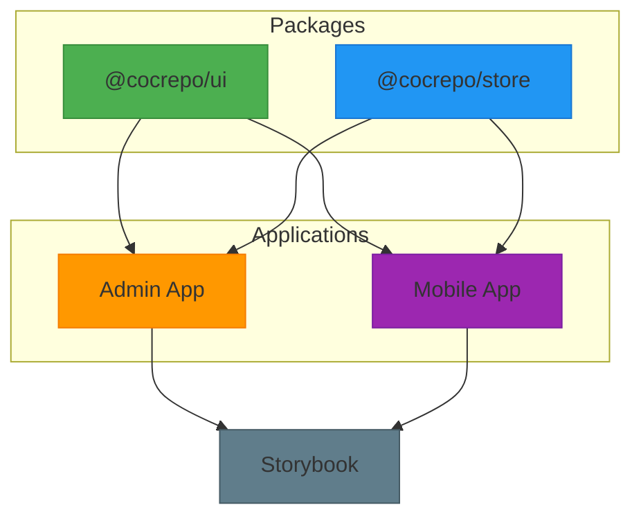
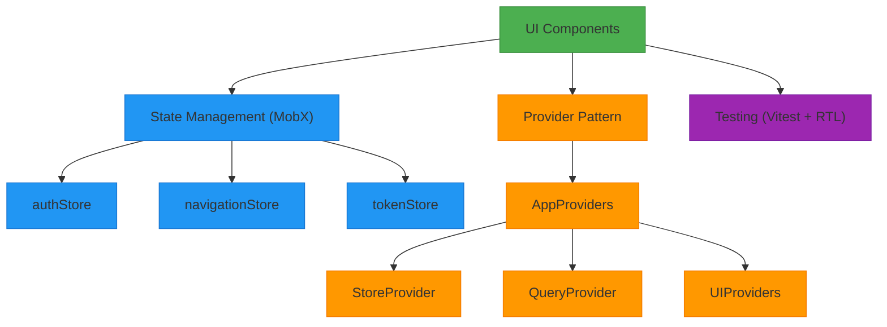
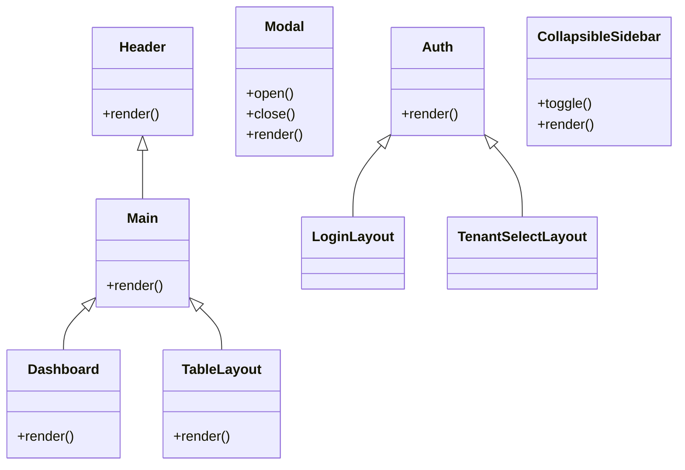
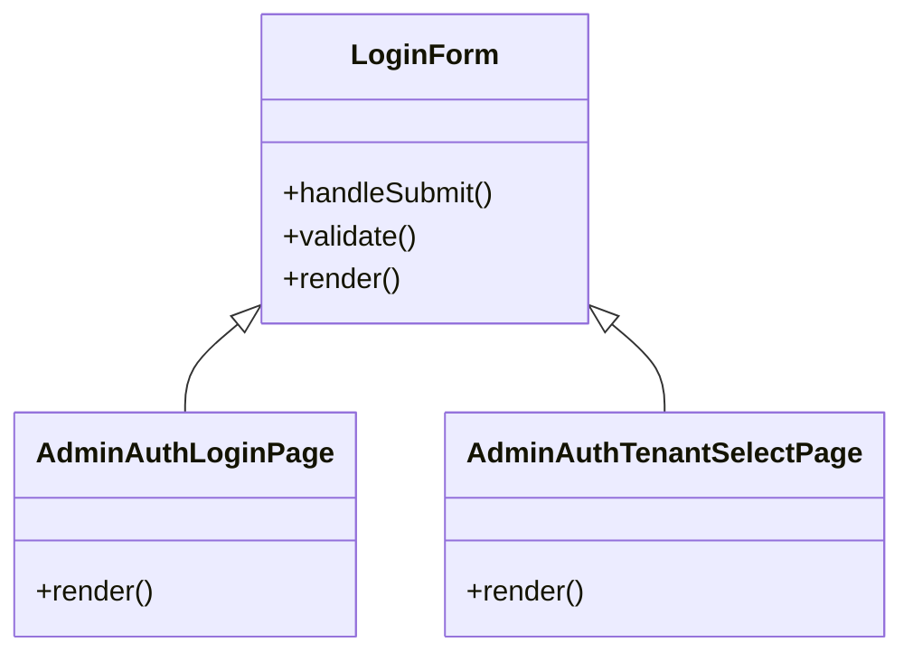
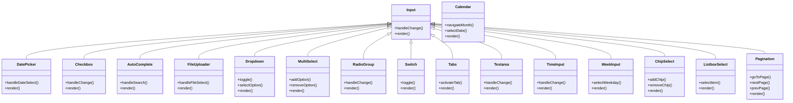
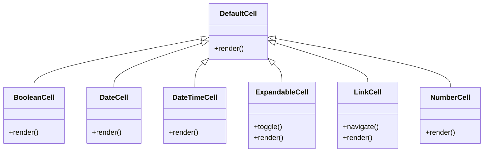
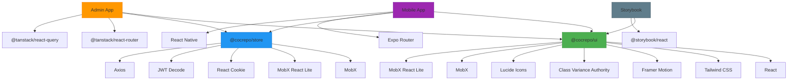

# Shared Frontend Components

<cite>
**Referenced Files in This Document**   
- [packages/ui/src/components/layout/Header/Header.tsx](file://packages/ui/src/components/layout/Header/Header.tsx)
- [packages/ui/src/components/form/LoginForm/LoginForm.tsx](file://packages/ui/src/components/form/LoginForm/LoginForm.tsx)
- [packages/ui/src/components/inputs/Input/Input.tsx](file://packages/ui/src/components/inputs/Input/Input.tsx)
- [packages/ui/src/components/ui/Button/Button.tsx](file://packages/ui/src/components/ui/Button/Button.tsx)
- [packages/store/src/stores/authStore.ts](file://packages/store/src/stores/authStore.ts)
- [packages/store/src/stores/navigationStore.ts](file://packages/store/src/stores/navigationStore.ts)
- [packages/store/src/stores/tokenStore.ts](file://packages/store/src/stores/tokenStore.ts)
- [packages/store/src/providers/StoreProvider.tsx](file://packages/store/src/providers/StoreProvider.tsx)
- [packages/ui/src/components/layout/Main/Main.tsx](file://packages/ui/src/components/layout/Main/Main.tsx)
- [packages/ui/src/components/layout/Modal/Modal.tsx](file://packages/ui/src/components/layout/Modal/Modal.tsx)
- [packages/ui/src/components/page/AdminAuthLoginPage.tsx](file://packages/ui/src/components/page/AdminAuthLoginPage.tsx)
- [packages/ui/src/components/page/AdminAuthTenantSelectPage.tsx](file://packages/ui/src/components/page/AdminAuthTenantSelectPage.tsx)
- [packages/ui/src/components/inputs/DatePicker/DatePicker.tsx](file://packages/ui/src/components/inputs/DatePicker/DatePicker.tsx)
- [packages/ui/src/components/inputs/Checkbox/Checkbox.tsx](file://packages/ui/src/components/inputs/Checkbox/Checkbox.tsx)
- [packages/ui/src/components/ui/Avatar/Avatar.tsx](file://packages/ui/src/components/ui/Avatar/Avatar.tsx)
- [packages/ui/src/components/ui/Chip/Chip.tsx](file://packages/ui/src/components/ui/Chip/Chip.tsx)
- [packages/ui/src/components/ui/Navbar/Navbar.tsx](file://packages/ui/src/components/ui/Navbar/Navbar.tsx)
- [packages/ui/src/components/ui/Text/Text.tsx](file://packages/ui/src/components/ui/Text/Text.tsx)
- [packages/ui/src/components/cell/BooleanCell/BooleanCell.tsx](file://packages/ui/src/components/cell/BooleanCell/BooleanCell.tsx)
- [packages/ui/src/components/cell/DateCell/DateCell.tsx](file://packages/ui/src/components/cell/DateCell/DateCell.tsx)
- [packages/ui/src/components/cell/DateTimeCell/DateTimeCell.tsx](file://packages/ui/src/components/cell/DateTimeCell/DateTimeCell.tsx)
- [packages/ui/src/components/cell/DefaultCell/DefaultCell.tsx](file://packages/ui/src/components/cell/DefaultCell/DefaultCell.tsx)
- [packages/ui/src/components/cell/ExpandableCell/ExpandableCell.tsx](file://packages/ui/src/components/cell/ExpandableCell/ExpandableCell.tsx)
- [packages/ui/src/components/cell/LinkCell/LinkCell.tsx](file://packages/ui/src/components/cell/LinkCell/LinkCell.tsx)
- [packages/ui/src/components/cell/NumberCell/NumberCell.tsx](file://packages/ui/src/components/cell/NumberCell/NumberCell.tsx)
- [packages/ui/src/components/inputs/AutoComplete/AutoComplete.tsx](file://packages/ui/src/components/inputs/AutoComplete/AutoComplete.tsx)
- [packages/ui/src/components/inputs/Calendar/Calendar.tsx](file://packages/ui/src/components/inputs/Calendar/Calendar.tsx)
- [packages/ui/src/components/inputs/ChipSelect/ChipSelect.tsx](file://packages/ui/src/components/inputs/ChipSelect/ChipSelect.tsx)
- [packages/ui/src/components/inputs/DateRangePicker/DateRangePicker.tsx](file://packages/ui/src/components/inputs/DateRangePicker/DateRangePicker.tsx)
- [packages/ui/src/components/inputs/Dropdown/Dropdown.tsx](file://packages/ui/src/components/inputs/Dropdown/Dropdown.tsx)
- [packages/ui/src/components/inputs/FileUploader/FileUploader.tsx](file://packages/ui/src/components/inputs/FileUploader/FileUploader.tsx)
- [packages/ui/src/components/inputs/ListboxSelect/ListboxSelect.tsx](file://packages/ui/src/components/inputs/ListboxSelect/ListboxSelect.tsx)
- [packages/ui/src/components/inputs/MultiSelect/MultiSelect.tsx](file://packages/ui/src/components/inputs/MultiSelect/MultiSelect.tsx)
- [packages/ui/src/components/inputs/Pagination/Pagination.tsx](file://packages/ui/src/components/inputs/Pagination/Pagination.tsx)
- [packages/ui/src/components/inputs/RadioGroup/RadioGroup.tsx](file://packages/ui/src/components/inputs/RadioGroup/RadioGroup.tsx)
- [packages/ui/src/components/inputs/Switch/Switch.tsx](file://packages/ui/src/components/inputs/Switch/Switch.tsx)
- [packages/ui/src/components/inputs/Tabs/Tabs.tsx](file://packages/ui/src/components/inputs/Tabs/Tabs.tsx)
- [packages/ui/src/components/inputs/Textarea/Textarea.tsx](file://packages/ui/src/components/inputs/Textarea/Textarea.tsx)
- [packages/ui/src/components/inputs/TimeInput/TimeInput.tsx](file://packages/ui/src/components/inputs/TimeInput/TimeInput.tsx)
- [packages/ui/src/components/inputs/VideoUploader/VideoUploader.tsx](file://packages/ui/src/components/inputs/VideoUploader/VideoUploader.tsx)
- [packages/ui/src/components/inputs/WeekInput/WeekInput.tsx](file://packages/ui/src/components/inputs/WeekInput/WeekInput.tsx)
- [packages/ui/src/components/layout/Auth/Auth.tsx](file://packages/ui/src/components/layout/Auth/Auth.tsx)
- [packages/ui/src/components/layout/CollapsibleSidebar/CollapsibleSidebar.tsx](file://packages/ui/src/components/layout/CollapsibleSidebar/CollapsibleSidebar.tsx)
- [packages/ui/src/components/layout/Dashboard/Dashboard.tsx](file://packages/ui/src/components/layout/Dashboard/Dashboard.tsx)
- [packages/ui/src/components/layout/Table/Table.tsx](file://packages/ui/src/components/layout/Table/Table.tsx)
- [packages/ui/src/components/page/index.ts](file://packages/ui/src/components/page/index.ts)
- [packages/ui/src/components/ui/DataGrid/DataGrid.tsx](file://packages/ui/src/components/ui/DataGrid/DataGrid.tsx)
- [packages/ui/src/components/ui/HStack/HStack.tsx](file://packages/ui/src/components/ui/HStack/HStack.tsx)
- [packages/ui/src/components/ui/List/List.tsx](file://packages/ui/src/components/ui/List/List.tsx)
- [packages/ui/src/components/ui/Logo/Logo.tsx](file://packages/ui/src/components/ui/Logo/Logo.tsx)
- [packages/ui/src/components/ui/Message/Message.tsx](file://packages/ui/src/components/ui/Message/Message.tsx)
- [packages/ui/src/components/ui/NavbarItem/NavbarItem.tsx](file://packages/ui/src/components/ui/NavbarItem/NavbarItem.tsx)
- [packages/ui/src/components/ui/NotFound/NotFound.tsx](file://packages/ui/src/components/ui/NotFound/NotFound.tsx)
- [packages/ui/src/components/ui/Placeholder/Placeholder.tsx](file://packages/ui/src/components/ui/Placeholder/Placeholder.tsx)
- [packages/ui/src/components/ui/Section/Section.tsx](file://packages/ui/src/components/ui/Section/Section.tsx)
- [packages/ui/src/components/ui/Select/Select.tsx](file://packages/ui/src/components/ui/Select/Select.tsx)
- [packages/ui/src/components/ui/Skeleton/Skeleton.tsx](file://packages/ui/src/components/ui/Skeleton/Skeleton.tsx)
- [packages/ui/src/components/ui/SortableMedia/SortableMedia.tsx](file://packages/ui/src/components/ui/SortableMedia/SortableMedia.tsx)
- [packages/ui/src/components/ui/Spacer/Spacer.tsx](file://packages/ui/src/components/ui/Spacer/Spacer.tsx)
- [packages/ui/src/components/ui/SplashScreen/SplashScreen.tsx](file://packages/ui/src/components/ui/SplashScreen/SplashScreen.tsx)
- [packages/ui/src/components/ui/Table/Table.tsx](file://packages/ui/src/components/ui/Table/Table.tsx)
- [packages/ui/src/components/ui/User/User.tsx](file://packages/ui/src/components/ui/User/User.tsx)
- [packages/ui/src/components/ui/VStack/VStack.tsx](file://packages/ui/src/components/ui/VStack/VStack.tsx)
- [packages/ui/src/components/ui/VideoPlayer/VideoPlayer.tsx](file://packages/ui/src/components/ui/VideoPlayer/VideoPlayer.tsx)
- [packages/ui/src/components/index.ts](file://packages/ui/src/components/index.ts)
- [packages/ui/package.json](file://packages/ui/package.json)
- [packages/store/package.json](file://packages/store/package.json)
- [packages/store/src/stores/index.ts](file://packages/store/src/stores/index.ts)
- [packages/store/src/providers/index.ts](file://packages/store/src/providers/index.ts)
- [apps/admin/src/App.tsx](file://apps/admin/src/App.tsx)
- [apps/mobile/src/app/_layout.tsx](file://apps/mobile/src/app/_layout.tsx)
</cite>

## Table of Contents
1. [Introduction](#introduction)
2. [Project Structure](#project-structure)
3. [Core Components](#core-components)
4. [Architecture Overview](#architecture-overview)
5. [Detailed Component Analysis](#detailed-component-analysis)
6. [Dependency Analysis](#dependency-analysis)
7. [Performance Considerations](#performance-considerations)
8. [Troubleshooting Guide](#troubleshooting-guide)
9. [Conclusion](#conclusion)

## Introduction
The Shared Frontend Components library in prj-core provides a comprehensive UI component system designed to ensure consistency across both admin and mobile applications. This documentation details the architecture, component organization, state management, and development workflow for this shared library. The system leverages React with MobX for state management, implements a provider pattern for global context, and follows a structured approach to component categorization and reuse.

## Project Structure
The shared frontend components are organized within the monorepo structure under the packages directory. The primary packages relevant to this documentation are @cocrepo/ui and @cocrepo/store, which contain the UI components and state management logic respectively.

**Diagram sources**
- [packages/ui/package.json](file://packages/ui/package.json)
- [packages/store/package.json](file://packages/store/package.json)

**Section sources**
- [packages/ui/package.json](file://packages/ui/package.json)
- [packages/store/package.json](file://packages/store/package.json)

## Core Components
The Shared Frontend Components library is organized into several categories to promote consistency and reusability across applications. These categories include layout, form, inputs, and ui components, each designed to serve specific purposes in the user interface.

**Section sources**
- [packages/ui/src/components/index.ts](file://packages/ui/src/components/index.ts)
- [packages/ui/src/components/layout/Header/Header.tsx](file://packages/ui/src/components/layout/Header/Header.tsx)
- [packages/ui/src/components/form/LoginForm/LoginForm.tsx](file://packages/ui/src/components/form/LoginForm/LoginForm.tsx)
- [packages/ui/src/components/inputs/Input/Input.tsx](file://packages/ui/src/components/inputs/Input/Input.tsx)
- [packages/ui/src/components/ui/Button/Button.tsx](file://packages/ui/src/components/ui/Button/Button.tsx)

## Architecture Overview
The architecture of the Shared Frontend Components follows a modular design pattern with clear separation of concerns. The system is built around reusable components organized by functionality, with state management handled through MobX stores and global context provided through the provider pattern.

**Diagram sources**
- [packages/ui/src/components/index.ts](file://packages/ui/src/components/index.ts)
- [packages/store/src/stores/index.ts](file://packages/store/src/stores/index.ts)
- [packages/store/src/providers/StoreProvider.tsx](file://packages/store/src/providers/StoreProvider.tsx)

## Detailed Component Analysis

### Component Categories
The Shared Frontend Components library organizes components into logical categories to facilitate discovery and consistent usage across applications.

#### Layout Components
Layout components provide structural organization for applications, including headers, main content areas, modals, and authentication layouts.

**Diagram sources**
- [packages/ui/src/components/layout/Header/Header.tsx](file://packages/ui/src/components/layout/Header/Header.tsx)
- [packages/ui/src/components/layout/Main/Main.tsx](file://packages/ui/src/components/layout/Main/Main.tsx)
- [packages/ui/src/components/layout/Modal/Modal.tsx](file://packages/ui/src/components/layout/Modal/Modal.tsx)
- [packages/ui/src/components/layout/Auth/Auth.tsx](file://packages/ui/src/components/layout/Auth/Auth.tsx)
- [packages/ui/src/components/layout/Dashboard/Dashboard.tsx](file://packages/ui/src/components/layout/Dashboard/Dashboard.tsx)
- [packages/ui/src/components/layout/Table/Table.tsx](file://packages/ui/src/components/layout/Table/Table.tsx)
- [packages/ui/src/components/layout/CollapsibleSidebar/CollapsibleSidebar.tsx](file://packages/ui/src/components/layout/CollapsibleSidebar/CollapsibleSidebar.tsx)

**Section sources**
- [packages/ui/src/components/layout/Header/Header.tsx](file://packages/ui/src/components/layout/Header/Header.tsx)
- [packages/ui/src/components/layout/Main/Main.tsx](file://packages/ui/src/components/layout/Main/Main.tsx)
- [packages/ui/src/components/layout/Modal/Modal.tsx](file://packages/ui/src/components/layout/Modal/Modal.tsx)
- [packages/ui/src/components/layout/Auth/Auth.tsx](file://packages/ui/src/components/layout/Auth/Auth.tsx)

#### Form Components
Form components provide standardized UI elements for user input and data collection, with the LoginForm serving as a key authentication component.

**Diagram sources**
- [packages/ui/src/components/form/LoginForm/LoginForm.tsx](file://packages/ui/src/components/form/LoginForm/LoginForm.tsx)
- [packages/ui/src/components/page/AdminAuthLoginPage.tsx](file://packages/ui/src/components/page/AdminAuthLoginPage.tsx)
- [packages/ui/src/components/page/AdminAuthTenantSelectPage.tsx](file://packages/ui/src/components/page/AdminAuthTenantSelectPage.tsx)

**Section sources**
- [packages/ui/src/components/form/LoginForm/LoginForm.tsx](file://packages/ui/src/components/form/LoginForm/LoginForm.tsx)
- [packages/ui/src/components/page/AdminAuthLoginPage.tsx](file://packages/ui/src/components/page/AdminAuthLoginPage.tsx)
- [packages/ui/src/components/page/AdminAuthTenantSelectPage.tsx](file://packages/ui/src/components/page/AdminAuthTenantSelectPage.tsx)

#### Input Components
Input components provide a comprehensive set of interactive elements for user input, organized in the inputs directory with specialized functionality.

**Diagram sources**
- [packages/ui/src/components/inputs/Input/Input.tsx](file://packages/ui/src/components/inputs/Input/Input.tsx)
- [packages/ui/src/components/inputs/DatePicker/DatePicker.tsx](file://packages/ui/src/components/inputs/DatePicker/DatePicker.tsx)
- [packages/ui/src/components/inputs/Checkbox/Checkbox.tsx](file://packages/ui/src/components/inputs/Checkbox/Checkbox.tsx)
- [packages/ui/src/components/inputs/AutoComplete/AutoComplete.tsx](file://packages/ui/src/components/inputs/AutoComplete/AutoComplete.tsx)
- [packages/ui/src/components/inputs/FileUploader/FileUploader.tsx](file://packages/ui/src/components/inputs/FileUploader/FileUploader.tsx)
- [packages/ui/src/components/inputs/Calendar/Calendar.tsx](file://packages/ui/src/components/inputs/Calendar/Calendar.tsx)
- [packages/ui/src/components/inputs/Dropdown/Dropdown.tsx](file://packages/ui/src/components/inputs/Dropdown/Dropdown.tsx)
- [packages/ui/src/components/inputs/MultiSelect/MultiSelect.tsx](file://packages/ui/src/components/inputs/MultiSelect/MultiSelect.tsx)
- [packages/ui/src/components/inputs/RadioGroup/RadioGroup.tsx](file://packages/ui/src/components/inputs/RadioGroup/RadioGroup.tsx)
- [packages/ui/src/components/inputs/Switch/Switch.tsx](file://packages/ui/src/components/inputs/Switch/Switch.tsx)
- [packages/ui/src/components/inputs/Tabs/Tabs.tsx](file://packages/ui/src/components/inputs/Tabs/Tabs.tsx)
- [packages/ui/src/components/inputs/Textarea/Textarea.tsx](file://packages/ui/src/components/inputs/Textarea/Textarea.tsx)
- [packages/ui/src/components/inputs/TimeInput/TimeInput.tsx](file://packages/ui/src/components/inputs/TimeInput/TimeInput.tsx)
- [packages/ui/src/components/inputs/WeekInput/WeekInput.tsx](file://packages/ui/src/components/inputs/WeekInput/WeekInput.tsx)
- [packages/ui/src/components/inputs/ChipSelect/ChipSelect.tsx](file://packages/ui/src/components/inputs/ChipSelect/ChipSelect.tsx)
- [packages/ui/src/components/inputs/ListboxSelect/ListboxSelect.tsx](file://packages/ui/src/components/inputs/ListboxSelect/ListboxSelect.tsx)
- [packages/ui/src/components/inputs/Pagination/Pagination.tsx](file://packages/ui/src/components/inputs/Pagination/Pagination.tsx)

**Section sources**
- [packages/ui/src/components/inputs/Input/Input.tsx](file://packages/ui/src/components/inputs/Input/Input.tsx)
- [packages/ui/src/components/inputs/DatePicker/DatePicker.tsx](file://packages/ui/src/components/inputs/DatePicker/DatePicker.tsx)
- [packages/ui/src/components/inputs/Checkbox/Checkbox.tsx](file://packages/ui/src/components/inputs/Checkbox/Checkbox.tsx)
- [packages/ui/src/components/inputs/AutoComplete/AutoComplete.tsx](file://packages/ui/src/components/inputs/AutoComplete/AutoComplete.tsx)

#### UI Components
UI components provide foundational elements for building interfaces, including buttons, avatars, chips, and navigation elements.

```mermaid
classDiagram
class Button {
+onClick()
+render()
}
class Avatar {
+render()
}
class Chip {
+render()
}
class Container {
+render()
}
class Copyright {
+render()
}
class DataGrid {
+render()
}
class HStack {
+render()
}
class List {
+render()
}
class Logo {
+render()
}
class Message {
+render()
}
class Navbar {
+render()
}
class NavbarItem {
+render()
}
class NotFound {
+render()
}
class Placeholder {
+render()
}
class Section {
+render()
}
class Select {
+render()
}
class Skeleton {
+render()
}
class SortableMedia {
+render()
}
class Spacer {
+render()
}
class SplashScreen {
+render()
}
class Table {
+render()
}
class Text {
+render()
}
class User {
+render()
}
class VStack {
+render()
}
class VideoPlayer {
+render()
}
Button <|-- PrimaryButton
Button <|-- SecondaryButton
Button <|-- IconButton
Container <|-- Section
Container <|-- Placeholder
HStack <|-- VStack
List <|-- DataGrid
Navbar <|-- NavbarItem
Select <|-- AutocompleteSelect
Skeleton <|-- LoadingSkeleton
Spacer <|-- HorizontalSpacer
Spacer <|-- VerticalSpacer
```

**Diagram sources**
- [packages/ui/src/components/ui/Button/Button.tsx](file://packages/ui/src/components/ui/Button/Button.tsx)
- [packages/ui/src/components/ui/Avatar/Avatar.tsx](file://packages/ui/src/components/ui/Avatar/Avatar.tsx)
- [packages/ui/src/components/ui/Chip/Chip.tsx](file://packages/ui/src/components/ui/Chip/Chip.tsx)
- [packages/ui/src/components/ui/Container/Container.tsx](file://packages/ui/src/components/ui/Container/Container.tsx)
- [packages/ui/src/components/ui/Copyright/Copyright.tsx](file://packages/ui/src/components/ui/Copyright/Copyright.tsx)
- [packages/ui/src/components/ui/DataGrid/DataGrid.tsx](file://packages/ui/src/components/ui/DataGrid/DataGrid.tsx)
- [packages/ui/src/components/ui/HStack/HStack.tsx](file://packages/ui/src/components/ui/HStack/HStack.tsx)
- [packages/ui/src/components/ui/List/List.tsx](file://packages/ui/src/components/ui/List/List.tsx)
- [packages/ui/src/components/ui/Logo/Logo.tsx](file://packages/ui/src/components/ui/Logo/Logo.tsx)
- [packages/ui/src/components/ui/Message/Message.tsx](file://packages/ui/src/components/ui/Message/Message.tsx)
- [packages/ui/src/components/ui/Navbar/Navbar.tsx](file://packages/ui/src/components/ui/Navbar/Navbar.tsx)
- [packages/ui/src/components/ui/NavbarItem/NavbarItem.tsx](file://packages/ui/src/components/ui/NavbarItem/NavbarItem.tsx)
- [packages/ui/src/components/ui/NotFound/NotFound.tsx](file://packages/ui/src/components/ui/NotFound/NotFound.tsx)
- [packages/ui/src/components/ui/Placeholder/Placeholder.tsx](file://packages/ui/src/components/ui/Placeholder/Placeholder.tsx)
- [packages/ui/src/components/ui/Section/Section.tsx](file://packages/ui/src/components/ui/Section/Section.tsx)
- [packages/ui/src/components/ui/Select/Select.tsx](file://packages/ui/src/components/ui/Select/Select.tsx)
- [packages/ui/src/components/ui/Skeleton/Skeleton.tsx](file://packages/ui/src/components/ui/Skeleton/Skeleton.tsx)
- [packages/ui/src/components/ui/SortableMedia/SortableMedia.tsx](file://packages/ui/src/components/ui/SortableMedia/SortableMedia.tsx)
- [packages/ui/src/components/ui/Spacer/Spacer.tsx](file://packages/ui/src/components/ui/Spacer/Spacer.tsx)
- [packages/ui/src/components/ui/SplashScreen/SplashScreen.tsx](file://packages/ui/src/components/ui/SplashScreen/SplashScreen.tsx)
- [packages/ui/src/components/ui/Table/Table.tsx](file://packages/ui/src/components/ui/Table/Table.tsx)
- [packages/ui/src/components/ui/Text/Text.tsx](file://packages/ui/src/components/ui/Text/Text.tsx)
- [packages/ui/src/components/ui/User/User.tsx](file://packages/ui/src/components/ui/User/User.tsx)
- [packages/ui/src/components/ui/VStack/VStack.tsx](file://packages/ui/src/components/ui/VStack/VStack.tsx)
- [packages/ui/src/components/ui/VideoPlayer/VideoPlayer.tsx](file://packages/ui/src/components/ui/VideoPlayer/VideoPlayer.tsx)

**Section sources**
- [packages/ui/src/components/ui/Button/Button.tsx](file://packages/ui/src/components/ui/Button/Button.tsx)
- [packages/ui/src/components/ui/Avatar/Avatar.tsx](file://packages/ui/src/components/ui/Avatar/Avatar.tsx)
- [packages/ui/src/components/ui/Chip/Chip.tsx](file://packages/ui/src/components/ui/Chip/Chip.tsx)
- [packages/ui/src/components/ui/Container/Container.tsx](file://packages/ui/src/components/ui/Container/Container.tsx)

#### Cell Components
Cell components are specialized for displaying data in tabular formats, providing consistent rendering for different data types.

**Diagram sources**
- [packages/ui/src/components/cell/BooleanCell/BooleanCell.tsx](file://packages/ui/src/components/cell/BooleanCell/BooleanCell.tsx)
- [packages/ui/src/components/cell/DateCell/DateCell.tsx](file://packages/ui/src/components/cell/DateCell/DateCell.tsx)
- [packages/ui/src/components/cell/DateTimeCell/DateTimeCell.tsx](file://packages/ui/src/components/cell/DateTimeCell/DateTimeCell.tsx)
- [packages/ui/src/components/cell/DefaultCell/DefaultCell.tsx](file://packages/ui/src/components/cell/DefaultCell/DefaultCell.tsx)
- [packages/ui/src/components/cell/ExpandableCell/ExpandableCell.tsx](file://packages/ui/src/components/cell/ExpandableCell/ExpandableCell.tsx)
- [packages/ui/src/components/cell/LinkCell/LinkCell.tsx](file://packages/ui/src/components/cell/LinkCell/LinkCell.tsx)
- [packages/ui/src/components/cell/NumberCell/NumberCell.tsx](file://packages/ui/src/components/cell/NumberCell/NumberCell.tsx)

**Section sources**
- [packages/ui/src/components/cell/BooleanCell/BooleanCell.tsx](file://packages/ui/src/components/cell/BooleanCell/BooleanCell.tsx)
- [packages/ui/src/components/cell/DateCell/DateCell.tsx](file://packages/ui/src/components/cell/DateCell/DateCell.tsx)
- [packages/ui/src/components/cell/DateTimeCell/DateTimeCell.tsx](file://packages/ui/src/components/cell/DateTimeCell/DateTimeCell.tsx)
- [packages/ui/src/components/cell/DefaultCell/DefaultCell.tsx](file://packages/ui/src/components/cell/DefaultCell/DefaultCell.tsx)

## Dependency Analysis
The Shared Frontend Components library has a well-defined dependency structure that enables reusability across applications while maintaining independence from specific application logic.

**Diagram sources**
- [packages/ui/package.json](file://packages/ui/package.json)
- [packages/store/package.json](file://packages/store/package.json)

**Section sources**
- [packages/ui/package.json](file://packages/ui/package.json)
- [packages/store/package.json](file://packages/store/package.json)

## Performance Considerations
The Shared Frontend Components library is designed with performance in mind, leveraging MobX's efficient reactivity system to minimize unnecessary re-renders. The components are optimized for tree-shaking, allowing applications to import only the components they need. The library uses React's memoization techniques and implements proper shouldComponentUpdate logic where applicable to ensure optimal rendering performance.

## Troubleshooting Guide
When encountering issues with the Shared Frontend Components, consider the following common scenarios:

1. **Component not rendering**: Ensure the component is properly imported and that all required props are provided.
2. **State not updating**: Verify that MobX stores are properly initialized and that the component is wrapped with observer or useObserver.
3. **Styling issues**: Check that Tailwind CSS is properly configured in the consuming application and that the correct class names are being applied.
4. **Type errors**: Ensure that the consuming application has compatible TypeScript versions and that the component props match the expected types.
5. **Build errors**: Verify that the package.json scripts are correctly configured and that all dependencies are properly installed.

**Section sources**
- [packages/ui/package.json](file://packages/ui/package.json)
- [packages/store/package.json](file://packages/store/package.json)

## Conclusion
The Shared Frontend Components library in prj-core provides a robust, well-organized system for building consistent user interfaces across both admin and mobile applications. By categorizing components into logical groups and implementing a centralized state management system with MobX, the library promotes reusability and maintainability. The provider pattern implementation in AppProviders ensures that global context is available throughout the application, while the comprehensive testing setup with Vitest and React Testing Library helps maintain component quality. This architecture enables efficient development of new reusable components that can be easily consumed by multiple applications within the ecosystem.