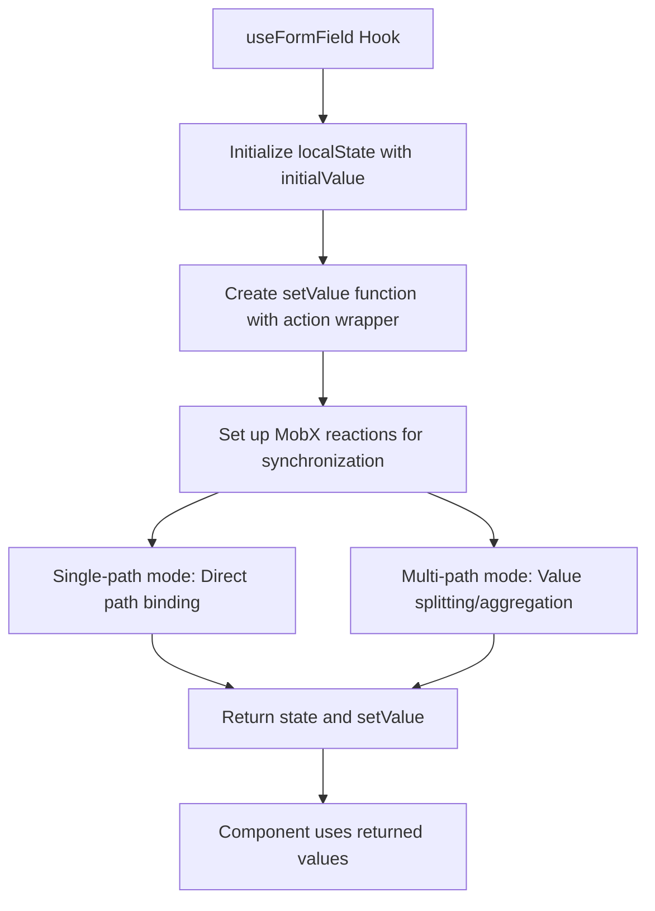
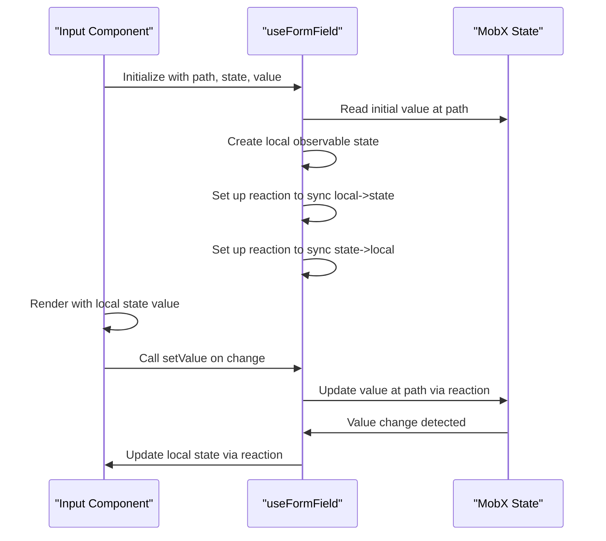
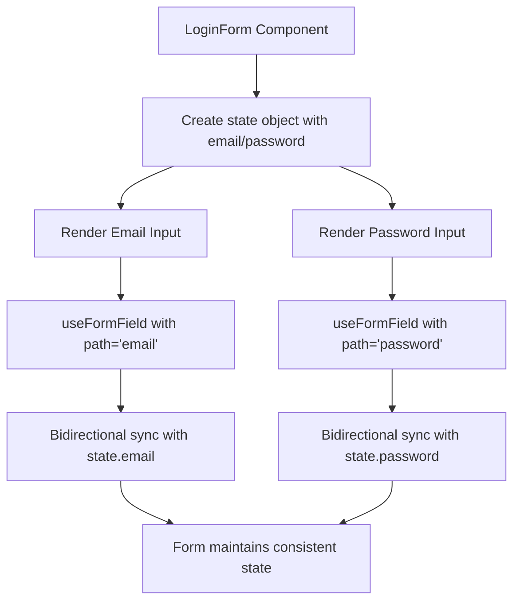

# Shared React Hooks

<cite>
**Referenced Files in This Document**   
- [useFormField.ts](file://packages/hooks/src/useFormField.ts)
- [index.ts](file://packages/hooks/src/index.ts)
- [Input.tsx](file://packages/ui/src/components/inputs/Input/index.tsx)
- [LoginForm.tsx](file://packages/ui/src/components/form/LoginForm/LoginForm.tsx)
- [package.json](file://packages/hooks/package.json)
- [README.md](file://packages/hooks/README.md)
</cite>

## Table of Contents
1. [Introduction](#introduction)
2. [Package Overview](#package-overview)
3. [Core Functionality](#core-functionality)
4. [useFormField Hook](#useformfield-hook)
5. [Usage Examples](#usage-examples)
6. [Integration with Form Components](#integration-with-form-components)
7. [Development Workflow](#development-workflow)
8. [Best Practices](#best-practices)

## Introduction

The Shared React Hooks package (`@cocrepo/hooks`) is a minimal, focused library designed to provide reusable custom hooks across frontend applications in the prj-core monorepo. This package promotes code reuse and consistency, particularly in form handling between the admin and mobile applications. The primary hook, `useFormField`, enables efficient form state management by connecting input components to MobX state stores through path-based state binding. This documentation details the hook's functionality, parameters, return values, and integration patterns, along with guidance for extending the package with new shared hooks while maintaining backward compatibility.

## Package Overview

The `@cocrepo/hooks` package serves as a centralized repository for reusable React hooks across the organization's frontend applications. Located in the `packages/hooks` directory of the monorepo, this package is specifically designed to address common frontend patterns with a focus on form state management and MobX integration. The package follows a minimalist approach, currently exposing only the `useFormField` hook through its public API, which is re-exported from the main index file.

The package is published as a public npm package with version 1.3.7 and is consumed by both the admin and mobile applications through standard package dependencies. It leverages TypeScript for type safety and integrates with MobX for state management, using `mobx-react-lite` for React bindings and `useLocalObservable` for managing local component state. The build process is streamlined, with source files served directly without compilation, as indicated by the package.json configuration that points main, module, and types entries to the index.ts file.

**Section sources**
- [package.json](file://packages/hooks/package.json#L1-L48)
- [index.ts](file://packages/hooks/src/index.ts#L1-L2)

## Core Functionality

The Shared React Hooks package provides form state management capabilities through the `useFormField` hook, which acts as a bridge between React components and MobX state stores. The core functionality revolves around synchronizing form field values with state objects using path-based access, enabling two-way data binding between UI components and application state.

The hook supports two distinct modes of operation: single-path and multi-path form field management. In single-path mode, the hook connects a form field directly to a specific path within a state object. In multi-path mode, it can manage complex form fields that need to synchronize with multiple state paths simultaneously, using value splitting and aggregation functions to transform data between the UI representation and the underlying state structure.

This dual-mode approach allows the hook to handle both simple input fields and complex form controls like date pickers or composite fields that need to update multiple state properties. The implementation uses MobX reactions to create bidirectional synchronization between the local component state and the provided state object, ensuring that changes in either direction are properly propagated.

**Section sources**
- [useFormField.ts](file://packages/hooks/src/useFormField.ts#L12-L169)

## useFormField Hook

The `useFormField` hook is the primary export of the Shared React Hooks package, providing a type-safe interface for managing form field state in React components. The hook accepts configuration options through a parameter object and returns an object containing the current field state and a setter function.

### Parameters

The hook supports two distinct parameter interfaces based on usage mode:

**Single-path options** (`UseFormFieldSingleOptions`):
- `value`: Initial value for the form field
- `state`: Reference to the MobX state object
- `path`: Dot-notation string path to the specific property in the state object

**Multi-path options** (`UseFormFieldMultiOptions`):
- `value`: Initial value for the form field
- `state`: Reference to the MobX state object
- `paths`: Array of dot-notation string paths to multiple properties in the state object
- `valueSplitter`: Function that transforms a single UI value into multiple state values
- `valueAggregator`: Optional function that combines multiple state values into a single UI value

### Return Value

The hook returns an object with the following properties:
- `state`: Observable object containing the current field value
- `setValue`: Function to update the field value, wrapped with MobX action for proper state management

The implementation uses `useLocalObservable` to create a local observable state for the field value, ensuring efficient re-renders when the value changes. MobX reactions establish bidirectional synchronization between this local state and the provided state object, with cleanup handled through the useEffect return function.

**Diagram sources**
- [useFormField.ts](file://packages/hooks/src/useFormField.ts#L62-L168)

**Section sources**
- [useFormField.ts](file://packages/hooks/src/useFormField.ts#L12-L169)

## Usage Examples

The `useFormField` hook is designed for integration with form components across the application ecosystem. The most common usage pattern involves wrapping input components to connect them to MobX state stores through path-based binding.

### Basic Input Integration

In the Input component implementation, the hook is used to create a controlled input that synchronizes with a specific path in a state object:

**Diagram sources**
- [Input.tsx](file://packages/ui/src/components/inputs/Input/index.tsx#L1-L38)

### Form Component Integration

The LoginForm component demonstrates how multiple `useFormField` hooks can be used together to manage a complete form:

**Diagram sources**
- [LoginForm.tsx](file://packages/ui/src/components/form/LoginForm/LoginForm.tsx#L1-L32)

## Integration with Form Components

The `useFormField` hook is tightly integrated with the UI component library, particularly in form-related components. The Input component serves as a prime example of this integration pattern, where the hook is used to create a MobX-aware input that automatically synchronizes with application state.

The integration follows a consistent pattern:
1. The component accepts a `path` prop indicating the state path to bind to
2. It uses `tools.get` from the toolkit package to retrieve the initial value from the state object
3. It initializes `useFormField` with the state, path, and initial value
4. It connects the input's value to the hook's state.value
5. It connects the input's onChange and onBlur events to the hook's setValue function

This pattern enables form components to be completely decoupled from the specific structure of the state store while maintaining type safety through the path-based access system. The approach promotes reusability, as the same input component can be used with different state objects and paths throughout the application.

The integration also supports form validation through the toolkit's validation utilities, which can be applied to the state object to provide feedback on form field validity. This creates a cohesive form handling system where state management, UI rendering, and validation are all coordinated through the shared hooks and utilities.

**Section sources**
- [Input.tsx](file://packages/ui/src/components/inputs/Input/index.tsx#L1-L38)
- [LoginForm.tsx](file://packages/ui/src/components/form/LoginForm/LoginForm.tsx#L1-L32)

## Development Workflow

The development workflow for the Shared React Hooks package follows the monorepo's standard practices for package maintenance and evolution. When adding new shared hooks or modifying existing ones, developers must consider backward compatibility and the impact on consuming applications.

### Adding New Hooks

To add a new shared hook:
1. Create a new TypeScript file in the `packages/hooks/src` directory
2. Implement the hook with proper TypeScript types and JSDoc comments
3. Export the hook from the file
4. Add the export to `index.ts` using `export * from "./hookName"`
5. Write unit tests for the new hook
6. Update documentation in README.md

### Maintaining Backward Compatibility

The package maintains backward compatibility through several strategies:
- Semantic versioning for public releases
- Type-safe interfaces that prevent breaking changes
- Deprecation warnings for features that will be removed
- Comprehensive unit tests to catch regressions

When changes are necessary that might break existing code, the team follows a deprecation process:
1. Add a console warning when the deprecated pattern is used
2. Publish a minor version with the deprecation
3. Wait for a reasonable period (typically one release cycle)
4. Remove the deprecated functionality in a major version

The build process is configured in turbo.json to ensure that changes to the hooks package trigger appropriate rebuilds of dependent packages, maintaining the integrity of the monorepo's dependency graph.

**Section sources**
- [turbo.json](file://turbo.json#L91-L116)
- [package.json](file://packages/hooks/package.json#L1-L48)
- [README.md](file://packages/hooks/README.md#L1-L261)

## Best Practices

When using the Shared React Hooks package, developers should follow these best practices to ensure consistent and maintainable code:

### For Consumers

- Always provide meaningful path strings that clearly indicate the state property being accessed
- Use the hook within functional components to leverage React's hooks system properly
- Ensure the state object passed to the hook is a MobX observable to enable proper reactivity
- Handle initial values appropriately, considering cases where the state path might not exist
- Use the returned setValue function for all state updates to maintain proper MobX transaction boundaries

### For Contributors

- Maintain type safety by providing comprehensive TypeScript interfaces
- Write clear JSDoc comments for all exported functions and interfaces
- Include unit tests for all new functionality
- Follow the existing code style and patterns
- Consider backward compatibility when making changes
- Update documentation when adding or modifying features

The package's minimalist design encourages focused, single-responsibility hooks that address specific use cases without unnecessary complexity. This approach ensures that the package remains lightweight and easy to understand while providing essential functionality for form state management across the application ecosystem.