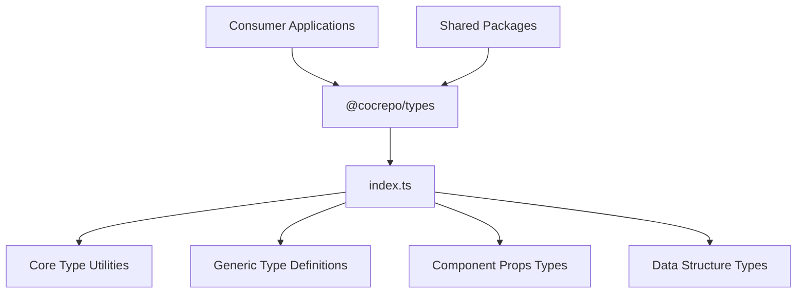
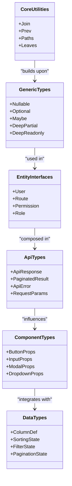
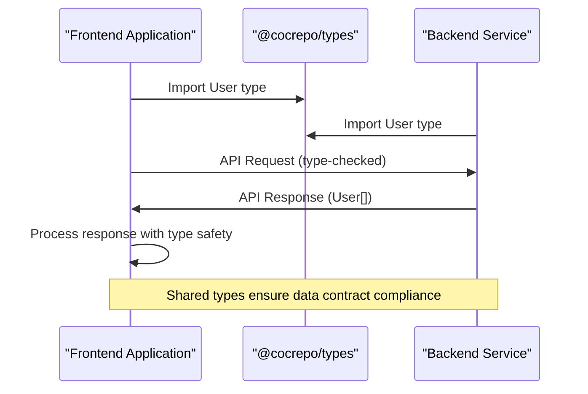
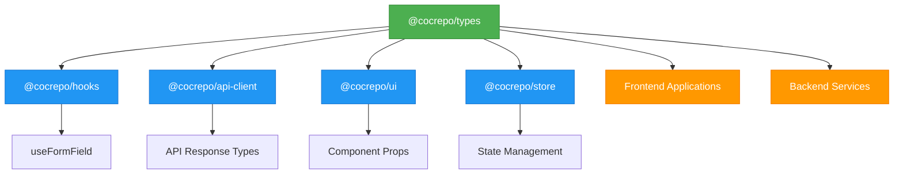

# Shared Type Definitions

<cite>
**Referenced Files in This Document**   
- [index.ts](file://packages/types/src/index.ts)
- [package.json](file://packages/types/package.json)
- [README.md](file://packages/types/README.md)
- [useFormField.ts](file://packages/hooks/src/useFormField.ts)
</cite>

## Table of Contents
1. [Introduction](#introduction)
2. [Package Structure and Organization](#package-structure-and-organization)
3. [Core Type Definitions](#core-type-definitions)
4. [Type Safety and Cross-Platform Consistency](#type-safety-and-cross-platform-consistency)
5. [Tree-Shaking and Minimal Bundle Impact](#tree-shaking-and-minimal-bundle-impact)
6. [Consumption Patterns Across the Monorepo](#consumption-patterns-across-the-monorepo)
7. [Versioning Strategy and Backward Compatibility](#versioning-strategy-and-backward-compatibility)
8. [Best Practices for Type Usage](#best-practices-for-type-usage)

## Introduction

The `@cocrepo/types` package serves as the foundational type system for the entire monorepo, providing a centralized repository of TypeScript type definitions, interfaces, and utility types. This shared package ensures type consistency across all frontend and backend applications, enabling type-safe communication between different parts of the system. By defining common types in a single location, the package eliminates duplication, reduces errors, and streamlines development across teams. The package is designed to be lightweight, with zero runtime impact, as all types are erased during compilation. Its strategic position in the dependency graph makes it one of the most critical packages in the architecture, as nearly every other package and application depends on it for type definitions.

**Section sources**
- [README.md](file://packages/types/README.md#L1-L273)

## Package Structure and Organization

The `@cocrepo/types` package follows a flat but well-organized structure focused on reusability and ease of consumption. All type definitions are exported from the main `index.ts` file, which serves as the single entry point for consumers. The package does not use subdirectories for type categorization, instead opting for a consolidated approach where all types are available through the root import. This design decision simplifies the import syntax and reduces cognitive overhead for developers. The package.json configuration specifies the entry points for different module systems, ensuring compatibility with various bundlers and environments. Notably, the package does not require a build step, as it exports TypeScript source files directly, which are then processed by the consumer's build system. This approach reduces complexity and ensures that consumers can benefit from the latest TypeScript features without intermediate compilation steps.

**Diagram sources**
- [index.ts](file://packages/types/src/index.ts#L1-L85)
- [package.json](file://packages/types/package.json#L1-L42)

**Section sources**
- [index.ts](file://packages/types/src/index.ts#L1-L85)
- [package.json](file://packages/types/package.json#L1-L42)

## Core Type Definitions

The `@cocrepo/types` package provides a comprehensive set of type definitions categorized into several key areas. The core type utilities include advanced TypeScript types like `Join`, `Paths`, and `Leaves`, which enable sophisticated type manipulation and nested property access. These utilities are particularly valuable for form handling and state management, where deep property paths need to be type-safe. The package also defines common interface patterns for entities like `User`, `Route`, and `ApiResponse`, ensuring consistency in data structures across the application. Generic types such as `Nullable<T>`, `Optional<T>`, and `Maybe<T>` provide standardized ways to handle optional values, reducing the need for repetitive union type definitions. Additionally, the package includes specialized types for UI components, data grids, and form validation, creating a cohesive typing system that spans both business logic and presentation layers.

**Diagram sources**
- [index.ts](file://packages/types/src/index.ts#L1-L85)
- [README.md](file://packages/types/README.md#L114-L144)

**Section sources**
- [index.ts](file://packages/types/src/index.ts#L1-L85)
- [README.md](file://packages/types/README.md#L114-L144)

## Type Safety and Cross-Platform Consistency

The `@cocrepo/types` package plays a crucial role in ensuring type safety and consistency across the entire monorepo, bridging the gap between frontend and backend codebases. By defining shared types for API responses, request parameters, and data models, the package enables compile-time verification of data contracts between client and server. This eliminates entire classes of runtime errors caused by mismatched data structures or incorrect assumptions about API responses. The strict TypeScript configuration, with options like `strictNullChecks` and `noImplicitAny`, ensures that type safety is maintained at the highest level. When frontend applications consume backend APIs, they can use the same type definitions that the backend uses, creating a seamless development experience. This shared typing system also facilitates better documentation, as the types themselves serve as a living specification of the data structures used throughout the system.

**Diagram sources**
- [README.md](file://packages/types/README.md#L7-L8)
- [README.md](file://packages/types/README.md#L120-L124)

**Section sources**
- [README.md](file://packages/types/README.md#L7-L8)
- [README.md](file://packages/types/README.md#L120-L124)

## Tree-Shaking and Minimal Bundle Impact

The `@cocrepo/types` package is designed with tree-shaking in mind, ensuring that consumers only bundle the types they actually use. Since TypeScript types are erased during compilation, the package has zero runtime impact, but the design still prioritizes minimal bundle size for any runtime components that might be included. The package structure, with all types exported from a single index file, works seamlessly with modern bundlers like Vite and Webpack, which can statically analyze imports and eliminate unused code. The use of `import type` syntax in consumer code further ensures that type-only imports do not contribute to the final bundle size. This tree-shaking capability is particularly important in a monorepo context, where many packages might depend on the shared types but only use a subset of the available definitions. The package's minimal dependencies and lack of runtime code make it an ideal foundation for the entire system, as it can be safely consumed without performance concerns.

**Section sources**
- [README.md](file://packages/types/README.md#L15)
- [package.json](file://packages/types/package.json#L1-L42)

## Consumption Patterns Across the Monorepo

The `@cocrepo/types` package is consumed throughout the monorepo in various patterns, demonstrating its central role in the architecture. One prominent example is in the `@cocrepo/hooks` package, where the `useFormField` hook imports type utilities like `Paths`, `PathTuple`, `ValueSplitter`, and `ValueAggregator` to provide type-safe form handling capabilities. This pattern shows how shared types enable the creation of generic, reusable hooks that can work with any data structure while maintaining type safety. Other packages consume the types for API client generation, component prop definitions, and state management. The import syntax consistently uses the `import type` keyword to indicate that these are type-only imports, which helps bundlers optimize the final output. The widespread adoption of these shared types across packages creates a consistent development experience and reduces the learning curve for new team members.

**Diagram sources**
- [useFormField.ts](file://packages/hooks/src/useFormField.ts#L2-L7)
- [README.md](file://packages/types/README.md#L1-L273)

**Section sources**
- [useFormField.ts](file://packages/hooks/src/useFormField.ts#L2-L7)
- [README.md](file://packages/types/README.md#L1-L273)

## Versioning Strategy and Backward Compatibility

The `@cocrepo/types` package follows a careful versioning strategy to maintain backward compatibility while allowing for necessary evolution. As a foundational package with widespread dependencies, breaking changes are avoided whenever possible. When new types are added, they are introduced in a way that does not affect existing consumers. If a type needs to be modified or deprecated, a transitional period is implemented where both the old and new types coexist, with the old type marked as deprecated. This approach allows consumers to migrate at their own pace. The package uses semantic versioning, with major version increments reserved for breaking changes that cannot be avoided. The README documentation includes a migration guide to help consumers update their code when breaking changes are necessary. This conservative approach to versioning ensures stability across the monorepo, as teams can upgrade to new versions of the types package with confidence that their existing code will continue to work.

**Section sources**
- [README.md](file://packages/types/README.md#L255-L268)
- [package.json](file://packages/types/package.json#L3-L4)

## Best Practices for Type Usage

When using the `@cocrepo/types` package, several best practices ensure optimal results and maintainability. First, always use `import type` for type-only imports, as this enables better tree-shaking and makes the intent clear. Second, extend existing types rather than creating duplicates, leveraging TypeScript's interface merging and extension capabilities. Third, leverage the generic types provided by the package, such as `Partial`, `Pick`, and `Omit`, to create derived types without repetition. Fourth, document complex types with JSDoc comments to improve maintainability and onboarding. Finally, organize type imports by domain or purpose, grouping related types together in import statements. These practices, documented in the package's README, help maintain consistency across the codebase and ensure that the shared types are used effectively and efficiently.

**Section sources**
- [README.md](file://packages/types/README.md#L187-L191)
- [README.md](file://packages/types/README.md#L193-L210)