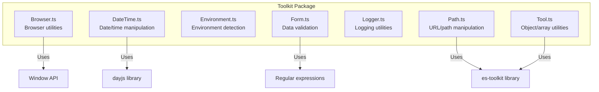
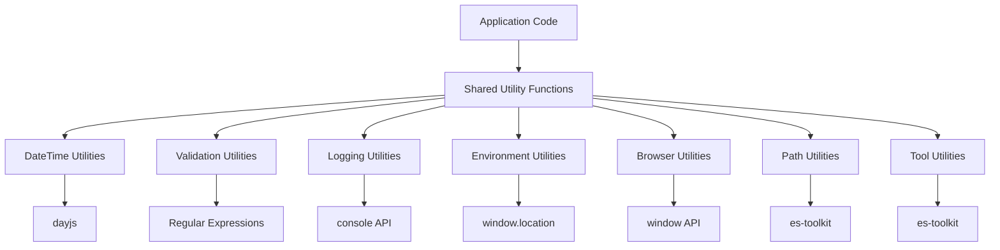
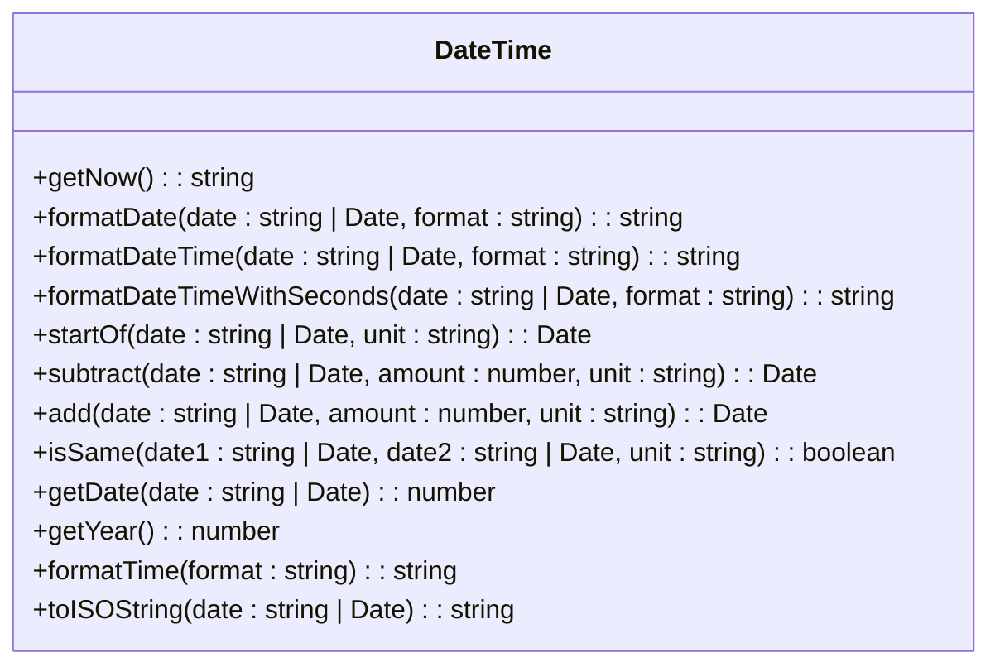
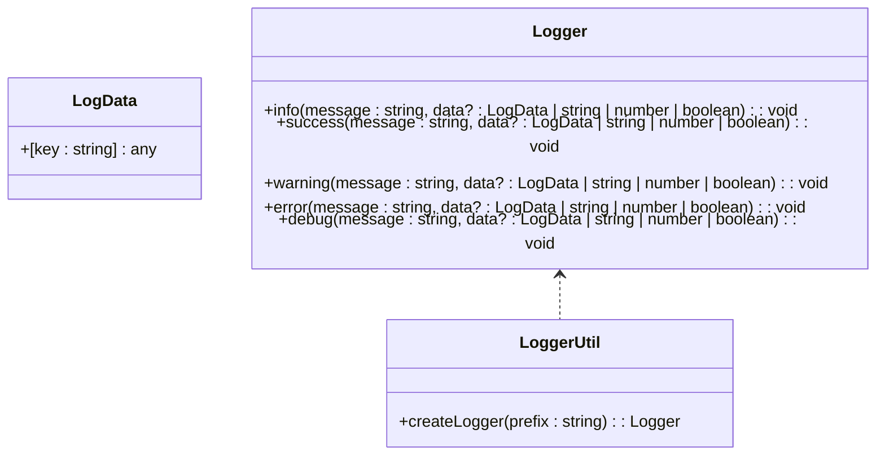
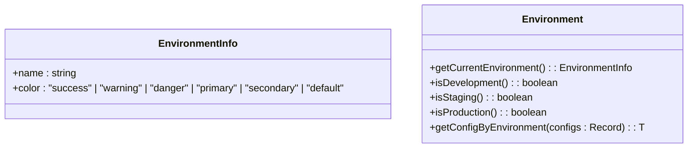
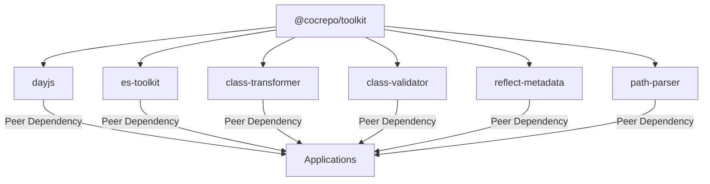
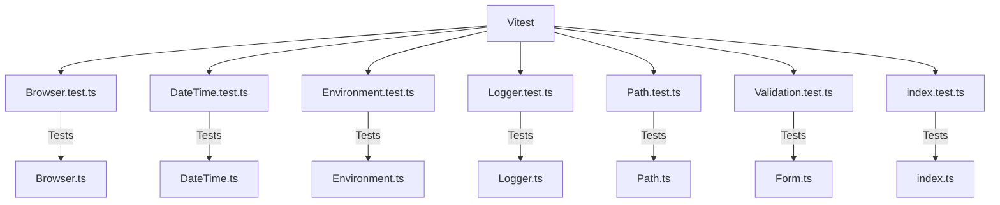

# Shared Utility Functions

<cite>
**Referenced Files in This Document**   
- [Browser.ts](file://packages/toolkit/src/Browser.ts)
- [DateTime.ts](file://packages/toolkit/src/DateTime.ts)
- [Environment.ts](file://packages/toolkit/src/Environment.ts)
- [Form.ts](file://packages/toolkit/src/Form.ts)
- [Logger.ts](file://packages/toolkit/src/Logger.ts)
- [Path.ts](file://packages/toolkit/src/Path.ts)
- [Tool.ts](file://packages/toolkit/src/Tool.ts)
- [package.json](file://packages/toolkit/package.json)
- [vitest.config.ts](file://packages/toolkit/vitest.config.ts)
</cite>

## Table of Contents
1. [Introduction](#introduction)
2. [Project Structure](#project-structure)
3. Core Components
   - [Date/Time Manipulation](#datetime-manipulation)
   - [Data Validation](#data-validation)
   - [Logging](#logging)
   - [Environment Detection](#environment-detection)
4. [Architecture Overview](#architecture-overview)
5. [Detailed Component Analysis](#detailed-component-analysis)
6. [Dependency Analysis](#dependency-analysis)
7. [Performance Considerations](#performance-considerations)
8. [Testing Strategy](#testing-strategy)
9. [Usage Examples](#usage-examples)
10. [Development Workflow](#development-workflow)
11. [Conclusion](#conclusion)

## Introduction
The Shared Utility Functions package (published as @cocrepo/toolkit) provides a collection of reusable utility functions designed to promote code consistency and reduce duplication across applications in the prj-core monorepo. This package organizes utilities by functional concern, including date/time manipulation, data validation, logging, environment detection, and browser interactions. The utilities are designed to be lightweight, type-safe, and compatible with both frontend and backend environments where applicable. By centralizing these common functions, the toolkit ensures consistent behavior across different applications while reducing the maintenance burden of duplicated utility code.

## Project Structure
The toolkit package follows a modular structure with each utility concern separated into its own file. This organization promotes discoverability and allows applications to import only the specific utilities they need. The package is configured for tree-shaking, ensuring that unused utilities are not included in application bundles.



**Diagram sources**
- [Browser.ts](file://packages/toolkit/src/Browser.ts)
- [DateTime.ts](file://packages/toolkit/src/DateTime.ts)
- [Environment.ts](file://packages/toolkit/src/Environment.ts)
- [Form.ts](file://packages/toolkit/src/Form.ts)
- [Logger.ts](file://packages/toolkit/src/Logger.ts)
- [Path.ts](file://packages/toolkit/src/Path.ts)
- [Tool.ts](file://packages/toolkit/src/Tool.ts)

**Section sources**
- [Browser.ts](file://packages/toolkit/src/Browser.ts)
- [DateTime.ts](file://packages/toolkit/src/DateTime.ts)
- [Environment.ts](file://packages/toolkit/src/Environment.ts)
- [Form.ts](file://packages/toolkit/src/Form.ts)
- [Logger.ts](file://packages/toolkit/src/Logger.ts)
- [Path.ts](file://packages/toolkit/src/Path.ts)
- [Tool.ts](file://packages/toolkit/src/Tool.ts)

## Core Components

### DateTime Manipulation
The DateTime utilities provide a comprehensive set of functions for working with dates and times, built on top of the dayjs library. These functions handle formatting, manipulation, comparison, and extraction of date components.

**Section sources**
- [DateTime.ts](file://packages/toolkit/src/DateTime.ts)

### Data Validation
The Form utilities offer robust validation capabilities for form fields and data objects, supporting various validation rules including required fields, length constraints, numerical ranges, and pattern matching.

**Section sources**
- [Form.ts](file://packages/toolkit/src/Form.ts)

### Logging
The Logger utilities provide a structured logging interface with different log levels and visual indicators, enabling consistent logging patterns across applications.

**Section sources**
- [Logger.ts](file://packages/toolkit/src/Logger.ts)

### Environment Detection
The Environment utilities enable applications to detect their current deployment environment (development, staging, or production) and access environment-specific configurations.

**Section sources**
- [Environment.ts](file://packages/toolkit/src/Environment.ts)

## Architecture Overview
The Shared Utility Functions package follows a functional programming approach with pure functions that have no side effects. Each utility file exports specific functions related to a particular concern, making the API surface clear and focused. The package leverages existing well-maintained libraries like dayjs and es-toolkit for core functionality while providing a consistent interface and additional features tailored to the organization's needs.



**Diagram sources**
- [DateTime.ts](file://packages/toolkit/src/DateTime.ts)
- [Form.ts](file://packages/toolkit/src/Form.ts)
- [Logger.ts](file://packages/toolkit/src/Logger.ts)
- [Environment.ts](file://packages/toolkit/src/Environment.ts)
- [Browser.ts](file://packages/toolkit/src/Browser.ts)
- [Path.ts](file://packages/toolkit/src/Path.ts)
- [Tool.ts](file://packages/toolkit/src/Tool.ts)

## Detailed Component Analysis

### DateTime Utilities Analysis
The DateTime module provides a comprehensive set of functions for date and time operations, abstracting the dayjs library with a consistent API.



**Diagram sources**
- [DateTime.ts](file://packages/toolkit/src/DateTime.ts)

**Section sources**
- [DateTime.ts](file://packages/toolkit/src/DateTime.ts)

### Validation Utilities Analysis
The Form module provides robust validation functions for form fields and data objects, supporting various validation rules and error reporting.

```mermaid
classDiagram
class Validation {
+timings : ("onBlur" | "onChange" | "onFocus")[]
+required : { value : boolean; message : string }
+minLength : { value : number; message : string }
+maxLength : { value : number; message : string }
+min : { value : number; message : string }
+max : { value : number; message : string }
+patterns : { value : RegExp | string; message : string }[]
}
class FormValidator {
+validateSingleField(value : any, validation : Validation) : { isValid : boolean; errorMessage? : string }
+validateFields(state : any, validationFields : Record<string, Validation>) : { isValid : boolean; errorMessage? : string }
}
Validation <.. FormValidator
```

**Diagram sources**
- [Form.ts](file://packages/toolkit/src/Form.ts)

**Section sources**
- [Form.ts](file://packages/toolkit/src/Form.ts)

### Logging Utilities Analysis
The Logger module provides a structured logging interface with different log levels and visual indicators for improved debugging and monitoring.



**Diagram sources**
- [Logger.ts](file://packages/toolkit/src/Logger.ts)

**Section sources**
- [Logger.ts](file://packages/toolkit/src/Logger.ts)

### Environment Utilities Analysis
The Environment module provides functions to detect the current deployment environment and access environment-specific configurations.



**Diagram sources**
- [Environment.ts](file://packages/toolkit/src/Environment.ts)

**Section sources**
- [Environment.ts](file://packages/toolkit/src/Environment.ts)

## Dependency Analysis
The toolkit package has a minimal set of dependencies, leveraging well-established libraries for core functionality while keeping the overall bundle size small.



**Diagram sources**
- [package.json](file://packages/toolkit/package.json)

**Section sources**
- [package.json](file://packages/toolkit/package.json)

## Performance Considerations
The utility functions are designed with performance in mind, using efficient algorithms and minimizing unnecessary computations. The modular structure enables tree-shaking, ensuring that only used functions are included in application bundles. Functions are generally pure and have minimal side effects, making them predictable and cacheable. The use of established libraries like dayjs and es-toolkit ensures that core operations are optimized and well-tested.

## Testing Strategy
The toolkit package uses Vitest for testing utility functions, providing comprehensive test coverage for all exported functions. The testing strategy focuses on validating function behavior, edge cases, and error handling.



**Diagram sources**
- [vitest.config.ts](file://packages/toolkit/vitest.config.ts)
- [Browser.test.ts](file://packages/toolkit/src/__tests__/Browser.test.ts)
- [DateTime.test.ts](file://packages/toolkit/src/__tests__/DateTime.test.ts)
- [Environment.test.ts](file://packages/toolkit/src/__tests__/Environment.test.ts)
- [Logger.test.ts](file://packages/toolkit/src/__tests__/Logger.test.ts)
- [Path.test.ts](file://packages/toolkit/src/__tests__/Path.test.ts)
- [Validation.test.ts](file://packages/toolkit/src/__tests__/Validation.test.ts)
- [index.test.ts](file://packages/toolkit/src/__tests__/index.test.ts)

**Section sources**
- [vitest.config.ts](file://packages/toolkit/vitest.config.ts)

## Usage Examples
The following examples demonstrate common usage patterns for the utility functions:

### Date/Time Formatting
```typescript
import { formatDate, formatDateTime, getNow } from '@cocrepo/toolkit';

// Format date as YYYY.MM.DD
const formattedDate = formatDate(new Date(), 'YYYY.MM.DD');

// Format date and time as YYYY.MM.DD HH:mm
const formattedDateTime = formatDateTime('2023-01-15T14:30:00');

// Get current date and time
const now = getNow();
```

### Form Validation
```typescript
import { validateSingleField, validateFields } from '@cocrepo/toolkit';

// Validate a single field
const emailValidation = {
  required: { value: true, message: 'Email is required' },
  patterns: [
    { value: /^[^\s@]+@[^\s@]+\.[^\s@]+$/, message: 'Invalid email format' }
  ]
};

const result = validateSingleField('user@example.com', emailValidation);

// Validate multiple fields
const validationRules = {
  'user.email': emailValidation,
  'user.age': {
    min: { value: 18, message: 'Must be at least 18 years old' }
  }
};

const formState = { user: { email: 'user@example.com', age: 25 } };
const validationResult = validateFields(formState, validationRules);
```

### Environment Detection
```typescript
import { getCurrentEnvironment, isDevelopment, getConfigByEnvironment } from '@cocrepo/toolkit';

// Get current environment info
const env = getCurrentEnvironment();
console.log(`Running in ${env.name} environment`);

// Check if in development
if (isDevelopment()) {
  console.log('Development mode enabled');
}

// Get environment-specific configuration
const apiUrl = getConfigByEnvironment({
  개발: 'http://localhost:3000',
  스테이징: 'https://staging-api.example.com',
  운영: 'https://api.example.com'
});
```

### Structured Logging
```typescript
import { createLogger } from '@cocrepo/toolkit';

// Create a logger with a prefix
const logger = createLogger('[UserService]');

// Use different log levels
logger.info('Fetching user data', { userId: 123 });
logger.success('User data retrieved successfully');
logger.warning('User profile is incomplete');
logger.error('Failed to update user', error);
logger.debug('Processing user preferences');
```

**Section sources**
- [DateTime.ts](file://packages/toolkit/src/DateTime.ts)
- [Form.ts](file://packages/toolkit/src/Form.ts)
- [Environment.ts](file://packages/toolkit/src/Environment.ts)
- [Logger.ts](file://packages/toolkit/src/Logger.ts)

## Development Workflow
The development workflow for adding new utilities to the toolkit follows a structured process to maintain backward compatibility and type safety:

1. **Identify the need**: Determine if the functionality is truly reusable across multiple applications
2. **Design the API**: Create a clear, consistent interface that follows existing patterns
3. **Implement the utility**: Write the function with comprehensive TypeScript types
4. **Add documentation**: Include JSDoc comments with examples and parameter descriptions
5. **Write tests**: Create comprehensive tests using Vitest to cover normal and edge cases
6. **Update exports**: Add the new utility to the index.ts file if appropriate
7. **Version appropriately**: Follow semantic versioning based on the change type

The package uses tsup for bundling, which automatically generates ESM and CJS builds along with type declarations. The build process includes type checking to ensure type safety. Before publishing, the package is tested locally in consuming applications to verify compatibility.

**Section sources**
- [package.json](file://packages/toolkit/package.json)
- [tsup.config.ts](file://packages/toolkit/tsup.config.ts)
- [vitest.config.ts](file://packages/toolkit/vitest.config.ts)

## Conclusion
The Shared Utility Functions package provides a valuable collection of reusable utilities that promote code consistency and reduce duplication across applications in the prj-core monorepo. By organizing utilities by concern and providing a well-documented API, the toolkit enables developers to quickly implement common functionality without reinventing the wheel. The use of Vitest for comprehensive testing ensures reliability, while the modular structure supports tree-shaking for optimal bundle sizes. As the organization continues to develop new applications, this toolkit will serve as a foundational library for common operations, improving development velocity and code quality.