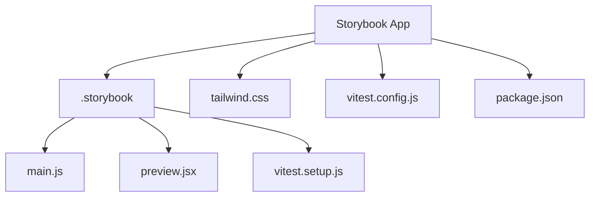
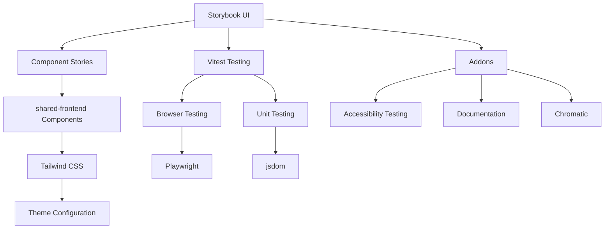
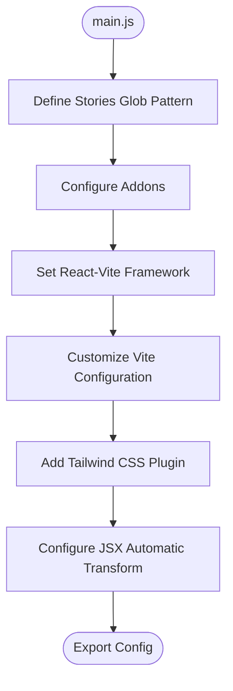
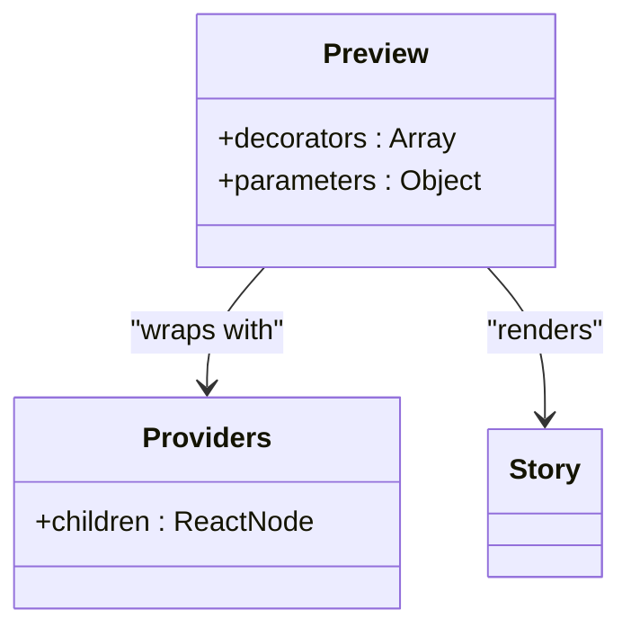
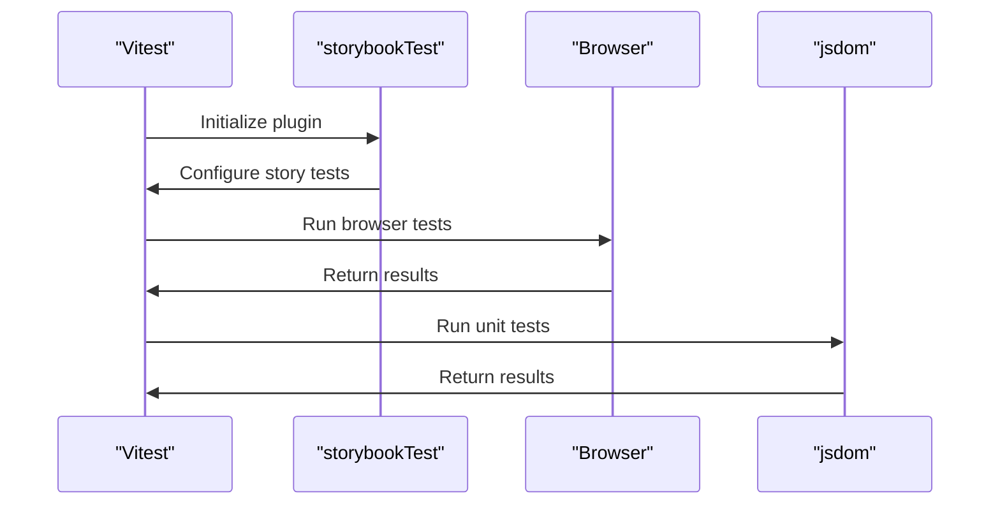

# Storybook Component Library

<cite>
**Referenced Files in This Document**   
- [main.js](file://apps/storybook/.storybook/main.js)
- [preview.jsx](file://apps/storybook/.storybook/preview.jsx)
- [vitest.setup.js](file://apps/storybook/.storybook/vitest.setup.js)
- [vitest.config.js](file://apps/storybook/vitest.config.js)
- [test-setup.js](file://apps/storybook/test-setup.js)
- [tailwind.css](file://apps/storybook/tailwind.css)
- [package.json](file://apps/storybook/package.json)
</cite>

## Table of Contents
1. [Introduction](#introduction)
2. [Project Structure](#project-structure)
3. [Core Components](#core-components)
4. [Architecture Overview](#architecture-overview)
5. [Detailed Component Analysis](#detailed-component-analysis)
6. [Dependency Analysis](#dependency-analysis)
7. [Performance Considerations](#performance-considerations)
8. [Troubleshooting Guide](#troubleshooting-guide)
9. [Conclusion](#conclusion)

## Introduction
The Storybook Component Library in prj-core serves as an isolated development environment for UI components, enabling visual testing, documentation, and consistent design system maintenance. This documentation details the architecture, configuration, and workflow for developing, testing, and publishing components within the monorepo structure.

## Project Structure



**Diagram sources**
- [main.js](file://apps/storybook/.storybook/main.js)
- [preview.jsx](file://apps/storybook/.storybook/preview.jsx)
- [vitest.config.js](file://apps/storybook/vitest.config.js)

**Section sources**
- [main.js](file://apps/storybook/.storybook/main.js)
- [preview.jsx](file://apps/storybook/.storybook/preview.jsx)
- [package.json](file://apps/storybook/package.json)

## Core Components

The Storybook Component Library is configured through several core files that define its behavior, integration with Tailwind CSS, and testing setup. The library sources components from the shared-frontend package and provides a comprehensive environment for component development and documentation.

**Section sources**
- [main.js](file://apps/storybook/.storybook/main.js)
- [preview.jsx](file://apps/storybook/.storybook/preview.jsx)
- [vitest.config.js](file://apps/storybook/vitest.config.js)

## Architecture Overview



**Diagram sources**
- [main.js](file://apps/storybook/.storybook/main.js)
- [preview.jsx](file://apps/storybook/.storybook/preview.jsx)
- [vitest.config.js](file://apps/storybook/vitest.config.js)

## Detailed Component Analysis

### Configuration Analysis

#### Storybook Configuration


**Diagram sources**
- [main.js](file://apps/storybook/.storybook/main.js)

**Section sources**
- [main.js](file://apps/storybook/.storybook/main.js)

#### Preview Configuration


**Diagram sources**
- [preview.jsx](file://apps/storybook/.storybook/preview.jsx)

**Section sources**
- [preview.jsx](file://apps/storybook/.storybook/preview.jsx)

#### Testing Configuration


**Diagram sources**
- [vitest.config.js](file://apps/storybook/vitest.config.js)
- [vitest.setup.js](file://apps/storybook/.storybook/vitest.setup.js)

**Section sources**
- [vitest.config.js](file://apps/storybook/vitest.config.js)
- [vitest.setup.js](file://apps/storybook/.storybook/vitest.setup.js)

## Dependency Analysis

```mermaid
dependency-graph
"main.js" --> "tailwindcss/vite"
"main.js" --> "@storybook/react-vite"
"preview.jsx" --> "tailwind.css"
"preview.jsx" --> "@cocrepo/providers"
"vitest.config.js" --> "@storybook/addon-vitest"
"vitest.config.js" --> "@vitejs/plugin-react-swc"
"vitest.config.js" --> "playwright"
"test-setup.js" --> "@testing-library/react"
"test-setup.js" --> "@testing-library/jest-dom"
```

**Diagram sources**
- [main.js](file://apps/storybook/.storybook/main.js)
- [preview.jsx](file://apps/storybook/.storybook/preview.jsx)
- [vitest.config.js](file://apps/storybook/vitest.config.js)
- [test-setup.js](file://apps/storybook/test-setup.js)

**Section sources**
- [main.js](file://apps/storybook/.storybook/main.js)
- [preview.jsx](file://apps/storybook/.storybook/preview.jsx)
- [vitest.config.js](file://apps/storybook/vitest.config.js)
- [test-setup.js](file://apps/storybook/test-setup.js)

## Performance Considerations
The Storybook Component Library is optimized for development efficiency with Vite as the build tool, providing fast hot module replacement and instant server start. The configuration leverages Vite's native ES modules support and efficient dependency pre-bundling. The testing setup uses parallel project configurations in Vitest to run browser and unit tests simultaneously, improving test execution speed.

## Troubleshooting Guide

When encountering issues with the Storybook Component Library, consider the following common problems and solutions:

1. **Storybook fails to start**: Verify that the shared-frontend package is properly linked and accessible from the storybook application.
2. **Tailwind CSS not applying**: Check that the tailwind.css file is correctly imported in preview.jsx and that the Vite plugin is properly configured in main.js.
3. **Tests failing in browser environment**: Ensure Playwright is properly installed and that the browser instances are correctly configured in vitest.config.js.
4. **Component stories not loading**: Verify the glob patterns in the stories array in main.js correctly point to the component story files in the shared-frontend package.

**Section sources**
- [main.js](file://apps/storybook/.storybook/main.js)
- [preview.jsx](file://apps/storybook/.storybook/preview.jsx)
- [vitest.config.js](file://apps/storybook/vitest.config.js)

## Conclusion
The Storybook Component Library in prj-core provides a robust environment for developing, testing, and documenting UI components. By leveraging modern tools like Vite, Vitest, and Playwright, it offers a comprehensive solution for maintaining a consistent design system across the organization. The integration with Tailwind CSS enables rapid UI development with a consistent design language, while the isolated development environment ensures components are thoroughly tested and documented before being consumed by applications.