# Package Management with pnpm

<cite>
**Referenced Files in This Document**   
- [pnpm-workspace.yaml](file://pnpm-workspace.yaml)
- [.npmrc](file://.npmrc)
- [package.json](file://package.json)
- [turbo.json](file://turbo.json)
- [apps/admin/package.json](file://apps/admin/package.json)
- [apps/server/package.json](file://apps/server/package.json)
- [scripts/update-app-deps.js](file://scripts/update-app-deps.js)
- [scripts/version-pkg.js](file://scripts/version-pkg.js)
</cite>

## Table of Contents
1. [Introduction](#introduction)
2. [Workspace Structure Configuration](#workspace-structure-configuration)
3. [Dependency Management with pnpm Catalog](#dependency-management-with-pnpm-catalog)
4. [Flat Node Modules and Disk Space Optimization](#flat-node-modules-and-disk-space-optimization)
5. [Package Versioning and Release Workflows](#package-versioning-and-release-workflows)
6. [Dependency Update Automation](#dependency-update-automation)
7. [Peer Dependencies and Resolution Challenges](#peer-dependencies-and-resolution-challenges)
8. [Best Practices for Monorepo Dependency Management](#best-practices-for-monorepo-dependency-management)
9. [Integration with Turbo Build System](#integration-with-turbo-build-system)

## Introduction
The prj-core monorepo implements a sophisticated package management system using pnpm to manage dependencies across multiple applications and shared packages. This documentation details the architecture and workflows that enable efficient dependency management, disk space optimization, and consistent versioning across the codebase. The system leverages pnpm's workspace protocol, catalog feature, and flat node_modules structure to create a scalable and maintainable development environment.

## Workspace Structure Configuration

The monorepo structure is defined in pnpm-workspace.yaml, which specifies the packages included in the workspace:


**Diagram sources**
- [pnpm-workspace.yaml](file://pnpm-workspace.yaml#L1-L3)

**Section sources**
- [pnpm-workspace.yaml](file://pnpm-workspace.yaml#L1-L3)

The pnpm-workspace.yaml file configures the workspace to include all packages under the apps/* and packages/* directories, enabling the monorepo to treat these as linked packages that can depend on each other using the workspace: protocol. This configuration allows for seamless development across multiple applications and shared libraries while maintaining a single dependency tree.

## Dependency Management with pnpm Catalog

The project utilizes pnpm's catalog feature to standardize dependency versions across all packages. The pnpm-workspace.yaml file contains a catalog section that defines consistent versions for commonly used dependencies:

```yaml
catalog:
  '@biomejs/biome': ^2.1.4
  '@heroui/react': ^2.8.2
  '@prisma/client': ^7.0.0
  '@tanstack/react-query': 5.83.0
  'react': 19.1.0
  'typescript': ^5.9.2
  # ... additional catalog entries
```

Packages reference these catalog versions using the "catalog:" syntax in their package.json files:

```json
"dependencies": {
  "@heroui/react": "catalog:",
  "@tanstack/react-query": "catalog:",
  "react": "catalog:",
  "typescript": "catalog:"
}
```

This approach ensures version consistency across all applications and packages, preventing dependency duplication and version conflicts. When a dependency version needs to be updated, it can be changed in a single location (the catalog) rather than requiring updates across multiple package.json files.

**Section sources**
- [pnpm-workspace.yaml](file://pnpm-workspace.yaml#L5-L52)
- [apps/admin/package.json](file://apps/admin/package.json#L18-L50)

## Flat Node Modules and Disk Space Optimization

pnpm implements a flat node_modules structure with hard linking to optimize disk space usage and improve installation performance. Unlike traditional npm or yarn installations that create nested node_modules directories with duplicated packages, pnpm stores all packages in a global content-addressable store and creates symbolic links to them.

The .npmrc configuration file includes settings that influence this behavior:

```
public-hoist-pattern[]=!tailwindcss
public-hoist-pattern[]=!@tailwindcss/*
```

These settings prevent tailwindcss packages from being hoisted to the root node_modules, which helps avoid version conflicts between different applications that might require different versions of Tailwind CSS. The flat structure combined with hard linking provides several benefits:

- **Disk space efficiency**: Packages are stored only once on disk, regardless of how many packages depend on them
- **Faster installations**: Subsequent installations are faster as packages are retrieved from the local store
- **Deterministic builds**: The content-addressable store ensures that identical dependencies produce identical installations
- **Reduced duplication**: Eliminates the problem of multiple versions of the same package existing in different node_modules directories

**Section sources**
- [.npmrc](file://.npmrc#L1-L2)
- [pnpm-workspace.yaml](file://pnpm-workspace.yaml)

## Package Versioning and Release Workflows

The monorepo implements standardized workflows for versioning and releasing packages through npm scripts defined in the root package.json:

```json
"scripts": {
  "version:patch": "pnpm -r --filter './packages/**' exec npm version patch --no-git-tag-version",
  "version:minor": "pnpm -r --filter './packages/**' exec npm version minor --no-git-tag-version",
  "version:major": "pnpm -r --filter './packages/**' exec npm version major --no-git-tag-version",
  "publish:packages": "pnpm -r --filter './packages/**' publish --access public --no-git-checks",
  "release:patch": "pnpm version:patch && pnpm build:packages && pnpm publish:packages && pnpm update:app-deps",
  "release:minor": "pnpm version:minor && pnpm build:packages && pnpm publish:packages && pnpm update:app-deps",
  "release:major": "pnpm version:major && pnpm build:packages && pnpm publish:packages && pnpm update:app-deps"
}
```

Additionally, custom scripts provide more granular control over versioning:

```mermaid
flowchart TD
Start([Start Version Update]) --> ValidateInput["Validate Package Name and Version Type"]
ValidateInput --> FindPackage["Locate Target Package in /packages"]
FindPackage --> ReadCurrentVersion["Read Current Version from package.json"]
ReadCurrentVersion --> ExecuteVersionCommand["Run npm version command with specified type"]
ExecuteVersionCommand --> UpdatePackageJson["Update package.json with new version"]
UpdatePackageJson --> ReadUpdatedVersion["Read Updated Version"]
ReadUpdatedVersion --> DisplaySuccess["Display Version Change: Old → New"]
DisplaySuccess --> End([Version Update Complete])
ValidateInput --> |Invalid Package| HandleError["Display Available Packages"]
HandleError --> End
ValidateInput --> |Invalid Version Type| HandleVersionError["Display Valid Version Types"]
HandleVersionError --> End
```



**Diagram sources**
- [scripts/version-pkg.js](file://scripts/version-pkg.js#L1-L79)

**Section sources**
- [package.json](file://package.json#L23-L37)
- [scripts/version-pkg.js](file://scripts/version-pkg.js#L1-L79)

## Dependency Update Automation

The monorepo includes automated workflows for updating dependencies across applications when shared packages are versioned. The update-app-deps.js script handles this process:


**Diagram sources**
- [scripts/update-app-deps.js](file://scripts/update-app-deps.js#L1-L163)

**Section sources**
- [scripts/update-app-deps.js](file://scripts/update-app-deps.js#L1-L163)

The script works by:
1. Collecting the current versions of all shared packages from the packages/ directory
2. For each selected application, reading its package.json file
3. Identifying dependencies that match shared packages and use the workspace: protocol
4. Updating the version range to match the current version of the shared package using the workspace:^X.X.0 format
5. Writing the updated package.json back to disk

This automation ensures that applications always reference the correct version range for shared packages after they've been published.

## Peer Dependencies and Resolution Challenges

The monorepo architecture presents several challenges related to peer dependencies and version resolution:

1. **React Version Consistency**: Multiple UI packages depend on React, requiring careful management to ensure all packages use compatible versions. The catalog system helps mitigate this by standardizing the React version across all packages.

2. **Tailwind CSS Configuration**: The .npmrc settings specifically exclude Tailwind CSS packages from hoisting to prevent conflicts between different applications that might have different Tailwind configurations.

3. **TypeScript Version Alignment**: Shared packages and applications must use compatible TypeScript versions to ensure type checking works correctly across package boundaries.

4. **Workspace Protocol Usage**: The workspace: protocol allows packages to depend on each other during development, but these dependencies must be properly versioned and published for production use.

The ignoredBuiltDependencies and onlyBuiltDependencies settings in pnpm-workspace.yaml further refine the build process:

```yaml
ignoredBuiltDependencies:
  - msw

onlyBuiltDependencies:
  - '@nestjs/core'
  - nestjs-pino
```

These settings optimize the build process by specifying which dependencies should be ignored or exclusively included when building packages.

**Section sources**
- [pnpm-workspace.yaml](file://pnpm-workspace.yaml#L53-L59)
- [apps/admin/package.json](file://apps/admin/package.json)

## Best Practices for Monorepo Dependency Management

Based on the implementation in prj-core, the following best practices are recommended for managing dependencies in a multi-package repository:

1. **Use pnpm Catalog for Standardization**: Define common dependencies in a catalog to ensure version consistency across all packages.

2. **Leverage Workspace Protocol**: Use workspace: dependencies during development to enable seamless linking between packages.

3. **Automate Version Synchronization**: Implement scripts to automatically update application dependencies when shared packages are versioned.

4. **Standardize Version Bumping**: Use consistent scripts for patch, minor, and major version updates across all packages.

5. **Optimize Disk Usage**: Take advantage of pnpm's flat node_modules structure and hard linking to reduce disk space consumption.

6. **Manage Peer Dependencies Carefully**: Pay special attention to peer dependencies like React, TypeScript, and testing libraries to avoid version conflicts.

7. **Use Selective Hoisting**: Configure hoisting rules to prevent problematic packages from being hoisted to the root node_modules.

8. **Integrate with Build Orchestration**: Coordinate package management with build systems like Turbo to ensure proper build ordering and caching.

9. **Document Dependency Policies**: Maintain clear documentation on how dependencies should be added, updated, and removed.

10. **Regular Dependency Audits**: Periodically review dependencies for security vulnerabilities, performance issues, and unnecessary packages.

**Section sources**
- [pnpm-workspace.yaml](file://pnpm-workspace.yaml)
- [package.json](file://package.json)
- [scripts/update-app-deps.js](file://scripts/update-app-deps.js)
- [scripts/version-pkg.js](file://scripts/version-pkg.js)

## Integration with Turbo Build System

The package management system is tightly integrated with the Turbo build system, as defined in turbo.json. This integration ensures that dependency changes trigger appropriate rebuilds and that build caching is optimized:

```json
{
  "globalDependencies": [
    "pnpm-workspace.yaml",
    "pnpm-lock.yaml"
  ],
  "tasks": {
    "build": {
      "dependsOn": ["^build"]
    },
    "server#build": {
      "dependsOn": ["@cocrepo/schema#build", "@cocrepo/toolkit#build"]
    },
    "start:dev": {
      "dependsOn": ["^build"]
    }
  }
}
```

Key integration points include:

- **Global Dependencies**: Changes to pnpm-workspace.yaml or pnpm-lock.yaml trigger rebuilds of affected packages
- **Build Dependencies**: Applications declare dependencies on shared packages, ensuring they are built in the correct order
- **Development Workflow**: The start:dev task depends on building all dependencies, ensuring a consistent development environment
- **Cache Invalidation**: Dependency changes automatically invalidate build caches to prevent stale builds

This integration creates a cohesive development experience where package management and build orchestration work together seamlessly.

**Section sources**
- [turbo.json](file://turbo.json#L1-L167)
- [package.json](file://package.json)