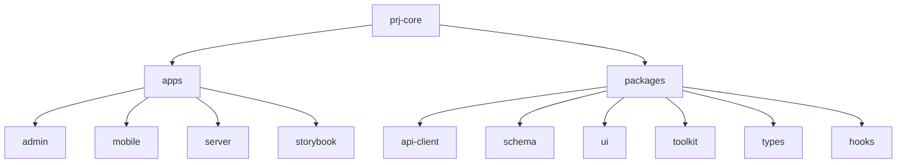
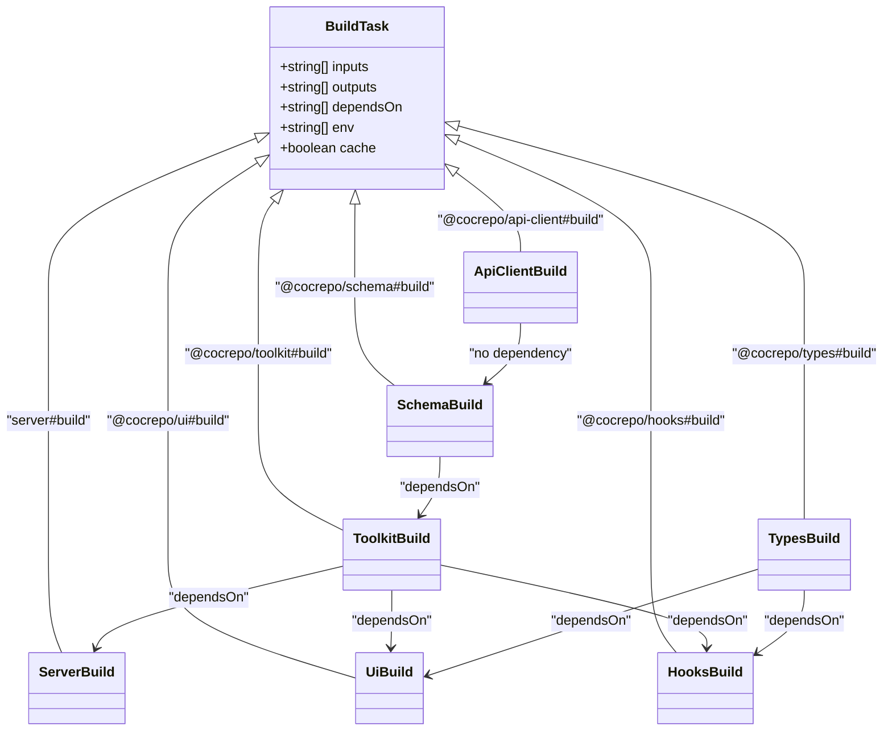
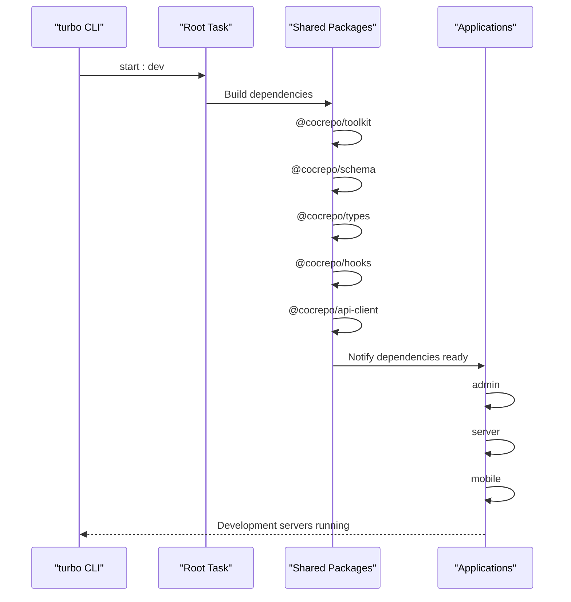
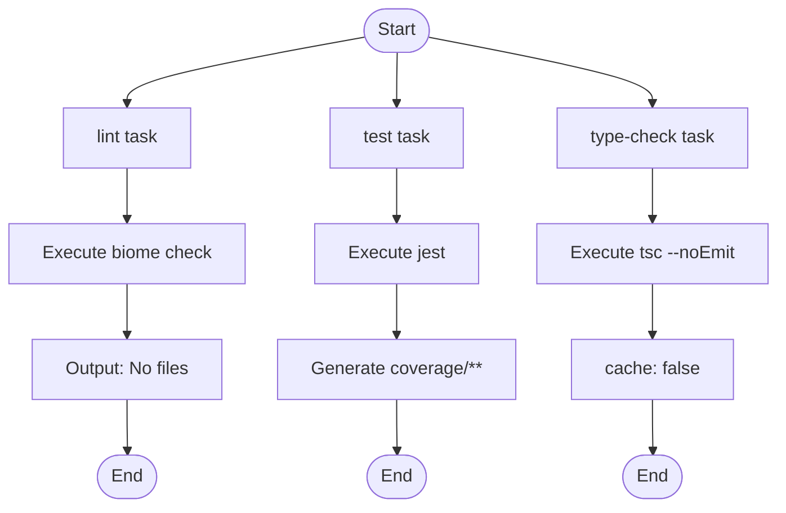
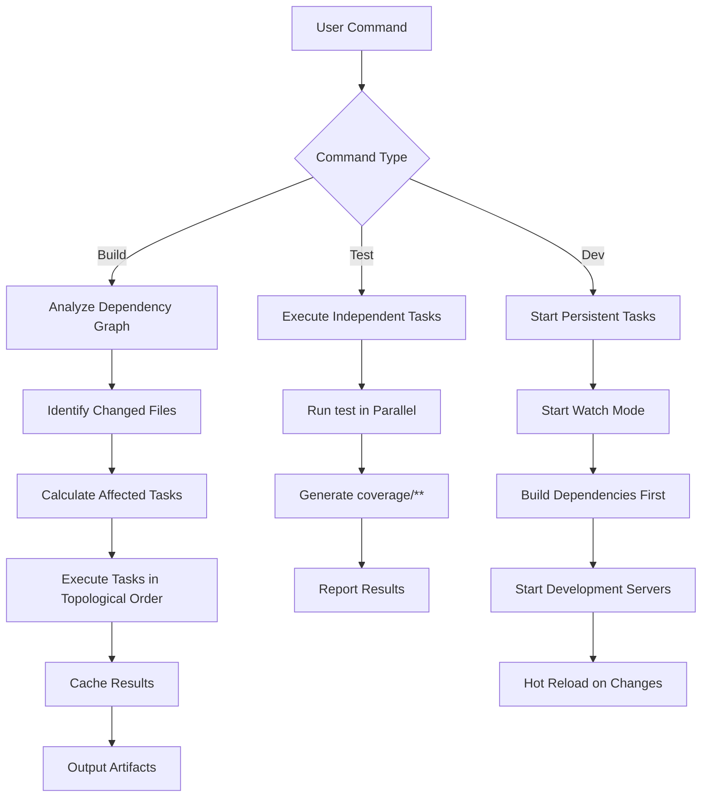
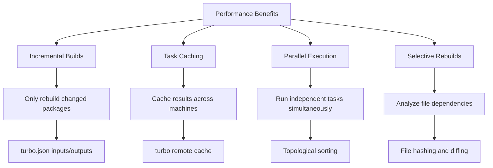
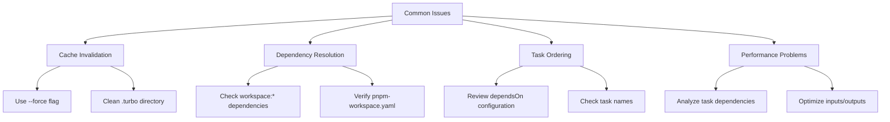

# Task Orchestration with Turborepo

<cite>
**Referenced Files in This Document**   
- [turbo.json](file://turbo.json)
- [package.json](file://package.json)
- [pnpm-workspace.yaml](file://pnpm-workspace.yaml)
- [apps/admin/package.json](file://apps/admin/package.json)
- [apps/server/package.json](file://apps/server/package.json)
- [packages/api-client/package.json](file://packages/api-client/package.json)
- [packages/schema/package.json](file://packages/schema/package.json)
- [packages/ui/package.json](file://packages/ui/package.json)
- [packages/hooks/package.json](file://packages/hooks/package.json)
</cite>

## Table of Contents
1. [Introduction](#introduction)
2. [Project Structure](#project-structure)
3. [Core Components](#core-components)
4. [Architecture Overview](#architecture-overview)
5. [Detailed Component Analysis](#detailed-component-analysis)
6. [Dependency Analysis](#dependency-analysis)
7. [Performance Considerations](#performance-considerations)
8. [Troubleshooting Guide](#troubleshooting-guide)
9. [Conclusion](#conclusion)

## Introduction
This document provides comprehensive architectural documentation for the task orchestration system in prj-core using Turborepo. The system enables efficient development workflows through intelligent caching, incremental builds, and parallel task execution across a monorepo containing multiple applications and shared packages. The configuration leverages Turborepo's capabilities to optimize build, test, lint, and development workflows while maintaining proper dependency ordering and cache invalidation strategies.

## Project Structure

The prj-core monorepo follows a standard Turborepo structure with applications and shared packages organized in dedicated directories:



**Diagram sources**
- [turbo.json](file://turbo.json#L1-L167)

**Section sources**
- [turbo.json](file://turbo.json#L1-L167)
- [pnpm-workspace.yaml](file://pnpm-workspace.yaml#L1-L59)

## Core Components

The task orchestration system in prj-core consists of several core components that work together to enable efficient development workflows. The system is configured through the turbo.json file, which defines task pipelines, dependencies, inputs, outputs, and caching behavior for various operations across the monorepo. Key components include build pipelines for applications and shared packages, testing workflows, linting and formatting tasks, and development server orchestration.

**Section sources**
- [turbo.json](file://turbo.json#L1-L167)
- [package.json](file://package.json#L1-L50)

## Architecture Overview

The Turborepo architecture in prj-core implements a sophisticated task orchestration system that optimizes development workflows through intelligent caching and dependency management. The system creates an execution graph based on package dependencies and task configurations, enabling parallel execution of independent tasks while ensuring proper ordering for dependent tasks.

```mermaid
graph TD
A[Root Tasks] --> B[build]
A --> C[test]
A --> D[lint]
A --> E[start:dev]
B --> F[Package Builds]
F --> G[api-client#build]
F --> H[schema#build]
F --> I[toolkit#build]
F --> J[server#build]
F --> K[ui#build]
F --> L[hooks#build]
F --> M[types#build]
G --> N[Inputs: src/**/*.ts, orval.config.js]
H --> O[Inputs: src/**/*.ts, tsup.config.*]
I --> P[Inputs: src/**/*.ts, tsup.config.*]
J --> Q[Inputs: src/**/*.ts, nest-cli.json]
K --> R[Inputs: src/**/*.{ts,tsx,css}]
L --> S[Inputs: src/**/*.ts]
M --> T[Inputs: src/**/*.ts]
U[Global Dependencies] --> V[.env.local]
U --> W[.env.development.local]
U --> X[pnpm-workspace.yaml]
U --> Y[pnpm-lock.yaml]
```

**Diagram sources**
- [turbo.json](file://turbo.json#L1-L167)
- [package.json](file://package.json#L1-L50)

## Detailed Component Analysis

### Task Configuration Analysis

The turbo.json configuration defines a comprehensive set of tasks for the monorepo, with specific inputs, outputs, dependencies, and caching behavior for each package and operation.

#### Build Task Configuration


**Diagram sources**
- [turbo.json](file://turbo.json#L14-L52)
- [packages/api-client/package.json](file://packages/api-client/package.json#L1-L56)
- [packages/schema/package.json](file://packages/schema/package.json#L1-L81)
- [packages/toolkit/package.json](file://packages/toolkit/package.json#L1-L56)

#### Development Workflow Configuration


**Diagram sources**
- [turbo.json](file://turbo.json#L151-L156)
- [apps/admin/package.json](file://apps/admin/package.json#L1-L69)
- [apps/server/package.json](file://apps/server/package.json#L1-L102)

#### Testing and Linting Configuration


**Diagram sources**
- [turbo.json](file://turbo.json#L115-L134)
- [package.json](file://package.json#L1-L50)

### Task Execution Flow

The task execution flow in prj-core follows a dependency-based orchestration pattern where Turborepo analyzes the dependency graph and executes tasks in the optimal order.



**Diagram sources**
- [turbo.json](file://turbo.json#L1-L167)
- [package.json](file://package.json#L1-L50)

## Dependency Analysis

The dependency graph in prj-core is carefully structured to ensure proper build ordering and efficient caching. The system uses both explicit dependencies in package.json files and implicit dependencies defined in the turbo.json configuration.

```mermaid
graph TD
A[@cocrepo/types] --> B[@cocrepo/hooks]
A --> C[@cocrepo/ui]
D[@cocrepo/toolkit] --> B
D --> C
D --> E[@cocrepo/schema]
D --> F[server]
E --> F
G[@cocrepo/api-client] --> C
G --> H[mobile]
B --> C
C --> I[admin]
F --> J[API Endpoints]
K[admin] --> L[UI Components]
M[mobile] --> N[React Components]
style A fill:#f9f,stroke:#333
style D fill:#f9f,stroke:#333
style E fill:#f9f,stroke:#333
style G fill:#f9f,stroke:#333
style B fill:#f9f,stroke:#333
style C fill:#f9f,stroke:#333
style A fill:#f9f,stroke:#333
```

**Diagram sources**
- [turbo.json](file://turbo.json#L1-L167)
- [pnpm-workspace.yaml](file://pnpm-workspace.yaml#L1-L59)

## Performance Considerations

The Turborepo configuration in prj-core includes several performance optimizations that significantly improve development workflow efficiency:



**Diagram sources**
- [turbo.json](file://turbo.json#L1-L167)
- [package.json](file://package.json#L1-L50)

## Troubleshooting Guide

Common issues and solutions for the Turborepo task orchestration system:



**Section sources**
- [turbo.json](file://turbo.json#L1-L167)
- [package.json](file://package.json#L1-L50)
- [pnpm-workspace.yaml](file://pnpm-workspace.yaml#L1-L59)

## Conclusion

The Turborepo task orchestration system in prj-core provides a robust foundation for efficient monorepo development. By leveraging intelligent caching, incremental builds, and proper dependency management, the system significantly reduces build times and improves developer productivity. The configuration supports parallel execution of independent tasks while ensuring correct ordering for dependent packages, enabling scalable development across multiple applications and shared components. The architecture is extensible, allowing for easy addition of new packages and applications with proper integration into the existing task pipelines.