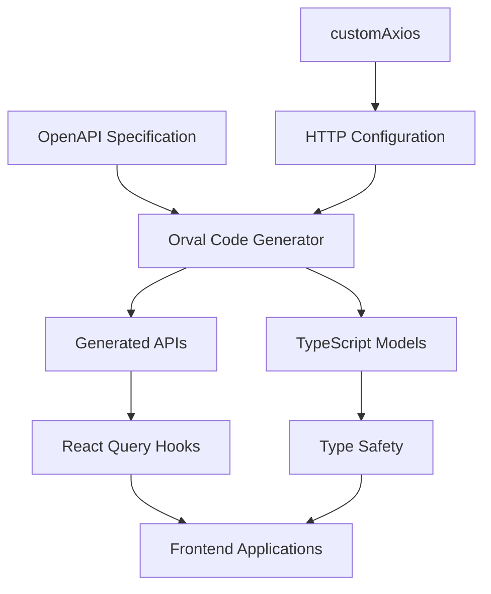
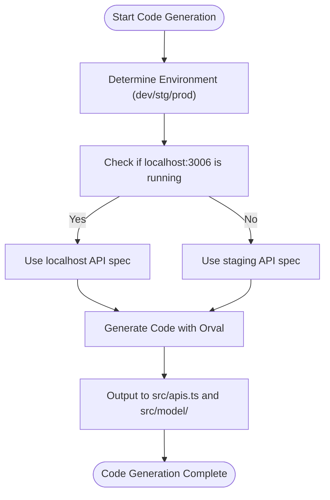
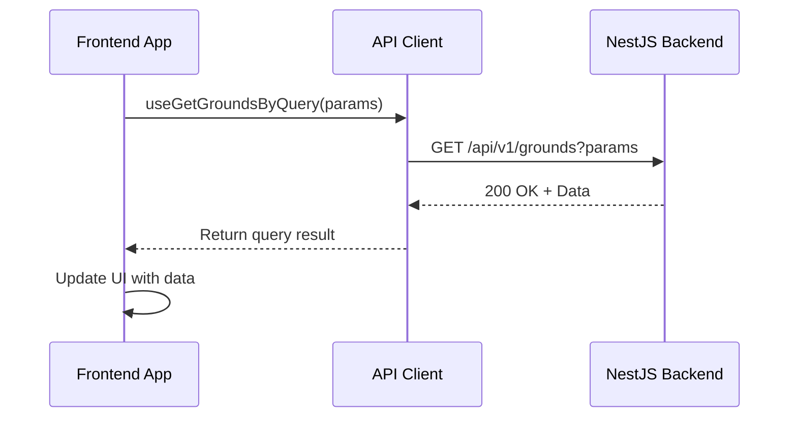

# API Client Package

<cite>
**Referenced Files in This Document**
- [package.json](file://packages/api-client/package.json)
- [orval.config.js](file://packages/api-client/orval.config.js)
- [src/index.ts](file://packages/api-client/src/index.ts)
- [src/apis.ts](file://packages/api-client/src/apis.ts)
- [src/libs/customAxios.ts](file://packages/api-client/src/libs/customAxios.ts)
- [src/model/index.ts](file://packages/api-client/src/model/index.ts)
</cite>

## Table of Contents
1. [Introduction](#introduction)
2. [Architecture Overview](#architecture-overview)
3. [Core Components](#core-components)
4. [Code Generation Workflow](#code-generation-workflow)
5. [Usage Examples](#usage-examples)
6. [Versioning and Extension Strategy](#versioning-and-extension-strategy)
7. [Troubleshooting Guide](#troubleshooting-guide)
8. [Performance Considerations](#performance-considerations)

## Introduction
The shared-api-client package in prj-core is an automatically generated API client that enables type-safe communication between frontend applications and the NestJS backend. Built using Orval, this package transforms OpenAPI specifications into TypeScript code, providing developers with strongly-typed functions for all API endpoints. The client is consumed by both the admin and mobile applications, ensuring consistency across platforms while reducing boilerplate code and preventing runtime errors through compile-time type checking.

## Architecture Overview
The API client package follows a modular architecture centered around code generation from OpenAPI specifications. At its core, Orval processes the backend's OpenAPI documentation to generate TypeScript interfaces and service functions. The architecture includes environment-specific configuration handling, HTTP client customization through Axios, and integration with React Query for data fetching and state management in frontend applications.



**Diagram sources**
- [orval.config.js](file://packages/api-client/orval.config.js)
- [src/libs/customAxios.ts](file://packages/api-client/src/libs/customAxios.ts)

**Section sources**
- [orval.config.js](file://packages/api-client/orval.config.js)
- [src/index.ts](file://packages/api-client/src/index.ts)

## Core Components

### Generated APIs and Models
The package contains two primary directories: `apis.ts` which exports all generated service functions, and `model` which contains TypeScript interfaces for all API request and response payloads. These are automatically generated from the OpenAPI specification, ensuring perfect alignment between frontend types and backend contracts.

### customAxios Configuration
The HTTP configuration is centralized in `customAxios.ts`, which creates an Axios instance with default settings including 10-second timeout and credentials support for cookie-based authentication. The configuration also includes response interceptors that handle 409 conflict errors by providing user-friendly error messages.

### Environment-Aware Code Generation
The Orval configuration (`orval.config.js`) implements a sophisticated environment detection system that automatically selects the appropriate API endpoint based on the current NODE_ENV. During development, it first checks if the local server is running and falls back to staging if unavailable, while production always uses the production endpoint.

**Section sources**
- [src/apis.ts](file://packages/api-client/src/apis.ts)
- [src/libs/customAxios.ts](file://packages/api-client/src/libs/customAxios.ts)
- [src/model/index.ts](file://packages/api-client/src/model/index.ts)
- [orval.config.js](file://packages/api-client/orval.config.js)

## Code Generation Workflow
The code generation process is triggered through npm scripts defined in package.json. Running `pnpm codegen` executes Orval with the configuration specified in `orval.config.js`. The workflow begins by determining the appropriate OpenAPI specification URL based on the current environment, then generates both API service functions and TypeScript models. The generated code is output to `src/apis.ts` and `src/model/` respectively, with React Query hooks automatically created for all endpoints.

The configuration specifies "tags-split" mode, which organizes generated code by OpenAPI tags, improving maintainability. All generated functions use the customAxios instance, ensuring consistent HTTP behavior across all requests. The generation process also creates comprehensive TypeScript types that reflect the exact structure of request and response payloads.



**Diagram sources**
- [orval.config.js](file://packages/api-client/orval.config.js)

**Section sources**
- [package.json](file://packages/api-client/package.json)
- [orval.config.js](file://packages/api-client/orval.config.js)

## Usage Examples

### Importing and Using the API Client
The API client can be imported in frontend applications using the package name `@cocrepo/api-client`. All generated service functions are available through the default export, with React Query hooks automatically provided for data fetching operations.



**Diagram sources**
- [src/apis.ts](file://packages/api-client/src/apis.ts)

### React Query Integration
The generated API client is designed to work seamlessly with React Query. For example, to fetch grounds data in a React component:

```typescript
import { useGetGroundsByQuery } from '@cocrepo/api-client';

const GroundList = () => {
  const { data, isLoading, error } = useGetGroundsByQuery({ 
    page: 1, 
    limit: 10 
  });
  
  // Handle loading, error, and data states
};
```

This approach provides automatic caching, background refetching, and optimized re-rendering based on data changes.

**Section sources**
- [src/apis.ts](file://packages/api-client/src/apis.ts)
- [src/index.ts](file://packages/api-client/src/index.ts)

## Versioning and Extension Strategy
The API client follows semantic versioning as indicated by its version number (1.3.6). Updates are triggered whenever the backend API changes, requiring regeneration of the client code. To extend the client for new endpoints, developers must first update the OpenAPI specification in the backend, then regenerate the client code using the codegen script.

The package is configured to be side-effect free, allowing for tree-shaking in frontend applications. This means only the API functions that are actually imported and used will be included in the final bundle, helping to minimize bundle size.

**Section sources**
- [package.json](file://packages/api-client/package.json)

## Troubleshooting Guide

### Type Mismatches
When encountering type mismatches between frontend and backend, ensure the API client has been regenerated after any backend API changes. Clear the build cache and reinstall dependencies if issues persist.

### Authentication Errors
Authentication errors typically occur due to missing or expired JWT tokens. Verify that the `withCredentials: true` setting in customAxios is properly sending cookies. Check that the backend authentication endpoints are correctly configured and that tokens are being properly stored.

### Regeneration Problems
If code generation fails, verify that the OpenAPI specification endpoint is accessible. Check network connectivity and ensure the backend server is running. Review the orval.config.js file for any configuration issues, particularly the environment detection logic.

**Section sources**
- [src/libs/customAxios.ts](file://packages/api-client/src/libs/customAxios.ts)
- [orval.config.js](file://packages/api-client/orval.config.js)

## Performance Considerations
The generated API client has implications for bundle size and application performance. Since all API types and functions are included in the package, lazy loading strategies should be employed in frontend applications to avoid loading unused API functions.

The use of React Query provides built-in performance optimizations including data caching, deduplication of requests, and intelligent refetching. However, developers should be mindful of the number of simultaneous queries and consider pagination for large datasets.

For production applications, code splitting can be implemented to load API client modules only when needed, reducing initial load time. The tree-shakable nature of the package supports this optimization strategy.

**Section sources**
- [package.json](file://packages/api-client/package.json)
- [src/index.ts](file://packages/api-client/src/index.ts)