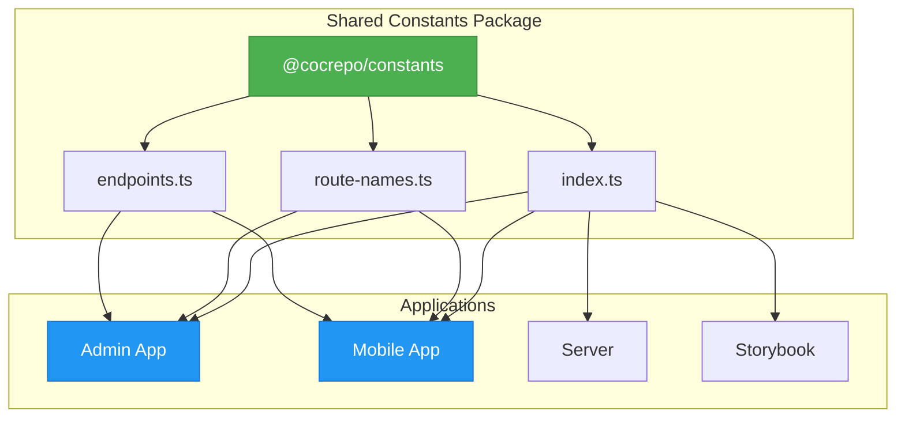
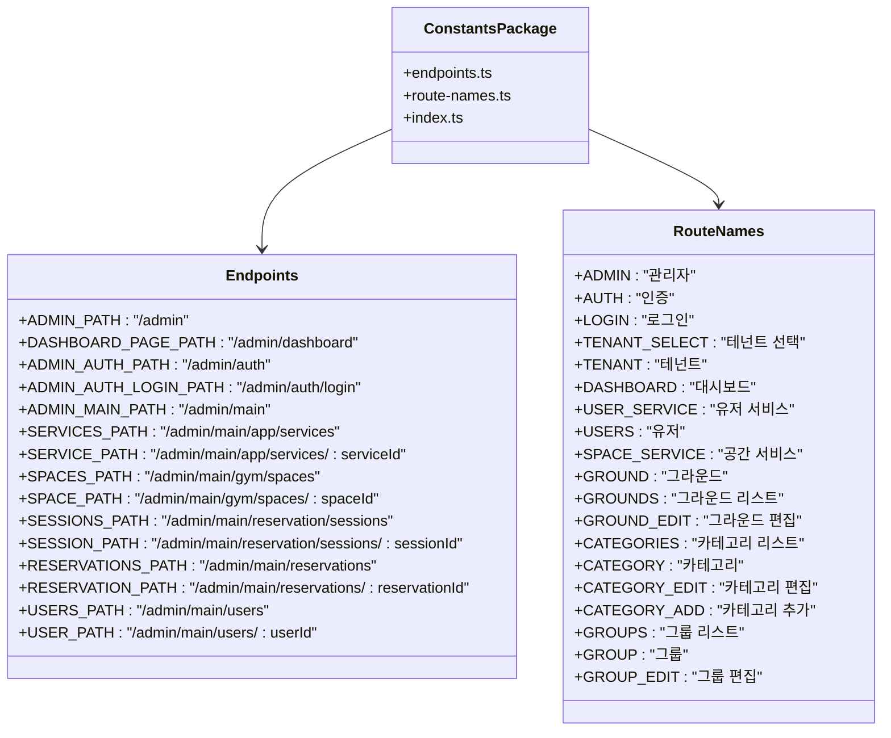
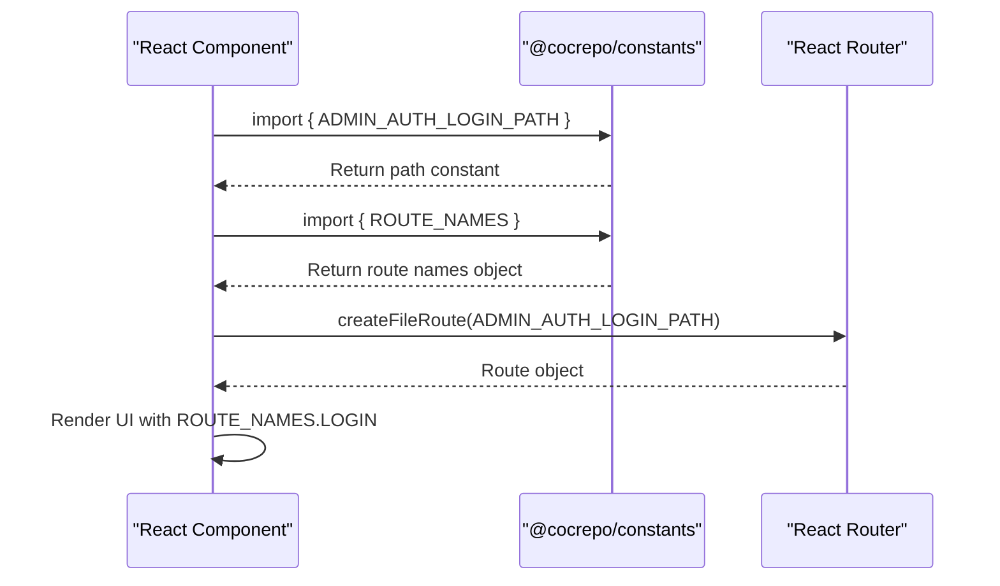

# Configuration Variables Package

<cite>
**Referenced Files in This Document**   
- [endpoints.ts](file://packages/constants/src/endpoints.ts)
- [route-names.ts](file://packages/constants/src/route-names.ts)
- [index.ts](file://packages/constants/index.ts)
- [package.json](file://packages/constants/package.json)
- [README.md](file://packages/constants/README.md)
</cite>

## Table of Contents
1. [Introduction](#introduction)
2. [Architecture Overview](#architecture-overview)
3. [Core Components](#core-components)
4. [Implementation Details](#implementation-details)
5. [Usage Examples](#usage-examples)
6. [Environment Configuration](#environment-configuration)
7. [Adding New Constants](#adding-new-constants)
8. [Troubleshooting Guide](#troubleshooting-guide)
9. [Performance Considerations](#performance-considerations)

## Introduction
The shared-vars package (published as @cocrepo/constants) serves as a centralized configuration store for shared constants across the prj-core monorepo. This package provides a single source of truth for critical application values, particularly API endpoints and route names, ensuring consistent URL management and navigation across all applications. By centralizing these values, the package eliminates the risk of broken links, inconsistent routing, and configuration mismatches that commonly occur when these values are defined in multiple locations. The package is designed with TypeScript for type safety, enabling compile-time validation of constants and preventing string-related errors. It follows a tree-shakeable module pattern, allowing applications to import only the specific constants they need, optimizing bundle size and performance.

## Architecture Overview

**Diagram sources**
- [endpoints.ts](file://packages/constants/src/endpoints.ts)
- [route-names.ts](file://packages/constants/src/route-names.ts)
- [index.ts](file://packages/constants/index.ts)

**Section sources**
- [endpoints.ts](file://packages/constants/src/endpoints.ts)
- [route-names.ts](file://packages/constants/src/route-names.ts)

## Core Components

The shared-vars package consists of two primary components that work together to provide a comprehensive configuration system. The endpoints.ts file defines all URL paths and routes used throughout the applications, organizing them hierarchically by feature area such as admin, authentication, dashboard, and various service modules. These constants use template literals to create complex paths with parameters, ensuring consistency in URL patterns across the codebase. The route-names.ts file complements this by defining human-readable names for routes, which are used in UI elements like navigation menus and breadcrumbs. This separation of concerns allows developers to use the technical path constants for routing and API calls while using the descriptive names for user-facing elements. Both files export their constants using TypeScript's const assertions, which preserves the literal types and enables better type inference throughout the codebase.

**Section sources**
- [endpoints.ts](file://packages/constants/src/endpoints.ts#L1-L103)
- [route-names.ts](file://packages/constants/src/route-names.ts#L1-L25)

## Implementation Details

The implementation leverages TypeScript's advanced type system to ensure maximum type safety and developer experience. All constants are defined as `export const` declarations, making them immutable and preventing accidental reassignment. The route names use the `as const` assertion, which tells TypeScript to treat the object as a readonly literal type rather than a mutable object, preserving the exact string values for type checking. This approach enables features like autocomplete and refactoring support in IDEs, as well as compile-time validation when these constants are used in switch statements or conditional logic. The package is built using tsup, a fast and zero-config bundler for TypeScript packages, which generates both CommonJS and ES module builds for maximum compatibility. The build process creates type declarations that preserve the exact types of the constants, ensuring that consuming applications receive the full benefits of TypeScript's type system. The package follows a flat export structure through the index.ts file, which re-exports all constants from the individual source files, providing a clean and consistent import interface.

**Diagram sources**
- [endpoints.ts](file://packages/constants/src/endpoints.ts)
- [route-names.ts](file://packages/constants/src/route-names.ts)
- [index.ts](file://packages/constants/index.ts)

**Section sources**
- [endpoints.ts](file://packages/constants/src/endpoints.ts)
- [route-names.ts](file://packages/constants/src/route-names.ts)
- [index.ts](file://packages/constants/index.ts)

## Usage Examples

Applications consume the shared constants through standard ES module imports, typically importing specific constants rather than the entire module to optimize tree-shaking. The admin application uses these constants extensively in its routing configuration, with route definitions referencing the path constants from endpoints.ts to ensure consistency across the application. For example, the login route is defined using ADMIN_AUTH_LOGIN_PATH, guaranteeing that the URL matches across all references. The mobile application similarly uses these constants for navigation and API calls, reducing the risk of broken links when routes change. Components that display navigation menus import the route names from route-names.ts to show user-friendly labels while using the corresponding path constants for the actual navigation targets. This pattern ensures that both the technical implementation and user experience remain consistent. The constants are also used in utility functions and hooks that manage application state related to routing, such as determining the active route or generating breadcrumb trails.

**Diagram sources**
- [endpoints.ts](file://packages/constants/src/endpoints.ts)
- [route-names.ts](file://packages/constants/src/route-names.ts)

**Section sources**
- [endpoints.ts](file://packages/constants/src/endpoints.ts)
- [route-names.ts](file://packages/constants/src/route-names.ts)

## Environment Configuration

The shared-vars package integrates with the build system to support environment-specific configurations, though the core implementation focuses on shared constants that remain consistent across environments. The package.json configuration specifies the build scripts that generate the distribution files, with tsup handling the compilation and bundling process. The package is configured to produce both ES modules and CommonJS modules, ensuring compatibility with different module systems and bundlers. The exports field in package.json defines the entry points for different module systems, allowing applications to import the package using standard import syntax regardless of their build configuration. The build process generates type declarations that preserve the exact types of the constants, enabling consuming applications to benefit from TypeScript's type checking. While the current implementation doesn't include environment-specific values directly in the constants files, the pattern supports this through build-time substitution or configuration files that can be imported alongside the shared constants.

**Section sources**
- [package.json](file://packages/constants/package.json)
- [tsup.config.ts](file://packages/constants/tsup.config.ts)

## Adding New Constants

When adding new endpoints or routes to maintain backward compatibility, developers should follow a structured process. First, the new constant should be added to the appropriate file (endpoints.ts for URL paths, route-names.ts for display names) using a descriptive name in uppercase with underscores. The constant should be added in a logical location within the file, grouped with related constants. For route paths that include parameters, template literals should be used with clear parameter names prefixed with a colon (e.g., ":serviceId"). After adding the constant, it will be automatically exported through the index.ts file due to the wildcard exports. Documentation should be updated in the README.md to describe the new constant and its usage. To maintain backward compatibility, deprecated constants should not be removed immediately but can be marked with comments indicating they are deprecated. The package follows semantic versioning, so breaking changes should be reserved for major version updates, while new constants can be added in minor versions.

**Section sources**
- [endpoints.ts](file://packages/constants/src/endpoints.ts)
- [route-names.ts](file://packages/constants/src/route-names.ts)
- [README.md](file://packages/constants/README.md)

## Troubleshooting Guide

Common issues with the shared-vars package typically fall into three categories: endpoint mismatches, routing errors, and configuration problems. Endpoint mismatches occur when the constants don't match the actual API endpoints or route definitions, often due to updates in one location but not the other. These can be diagnosed by checking the network requests in the browser's developer tools and comparing the requested URLs with the constants in endpoints.ts. Routing errors may manifest as 404 pages or navigation failures and are often caused by incorrect path definitions or parameter handling. These can be debugged by logging the route constants and verifying they match the route definitions in the application. Configuration problems may arise from incorrect imports or build issues, which can be identified by checking the import statements and ensuring the package is properly installed and referenced. Type errors related to the constants usually indicate a mismatch between the expected and actual types, which can be resolved by verifying the TypeScript types and ensuring proper usage of the constants.

**Section sources**
- [endpoints.ts](file://packages/constants/src/endpoints.ts)
- [route-names.ts](file://packages/constants/src/route-names.ts)
- [README.md](file://packages/constants/README.md)

## Performance Considerations

The shared-vars package is designed with performance in mind, particularly regarding bundle size and dead code elimination. The package is tree-shakeable, meaning that applications only include the constants they actually import, minimizing the impact on bundle size. This is achieved through ES module syntax and the use of named exports rather than default exports. The build process with tsup ensures that the generated code is optimized for size and performance, producing both ES module and CommonJS builds. The constants themselves have zero runtime overhead, as they are simple string values that are inlined by bundlers during the build process. Dead code elimination is supported by most modern bundlers, which can remove unused constants from the final bundle. The package avoids circular dependencies and keeps its dependencies minimal, further enhancing performance. For applications concerned about bundle size, selective imports (e.g., `import { ADMIN_AUTH_LOGIN_PATH } from "@cocrepo/constants"`) are recommended over namespace imports to ensure only the necessary code is included.

**Section sources**
- [package.json](file://packages/constants/package.json)
- [tsup.config.ts](file://packages/constants/tsup.config.ts)
- [README.md](file://packages/constants/README.md)