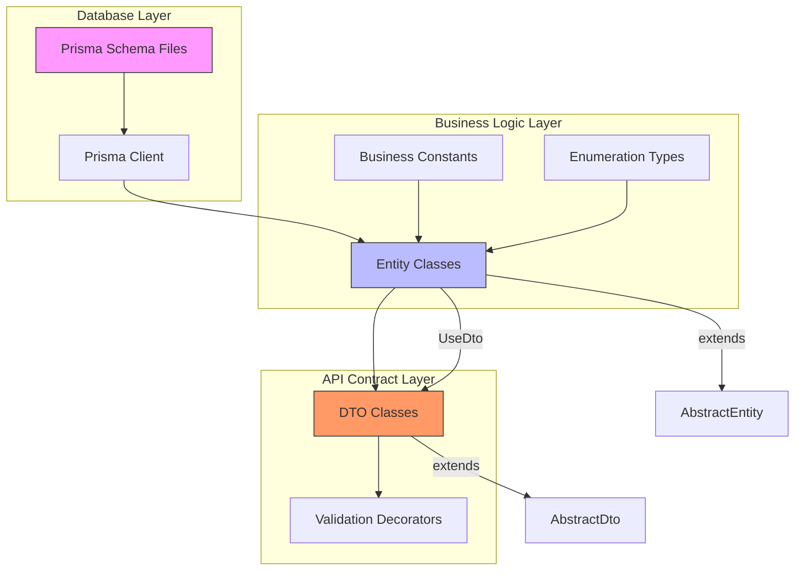
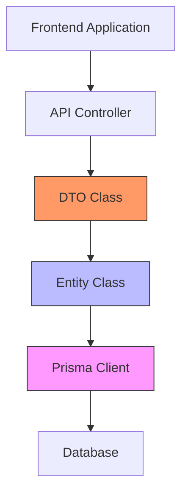
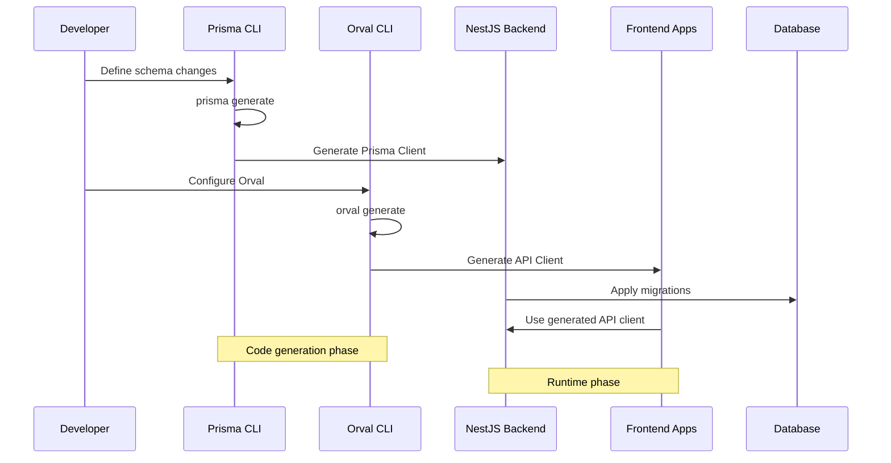

# Data Schema Package

<cite>
**Referenced Files in This Document**   
- [core.prisma](file://packages/schema/prisma/schema/core.prisma)
- [abstract.entity.ts](file://packages/schema/src/entity/abstract.entity.ts)
- [abstract.dto.ts](file://packages/schema/src/dto/abstract.dto.ts)
- [use-dto.decorator.ts](file://packages/schema/src/decorator/use-dto.decorator.ts)
- [validator.decorators.ts](file://packages/schema/src/decorator/validator.decorators.ts)
- [field.decorators.ts](file://packages/schema/src/decorator/field/index.ts)
- [prisma.config.ts](file://packages/schema/prisma.config.ts)
- [package.json](file://packages/schema/package.json)
- [seed.ts](file://packages/schema/prisma/seed.ts)
- [entity-common-fields.ts](file://packages/schema/src/constant/entity-common-fields.ts)
</cite>

## Table of Contents
1. [Introduction](#introduction)
2. [Architecture Overview](#architecture-overview)
3. [Core Components](#core-components)
4. [Implementation Details](#implementation-details)
5. [Code Generation Workflow](#code-generation-workflow)
6. [Defining New Entities](#defining-new-entities)
7. [Migration Process](#migration-process)
8. [Seed Data Management](#seed-data-management)
9. [Troubleshooting Guide](#troubleshooting-guide)
10. [Performance Considerations](#performance-considerations)

## Introduction

The shared-schema package serves as the central source of truth for data models across the prj-core monorepo. This package provides a unified schema definition that is shared between the NestJS backend and frontend applications, ensuring consistency and type safety throughout the stack. The package contains Prisma schema definitions, entity classes, DTOs (Data Transfer Objects), and business constants that define the core data structures and business logic of the application.

As the single source of truth for data models, this package enables seamless integration between services while maintaining strict type safety and data consistency. It eliminates schema drift between frontend and backend by providing a shared definition that both sides can reference, reducing bugs and improving development efficiency.

## Architecture Overview

The shared-schema package follows a layered architecture that separates concerns between database schema definition, business entities, and API contracts. This architecture enables clear separation of concerns while maintaining strong type safety across the entire stack.



**Diagram sources**
- [core.prisma](file://packages/schema/prisma/schema/core.prisma)
- [abstract.entity.ts](file://packages/schema/src/entity/abstract.entity.ts)
- [abstract.dto.ts](file://packages/schema/src/dto/abstract.dto.ts)

**Section sources**
- [core.prisma](file://packages/schema/prisma/schema/core.prisma)
- [abstract.entity.ts](file://packages/schema/src/entity/abstract.entity.ts)
- [abstract.dto.ts](file://packages/schema/src/dto/abstract.dto.ts)

## Core Components

The shared-schema package consists of several core components that work together to provide a comprehensive data modeling solution. These components include the Prisma schema that defines the database structure, entity files that extend Prisma models with business logic, DTOs for API request/response payloads, and decorators for validation and transformation.

The architecture is designed around the principle of separation of concerns, where each component has a specific responsibility. The Prisma schema defines the physical database structure, entity classes add business logic and methods to the data models, DTOs define the API contracts, and decorators provide validation and transformation rules.

```mermaid
classDiagram
class AbstractEntity {
+id : string
+seq : number
+createdAt : Date
+updatedAt : Date | null
+removedAt : Date | null
+toDto(options?) : DTO
}
class AbstractDto {
+id : string
+seq : number
+createdAt : Date
+updatedAt : Date
+removedAt : Date
}
class UserEntity {
+email : string
+firstName : string
+lastName : string
+phone : string
+isActive : boolean
+tenant : Tenant
+role : Role
+toDto() : UserDto
}
class UserDto {
+email : string
+firstName : string
+lastName : string
+phone : string
+isActive : boolean
}
class CategoryEntity {
+name : string
+type : CategoryTypes
+parentId : string
+parent : Category
+children : Category[]
+toDto() : CategoryDto
}
AbstractEntity <|-- UserEntity
AbstractEntity <|-- CategoryEntity
AbstractDto <|-- UserDto
UserEntity --> UserDto : "UseDto"
CategoryEntity --> CategoryDto : "UseDto"
note right of UserEntity
Entity classes extend AbstractEntity
and contain business logic methods
end
note right of UserDto
DTO classes extend AbstractDto
and are used for API contracts
end
```

**Diagram sources**
- [abstract.entity.ts](file://packages/schema/src/entity/abstract.entity.ts)
- [abstract.dto.ts](file://packages/schema/src/dto/abstract.dto.ts)
- [user.entity.ts](file://packages/schema/src/entity/user.entity.ts)
- [user.dto.ts](file://packages/schema/src/dto/user.dto.ts)

**Section sources**
- [abstract.entity.ts](file://packages/schema/src/entity/abstract.entity.ts)
- [abstract.dto.ts](file://packages/schema/src/dto/abstract.dto.ts)
- [entity-common-fields.ts](file://packages/schema/src/constant/entity-common-fields.ts)

## Implementation Details

### Prisma Schema Structure

The Prisma schema is organized using a multi-file approach, with domain-specific models separated into individual files. The base configuration is defined in `_base.prisma`, which contains the generator and datasource configuration, while domain models are organized in separate files such as `core.prisma`, `user.prisma`, `role.prisma`, and `space.prisma`.

This modular approach allows for better organization and maintainability of the schema, especially as the application grows in complexity. Each model follows a consistent pattern with common fields such as `id`, `seq`, `createdAt`, `updatedAt`, and `removedAt` (for soft deletes), which are mapped to database columns using the `@map` attribute.

### Entity Classes

Entity classes extend the `AbstractEntity` base class and provide a layer of business logic on top of the Prisma-generated models. The `AbstractEntity` class defines common properties and methods that are shared across all entities, including the `toDto()` method for converting entities to DTOs.



**Diagram sources**
- [abstract.entity.ts](file://packages/schema/src/entity/abstract.entity.ts)
- [use-dto.decorator.ts](file://packages/schema/src/decorator/use-dto.decorator.ts)

### DTOs and Validation

DTOs (Data Transfer Objects) are used to define the API contracts and ensure type safety between the frontend and backend. They extend the `AbstractDto` base class, which defines common properties with appropriate decorators for validation and transformation.

The package includes a comprehensive set of decorators for field validation and transformation, including:
- Field type decorators (`UUIDField`, `DateField`, `NumberField`)
- Validation decorators (`IsPassword`, `IsPhoneNumber`, `IsTmpKey`)
- Conditional validation decorators (`IsUndefinable`, `IsNullable`)

These decorators leverage the `class-validator` and `class-transformer` libraries to provide runtime validation and transformation of data.

**Section sources**
- [abstract.dto.ts](file://packages/schema/src/dto/abstract.dto.ts)
- [validator.decorators.ts](file://packages/schema/src/decorator/validator.decorators.ts)
- [field.decorators.ts](file://packages/schema/src/decorator/field/index.ts)

## Code Generation Workflow

The shared-schema package implements an automated code generation workflow that ensures consistency between the database schema and API clients. This workflow consists of several steps that are executed during development and deployment.



**Diagram sources**
- [package.json](file://packages/schema/package.json)
- [prisma.config.ts](file://packages/schema/prisma.config.ts)

The workflow begins with developers defining schema changes in the Prisma schema files. When the `prisma generate` command is executed, it generates the Prisma Client with type-safe database access methods. This client is then used by the NestJS backend services to interact with the database.

Simultaneously, Orval uses the OpenAPI specification (generated from the NestJS backend) to generate type-safe API clients for the frontend applications. This ensures that the frontend has access to the same type definitions as the backend, preventing type mismatches and improving development efficiency.

**Section sources**
- [package.json](file://packages/schema/package.json)
- [prisma.config.ts](file://packages/schema/prisma.config.ts)

## Defining New Entities

Creating a new entity in the shared-schema package follows a standardized process that ensures consistency and type safety across the stack. The process involves several steps:

1. Define the Prisma model in the appropriate schema file
2. Create the entity class that extends `AbstractEntity`
3. Create the DTO class that extends `AbstractDto`
4. Apply appropriate decorators for validation and transformation
5. Register the entity and DTO in the appropriate index files

When defining a new entity, developers should follow the established patterns for field naming, data types, and relationships. Common fields such as `id`, `seq`, `createdAt`, `updatedAt`, and `removedAt` should be included in all entities to maintain consistency.

The `UseDto` decorator is used to link entity classes with their corresponding DTO classes, enabling automatic conversion between the two. This decorator adds a reference to the DTO class on the entity's prototype, which can be used by the `toDto()` method to perform the conversion.

**Section sources**
- [abstract.entity.ts](file://packages/schema/src/entity/abstract.entity.ts)
- [abstract.dto.ts](file://packages/schema/src/dto/abstract.dto.ts)
- [use-dto.decorator.ts](file://packages/schema/src/decorator/use-dto.decorator.ts)

## Migration Process

The migration process in the shared-schema package is managed through Prisma's migration system, which provides a reliable way to evolve the database schema over time. The package includes several npm scripts to facilitate the migration process:

- `db:migrate`: Create and apply migrations during development
- `db:migrate:deploy`: Deploy migrations to production
- `db:reset`: Reset the database and re-run migrations
- `db:push`: Push schema changes to the database (development only)
- `db:pull`: Pull schema from the database (reverse engineering)

The migration process follows a standard workflow:
1. Make changes to the Prisma schema files
2. Run `pnpm db:migrate` to create a new migration
3. Review the generated SQL in the migration file
4. Apply the migration to the database
5. Update entity and DTO classes as needed

Migrations are stored in the `prisma/migrations` directory and include both a SQL file and a metadata file. This ensures that schema changes are version-controlled and can be applied consistently across different environments.

**Section sources**
- [package.json](file://packages/schema/package.json)
- [prisma.config.ts](file://packages/schema/prisma.config.ts)

## Seed Data Management

Seed data management is handled through Prisma's seeding functionality, which allows for the programmatic creation of initial data for development and testing. The package includes a `seed.ts` file that defines the seeding logic and can be executed using the `db:seed` script.

The seeding process follows these principles:
- Seed data is environment-specific and should not be used in production
- Relationships between entities are properly established during seeding
- Unique constraints are respected to prevent seeding errors
- Data is created in the correct order to satisfy foreign key constraints

The seed data is typically used to create initial users, roles, permissions, and other essential data needed for application functionality. This ensures that developers have a consistent starting point for development and testing.

**Section sources**
- [seed.ts](file://packages/schema/prisma/seed.ts)
- [package.json](file://packages/schema/package.json)

## Troubleshooting Guide

### Migration Conflicts

Migration conflicts can occur when multiple developers create migrations simultaneously. To resolve these conflicts:
1. Pull the latest changes from the main branch
2. Check if the conflicting migration has already been applied
3. If not applied, rebase your changes and recreate the migration
4. If already applied, skip creating a new migration and update your local schema

### Type Mismatches Between Layers

Type mismatches between the database layer, entity layer, and API layer can occur when changes are not properly synchronized. To prevent these issues:
1. Always run `prisma generate` after making schema changes
2. Ensure entity and DTO classes are updated to reflect schema changes
3. Verify that the Orval-generated API client matches the backend API
4. Use strict TypeScript configuration to catch type errors at compile time

### Circular Dependencies

Circular dependencies can occur when entities reference each other in a circular manner. To resolve circular dependencies:
1. Use lazy loading for relationships when possible
2. Restructure the data model to eliminate circular references
3. Use interfaces instead of concrete classes for type references
4. Move shared types to a separate file that can be imported by both entities

**Section sources**
- [abstract.entity.ts](file://packages/schema/src/entity/abstract.entity.ts)
- [abstract.dto.ts](file://packages/schema/src/dto/abstract.dto.ts)
- [package.json](file://packages/schema/package.json)

## Performance Considerations

### Database Indexing

Proper database indexing is critical for application performance. The shared-schema package should include appropriate indexes on fields that are frequently queried, such as:
- Foreign key fields
- Fields used in WHERE clauses
- Fields used in ORDER BY clauses
- Fields used in JOIN conditions

Indexes should be defined in the Prisma schema using the `@@index` and `@@unique` attributes. Care should be taken to balance query performance with write performance, as indexes can slow down INSERT, UPDATE, and DELETE operations.

### Query Optimization

Query optimization is essential for maintaining good performance as the application scales. Best practices include:
- Using Prisma's query optimization features like `select` and `include`
- Avoiding N+1 query problems by properly batching related data
- Using connection pooling to reduce database connection overhead
- Implementing caching for frequently accessed data

The entity classes can include methods that encapsulate optimized queries, making it easier for service layers to access data efficiently.

**Section sources**
- [core.prisma](file://packages/schema/prisma/schema/core.prisma)
- [abstract.entity.ts](file://packages/schema/src/entity/abstract.entity.ts)