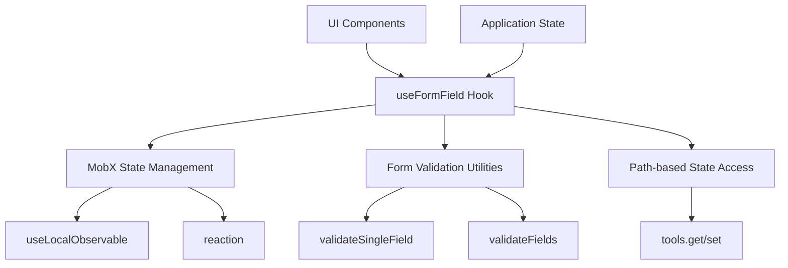
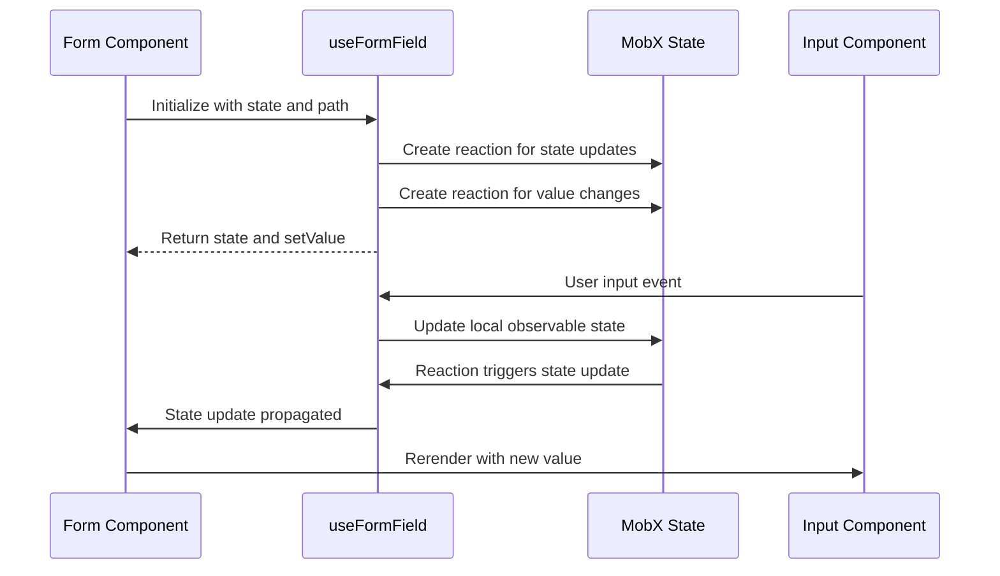

# React Hooks Package

<cite>
**Referenced Files in This Document**   
- [useFormField.ts](file://packages/hooks/src/useFormField.ts)
- [index.ts](file://packages/hooks/src/index.ts)
- [Tool.ts](file://packages/toolkit/src/Tool.ts)
- [Form.ts](file://packages/toolkit/src/Form.ts)
- [LoginForm.tsx](file://packages/ui/src/components/form/LoginForm/LoginForm.tsx)
- [AdminAuthLoginPage.tsx](file://packages/ui/src/components/page/AdminAuthLoginPage.tsx)
</cite>

## Table of Contents
1. [Introduction](#introduction)
2. [Architecture Overview](#architecture-overview)
3. [Core Components](#core-components)
4. [Implementation Details](#implementation-details)
5. [Usage Examples](#usage-examples)
6. [Creating New Custom Hooks](#creating-new-custom-hooks)
7. [Troubleshooting Guide](#troubleshooting-guide)
8. [Performance Considerations](#performance-considerations)

## Introduction
The shared-hooks package in prj-core provides a collection of custom React hooks designed to encapsulate common state logic and side effects for reuse across the admin and mobile applications. The package centers around the useFormField hook, which manages form field state, validation, and change handling in a type-safe manner. This documentation explains the architecture, implementation, and usage patterns of the useFormField hook, along with guidance for creating new custom hooks following the same patterns.

## Architecture Overview
The shared-hooks package follows a modular architecture focused on providing reusable state management utilities, with the useFormField hook as its primary component. The hook leverages MobX for state management and integrates with form validation utilities from shared-utils. The architecture enables bidirectional data binding between UI components and application state, supporting both single-path and multi-path state updates.



**Diagram sources**
- [useFormField.ts](file://packages/hooks/src/useFormField.ts)
- [Tool.ts](file://packages/toolkit/src/Tool.ts)
- [Form.ts](file://packages/toolkit/src/Form.ts)

**Section sources**
- [useFormField.ts](file://packages/hooks/src/useFormField.ts)
- [index.ts](file://packages/hooks/src/index.ts)

## Core Components
The shared-hooks package contains the useFormField hook as its primary component, which provides a type-safe interface for managing form field state and validation. The hook supports two usage patterns: single-path for direct state property binding and multi-path for complex state transformations. The implementation leverages MobX observables for efficient state management and automatic reactivity.

**Section sources**
- [useFormField.ts](file://packages/hooks/src/useFormField.ts#L12-L169)
- [index.ts](file://packages/hooks/src/index.ts#L1-L2)

## Implementation Details
The useFormField hook implements a sophisticated state management pattern using MobX observables and reactions. It creates a local observable state for the field value and establishes bidirectional synchronization with the application state through MobX reactions. For single-path usage, the hook directly synchronizes a field value with a specific path in the state object. For multi-path usage, it employs valueSplitter and valueAggregator functions to transform data between the UI representation and multiple state properties.

The hook's implementation includes several key features:
- Type-safe generics for state and value types
- Discriminated union types to differentiate between single and multi-path options
- Memoized action functions with debug names for improved development experience
- Automatic cleanup of MobX reactions in useEffect cleanup functions

```mermaid
classDiagram
class UseFormFieldOptions {
<<interface>>
+value : TValue
+state : TState
}
class UseFormFieldSingleOptions {
<<interface>>
+path : Paths<TState, 4>
}
class UseFormFieldMultiOptions {
<<interface>>
+paths : TPaths
+valueSplitter : ValueSplitter<TValue, TPaths>
+valueAggregator : ValueAggregator<TValue, TPaths>
}
class UseFormFieldReturn {
<<interface>>
+state : { value : TValue }
+setValue : (value : TValue) => void
}
UseFormFieldOptions <|-- UseFormFieldSingleOptions
UseFormFieldOptions <|-- UseFormFieldMultiOptions
UseFormFieldReturn --> UseFormFieldOptions
```

**Diagram sources**
- [useFormField.ts](file://packages/hooks/src/useFormField.ts#L12-L66)

**Section sources**
- [useFormField.ts](file://packages/hooks/src/useFormField.ts#L62-L169)

## Usage Examples
The useFormField hook is designed to be used in form components to manage field state and validation. In the admin application, it is used in the login form to manage email and password fields. The hook integrates with UI components through the path and state props, enabling declarative form state management. For complex forms with nested state structures, the multi-path variant allows a single UI component to update multiple state properties simultaneously.



**Diagram sources**
- [useFormField.ts](file://packages/hooks/src/useFormField.ts)
- [LoginForm.tsx](file://packages/ui/src/components/form/LoginForm/LoginForm.tsx)
- [AdminAuthLoginPage.tsx](file://packages/ui/src/components/page/AdminAuthLoginPage.tsx)

**Section sources**
- [LoginForm.tsx](file://packages/ui/src/components/form/LoginForm/LoginForm.tsx#L1-L32)
- [AdminAuthLoginPage.tsx](file://packages/ui/src/components/page/AdminAuthLoginPage.tsx#L1-L28)

## Creating New Custom Hooks
To create new custom hooks following the same patterns as useFormField, developers should adhere to several key principles. First, ensure proper TypeScript typing with generic parameters that support type inference. Second, follow the hook naming convention (usePrefix) and export hooks through the package index. Third, leverage existing utilities from shared-utils where appropriate, particularly for common operations like form validation. Finally, implement comprehensive tests to verify both type safety and runtime behavior.

When creating new hooks, consider the following guidelines:
- Use descriptive generic type parameters
- Provide clear JSDoc comments for all interfaces and functions
- Implement both single and multi-path variants when applicable
- Include debug names for MobX actions to aid development
- Ensure proper cleanup of side effects in useEffect cleanup functions

**Section sources**
- [useFormField.ts](file://packages/hooks/src/useFormField.ts)
- [index.ts](file://packages/hooks/src/index.ts)

## Troubleshooting Guide
Common issues when using the useFormField hook include stale closures, unnecessary re-renders, and TypeScript type errors. For stale closures, ensure that the state object reference remains stable or use appropriate dependency arrays in useEffect. For unnecessary re-renders, verify that the component is properly memoized and that the state updates are not causing excessive re-renders. For TypeScript type errors, check that the generic type parameters are correctly inferred or explicitly specified.

Specific troubleshooting steps:
- Verify that the state object is not being recreated on each render
- Check that the path string matches the actual structure of the state object
- Ensure that valueSplitter and valueAggregator functions handle edge cases correctly
- Confirm that MobX reactions are properly disposed in cleanup functions
- Validate that the tools.get and tools.set functions support the required path syntax

**Section sources**
- [useFormField.ts](file://packages/hooks/src/useFormField.ts)
- [Tool.ts](file://packages/toolkit/src/Tool.ts)

## Performance Considerations
The useFormField hook implements several performance optimizations to minimize unnecessary re-renders and computations. The setValue function is memoized using useMemo to prevent recreation on each render. MobX reactions are used to efficiently synchronize state changes without requiring manual comparison logic. The hook's dependency array in useEffect is carefully constructed to include only the necessary dependencies for proper cleanup.

Key performance considerations:
- The localState observable is created once per hook instance
- MobX reactions automatically handle change detection
- Action functions are memoized with stable dependencies
- The effect cleanup properly disposes of reactions to prevent memory leaks
- Path-based access enables fine-grained reactivity without whole-state subscriptions

**Section sources**
- [useFormField.ts](file://packages/hooks/src/useFormField.ts#L74-L83)
- [Tool.ts](file://packages/toolkit/src/Tool.ts)