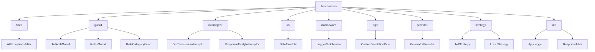
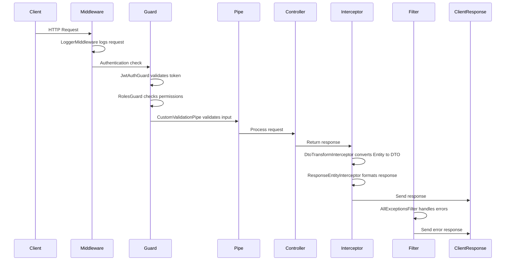
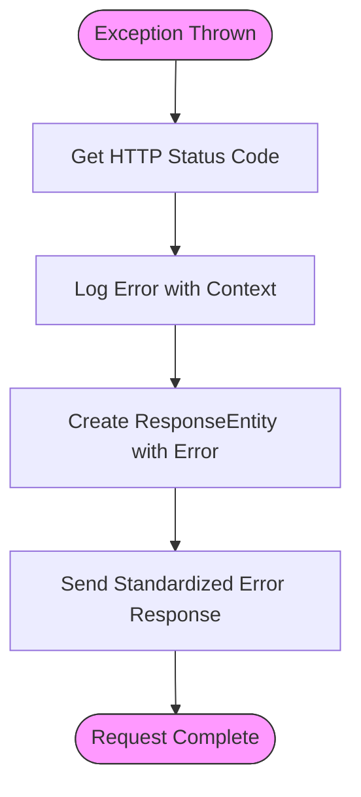
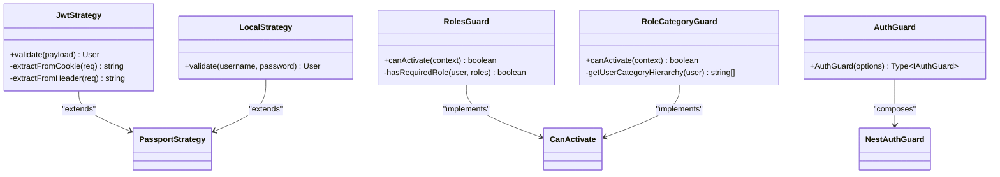
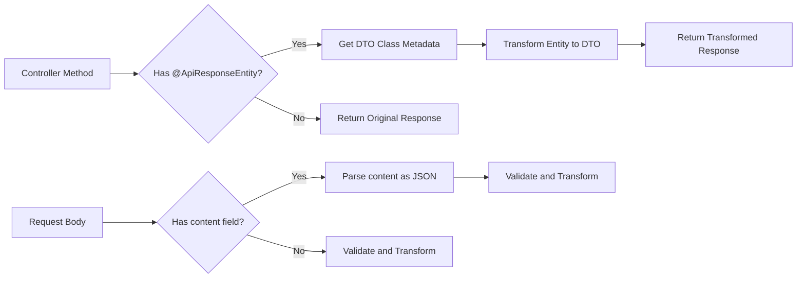
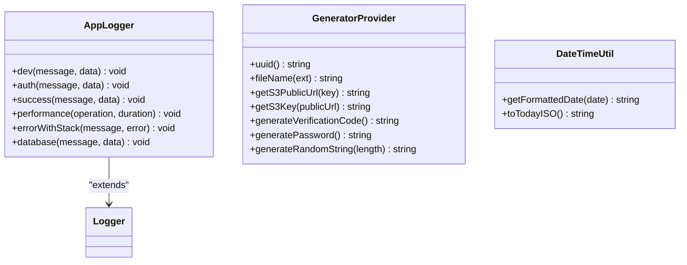
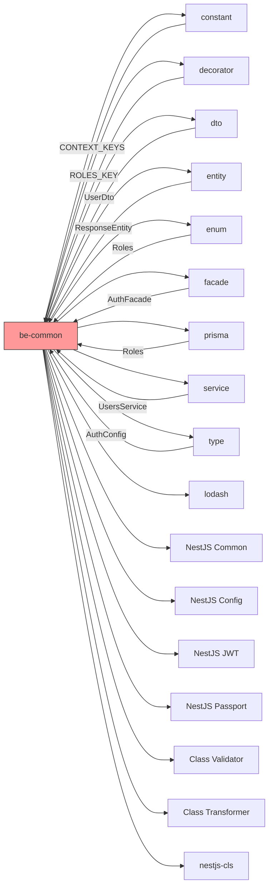

# Shared Common Package for Backend

<cite>
**Referenced Files in This Document**   
- [index.ts](file://packages/be-common/src/index.ts)
- [package.json](file://packages/be-common/package.json)
- [all-exception.filter.ts](file://packages/be-common/src/filter/all-exception.filter.ts)
- [auth.guard.ts](file://packages/be-common/src/guard/auth.guard.ts)
- [dto-transform.interceptor.ts](file://packages/be-common/src/interceptor/dto-transform.interceptor.ts)
- [data-time.util.ts](file://packages/be-common/src/lib/data-time.util.ts)
- [logger.middleware.ts](file://packages/be-common/src/middleware/logger.middleware.ts)
- [custom-validation.pipe.ts](file://packages/be-common/src/pipe/custom-validation.pipe.ts)
- [generator.provider.ts](file://packages/be-common/src/provider/generator.provider.ts)
- [app-logger.util.ts](file://packages/be-common/src/util/app-logger.util.ts)
- [response.util.ts](file://packages/be-common/src/util/response.util.ts)
- [jwt.strategy.ts](file://packages/be-common/src/strategy/jwt.strategy.ts)
- [local.strategy.ts](file://packages/be-common/src/strategy/local.strategy.ts)
- [roles.guard.ts](file://packages/be-common/src/guard/roles.guard.ts)
- [role-category.guard.ts](file://packages/be-common/src/guard/role-category.guard.ts)
</cite>

## Table of Contents
1. [Introduction](#introduction)
2. [Project Structure](#project-structure)
3. [Core Components](#core-components)
4. [Architecture Overview](#architecture-overview)
5. [Detailed Component Analysis](#detailed-component-analysis)
6. [Dependency Analysis](#dependency-analysis)
7. [Performance Considerations](#performance-considerations)
8. [Troubleshooting Guide](#troubleshooting-guide)
9. [Conclusion](#conclusion)

## Introduction
The Shared Common Package for Backend (`@cocrepo/be-common`) is a foundational utility library designed to provide reusable components across NestJS-based backend services in the project ecosystem. This package standardizes common patterns for authentication, error handling, logging, data transformation, and request processing. It serves as a centralized repository of cross-cutting concerns, ensuring consistency, reducing code duplication, and accelerating development across multiple backend applications.

The package is structured around NestJS architectural patterns including guards, filters, interceptors, pipes, and strategies, and integrates with other shared packages such as `@cocrepo/decorator`, `@cocrepo/dto`, and `@cocrepo/entity`. It plays a critical role in enforcing security policies, data integrity, and standardized response formats throughout the backend services.

## Project Structure

The `be-common` package follows a modular structure organized by functional categories. Each module encapsulates related utilities and can be imported independently.

**Diagram sources**
- [src/filter](file://packages/be-common/src/filter)
- [src/guard](file://packages/be-common/src/guard)
- [src/interceptor](file://packages/be-common/src/interceptor)
- [src/lib](file://packages/be-common/src/lib)
- [src/middleware](file://packages/be-common/src/middleware)
- [src/pipe](file://packages/be-common/src/pipe)
- [src/provider](file://packages/be-common/src/provider)
- [src/strategy](file://packages/be-common/src/strategy)
- [src/util](file://packages/be-common/src/util)

**Section sources**
- [index.ts](file://packages/be-common/src/index.ts)
- [package.json](file://packages/be-common/package.json)

## Core Components

The `be-common` package exports a comprehensive set of components that address common backend concerns. The main entry point (`index.ts`) re-exports all key modules, enabling clean and consistent imports across services. Key component categories include:

- **Decorators**: Standardized API documentation and security decorators
- **Filters**: Global exception handling with structured error responses
- **Guards**: Authentication and authorization mechanisms including role-based access control
- **Interceptors**: Automatic DTO transformation and response formatting
- **Libraries**: Utility functions for date formatting and other common operations
- **Middleware**: Request logging and context management
- **Pipes**: Input validation and content parsing
- **Providers**: Generators for UUIDs, filenames, and verification codes
- **Strategies**: Passport.js authentication strategies (JWT and local)
- **Utils**: Advanced logging, response wrapping, and transformation utilities

These components work together to create a cohesive backend development experience, ensuring that services follow consistent patterns for security, error handling, and data flow.

**Section sources**
- [index.ts](file://packages/be-common/src/index.ts)
- [package.json](file://packages/be-common/package.json)

## Architecture Overview

The `be-common` package implements a layered architecture that aligns with NestJS's dependency injection and middleware pipeline. Components are organized by their execution phase in the request lifecycle:

**Diagram sources**
- [middleware/logger.middleware.ts](file://packages/be-common/src/middleware/logger.middleware.ts)
- [guard/auth.guard.ts](file://packages/be-common/src/guard/auth.guard.ts)
- [guard/roles.guard.ts](file://packages/be-common/src/guard/roles.guard.ts)
- [pipe/custom-validation.pipe.ts](file://packages/be-common/src/pipe/custom-validation.pipe.ts)
- [interceptor/dto-transform.interceptor.ts](file://packages/be-common/src/interceptor/dto-transform.interceptor.ts)
- [interceptor/response-entity.interceptor.ts](file://packages/be-common/src/interceptor/response-entity.interceptor.ts)
- [filter/all-exception.filter.ts](file://packages/be-common/src/filter/all-exception.filter.ts)

## Detailed Component Analysis

### Exception Handling and Filtering

The `AllExceptionsFilter` provides centralized error handling across all services. It captures unhandled exceptions, logs detailed error information including stack traces in development mode, and returns standardized error responses using the `ResponseEntity` pattern from the entity package.

**Diagram sources**
- [all-exception.filter.ts](file://packages/be-common/src/filter/all-exception.filter.ts)

**Section sources**
- [all-exception.filter.ts](file://packages/be-common/src/filter/all-exception.filter.ts)

### Authentication and Authorization

The authentication system combines JWT and local strategies with a flexible guard system. The `JwtStrategy` extracts tokens from cookies or Authorization headers, while the `LocalStrategy` delegates user validation to the `AuthFacade`. Role-based access control is implemented through `RolesGuard` and `RoleCategoryGuard`, which evaluate user roles within tenant contexts.

**Diagram sources**
- [strategy/jwt.strategy.ts](file://packages/be-common/src/strategy/jwt.strategy.ts)
- [strategy/local.strategy.ts](file://packages/be-common/src/strategy/local.strategy.ts)
- [guard/roles.guard.ts](file://packages/be-common/src/guard/roles.guard.ts)
- [guard/role-category.guard.ts](file://packages/be-common/src/guard/role-category.guard.ts)
- [guard/auth.guard.ts](file://packages/be-common/src/guard/auth.guard.ts)

**Section sources**
- [strategy/jwt.strategy.ts](file://packages/be-common/src/strategy/jwt.strategy.ts)
- [strategy/local.strategy.ts](file://packages/be-common/src/strategy/local.strategy.ts)
- [guard/roles.guard.ts](file://packages/be-common/src/guard/roles.guard.ts)
- [guard/role-category.guard.ts](file://packages/be-common/src/guard/role-category.guard.ts)
- [guard/auth.guard.ts](file://packages/be-common/src/guard/auth.guard.ts)

### Data Transformation and Validation

The `DtoTransformInterceptor` automatically converts entity objects to their corresponding DTOs based on metadata from the `@ApiResponseEntity` decorator. This eliminates the need for manual transformation in controllers. The `CustomValidationPipe` extends NestJS's built-in validation pipe with additional features like content parsing and implicit type conversion.

**Diagram sources**
- [interceptor/dto-transform.interceptor.ts](file://packages/be-common/src/interceptor/dto-transform.interceptor.ts)
- [pipe/custom-validation.pipe.ts](file://packages/be-common/src/pipe/custom-validation.pipe.ts)

**Section sources**
- [interceptor/dto-transform.interceptor.ts](file://packages/be-common/src/interceptor/dto-transform.interceptor.ts)
- [pipe/custom-validation.pipe.ts](file://packages/be-common/src/pipe/custom-validation.pipe.ts)

### Utility Components

The package includes several utility components that enhance development productivity and operational visibility. The `AppLogger` class provides colored, emoji-enhanced logging with different methods for various contexts (auth, performance, database, etc.). The `GeneratorProvider` offers methods for generating UUIDs, filenames, S3 URLs, and random passwords.

**Diagram sources**
- [util/app-logger.util.ts](file://packages/be-common/src/util/app-logger.util.ts)
- [provider/generator.provider.ts](file://packages/be-common/src/provider/generator.provider.ts)
- [lib/data-time.util.ts](file://packages/be-common/src/lib/data-time.util.ts)

**Section sources**
- [util/app-logger.util.ts](file://packages/be-common/src/util/app-logger.util.ts)
- [provider/generator.provider.ts](file://packages/be-common/src/provider/generator.provider.ts)
- [lib/data-time.util.ts](file://packages/be-common/src/lib/data-time.util.ts)

## Dependency Analysis

The `be-common` package has a rich dependency graph that connects it to other shared packages and external libraries. It serves as a central integration point for the backend ecosystem.

**Diagram sources**
- [package.json](file://packages/be-common/package.json)
- [src/index.ts](file://packages/be-common/src/index.ts)

**Section sources**
- [package.json](file://packages/be-common/package.json)

## Performance Considerations

The `be-common` package includes several performance-conscious design decisions:

- The `DtoTransformInterceptor` includes error handling to ensure that transformation failures don't break the response pipeline, falling back to the original value when transformation fails.
- The `AppLogger` class conditionally enables verbose logging only in development mode, reducing log overhead in production.
- The `CustomValidationPipe` is configured with `whitelist: true` and `forbidNonWhitelisted: true` to prevent mass assignment vulnerabilities while enabling implicit type conversion for better developer experience.
- The `GeneratorProvider` uses efficient algorithms for generating random strings and passwords without external dependencies.
- The `JwtStrategy` extracts tokens from multiple sources (cookies and headers) with clear logging to aid in debugging authentication issues without compromising performance.

These components are designed to have minimal runtime overhead while providing maximum developer productivity and system reliability.

## Troubleshooting Guide

When troubleshooting issues related to the `be-common` package, consider the following common scenarios:

**Section sources**
- [strategy/jwt.strategy.ts](file://packages/be-common/src/strategy/jwt.strategy.ts)
- [filter/all-exception.filter.ts](file://packages/be-common/src/filter/all-exception.filter.ts)
- [util/app-logger.util.ts](file://packages/be-common/src/util/app-logger.util.ts)
- [interceptor/dto-transform.interceptor.ts](file://packages/be-common/src/interceptor/dto-transform.interceptor.ts)

## Conclusion

The Shared Common Package for Backend (`@cocrepo/be-common`) is a comprehensive utility library that standardizes critical backend functionality across the application ecosystem. By providing reusable components for authentication, authorization, error handling, logging, and data transformation, it ensures consistency, improves development velocity, and enhances system reliability. The package's modular design allows teams to adopt components incrementally while maintaining a cohesive architecture. Its deep integration with other shared packages and adherence to NestJS patterns makes it a foundational element of the backend infrastructure.