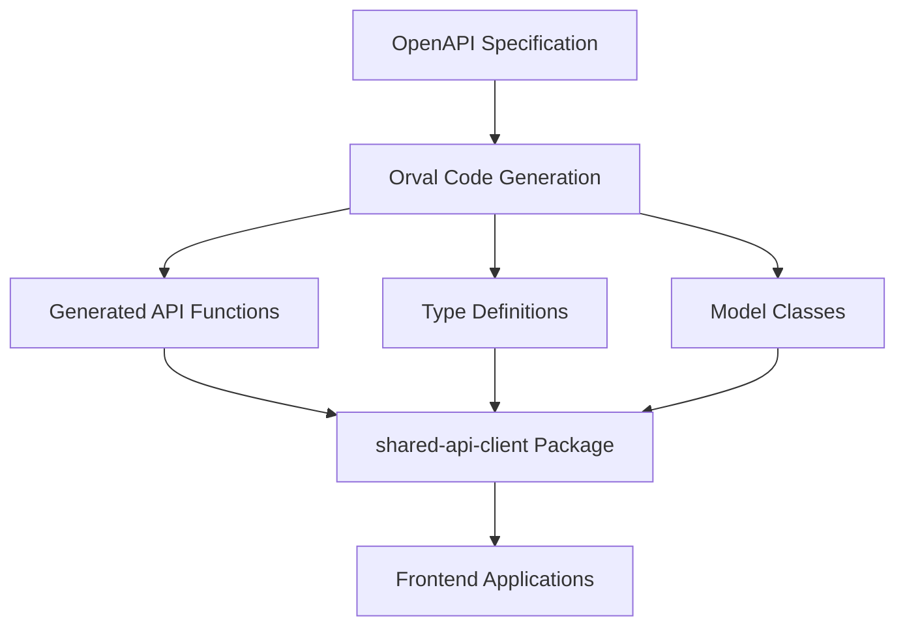
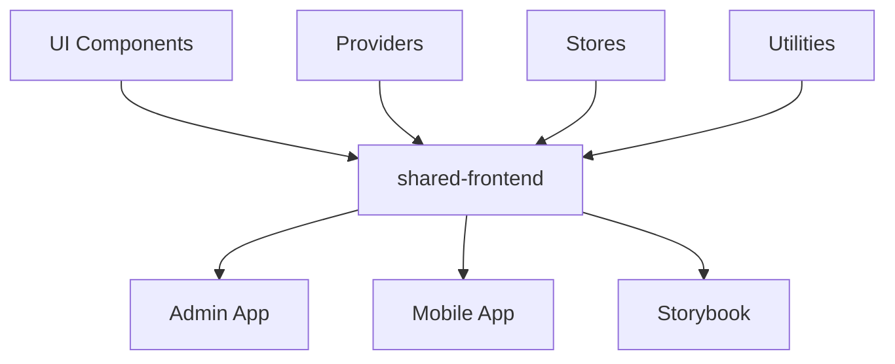
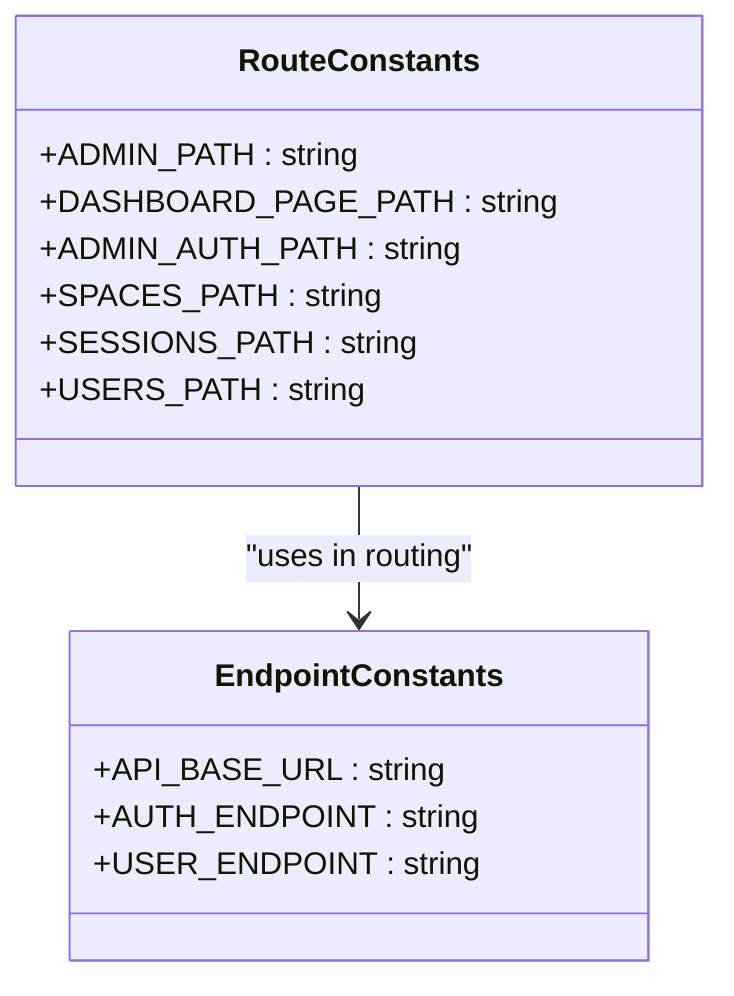
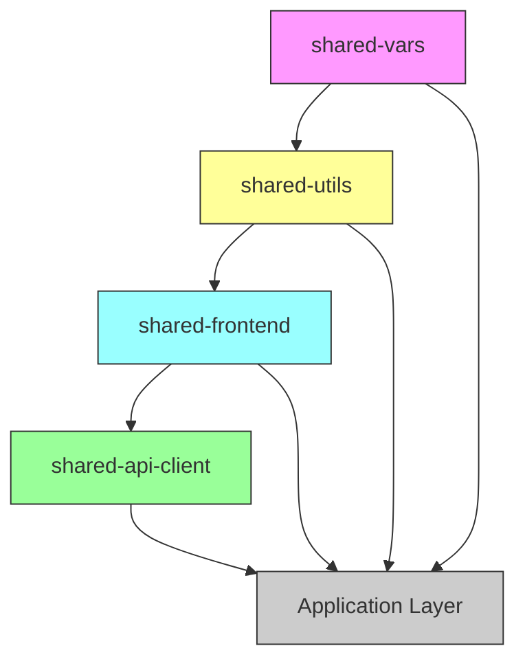

# Shared Packages

<cite>
**Referenced Files in This Document**   
- [package.json](file://packages/shared-api-client/package.json)
- [package.json](file://packages/shared-frontend/package.json)
- [package.json](file://packages/shared-utils/package.json)
- [package.json](file://packages/shared-vars/package.json)
- [index.ts](file://packages/shared-api-client/src/index.ts)
- [customAxios.ts](file://packages/shared-api-client/src/libs/customAxios.ts)
- [endpoints.ts](file://packages/shared-vars/src/endpoints.ts)
- [route-names.ts](file://packages/shared-vars/src/route-names.ts)
- [index.ts](file://packages/shared-frontend/index.ts)
- [index.ts](file://packages/shared-utils/index.ts)
</cite>

## Table of Contents
1. [Introduction](#introduction)
2. [Shared Package Overview](#shared-package-overview)
3. [Shared API Client](#shared-api-client)
4. [Shared Frontend Components](#shared-frontend-components)
5. [Shared Utilities](#shared-utilities)
6. [Shared Variables and Constants](#shared-variables-and-constants)
7. [Architecture and Integration](#architecture-and-integration)
8. [Usage Patterns](#usage-patterns)
9. [Versioning and Compatibility](#versioning-and-compatibility)
10. [Best Practices for Contribution](#best-practices-for-contribution)
11. [Troubleshooting Common Issues](#troubleshooting-common-issues)
12. [Performance Considerations](#performance-considerations)

## Introduction
The prj-core monorepo contains a collection of shared packages designed to promote code reuse, maintain consistency, and accelerate development across multiple applications. These shared packages serve as the foundation for the ecosystem, providing standardized implementations for common functionality. This document provides comprehensive documentation for the four primary shared packages: shared-api-client, shared-frontend, shared-utils, and shared-vars, detailing their architecture, implementation, usage patterns, and best practices.

## Shared Package Overview
The prj-core repository implements a monorepo architecture with several shared packages that serve distinct purposes in the application ecosystem:

- **shared-api-client**: Automatically generated API client and types from OpenAPI specifications
- **shared-frontend**: UI component library and frontend infrastructure
- **shared-utils**: Utility functions for common operations across applications
- **shared-vars**: Configuration values, constants, and environment variables

These packages are designed to be consumed by multiple applications within the ecosystem, including admin, mobile, and server applications, ensuring consistency and reducing duplication.

**Section sources**
- [package.json](file://packages/shared-api-client/package.json)
- [package.json](file://packages/shared-frontend/package.json)
- [package.json](file://packages/shared-utils/package.json)
- [package.json](file://packages/shared-vars/package.json)

## Shared API Client
The shared-api-client package provides a generated API client and TypeScript types based on OpenAPI specifications. This package enables consistent and type-safe interactions with backend services across all frontend applications.

### Purpose and Architecture
The shared-api-client is generated using Orval from OpenAPI specifications, creating a comprehensive set of API functions, models, and types. The architecture follows a code generation pattern where API endpoints are automatically transformed into TypeScript functions with proper typing.

The package exports all API functions through the main index.ts file, along with a custom Axios instance configured for the application's needs. This approach ensures that all API interactions are type-safe and consistent across the codebase.



**Diagram sources**
- [package.json](file://packages/shared-api-client/package.json)
- [index.ts](file://packages/shared-api-client/src/index.ts)

### Implementation Details
The implementation leverages Orval for code generation, configured through orval.config.js files for different environments (dev, prod, stg). The generated code includes:

- API functions for all endpoints
- TypeScript interfaces and types for request/response payloads
- Model classes for data entities
- A custom Axios instance with interceptors and configuration

The package uses @tanstack/react-query for data fetching, providing built-in support for caching, background updates, and error handling.

**Section sources**
- [package.json](file://packages/shared-api-client/package.json)
- [index.ts](file://packages/shared-api-client/src/index.ts)
- [customAxios.ts](file://packages/shared-api-client/src/libs/customAxios.ts)

### Usage Patterns
Applications consume the shared-api-client by importing the generated API functions and types:

```typescript
import { APIManager, createSessionDto } from '@cocrepo/api-client';

// Using API functions
const createSession = async (sessionData: createSessionDto) => {
  return await APIManager.postSessions(sessionData);
};
```

The package provides both direct API function access and a manager pattern through APIManager export, allowing flexibility in usage patterns.

## Shared Frontend Components
The shared-frontend package contains reusable UI components, providers, and state management utilities for frontend applications.

### Purpose and Architecture
This package serves as a component library that ensures visual and behavioral consistency across applications. It includes:

- UI components (buttons, forms, layouts, etc.)
- Context providers for application state
- MobX stores for state management
- Utility functions for frontend operations

The architecture follows a modular structure with components organized by category and providers separated for different concerns (authentication, routing, etc.).



**Diagram sources**
- [package.json](file://packages/shared-frontend/package.json)
- [index.ts](file://packages/shared-frontend/index.ts)

### Implementation Details
The implementation uses React with MobX for state management, providing observable stores for shared application state. The component library follows accessibility best practices and is designed to be themeable.

Key features include:
- Responsive design principles
- Accessibility compliance
- Theme support
- Internationalization readiness
- Storybook integration for component documentation

**Section sources**
- [package.json](file://packages/shared-frontend/package.json)
- [index.ts](file://packages/shared-frontend/index.ts)

## Shared Utilities
The shared-utils package provides utility functions for common operations across the codebase.

### Purpose and Architecture
This package contains pure functions for operations that are needed in multiple applications, including:

- Date and time manipulation
- String formatting and validation
- Path manipulation
- Browser detection
- Logging utilities
- Form validation helpers

The architecture follows a functional programming approach with small, focused utility functions that can be tree-shaken when not used.

### Implementation Details
The utilities are implemented as standalone modules, each containing related functions:

- DateTime.ts: Date formatting, parsing, and calculation utilities
- Validation.ts: Input validation functions
- Path.ts: URL and file path manipulation
- Environment.ts: Environment detection and configuration
- Logger.ts: Structured logging utilities

Each utility is thoroughly tested and documented, with type safety ensured through TypeScript.

**Section sources**
- [package.json](file://packages/shared-utils/package.json)
- [index.ts](file://packages/shared-utils/index.ts)

## Shared Variables and Constants
The shared-vars package contains configuration values, route definitions, and other constants used across applications.

### Purpose and Architecture
This package centralizes configuration values and constants to ensure consistency and ease of maintenance. It includes:

- Route path definitions
- API endpoint configurations
- Application constants
- Feature flags
- Environment-specific values

By centralizing these values, the package enables consistent routing, easier refactoring, and simplified configuration management.



**Diagram sources**
- [endpoints.ts](file://packages/shared-vars/src/endpoints.ts)
- [route-names.ts](file://packages/shared-vars/src/route-names.ts)

### Implementation Details
The implementation uses TypeScript const assertions and string literal types to ensure type safety and prevent typos. Route parameters are properly typed with placeholders (e.g., :userId) to enable type-safe routing.

The package exports constants for:
- Admin interface routes
- API endpoints
- Feature configuration
- Application settings

**Section sources**
- [endpoints.ts](file://packages/shared-vars/src/endpoints.ts)
- [route-names.ts](file://packages/shared-vars/src/route-names.ts)

## Architecture and Integration
The shared packages form a dependency hierarchy that supports the overall application architecture:



**Diagram sources**
- [package.json](file://packages/shared-api-client/package.json)
- [package.json](file://packages/shared-frontend/package.json)
- [package.json](file://packages/shared-utils/package.json)
- [package.json](file://packages/shared-vars/package.json)

The integration pattern follows these principles:
- Lower-level packages have no dependencies on higher-level packages
- Circular dependencies are strictly prohibited
- Versioning is coordinated across packages
- Breaking changes are minimized and properly documented

## Usage Patterns
### Consuming Shared Packages
Applications consume shared packages through standard npm package imports:

```typescript
// Importing from shared-api-client
import { APIManager } from '@cocrepo/api-client';

// Importing from shared-frontend
import { Button, Card } from '@cocrepo/frontend';

// Importing from shared-utils
import { formatDate, isValidEmail } from '@cocrepo/utils';

// Importing from shared-vars
import { ADMIN_PATH, USERS_PATH } from '@cocrepo/vars';
```

### Extending Shared Components
When extending shared components, follow these patterns:

```typescript
// Extending a shared component
import { Button } from '@cocrepo/frontend';

const PrimaryButton = (props) => (
  <Button variant="primary" {...props} />
);
```

## Versioning and Compatibility
### Versioning Strategy
The shared packages follow semantic versioning (semver) with the following guidelines:

- **Major version**: Breaking changes that require code modifications
- **Minor version**: New functionality in a backward-compatible manner
- **Patch version**: Backward-compatible bug fixes

### Backward Compatibility
To maintain backward compatibility:
- Deprecate rather than remove functionality
- Provide migration guides for breaking changes
- Maintain backward compatibility for at least one major version
- Use feature flags for experimental functionality

### Release Process
Packages are released using automated tooling with the following process:
1. Changes are made in the shared package
2. Tests are run to ensure functionality
3. Version is bumped according to semver
4. Package is published to the registry
5. Applications are updated to use the new version

## Best Practices for Contribution
### Code Quality
- Write comprehensive tests for new functionality
- Follow existing code style and patterns
- Document public APIs and complex logic
- Ensure type safety throughout

### Testing
- Write unit tests for utility functions
- Write integration tests for component interactions
- Test edge cases and error conditions
- Ensure test coverage meets project standards

### Documentation
- Update JSDoc comments for public APIs
- Add examples for complex functionality
- Document breaking changes in release notes
- Update README with new features

## Troubleshooting Common Issues
### Missing Type Definitions
If type definitions are not being resolved:
- Ensure the package is properly installed
- Check tsconfig.json for proper path resolution
- Verify the package exports types correctly

### Build Errors
Common build issues and solutions:
- **Module not found**: Verify package name and installation
- **Type errors**: Ensure compatible TypeScript versions
- **Tree-shaking issues**: Check package exports configuration

### Runtime Errors
Common runtime issues:
- **Undefined functions**: Verify import paths and package versions
- **Configuration errors**: Check environment-specific configurations
- **Network errors**: Verify API client configuration and endpoints

## Performance Considerations
### Bundle Size Optimization
- Use tree-shaking compatible exports
- Minimize dependencies in shared packages
- Use code splitting for large utility libraries
- Optimize component bundles

### Caching Strategies
- Implement proper caching in API client
- Use memoization for expensive utility functions
- Cache component renders with React.memo
- Implement service worker caching for static assets

### Loading Performance
- Lazy load non-essential shared components
- Code split large utility libraries
- Preload critical shared resources
- Optimize package initialization time