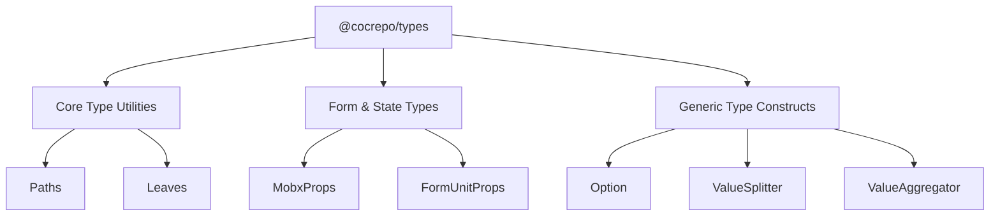
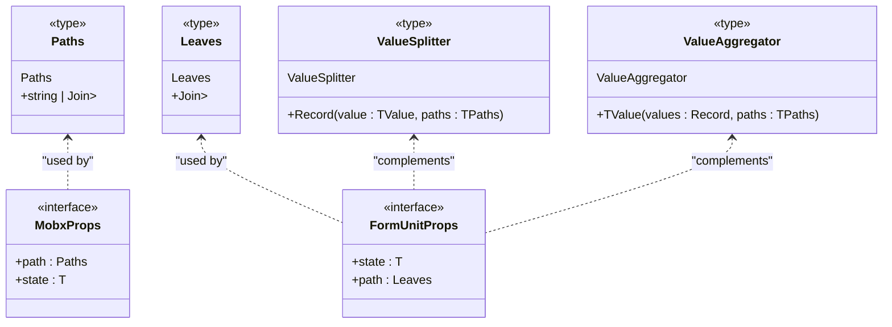
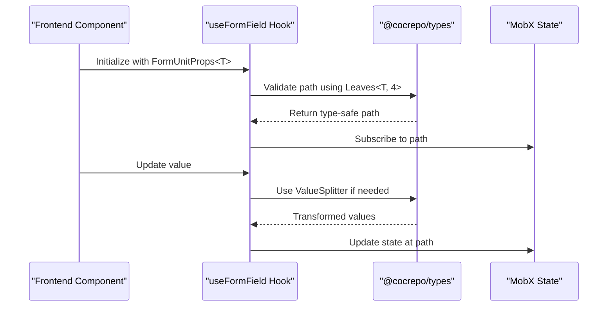

# Type Definitions Package

<cite>
**Referenced Files in This Document**   
- [index.ts](file://packages/types/src/index.ts)
- [package.json](file://packages/types/package.json)
- [README.md](file://packages/types/README.md)
- [jest-e2e.json](file://apps/server/test/jest-e2e.json)
- [types.ts](file://packages/api-client/src/types.ts)
</cite>

## Table of Contents
1. [Introduction](#introduction)
2. [Architecture Overview](#architecture-overview)
3. [Core Type Definitions](#core-type-definitions)
4. [Usage Patterns](#usage-patterns)
5. [Governance and Boundaries](#governance-and-boundaries)
6. [Troubleshooting Guide](#troubleshooting-guide)
7. [Performance Considerations](#performance-considerations)

## Introduction
The `@cocrepo/types` package serves as the foundational type definition library for the entire monorepo, providing a common vocabulary of type aliases, interfaces, and utilities that ensure consistency across all applications and services. This minimal, high-level package establishes the type foundation for the entire codebase, enabling type safety and reducing duplication through shared definitions. As the central source of truth for type definitions, it enables seamless integration between frontend components and backend services while maintaining a clear separation of concerns.

## Architecture Overview
The `@cocrepo/types` package is designed with a flat, accessible architecture centered around a single entry point in `index.ts`. This design ensures that all type definitions are easily importable from a single source while maintaining a lightweight, zero-runtime footprint. The package follows a utility-first approach, focusing on providing essential type constructs rather than domain-specific models.

**Diagram sources**
- [index.ts](file://packages/types/src/index.ts)

**Section sources**
- [index.ts](file://packages/types/src/index.ts)
- [package.json](file://packages/types/package.json)

## Core Type Definitions
The package provides a set of fundamental type definitions that address common patterns across the codebase. These definitions are framework-agnostic and can be safely imported by any package or application without introducing dependencies. The core types focus on three main categories: type utilities for nested property access, form state management, and generic value transformation.

The `Paths<T, D>` and `Leaves<T, D>` types enable type-safe access to nested properties up to a specified depth (default 4 levels), which is particularly useful for form state management and deep object manipulation. These utilities leverage TypeScript's template literal types and recursive conditional types to generate valid property path strings based on the structure of the input type.

For form and state management, the package provides `MobxProps<T>` and `FormUnitProps<T>` interfaces that define the contract for components that need to interact with deeply nested state. These types work in conjunction with the path utilities to ensure type safety when accessing and modifying state properties through string-based paths.

**Diagram sources**
- [index.ts](file://packages/types/src/index.ts)

**Section sources**
- [index.ts](file://packages/types/src/index.ts)

## Usage Patterns
The types in this package are designed to be imported using TypeScript's `import type` syntax to ensure they are erased at compile time and have zero runtime impact. This pattern is critical for maintaining the package's lightweight nature and preventing bundle bloat.

In frontend components, these types are commonly used with form libraries and state management systems to ensure type safety when working with deeply nested state structures. For example, the `FormUnitProps<T>` interface can be used to type components that need to update specific fields within a complex form state object, with the `path` property ensuring that only valid field paths are used.

Backend services leverage these types for API request and response typing, particularly when working with generic data transformation and validation logic. The utility types enable consistent typing across service layers without requiring direct dependencies on domain-specific models.

**Diagram sources**
- [index.ts](file://packages/types/src/index.ts)
- [useFormField.ts](file://packages/hooks/src/useFormField.ts)

**Section sources**
- [index.ts](file://packages/types/src/index.ts)
- [useFormField.ts](file://packages/hooks/src/useFormField.ts)

## Governance and Boundaries
The `@cocrepo/types` package follows strict governance rules regarding what types belong in this shared library versus more specialized packages. Only the most fundamental, widely-used types that are needed across multiple domains should be included here. Domain-specific types, such as entity models or API DTOs, belong in the `@cocrepo/schema` package, while API client types are maintained in the `@cocrepo/api-client` package.

This separation ensures that the type package remains minimal and focused on providing utility types rather than becoming a dumping ground for all type definitions. The package should not contain any runtime code, business logic, or domain-specific models, as these would introduce unnecessary dependencies and coupling between unrelated components.

When deciding whether a type belongs in this package, teams should consider whether the type is truly universal across the codebase and whether it represents a fundamental programming pattern rather than a domain concept. Types that are used in fewer than three distinct domains should typically be colocated with the code that uses them rather than being promoted to this shared package.

**Section sources**
- [README.md](file://packages/types/README.md)
- [package.json](file://packages/types/package.json)

## Troubleshooting Guide
Common issues with the `@cocrepo/types` package typically fall into three categories: type resolution errors, circular dependencies, and versioning conflicts. Type resolution errors often occur when the TypeScript configuration does not properly resolve the package exports, which can be fixed by ensuring the `paths` configuration in `tsconfig.json` correctly maps the package import to its source files.

Circular dependencies can arise when packages import types from each other in a circular manner. This is typically resolved by ensuring that only the most fundamental types are in `@cocrepo/types` and that domain-specific types remain in their respective packages. The use of `import type` instead of regular imports helps minimize the risk of circular dependencies by ensuring types are erased at compile time.

Versioning conflicts may occur when different packages depend on different versions of `@cocrepo/types`. In a monorepo setup with pnpm workspaces, this is typically mitigated by the workspace protocol that ensures a single version of the package is used across all applications. However, if issues arise, they can be resolved by running `pnpm install` to ensure version alignment across the workspace.

**Section sources**
- [jest-e2e.json](file://apps/server/test/jest-e2e.json)
- [README.md](file://packages/types/README.md)

## Performance Considerations
The `@cocrepo/types` package is designed with performance in mind, both in terms of type checking speed and bundle impact. Since all exports are type-only, they have zero runtime impact and do not contribute to bundle size. This makes the package safe to use extensively throughout the codebase without performance penalties.

However, complex type utilities like `Paths<T>` and `Leaves<T>` can impact TypeScript compilation speed, particularly when used with deeply nested or large types. To mitigate this, the package limits the maximum depth of nested property resolution to 4 levels by default, which provides a good balance between functionality and performance.

The package also avoids complex conditional types and distributive operations that can significantly slow down type checking. Instead, it focuses on providing straightforward utility types that are optimized for performance. Teams should be mindful of overusing advanced type manipulation patterns, as these can accumulate and slow down the overall type checking process across the monorepo.

**Section sources**
- [index.ts](file://packages/types/src/index.ts)
- [package.json](file://packages/types/package.json)