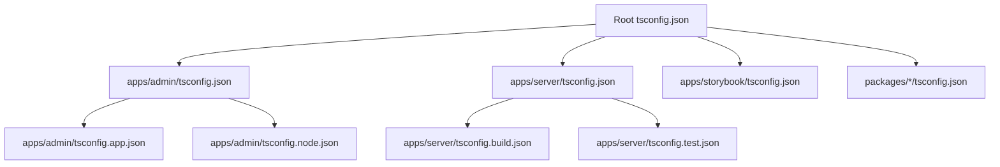
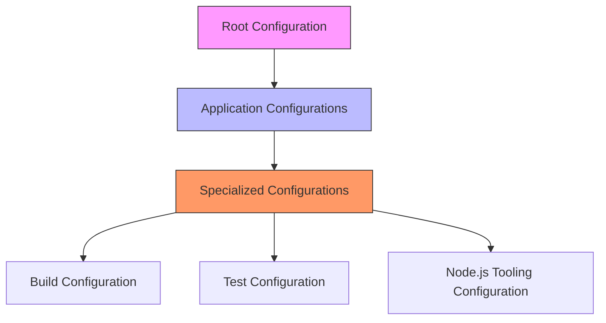
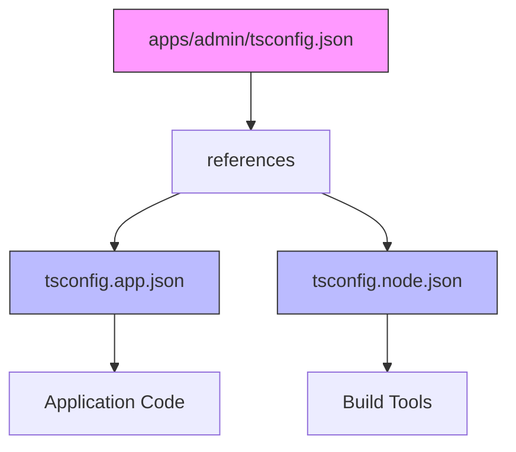
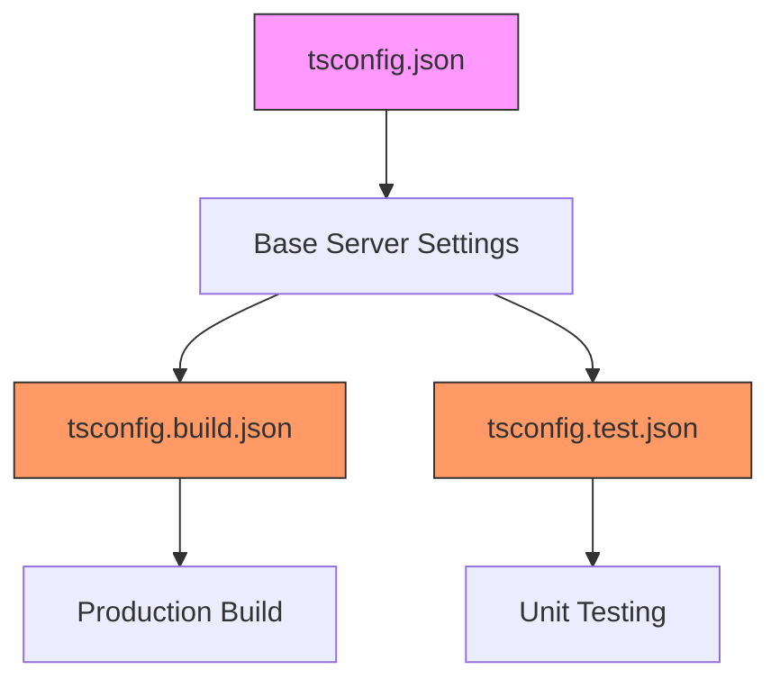
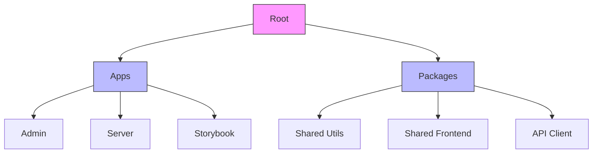

# TypeScript Configuration Package

<cite>
**Referenced Files in This Document**   
- [tsconfig.json](file://tsconfig.json)
- [apps/admin/tsconfig.json](file://apps/admin/tsconfig.json)
- [apps/admin/tsconfig.app.json](file://apps/admin/tsconfig.app.json)
- [apps/admin/tsconfig.node.json](file://apps/admin/tsconfig.node.json)
- [apps/server/tsconfig.json](file://apps/server/tsconfig.json)
- [apps/server/tsconfig.build.json](file://apps/server/tsconfig.build.json)
- [apps/server/tsconfig.test.json](file://apps/server/tsconfig.test.json)
- [packages/shared-utils/tsconfig.json](file://packages/shared-utils/tsconfig.json)
- [packages/shared-frontend/tsconfig.json](file://packages/shared-frontend/tsconfig.json)
- [packages/shared-api-client/tsconfig.json](file://packages/shared-api-client/tsconfig.json)
</cite>

## Table of Contents
1. [Introduction](#introduction)
2. [Project Structure](#project-structure)
3. [Core Components](#core-components)
4. [Architecture Overview](#architecture-overview)
5. [Detailed Component Analysis](#detailed-component-analysis)
6. [Dependency Analysis](#dependency-analysis)
7. [Performance Considerations](#performance-considerations)
8. [Troubleshooting Guide](#troubleshooting-guide)
9. [Conclusion](#conclusion)

## Introduction
The TypeScript configuration system in prj-core is designed to standardize compiler options and linting rules across all packages and applications in the monorepo, ensuring consistent code quality and type checking. While the expected shared-typescript-config package was not found in the repository, the current configuration system implements a hierarchical approach where individual projects extend base configurations to maintain consistency. This document analyzes the existing TypeScript configuration architecture, its implementation patterns, and best practices for maintaining type safety and development efficiency across the monorepo.

## Project Structure

**Diagram sources**
- [tsconfig.json](file://tsconfig.json)
- [apps/admin/tsconfig.json](file://apps/admin/tsconfig.json)
- [apps/server/tsconfig.json](file://apps/server/tsconfig.json)

**Section sources**
- [tsconfig.json](file://tsconfig.json)
- [apps/admin/tsconfig.json](file://apps/admin/tsconfig.json)
- [apps/server/tsconfig.json](file://apps/server/tsconfig.json)

## Core Components

The TypeScript configuration system in prj-core consists of multiple configuration files that work together to provide consistent type checking and compilation settings across the monorepo. The root tsconfig.json serves as the foundation, while application-specific configurations extend and specialize these settings for different environments and purposes. The system uses TypeScript's project reference feature to enable composite projects, allowing for independent compilation of different parts of the codebase while maintaining type consistency.

**Section sources**
- [tsconfig.json](file://tsconfig.json)
- [apps/admin/tsconfig.json](file://apps/admin/tsconfig.json)
- [apps/server/tsconfig.json](file://apps/server/tsconfig.json)

## Architecture Overview

The TypeScript configuration architecture follows a hierarchical pattern where specialized configurations extend more general ones. The root configuration provides basic compiler options that are inherited by all projects, while application-specific configurations add environment-specific settings. This approach enables consistent type checking across the codebase while allowing for necessary variations between different types of applications (e.g., frontend, backend, shared libraries).

**Diagram sources**
- [tsconfig.json](file://tsconfig.json)
- [apps/admin/tsconfig.json](file://apps/admin/tsconfig.json)
- [apps/admin/tsconfig.app.json](file://apps/admin/tsconfig.app.json)
- [apps/admin/tsconfig.node.json](file://apps/admin/tsconfig.node.json)
- [apps/server/tsconfig.build.json](file://apps/server/tsconfig.build.json)
- [apps/server/tsconfig.test.json](file://apps/server/tsconfig.test.json)

## Detailed Component Analysis

### Root Configuration Analysis

The root tsconfig.json file serves as the foundation for all TypeScript configurations in the monorepo. It defines basic compiler options that are inherited by all projects, ensuring consistency in type checking and code quality standards across the entire codebase.

**Section sources**
- [tsconfig.json](file://tsconfig.json)

### Application Configuration Analysis

Application-specific configurations like those in the admin and server apps use TypeScript's project reference feature to create composite projects. These configurations don't directly include files but instead reference other project configurations, allowing for better build performance and IDE support.

**Diagram sources**
- [apps/admin/tsconfig.json](file://apps/admin/tsconfig.json)
- [apps/admin/tsconfig.app.json](file://apps/admin/tsconfig.app.json)
- [apps/admin/tsconfig.node.json](file://apps/admin/tsconfig.node.json)

**Section sources**
- [apps/admin/tsconfig.json](file://apps/admin/tsconfig.json)
- [apps/admin/tsconfig.app.json](file://apps/admin/tsconfig.app.json)
- [apps/admin/tsconfig.node.json](file://apps/admin/tsconfig.node.json)

### Server Configuration Analysis

The server application implements a specialized configuration structure with separate files for different purposes. The tsconfig.build.json extends the base server configuration with additional options for production builds, while tsconfig.test.json provides settings optimized for testing environments.

**Diagram sources**
- [apps/server/tsconfig.json](file://apps/server/tsconfig.json)
- [apps/server/tsconfig.build.json](file://apps/server/tsconfig.build.json)
- [apps/server/tsconfig.test.json](file://apps/server/tsconfig.test.json)

**Section sources**
- [apps/server/tsconfig.json](file://apps/server/tsconfig.json)
- [apps/server/tsconfig.build.json](file://apps/server/tsconfig.build.json)
- [apps/server/tsconfig.test.json](file://apps/server/tsconfig.test.json)

## Dependency Analysis

The TypeScript configuration system in prj-core demonstrates a clear dependency hierarchy where specialized configurations extend more general ones. This inheritance pattern ensures consistency while allowing for necessary specialization. The use of project references in the admin application enables independent compilation of application code and build tooling, improving build performance and developer experience.

**Diagram sources**
- [tsconfig.json](file://tsconfig.json)
- [apps/admin/tsconfig.json](file://apps/admin/tsconfig.json)
- [apps/server/tsconfig.json](file://apps/server/tsconfig.json)
- [packages/shared-utils/tsconfig.json](file://packages/shared-utils/tsconfig.json)
- [packages/shared-frontend/tsconfig.json](file://packages/shared-frontend/tsconfig.json)
- [packages/shared-api-client/tsconfig.json](file://packages/shared-api-client/tsconfig.json)

**Section sources**
- [tsconfig.json](file://tsconfig.json)
- [apps/admin/tsconfig.json](file://apps/admin/tsconfig.json)
- [apps/server/tsconfig.json](file://apps/server/tsconfig.json)
- [packages/shared-utils/tsconfig.json](file://packages/shared-utils/tsconfig.json)

## Performance Considerations

The current TypeScript configuration system incorporates several performance optimizations. The use of composite projects with project references enables incremental builds and better IDE performance by allowing independent compilation of different parts of the codebase. The incremental compilation option is enabled in the server configuration, which can significantly reduce build times for large projects. Additionally, the skipLibCheck option improves compilation speed by skipping type checking of declaration files.

**Section sources**
- [apps/server/tsconfig.json](file://apps/server/tsconfig.json)
- [apps/admin/tsconfig.json](file://apps/admin/tsconfig.json)

## Troubleshooting Guide

When encountering TypeScript configuration issues in the prj-core monorepo, consider the following steps:

1. Verify that the extends chain is correctly configured and all referenced configuration files exist
2. Check for conflicting compiler options between parent and child configurations
3. Ensure that project references are properly set up in composite projects
4. Validate that paths and module resolution settings are consistent across configurations
5. Confirm that the root tsconfig.json is properly configured as the foundation for all projects

Common issues include missing file extensions in imports, incorrect path mappings, and conflicting compiler options between different configuration levels.

**Section sources**
- [tsconfig.json](file://tsconfig.json)
- [apps/admin/tsconfig.json](file://apps/admin/tsconfig.json)
- [apps/server/tsconfig.json](file://apps/server/tsconfig.json)

## Conclusion

While the expected shared-typescript-config package was not found in the repository, the prj-core monorepo implements a robust TypeScript configuration system that achieves similar goals through a hierarchical configuration approach. The system uses project references and configuration inheritance to maintain consistency across applications while allowing for necessary specialization. To improve this system, consider creating a dedicated shared-typescript-config package that contains base, react, and node configurations, which can then be published and consumed by all projects in the monorepo. This would centralize configuration management and make it easier to update TypeScript settings across the entire codebase.