# Utilities Package

<cite>
**Referenced Files in This Document**   
- [Browser.ts](file://packages/toolkit/src/Browser.ts)
- [DateTime.ts](file://packages/toolkit/src/DateTime.ts)
- [Environment.ts](file://packages/toolkit/src/Environment.ts)
- [Form.ts](file://packages/toolkit/src/Form.ts)
- [Logger.ts](file://packages/toolkit/src/Logger.ts)
- [Path.ts](file://packages/toolkit/src/Path.ts)
- [Tool.ts](file://packages/toolkit/src/Tool.ts)
- [package.json](file://packages/toolkit/package.json)
</cite>

## Table of Contents
1. [Introduction](#introduction)
2. [Architecture Overview](#architecture-overview)
3. [Core Utility Modules](#core-utility-modules)
4. [Implementation Details](#implementation-details)
5. [Usage Examples](#usage-examples)
6. [Development Guidelines](#development-guidelines)
7. [Troubleshooting Guide](#troubleshooting-guide)
8. [Performance Considerations](#performance-considerations)

## Introduction

The `@cocrepo/toolkit` package serves as a shared utilities library within the prj-core monorepo, providing consistent implementations of common operations across all applications. This package contains pure utility functions that are stateless, type-safe, and extensively tested, ensuring reliable behavior in both frontend and backend contexts. The utilities are designed to be tree-shakable, allowing applications to include only the functionality they need without increasing bundle size unnecessarily.

**Section sources**
- [package.json](file://packages/toolkit/package.json#L2-L8)

## Architecture Overview

The toolkit package is organized into specialized modules, each focusing on a specific domain of functionality. This modular architecture promotes separation of concerns and makes the utilities easy to understand and maintain. The package leverages external dependencies like `dayjs` for date manipulation and `es-toolkit` for various utility functions, while providing a consistent API layer on top.

**Diagram sources**
- [Browser.ts](file://packages/toolkit/src/Browser.ts)
- [DateTime.ts](file://packages/toolkit/src/DateTime.ts)
- [Environment.ts](file://packages/toolkit/src/Environment.ts)
- [Form.ts](file://packages/toolkit/src/Form.ts)
- [Logger.ts](file://packages/toolkit/src/Logger.ts)
- [Path.ts](file://packages/toolkit/src/Path.ts)
- [Tool.ts](file://packages/toolkit/src/Tool.ts)

**Section sources**
- [package.json](file://packages/toolkit/package.json#L32-L38)

## Core Utility Modules

### Browser Utilities

The Browser module provides functions for browser-specific operations including navigation, URL manipulation, and environment detection. These utilities include safeguards for server-side rendering by checking for the presence of browser APIs before execution.

**Section sources**
- [Browser.ts](file://packages/toolkit/src/Browser.ts#L11-L122)

### Date and Time Utilities

The DateTime module offers comprehensive date and time manipulation capabilities powered by the dayjs library. It provides functions for formatting, parsing, and manipulating dates with a consistent API that abstracts away the complexity of native JavaScript date handling.

**Section sources**
- [DateTime.ts](file://packages/toolkit/src/DateTime.ts#L3-L82)

### Environment Utilities

The Environment module enables applications to detect their current deployment environment (development, staging, or production) and access environment-specific configurations. This is particularly useful for managing different API endpoints and feature flags across environments.

**Section sources**
- [Environment.ts](file://packages/toolkit/src/Environment.ts#L23-L90)

### Form Validation Utilities

The Form module provides robust validation functions for form fields, supporting various validation rules including required fields, length constraints, numerical ranges, and pattern matching. The validation system is designed to be flexible and extensible.

**Section sources**
- [Form.ts](file://packages/toolkit/src/Form.ts#L13-L97)

### Logging Utilities

The Logger module offers a structured logging system with different log levels (info, success, warning, error, debug) and visual indicators through emoji prefixes. This enhances debuggability by providing clear visual distinction between different types of log messages.

**Section sources**
- [Logger.ts](file://packages/toolkit/src/Logger.ts#L40-L77)

### Path and URL Utilities

The Path module handles URL construction and parameter management, including template-based URL generation and query string manipulation. These utilities simplify the creation of dynamic URLs for API calls and navigation.

**Section sources**
- [Path.ts](file://packages/toolkit/src/Path.ts#L9-L49)

### General Tool Utilities

The Tool module provides general-purpose utilities for object property access, deep cloning, and array generation. These functions are particularly useful for working with nested data structures and creating ranges of numbers.

**Section sources**
- [Tool.ts](file://packages/toolkit/src/Tool.ts#L5-L42)

## Implementation Details

### Stateless and Pure Functions

All utility functions in the toolkit package are designed to be stateless and pure, meaning they have no side effects and their output depends solely on their input parameters. This design ensures predictable behavior and makes the functions easy to test and reason about.

**Diagram sources**
- [Browser.ts](file://packages/toolkit/src/Browser.ts)
- [DateTime.ts](file://packages/toolkit/src/DateTime.ts)
- [Form.ts](file://packages/toolkit/src/Form.ts)

### Type Safety

The toolkit package is implemented in TypeScript, providing strong type safety and excellent IDE support. All functions have explicit type annotations, and complex types are defined using interfaces to ensure type consistency across the codebase.

**Section sources**
- [Environment.ts](file://packages/toolkit/src/Environment.ts#L4-L9)
- [Form.ts](file://packages/toolkit/src/Form.ts#L1-L9)
- [Logger.ts](file://packages/toolkit/src/Logger.ts#L22-L32)

### Test Coverage

The toolkit package includes comprehensive test coverage for all utility functions, ensuring reliability and preventing regressions. The test suite validates both normal operation and edge cases for each function.

**Section sources**
- [Browser.test.ts](file://packages/toolkit/src/__tests__/Browser.test.ts)
- [DateTime.test.ts](file://packages/toolkit/src/__tests__/DateTime.test.ts)
- [Environment.test.ts](file://packages/toolkit/src/__tests__/Environment.test.ts)

## Usage Examples

### Frontend Usage

In frontend applications, the toolkit utilities can be used for various purposes such as form validation, date formatting, and environment-aware configuration.

```mermaid
sequenceDiagram
participant Component as "React Component"
participant FormUtil as "Form Validation"
participant DateUtil as "Date Formatting"
participant Logger as "Logging"
Component->>FormUtil : validateSingleField(value, validation)
FormUtil-->>Component : {isValid, errorMessage}
Component->>DateUtil : formatDate(date, "YYYY.MM.DD")
DateUtil-->>Component : "2023.12.25"
Component->>Logger : info("Form submitted")
Logger-->>Console : "🔍 [Component] Form submitted"
```

**Diagram sources**
- [Form.ts](file://packages/toolkit/src/Form.ts#L13-L69)
- [DateTime.ts](file://packages/toolkit/src/DateTime.ts#L8-L13)
- [Logger.ts](file://packages/toolkit/src/Logger.ts#L45-L47)

### Backend Usage

While primarily designed for frontend use, some utilities can also be employed in backend contexts, particularly for data transformation and logging.

**Section sources**
- [Tool.ts](file://packages/toolkit/src/Tool.ts#L22-L23)
- [Logger.ts](file://packages/toolkit/src/Logger.ts#L40-L77)

## Development Guidelines

### Adding New Utilities

When adding new utilities to the toolkit package, consider the following guidelines:
- Ensure the function is pure and stateless
- Provide comprehensive TypeScript type annotations
- Implement thorough test coverage
- Document the function with JSDoc comments
- Consider whether the utility is truly shared across multiple applications

**Section sources**
- [package.json](file://packages/toolkit/package.json#L19-L28)

### Maintaining Backward Compatibility

The toolkit package follows semantic versioning principles. When modifying existing functions:
- Avoid breaking changes in patch and minor releases
- Use deprecation warnings for features that will be removed
- Provide migration paths for breaking changes
- Update documentation to reflect any API changes

## Troubleshooting Guide

### Timezone Handling Issues

When working with dates, ensure consistent timezone handling by:
- Using ISO strings for data transfer
- Converting to local time only for display purposes
- Being aware of dayjs's default behavior regarding timezones

**Section sources**
- [DateTime.ts](file://packages/toolkit/src/DateTime.ts#L79-L82)

### Environment Detection Errors

If environment detection is not working correctly:
- Verify the hostname and port values being used for detection
- Check that the environment detection logic matches your deployment configuration
- Ensure the code is running in a browser context when using window.location

**Section sources**
- [Environment.ts](file://packages/toolkit/src/Environment.ts#L24-L39)

### Validation Edge Cases

Common validation edge cases include:
- Empty strings vs. null/undefined values
- Number parsing from string inputs
- Regular expression pattern matching with special characters

**Section sources**
- [Form.ts](file://packages/toolkit/src/Form.ts#L20-L29)

## Performance Considerations

### Function Optimization

The utility functions are designed to be lightweight and efficient. However, when using them in performance-critical paths:
- Cache results of expensive operations
- Avoid unnecessary function calls in loops
- Use the most specific utility function for your needs

### Tree Shaking

The toolkit package is designed to support tree shaking, allowing bundlers to eliminate unused code. To maximize tree shaking benefits:
- Import only the specific functions you need
- Avoid importing the entire module when possible
- Use ES6 module syntax for better static analysis

**Section sources**
- [package.json](file://packages/toolkit/package.json#L13-L17)