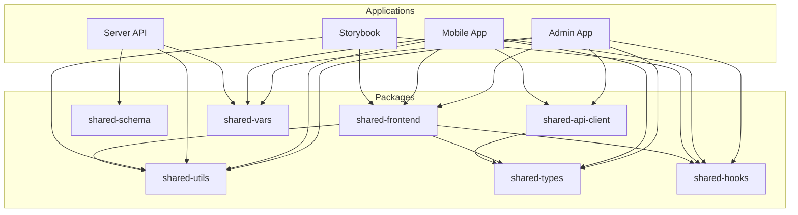
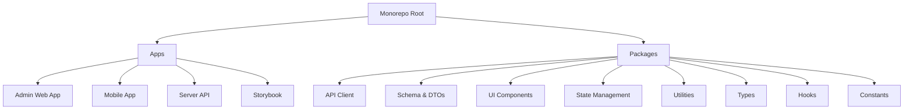
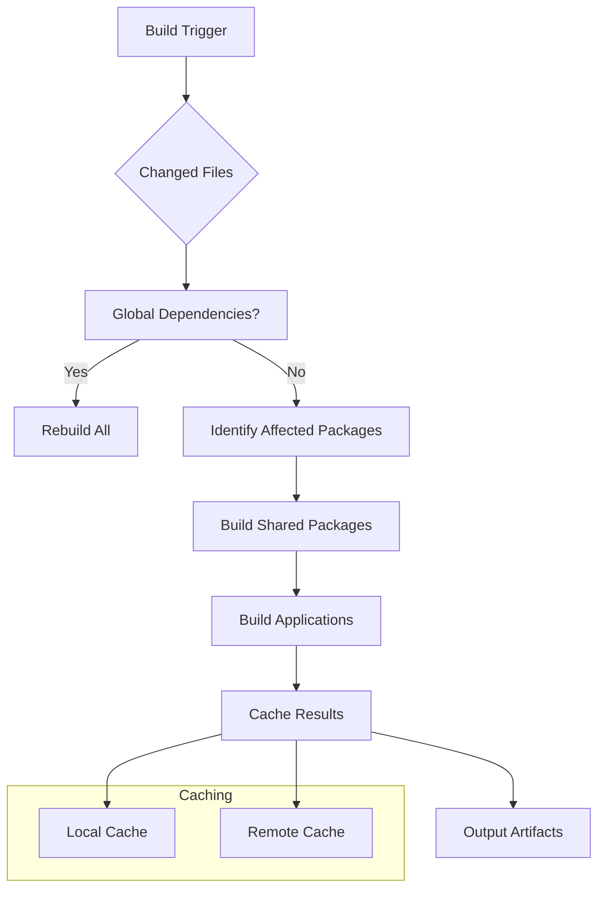
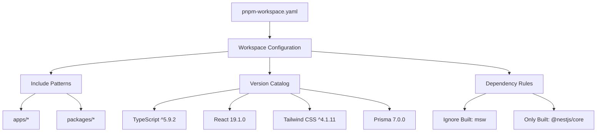
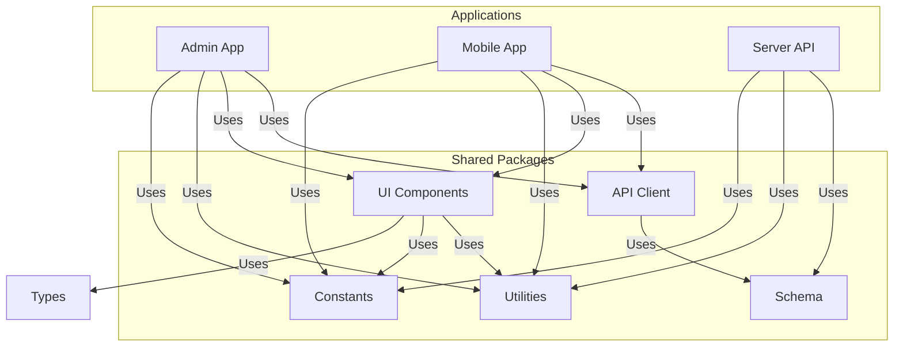
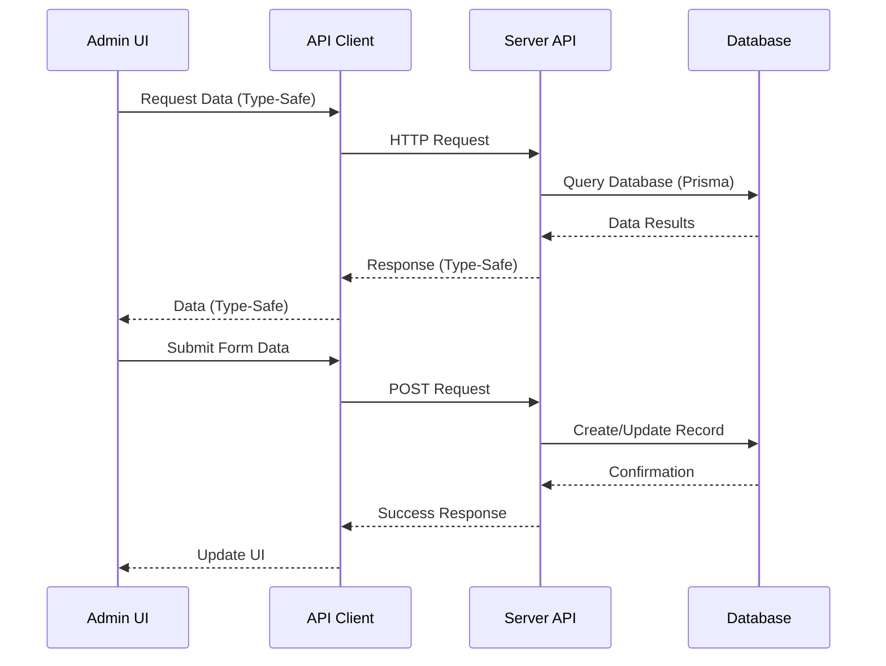
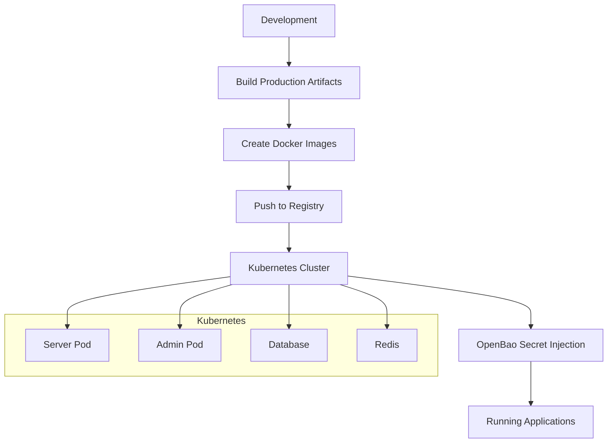
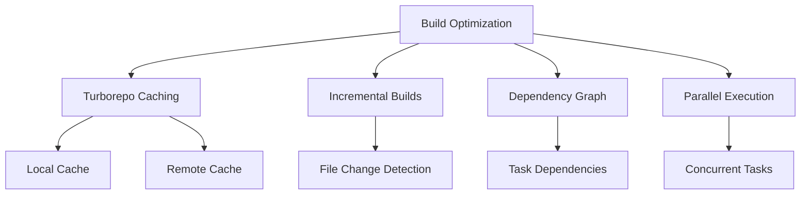

# Architecture Overview

<cite>
**Referenced Files in This Document**   
- [package.json](file://package.json)
- [turbo.json](file://turbo.json)
- [pnpm-workspace.yaml](file://pnpm-workspace.yaml)
- [README.md](file://README.md)
- [apps/admin/package.json](file://apps/admin/package.json)
- [apps/server/package.json](file://apps/server/package.json)
- [apps/storybook/package.json](file://apps/storybook/package.json)
- [packages/shared-api-client/package.json](file://packages/shared-api-client/package.json)
- [packages/shared-schema/package.json](file://packages/shared-schema/package.json)
- [packages/shared-frontend/package.json](file://packages/shared-frontend/package.json)
- [packages/shared-utils/package.json](file://packages/shared-utils/package.json)
- [packages/shared-vars/package.json](file://packages/shared-vars/package.json)
</cite>

## Table of Contents
1. [Introduction](#introduction)
2. [Project Structure](#project-structure)
3. [Monorepo Architecture](#monorepo-architecture)
4. [Task Orchestration with Turborepo](#task-orchestration-with-turborepo)
5. [Package Management with pnpm Workspaces](#package-management-with-pnpm-workspaces)
6. [Component Interactions](#component-interactions)
7. [Data Flows and Integration Patterns](#data-flows-and-integration-patterns)
8. [Technology Stack](#technology-stack)
9. [Infrastructure and Deployment](#infrastructure-and-deployment)
10. [Cross-Cutting Concerns](#cross-cutting-concerns)
11. [Scalability and Performance](#scalability-and-performance)
12. [Conclusion](#conclusion)

## Introduction
The prj-core monorepo architecture is designed as a modern full-stack reservation platform supporting multiple domains such as fitness, hair salons, and massage services. This architecture leverages Turborepo for task orchestration and pnpm workspaces for package management, enabling efficient code sharing, type safety, and streamlined development workflows. The system follows domain-driven design principles with a focus on extensibility, type safety, and code reusability across applications.

**Section sources**
- [README.md](file://README.md#L1-L50)

## Project Structure
The prj-core monorepo follows a well-organized structure with clear separation between applications and shared packages. The architecture consists of three main application layers (admin, mobile, server) and multiple shared packages that facilitate code reuse and maintain consistency across the codebase.

**Diagram sources**
- [README.md](file://README.md#L117-L203)
- [package.json](file://package.json)

**Section sources**
- [README.md](file://README.md#L117-L203)

## Monorepo Architecture
The prj-core monorepo implements a comprehensive architecture that enables code sharing, type safety, and efficient development workflows across multiple applications. The architecture is built around several core principles:

- **Domain Independence**: Designed to support various business domains including fitness, hair salons, and massage services
- **End-to-End Type Safety**: Achieved through TypeScript and Prisma integration
- **Maximum Code Reuse**: Shared packages contain reusable components, utilities, and types
- **Extensibility**: Multi-tenant architecture allows for infinite scaling

The architecture consists of applications in the `apps/` directory and shared packages in the `packages/` directory. This separation ensures that business logic and UI components can be shared across applications while maintaining clear boundaries between concerns.

**Diagram sources**
- [README.md](file://README.md#L117-L203)
- [package.json](file://package.json)

**Section sources**
- [README.md](file://README.md#L26-L44)

## Task Orchestration with Turborepo
Turborepo serves as the task orchestrator for the prj-core monorepo, providing efficient build caching, task dependency management, and parallel execution capabilities. The configuration in `turbo.json` defines a sophisticated dependency graph that ensures tasks are executed in the correct order with maximum efficiency.

Key features of the Turborepo configuration include:

- **Global Dependencies**: Configuration files like `.env.local`, `pnpm-workspace.yaml`, and `pnpm-lock.yaml` are monitored for changes
- **Task Dependencies**: Explicit dependencies between tasks ensure proper build ordering
- **Caching**: Build results are cached to improve performance
- **Persistent Tasks**: Development servers run as persistent tasks

The build pipeline is optimized with dependency-aware execution, where shared packages are built before applications that depend on them. For example, the server application depends on the schema and toolkit packages, ensuring they are built first.

**Diagram sources**
- [turbo.json](file://turbo.json#L1-L167)
- [package.json](file://package.json#L7-L37)

**Section sources**
- [turbo.json](file://turbo.json#L1-L167)

## Package Management with pnpm Workspaces
The prj-core monorepo utilizes pnpm workspaces for efficient package management, enabling shared dependencies and version control across packages. The `pnpm-workspace.yaml` configuration defines the workspace structure, including all applications and packages.

Key aspects of the pnpm workspace configuration:

- **Workspace Patterns**: Includes all apps and packages using glob patterns
- **Version Catalog**: Centralized dependency management with version aliases
- **Dependency Optimization**: Configuration to ignore certain built dependencies while including others

The version catalog feature allows for consistent dependency versions across the monorepo, reducing version conflicts and simplifying dependency updates. This approach ensures that all packages and applications use compatible versions of shared dependencies.

**Diagram sources**
- [pnpm-workspace.yaml](file://pnpm-workspace.yaml#L1-L59)

**Section sources**
- [pnpm-workspace.yaml](file://pnpm-workspace.yaml#L1-L59)

## Component Interactions
The prj-core architecture features a well-defined component interaction model that promotes loose coupling and high cohesion. Applications interact with shared packages through clearly defined interfaces, while shared packages maintain independence from application-specific logic.

The interaction model follows a dependency inversion principle, where higher-level modules define abstractions that lower-level modules implement. This allows for flexible composition and easy testing.

**Diagram sources**
- [README.md](file://README.md#L164-L203)
- [apps/admin/package.json](file://apps/admin/package.json)
- [apps/server/package.json](file://apps/server/package.json)

**Section sources**
- [apps/admin/package.json](file://apps/admin/package.json)
- [apps/server/package.json](file://apps/server/package.json)

## Data Flows and Integration Patterns
The prj-core architecture implements several integration patterns to manage data flow between components. The system follows a layered architecture with clear separation between presentation, business logic, and data access layers.

Key data flow patterns include:

- **API Client Generation**: OpenAPI specifications are used to generate type-safe API clients
- **State Management**: MobX and React Query provide client-side state management
- **Server-Side Data Access**: Prisma ORM handles database interactions with type safety
- **Event-Driven Communication**: Limited event-driven patterns for cross-component communication

The data flow typically follows a request-response pattern, where UI components request data through API clients, which communicate with the server API. The server processes requests, interacts with the database through Prisma, and returns responses to the client.

**Diagram sources**
- [packages/shared-api-client/src/apis.ts](file://packages/shared-api-client/src/apis.ts)
- [apps/server/src/main.ts](file://apps/server/src/main.ts)
- [packages/shared-schema/prisma/schema.prisma](file://packages/shared-schema/prisma/schema.prisma)

**Section sources**
- [packages/shared-api-client/package.json](file://packages/shared-api-client/package.json)
- [packages/shared-schema/package.json](file://packages/shared-schema/package.json)

## Technology Stack
The prj-core monorepo leverages a modern technology stack designed for type safety, performance, and developer experience. The stack is carefully selected to provide end-to-end TypeScript support and efficient development workflows.

### Frontend Technologies
- **Framework**: React 19 with Vite as the build tool
- **Routing**: TanStack Router for type-safe routing
- **State Management**: MobX and Valtio for reactive state
- **Data Fetching**: TanStack Query for server state management
- **UI Components**: HeroUI component library
- **Styling**: Tailwind CSS with utility-first approach
- **Animations**: Framer Motion for smooth animations
- **DnD**: dnd-kit for drag and drop functionality

### Backend Technologies
- **Framework**: NestJS 11 for Node.js backend
- **Runtime**: Node.js 20+
- **Language**: TypeScript 5.8
- **ORM**: Prisma 7 for database access
- **Database**: PostgreSQL 14+
- **Authentication**: Passport.js with JWT
- **Authorization**: CASL for fine-grained permissions
- **Validation**: class-validator for DTO validation
- **API Docs**: Swagger for OpenAPI documentation

### DevOps & Tools
- **Monorepo**: Turborepo for task orchestration
- **Package Manager**: pnpm 10.16
- **Linter**: Biome for linting and formatting
- **Testing**: Jest and Vitest for unit and integration tests
- **Secret Management**: OpenBao for environment variables
- **Storybook**: Storybook 9 for UI component documentation

**Section sources**
- [README.md](file://README.md#L71-L115)

## Infrastructure and Deployment
The prj-core architecture is designed for containerized deployment using Docker, with support for both development and production environments. The deployment topology follows modern cloud-native principles.

Key infrastructure components include:

- **Containerization**: Docker for packaging applications
- **Orchestration**: Kubernetes for container orchestration
- **Secret Management**: OpenBao for secure environment variable management
- **CI/CD**: Automated build and deployment pipelines

The deployment process involves building production artifacts using Turborepo, creating Docker images for each application, and deploying to Kubernetes clusters. Environment variables are securely managed through OpenBao, which injects them at deployment time.

**Diagram sources**
- [README.md](file://README.md#L418-L427)
- [apps/server/Dockerfile](file://apps/server/Dockerfile)

**Section sources**
- [README.md](file://README.md#L418-L427)

## Cross-Cutting Concerns
The prj-core architecture addresses several cross-cutting concerns to ensure consistency and maintainability across the codebase.

### Shared Configuration
Shared configuration is managed through dedicated packages:
- `shared-vars`: Contains endpoint URLs and route names
- `shared-schema`: Contains database configuration and environment variables
- Centralized configuration reduces duplication and ensures consistency

### Environment Management
Environment management follows a multi-layered approach:
- Development: Local `.env` files
- Production: OpenBao for secure secret management
- Configuration is injected at runtime, with sensible defaults

### Build Optimization
Build optimization is achieved through:
- Turborepo's caching mechanism
- Incremental builds based on file changes
- Dependency-aware task execution
- Parallel task execution where possible

**Diagram sources**
- [turbo.json](file://turbo.json)
- [packages/shared-vars/src/endpoints.ts](file://packages/shared-vars/src/endpoints.ts)
- [packages/shared-vars/src/route-names.ts](file://packages/shared-vars/src/route-names.ts)

**Section sources**
- [turbo.json](file://turbo.json)
- [packages/shared-vars/package.json](file://packages/shared-vars/package.json)

## Scalability and Performance
The prj-core architecture is designed with scalability and performance as key considerations. The multi-tenant design allows for infinite scaling of business domains, while the monorepo structure ensures consistent performance optimizations across applications.

Key scalability features:
- **Multi-Tenancy**: Support for multiple independent business tenants
- **Horizontal Scaling**: Stateless services that can be easily scaled
- **Database Optimization**: Prisma with PostgreSQL for efficient data access
- **Caching**: Multiple layers of caching at build and runtime

Performance considerations include:
- **Bundle Optimization**: Code splitting and tree shaking
- **Type Safety**: Compile-time checks to prevent runtime errors
- **Efficient Builds**: Turborepo's incremental build system
- **Monitoring**: Pino for high-performance logging

The architecture balances developer experience with production performance, ensuring that the system can handle growth while maintaining development velocity.

**Section sources**
- [README.md](file://README.md#L43-L44)
- [turbo.json](file://turbo.json)
- [apps/server/package.json](file://apps/server/package.json)

## Conclusion
The prj-core monorepo architecture represents a modern approach to full-stack application development, combining the benefits of monorepo organization with sophisticated tooling for task orchestration and package management. By leveraging Turborepo and pnpm workspaces, the architecture achieves high levels of code reuse, type safety, and development efficiency.

The component interaction model promotes loose coupling and high cohesion, while the data flow patterns ensure type safety from frontend to backend. The technology stack is carefully selected to provide end-to-end TypeScript support and excellent developer experience.

For deployment, the architecture embraces containerization and cloud-native principles, with Docker and Kubernetes enabling scalable and reliable production deployments. Cross-cutting concerns like configuration management and build optimization are addressed through dedicated packages and tooling.

Overall, the prj-core architecture provides a solid foundation for building and maintaining complex, multi-domain applications with a focus on extensibility, type safety, and developer productivity.