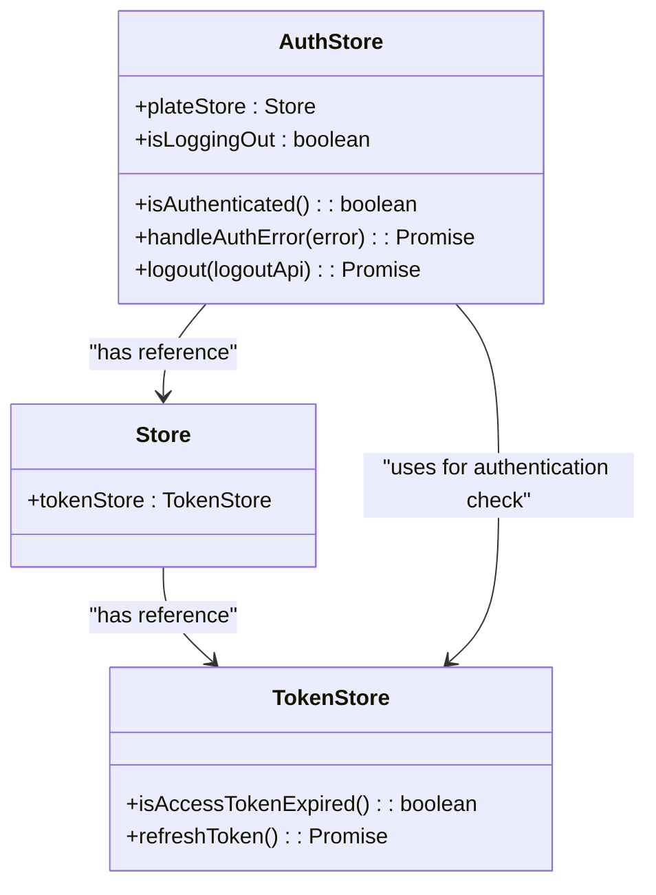
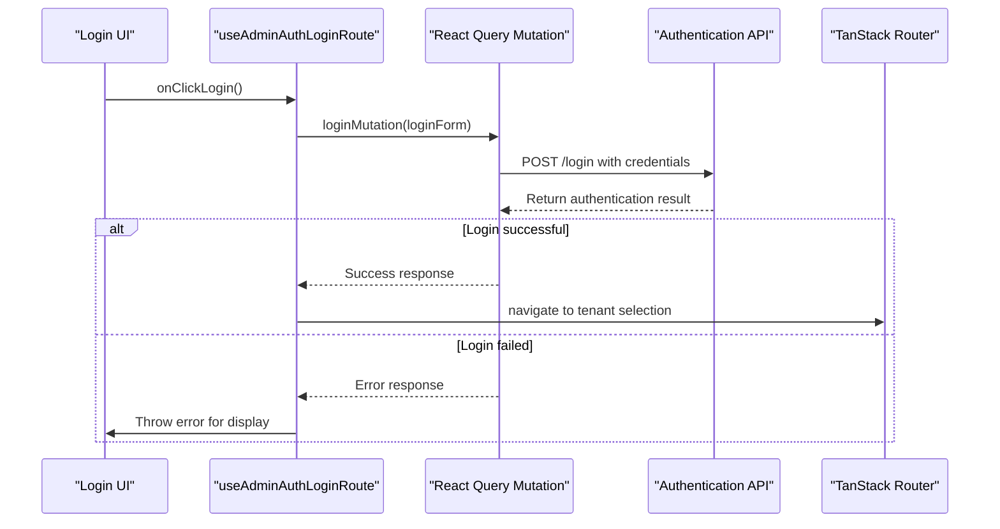
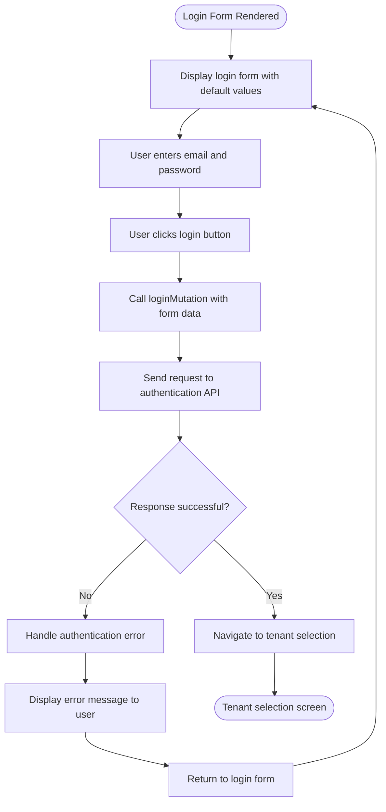
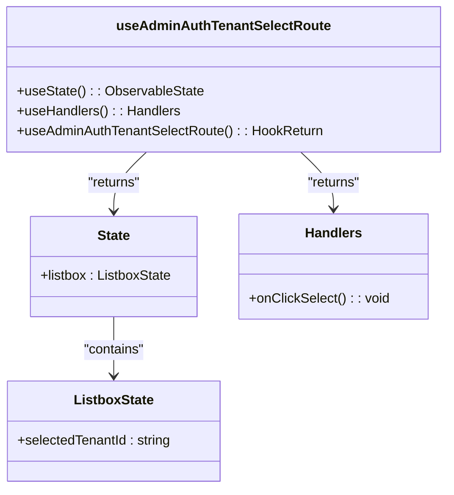
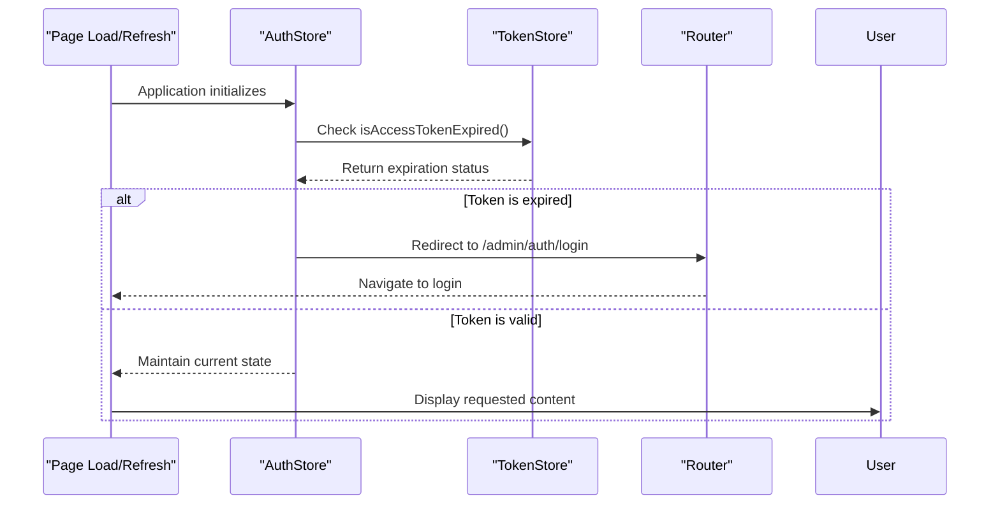
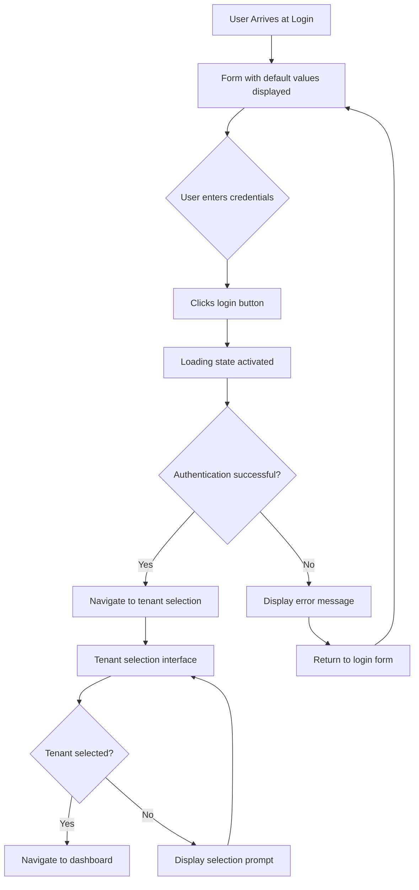

# Admin Authentication Flow

<cite>
**Referenced Files in This Document**   
- [useAdminLoginRoute.ts](file://apps/admin/src/hooks/useAdminLoginRoute.ts)
- [useAdminTenantSelectRoute.ts](file://apps/admin/src/hooks/useAdminTenantSelectRoute.ts)
- [auth.tsx](file://apps/admin/src/routes/admin/auth.tsx)
- [dashboard.tsx](file://apps/admin/src/routes/admin/dashboard.tsx)
- [App.tsx](file://apps/admin/src/App.tsx)
- [main.tsx](file://apps/admin/src/main.tsx)
- [authStore.ts](file://packages/store/src/stores/authStore.ts)
- [Providers.tsx](file://apps/admin/src/providers/Providers.tsx)
</cite>

## Table of Contents
1. [Introduction](#introduction)
2. [Authentication State Management](#authentication-state-management)
3. [Login Process Initiation](#login-process-initiation)
4. [Login Form Implementation](#login-form-implementation)
5. [Tenant Selection Process](#tenant-selection-process)
6. [Authentication Persistence and Synchronization](#authentication-persistence-and-synchronization)
7. [Protected Routes and Access Control](#protected-routes-and-access-control)
8. [UI/UX Considerations](#uiux-considerations)
9. [Conclusion](#conclusion)

## Introduction
This document provides a comprehensive overview of the authentication flow in the admin application. It details how users authenticate, how authentication state is managed, and how access to protected resources is enforced. The documentation covers the implementation of login functionality, tenant selection, state persistence, and security measures across the application.

## Authentication State Management

The authentication state in the admin application is managed through a MobX-based store architecture. The `AuthStore` class is responsible for maintaining the authentication state and handling authentication-related operations such as logout and error handling. The store integrates with the `tokenStore` to determine authentication status based on access token validity.



**Diagram sources**
- [authStore.ts](file://packages/store/src/stores/authStore.ts#L8-L83)

**Section sources**
- [authStore.ts](file://packages/store/src/stores/authStore.ts#L8-L83)
- [main.tsx](file://apps/admin/src/main.tsx#L1-L17)

## Login Process Initiation

The login process is initiated through the `useAdminAuthLoginRoute` hook, which orchestrates the authentication workflow. This hook manages the login form state, handles the login mutation, and coordinates navigation to subsequent steps in the authentication flow. The hook uses React Query's `useMutation` for handling the login API call and integrates with TanStack Router for navigation.



**Diagram sources**
- [useAdminLoginRoute.ts](file://apps/admin/src/hooks/useAdminLoginRoute.ts#L12-L77)

**Section sources**
- [useAdminLoginRoute.ts](file://apps/admin/src/hooks/useAdminLoginRoute.ts#L1-L77)
- [auth.tsx](file://apps/admin/src/routes/admin/auth.tsx#L1-L16)

## Login Form Implementation

The login form implementation follows a structured pattern using React hooks to separate concerns between state, actions, and handlers. The form includes built-in validation through the API client and error handling for authentication failures. The implementation uses MobX observable state to manage form data and React Query for mutation handling.



**Diagram sources**
- [useAdminLoginRoute.ts](file://apps/admin/src/hooks/useAdminLoginRoute.ts#L12-L77)

**Section sources**
- [useAdminLoginRoute.ts](file://apps/admin/src/hooks/useAdminLoginRoute.ts#L7-L77)
- [auth.tsx](file://apps/admin/src/routes/admin/auth.tsx#L3-L15)

## Tenant Selection Process

After successful authentication, users are directed to the tenant selection process via the `useAdminAuthTenantSelectRoute` hook. This hook manages the state for tenant selection, including tracking the currently selected tenant. The implementation provides a foundation for selecting from multiple available tenants after initial authentication.



**Diagram sources**
- [useAdminTenantSelectRoute.ts](file://apps/admin/src/hooks/useAdminTenantSelectRoute.ts#L4-L27)

**Section sources**
- [useAdminTenantSelectRoute.ts](file://apps/admin/src/hooks/useAdminTenantSelectRoute.ts#L1-L27)

## Authentication Persistence and Synchronization

Authentication state is persisted and synchronized across page reloads through a combination of HTTP-only cookies and client-side state management. The application uses the `AuthStore` to check authentication status on each request and automatically redirect unauthenticated users to the login page. The store integrates with the router to ensure consistent state across navigation events.

When a user's access token expires or a 401 unauthorized response is received, the application automatically redirects to the login page. This ensures that stale authentication states are properly handled and users are prompted to re-authenticate when necessary.



**Diagram sources**
- [authStore.ts](file://packages/store/src/stores/authStore.ts#L38-L49)
- [main.tsx](file://apps/admin/src/main.tsx#L1-L17)

**Section sources**
- [authStore.ts](file://packages/store/src/stores/authStore.ts#L38-L49)
- [main.tsx](file://apps/admin/src/main.tsx#L1-L17)
- [App.tsx](file://apps/admin/src/App.tsx#L1-L22)

## Protected Routes and Access Control

Protected routes in the admin application are enforced through a combination of route-level protection and global error handling. The `AuthStore` intercepts 401 unauthorized responses and automatically redirects users to the login page. This ensures that unauthorized access attempts are handled consistently across the application.

The dashboard route serves as an example of a protected route that requires authentication. Users must complete the login and tenant selection process before accessing the dashboard and its sub-routes. The application's routing structure separates public authentication routes from protected administrative routes.

```mermaid
graph TD
A[/admin/auth] --> B[/admin/auth/login]
A --> C[/admin/auth/login/tenant-select]
D[/admin/dashboard] --> E[/admin/dashboard/user-service/users]
D --> F[/admin/dashboard/space-service/grounds]
D --> G[/admin/dashboard/space-service/categories]
style A fill:#f9f,stroke:#333
style D fill:#bbf,stroke:#333
subgraph "Public Routes"
A
B
C
end
subgraph "Protected Routes"
D
E
F
G
end
H[AuthStore] --> |Redirects unauthenticated| A
H --> |Allows access to| D
```

**Diagram sources**
- [dashboard.tsx](file://apps/admin/src/routes/admin/dashboard.tsx#L3-L50)
- [authStore.ts](file://packages/store/src/stores/authStore.ts#L42-L48)

**Section sources**
- [dashboard.tsx](file://apps/admin/src/routes/admin/dashboard.tsx#L1-L50)
- [authStore.ts](file://packages/store/src/stores/authStore.ts#L42-L48)

## UI/UX Considerations

The authentication components incorporate several UI/UX considerations to enhance user experience. The login form includes default values for testing purposes, which can be easily modified for production use. Error handling is implemented to provide meaningful feedback to users when authentication fails.

Loading states are managed through the React Query mutation, which provides built-in loading indicators during the authentication process. The application uses a clean, centered layout for authentication screens to focus user attention on the login task.

Accessibility features include proper semantic HTML structure, appropriate contrast ratios, and keyboard navigation support. The tenant selection interface is designed to be intuitive, allowing users to easily identify and select their appropriate tenant.



**Diagram sources**
- [auth.tsx](file://apps/admin/src/routes/admin/auth.tsx#L3-L15)
- [useAdminLoginRoute.ts](file://apps/admin/src/hooks/useAdminLoginRoute.ts#L46-L56)

**Section sources**
- [auth.tsx](file://apps/admin/src/routes/admin/auth.tsx#L3-L15)
- [useAdminLoginRoute.ts](file://apps/admin/src/hooks/useAdminLoginRoute.ts#L46-L56)
- [useAdminTenantSelectRoute.ts](file://apps/admin/src/hooks/useAdminTenantSelectRoute.ts#L4-L27)

## Conclusion

The admin application implements a comprehensive authentication flow that securely manages user sessions and enforces access control. The system uses a combination of client-side state management with MobX and server-side authentication with HTTP-only cookies to provide a secure and user-friendly experience.

Key components of the authentication flow include the `useAdminAuthLoginRoute` hook for initiating login, the `AuthStore` for managing authentication state, and protected routes that ensure only authenticated users can access administrative functionality. The flow also includes tenant selection after authentication, allowing users to choose their appropriate organizational context.

The implementation prioritizes both security and usability, with proper error handling, loading states, and accessibility features. The architecture allows for easy extension and maintenance, with clear separation of concerns between state management, API communication, and user interface components.