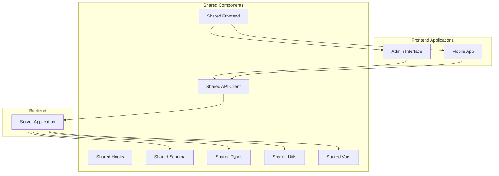
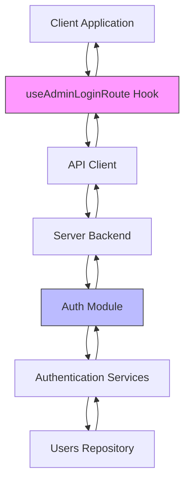
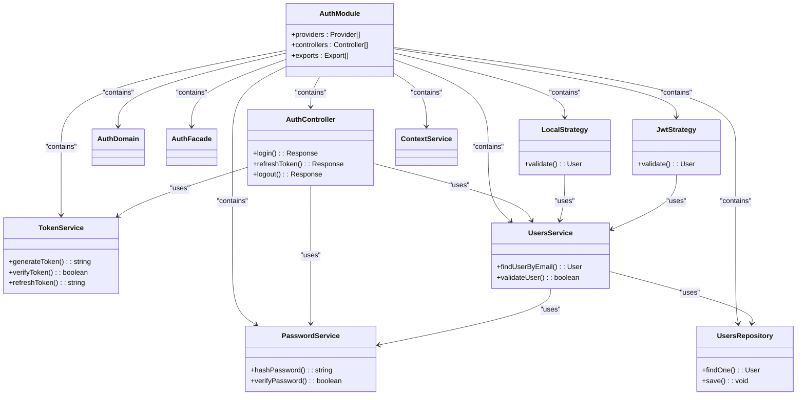
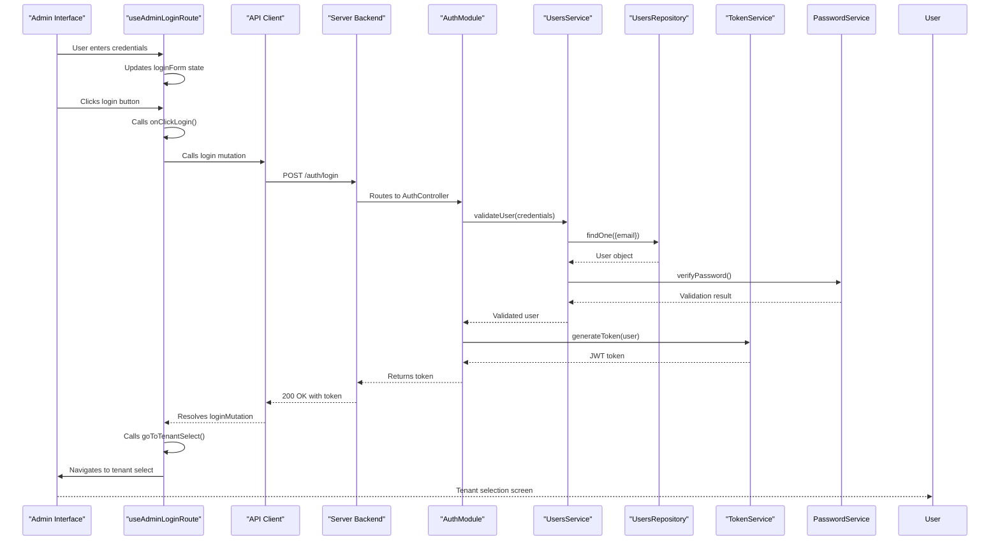
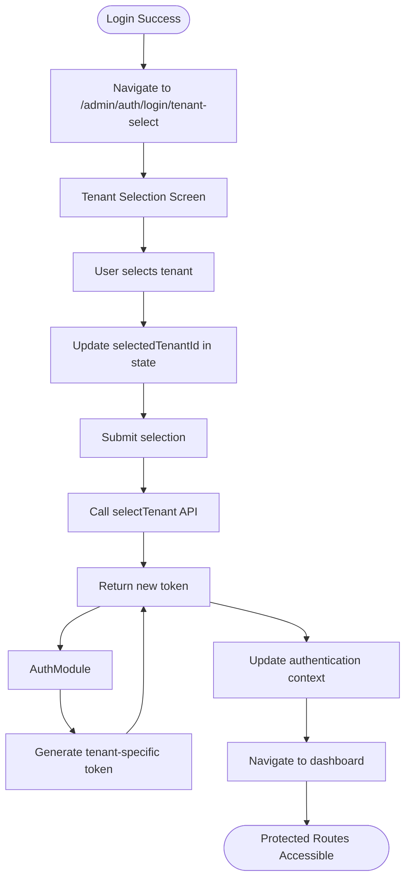

# Authentication Flow Across Components

<cite>
**Referenced Files in This Document**   
- [useAdminLoginRoute.ts](file://apps/admin/src/hooks/useAdminLoginRoute.ts)
- [useAdminTenantSelectRoute.ts](file://apps/admin/src/hooks/useAdminTenantSelectRoute.ts)
- [auth.tsx](file://apps/admin/src/routes/admin/auth.tsx)
- [dashboard.tsx](file://apps/admin/src/routes/admin/dashboard.tsx)
- [App.tsx](file://apps/admin/src/App.tsx)
- [auth.module.ts](file://apps/server/src/module/auth.module.ts)
- [AuthController](file://packages/shared/src/index.ts)
- [TokenService](file://packages/shared/src/index.ts)
- [AuthFacade](file://packages/shared/src/index.ts)
- [PasswordService](file://packages/shared/src/index.ts)
- [JwtStrategy](file://packages/shared/src/index.ts)
- [LocalStrategy](file://packages/shared/src/index.ts)
- [UsersService](file://packages/shared/src/index.ts)
- [UsersRepository](file://packages/shared/src/index.ts)
- [ContextService](file://packages/shared/src/index.ts)
- [shared-api-client](file://packages/shared-api-client/src/apis.ts)
</cite>

## Table of Contents
1. [Introduction](#introduction)
2. [Project Structure](#project-structure)
3. [Core Components](#core-components)
4. [Architecture Overview](#architecture-overview)
5. [Detailed Component Analysis](#detailed-component-analysis)
6. [Dependency Analysis](#dependency-analysis)
7. [Performance Considerations](#performance-considerations)
8. [Troubleshooting Guide](#troubleshooting-guide)
9. [Conclusion](#conclusion)

## Introduction
This document provides a comprehensive analysis of the end-to-end authentication flow across the admin interface, mobile app, and server backend. The authentication system is designed to securely manage user access through a multi-step process that includes login, tenant selection, token issuance, and protected route access. The system leverages modern authentication patterns including JWT tokens, refresh tokens, and role-based access control. The documentation traces the complete journey from user login through token validation and protected route access, with a focus on the orchestration between frontend hooks, backend services, and shared authentication components.

## Project Structure



**Diagram sources**
- [apps/admin](file://apps/admin)
- [apps/mobile](file://apps/mobile)
- [apps/server](file://apps/server)
- [packages/shared-api-client](file://packages/shared-api-client)
- [packages/shared-frontend](file://packages/shared-frontend)
- [packages/shared-schema](file://packages/shared-schema)

**Section sources**
- [project_structure](file://project_structure)

## Core Components

The authentication system consists of several core components that work together to provide a secure and seamless user experience. The frontend components include React hooks that manage the authentication state and user interactions, while the backend components handle token generation, validation, and user authentication. The shared components provide common interfaces and utilities that are used across both frontend and backend applications.

**Section sources**
- [useAdminLoginRoute.ts](file://apps/admin/src/hooks/useAdminLoginRoute.ts)
- [auth.module.ts](file://apps/server/src/module/auth.module.ts)
- [shared-api-client](file://packages/shared-api-client/src/apis.ts)

## Architecture Overview



**Diagram sources**
- [useAdminLoginRoute.ts](file://apps/admin/src/hooks/useAdminLoginRoute.ts)
- [auth.module.ts](file://apps/server/src/module/auth.module.ts)

## Detailed Component Analysis

### Admin Login Hook Analysis

The `useAdminLoginRoute` hook orchestrates the authentication process in the admin application. It manages the login form state, handles the login mutation, and navigates to the tenant selection route upon successful authentication.

```mermaid
classDiagram
class useAdminLoginRoute {
+loginForm : {email : string, password : string}
+goToTenantSelect() : void
+loginMutation : MutationFunction
+onClickLogin() : Promise~void~
}
useAdminLoginRoute --> useState : "creates"
useAdminLoginRoute --> useActions : "creates"
useAdminLoginRoute --> useHandlers : "creates"
class useState {
+loginForm : {email : string, password : string}
}
class useActions {
+loginMutation : MutationFunction
+goToTenantSelect() : void
}
class useHandlers {
+onClickLogin() : Promise~void~
}
useActions --> useMutation : "uses"
useActions --> useNavigate : "uses"
useHandlers --> loginMutation : "calls"
useHandlers --> goToTenantSelect : "calls"
```

**Diagram sources**
- [useAdminLoginRoute.ts](file://apps/admin/src/hooks/useAdminLoginRoute.ts#L1-L77)

**Section sources**
- [useAdminLoginRoute.ts](file://apps/admin/src/hooks/useAdminLoginRoute.ts#L1-L77)

### Authentication Module Analysis

The server-side authentication module is implemented as a NestJS module that provides all the necessary components for user authentication. It includes controllers, services, strategies, and repositories that work together to handle authentication requests.



**Diagram sources**
- [auth.module.ts](file://apps/server/src/module/auth.module.ts#L1-L31)

**Section sources**
- [auth.module.ts](file://apps/server/src/module/auth.module.ts#L1-L31)

### Authentication Flow Analysis

The complete authentication flow involves multiple steps from the initial login request to accessing protected routes. The following sequence diagram illustrates the interaction between components during the login process.



**Diagram sources**
- [useAdminLoginRoute.ts](file://apps/admin/src/hooks/useAdminLoginRoute.ts#L46-L56)
- [auth.module.ts](file://apps/server/src/module/auth.module.ts#L1-L31)

**Section sources**
- [useAdminLoginRoute.ts](file://apps/admin/src/hooks/useAdminLoginRoute.ts#L1-L77)
- [auth.module.ts](file://apps/server/src/module/auth.module.ts#L1-L31)

### Tenant Selection Flow

After successful authentication, users are directed to the tenant selection screen where they can choose which tenant to access. This flow is managed by the `useAdminTenantSelectRoute` hook.



**Diagram sources**
- [useAdminTenantSelectRoute.ts](file://apps/admin/src/hooks/useAdminTenantSelectRoute.ts#L1-L27)

**Section sources**
- [useAdminTenantSelectRoute.ts](file://apps/admin/src/hooks/useAdminTenantSelectRoute.ts#L1-L27)

## Dependency Analysis

```mermaid
graph TD
useAdminLoginRoute --> useMutation : "React Query"
useAdminLoginRoute --> useNavigate : "React Router"
useAdminLoginRoute --> axios : "HTTP Client"
useAdminLoginRoute --> mobx : "State Management"
useAdminLoginRoute --> shared-api-client : "API Interface"
auth.module.ts --> nestjs/common : "NestJS Core"
auth.module.ts --> shared : "Shared Components"
auth.module.ts --> AuthController : "Authentication Endpoints"
auth.module.ts --> TokenService : "JWT Management"
auth.module.ts --> PasswordService : "Password Hashing"
auth.module.ts --> UsersService : "User Management"
auth.module.ts --> UsersRepository : "Data Access"
auth.module.ts --> LocalStrategy : "Local Authentication"
auth.module.ts --> JwtStrategy : "JWT Authentication"
auth.module.ts --> ContextService : "Request Context"
style useAdminLoginRoute fill:#f9f,stroke:#333
style auth.module.ts fill:#bbf,stroke:#333
```

**Diagram sources**
- [useAdminLoginRoute.ts](file://apps/admin/src/hooks/useAdminLoginRoute.ts)
- [auth.module.ts](file://apps/server/src/module/auth.module.ts)

**Section sources**
- [useAdminLoginRoute.ts](file://apps/admin/src/hooks/useAdminLoginRoute.ts)
- [auth.module.ts](file://apps/server/src/module/auth.module.ts)

## Performance Considerations

The authentication system has been designed with performance in mind. The use of JWT tokens eliminates the need for repeated database queries during token validation, as the token itself contains the necessary user information. The system implements token refresh mechanisms to maintain user sessions without requiring frequent re-authentication. Caching strategies are employed at multiple levels, including in-memory caching of frequently accessed user data and HTTP caching of static authentication resources. The modular architecture allows for horizontal scaling of authentication services to handle increased load.

## Troubleshooting Guide

Common authentication issues and their solutions:

1. **Login failures with valid credentials**: Verify that the password hashing algorithm is correctly implemented and that the stored password hash matches the expected format.

2. **Token validation errors**: Check that the JWT secret key is consistent across all services and that the token has not expired.

3. **Tenant selection not persisting**: Ensure that the tenant context is properly stored in the authentication token and that the context service is correctly extracting this information from incoming requests.

4. **Session timeout issues**: Verify the refresh token implementation and ensure that refresh tokens are being properly stored and validated.

5. **CORS errors during authentication**: Check that the server is properly configured to handle CORS requests from the frontend applications.

**Section sources**
- [useAdminLoginRoute.ts](file://apps/admin/src/hooks/useAdminLoginRoute.ts)
- [auth.module.ts](file://apps/server/src/module/auth.module.ts)

## Conclusion

The authentication system provides a robust and secure foundation for user access control across the admin interface, mobile app, and server backend. The architecture effectively separates concerns between frontend presentation, API communication, and backend authentication logic. The use of shared components ensures consistency across applications while allowing for platform-specific implementations where needed. The system implements industry-standard security practices including JWT tokens, password hashing, and proper session management. Future enhancements could include multi-factor authentication, biometric login options for mobile, and improved error handling for edge cases.