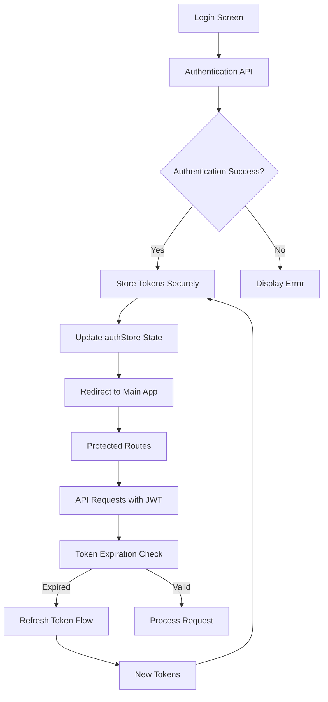
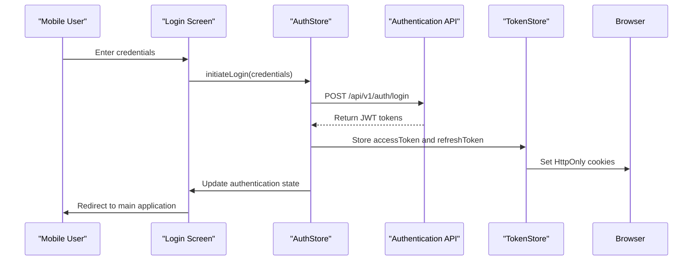
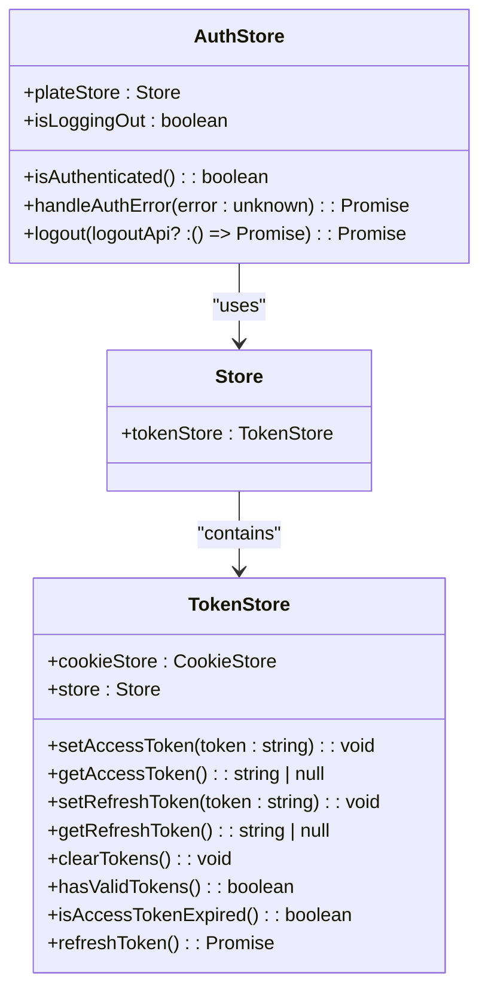
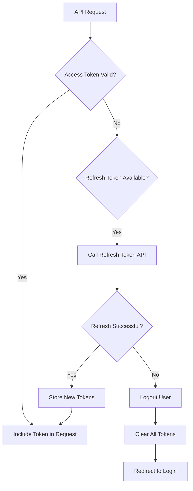
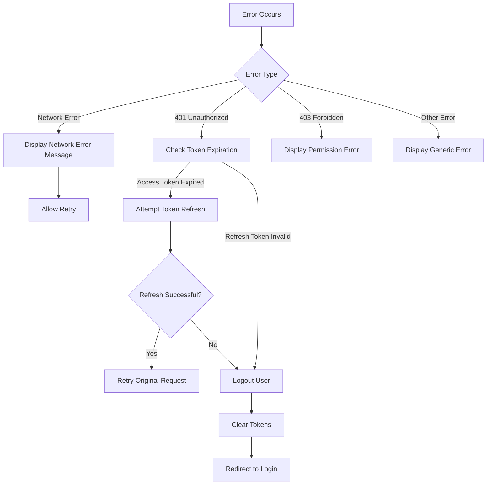

# Mobile Authentication Flow

<cite>
**Referenced Files in This Document**   
- [authStore.ts](file://packages/store/src/stores/authStore.ts)
- [tokenStore.ts](file://packages/store/src/stores/tokenStore.ts)
- [apis.ts](file://packages/api/src/apis.ts)
- [login.tsx](file://apps/admin/src/routes/admin/auth/login.tsx)
</cite>

## Table of Contents
1. [Introduction](#introduction)
2. [Authentication Architecture](#authentication-architecture)
3. [Login Process Flow](#login-process-flow)
4. [State Management with authStore](#state-management-with-authstore)
5. [Token Management and Refresh Mechanism](#token-management-and-refresh-mechanism)
6. [Error Handling](#error-handling)
7. [Security Considerations](#security-considerations)
8. [Conclusion](#conclusion)

## Introduction
This document details the mobile application's authentication flow, focusing on the integration between frontend components, state management, and backend services. The system implements a JWT-based authentication mechanism with secure token storage and automatic token refresh capabilities. The documentation covers the complete authentication journey from user login to session management and logout.

## Authentication Architecture

**Diagram sources**
- [authStore.ts](file://packages/store/src/stores/authStore.ts)
- [tokenStore.ts](file://packages/store/src/stores/tokenStore.ts)
- [apis.ts](file://packages/api/src/apis.ts)

**Section sources**
- [authStore.ts](file://packages/store/src/stores/authStore.ts)
- [tokenStore.ts](file://packages/store/src/stores/tokenStore.ts)

## Login Process Flow

**Diagram sources**
- [authStore.ts](file://packages/store/src/stores/authStore.ts)
- [tokenStore.ts](file://packages/store/src/stores/tokenStore.ts)
- [apis.ts](file://packages/api/src/apis.ts)
- [login.tsx](file://apps/admin/src/routes/admin/auth/login.tsx)

**Section sources**
- [authStore.ts](file://packages/store/src/stores/authStore.ts)
- [login.tsx](file://apps/admin/src/routes/admin/auth/login.tsx)

## State Management with authStore

The authentication state is managed through the `AuthStore` class which provides a centralized location for authentication-related state and operations. The store maintains the current authentication status and handles authentication errors across the application.

**Diagram sources**
- [authStore.ts](file://packages/store/src/stores/authStore.ts)
- [tokenStore.ts](file://packages/store/src/stores/tokenStore.ts)

**Section sources**
- [authStore.ts](file://packages/store/src/stores/authStore.ts)
- [tokenStore.ts](file://packages/store/src/stores/tokenStore.ts)

## Token Management and Refresh Mechanism

The token management system implements a secure approach to handling JWT tokens with automatic refresh capabilities. Access tokens are stored in HttpOnly cookies for security, while refresh tokens are used to obtain new access tokens when they expire.

**Diagram sources**
- [tokenStore.ts](file://packages/store/src/stores/tokenStore.ts)
- [authStore.ts](file://packages/store/src/stores/authStore.ts)

**Section sources**
- [tokenStore.ts](file://packages/store/src/stores/tokenStore.ts)

## Error Handling

The authentication system implements comprehensive error handling for various failure scenarios including network issues, invalid credentials, and expired sessions. The error handling is centralized in the AuthStore to ensure consistent behavior across the application.

**Diagram sources**
- [authStore.ts](file://packages/store/src/stores/authStore.ts)
- [tokenStore.ts](file://packages/store/src/stores/tokenStore.ts)

**Section sources**
- [authStore.ts](file://packages/store/src/stores/authStore.ts)

## Security Considerations

The authentication implementation follows security best practices including:
- Use of HttpOnly cookies to prevent XSS attacks
- Secure flag on cookies to ensure transmission over HTTPS only
- Strict SameSite policy to prevent CSRF attacks
- JWT token validation with expiration checks
- Automatic token refresh to minimize exposure of refresh tokens
- Centralized error handling to prevent information leakage

The system also implements secure storage mechanisms that persist authentication state across app restarts while maintaining security. The token refresh mechanism ensures uninterrupted user experience while maintaining security by automatically obtaining new access tokens before they expire.

**Section sources**
- [tokenStore.ts](file://packages/store/src/stores/tokenStore.ts)
- [authStore.ts](file://packages/store/src/stores/authStore.ts)

## Conclusion
The mobile application's authentication flow provides a secure and user-friendly experience with robust state management and error handling. The integration between the authStore and tokenStore ensures consistent authentication state across the application, while the JWT-based system with automatic token refresh provides both security and convenience. The architecture supports secure storage, proper error handling, and seamless user experience across different scenarios including network interruptions and token expiration.