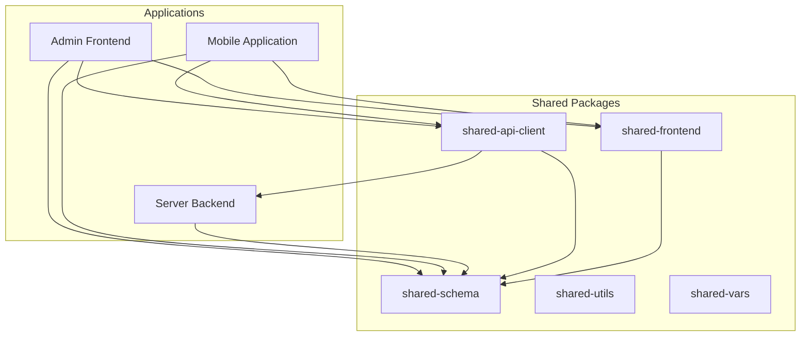
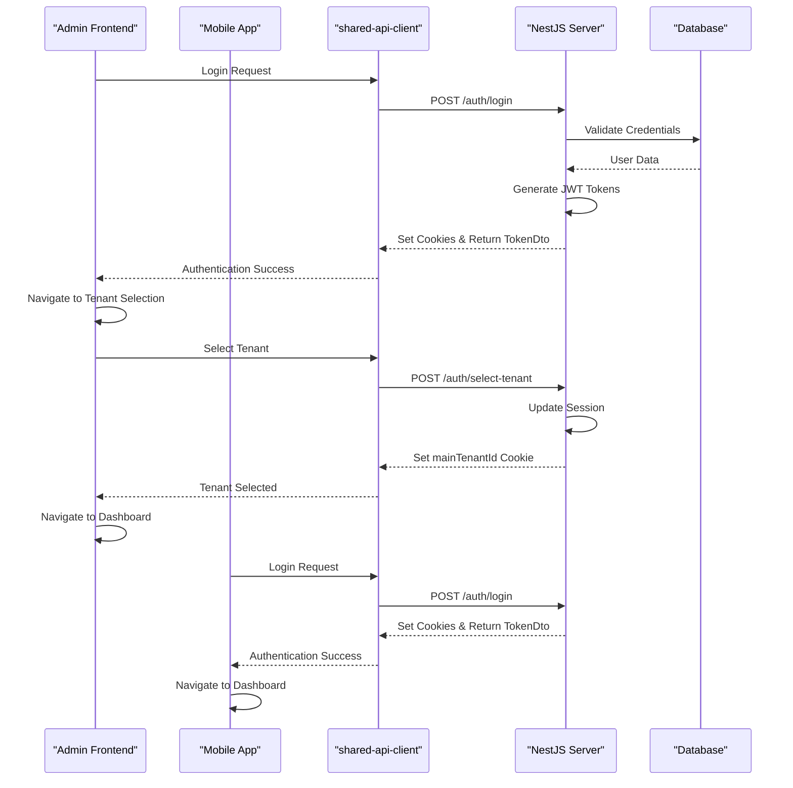
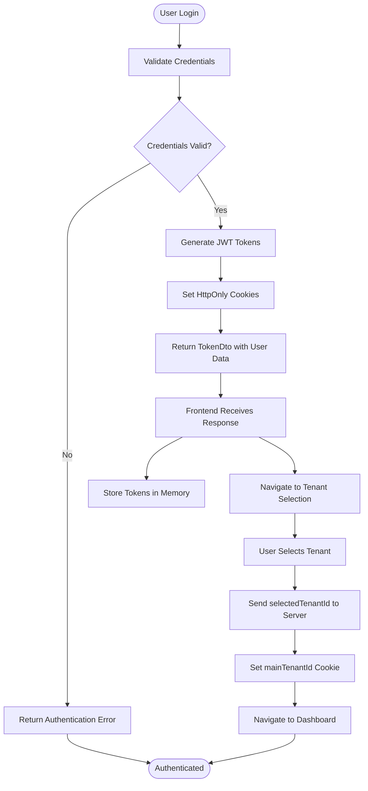
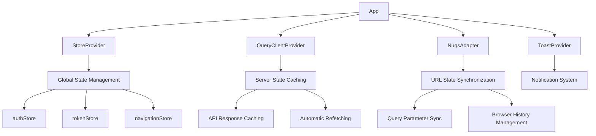
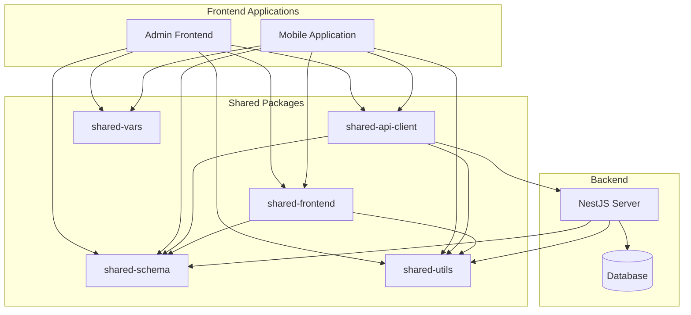

# Component Interactions

<cite>
**Referenced Files in This Document**   
- [App.tsx](file://apps/admin/src/App.tsx)
- [main.tsx](file://apps/admin/src/main.tsx)
- [Providers.tsx](file://apps/admin/src/providers/Providers.tsx)
- [useAdminLoginRoute.ts](file://apps/admin/src/hooks/useAdminLoginRoute.ts)
- [useAdminTenantSelectRoute.ts](file://apps/admin/src/hooks/useAdminTenantSelectRoute.ts)
- [main.ts](file://apps/server/src/main.ts)
- [auth.controller.ts](file://apps/server/src/shared/controller/domains/auth.controller.ts)
- [token.dto.ts](file://packages/schema/src/dto/auth/token.dto.ts)
- [selectTenantDto.ts](file://packages/schema/src/dto/select-tenant.dto.ts)
- [selectTenantDto.ts](file://packages/api-client/src/model/selectTenantDto.ts)
- [AdminAuthLoginPage.tsx](file://packages/ui/src/components/page/AdminAuthLoginPage.tsx)
- [AdminAuthTenantSelectPage.tsx](file://packages/ui/src/components/page/AdminAuthTenantSelectPage.tsx)
</cite>

## Table of Contents
1. [Introduction](#introduction)
2. [Project Structure](#project-structure)
3. [Core Components](#core-components)
4. [Architecture Overview](#architecture-overview)
5. [Detailed Component Analysis](#detailed-component-analysis)
6. [Dependency Analysis](#dependency-analysis)
7. [Performance Considerations](#performance-considerations)
8. [Troubleshooting Guide](#troubleshooting-guide)
9. [Conclusion](#conclusion)

## Introduction
This document provides architectural documentation for the component interactions within the prj-core system. It describes the high-level design of how the admin frontend, mobile application, and server backend communicate and share state. The document focuses on data flow patterns between applications and shared packages, particularly how shared-frontend components are consumed by both admin and mobile apps. It explains the role of AppProviders in managing global state and dependencies across the system, details the API consumption pattern where both frontend applications use the shared-api-client to interact with the NestJS server, and illustrates the authentication flow that spans all components from login in the admin interface to tenant selection and token management.

## Project Structure



**Diagram sources**
- [apps/admin](file://apps/admin)
- [apps/mobile](file://apps/mobile)
- [apps/server](file://apps/server)
- [packages/shared-api-client](file://packages/shared-api-client)
- [packages/shared-frontend](file://packages/shared-frontend)
- [packages/shared-schema](file://packages/shared-schema)

**Section sources**
- [apps/admin](file://apps/admin)
- [apps/mobile](file://apps/mobile)
- [apps/server](file://apps/server)
- [packages/shared-api-client](file://packages/shared-api-client)
- [packages/shared-frontend](file://packages/shared-frontend)
- [packages/shared-schema](file://packages/shared-schema)

## Core Components

The prj-core system consists of three main applications: the admin frontend, mobile application, and server backend, which interact through a set of shared packages. The shared-api-client package provides a unified interface for both frontend applications to communicate with the NestJS server. The shared-frontend package contains reusable UI components and state management utilities consumed by both frontend applications. The shared-schema package defines the data models and DTOs used across the system, ensuring consistency between frontend and backend.

**Section sources**
- [apps/admin](file://apps/admin)
- [apps/mobile](file://apps/mobile)
- [apps/server](file://apps/server)
- [packages/shared-api-client](file://packages/shared-api-client)
- [packages/shared-frontend](file://packages/shared-frontend)
- [packages/shared-schema](file://packages/shared-schema)

## Architecture Overview



**Diagram sources**
- [apps/admin/src/hooks/useAdminLoginRoute.ts](file://apps/admin/src/hooks/useAdminLoginRoute.ts)
- [apps/server/src/shared/controller/domains/auth.controller.ts](file://apps/server/src/shared/controller/domains/auth.controller.ts)
- [packages/api-client/src/model/selectTenantDto.ts](file://packages/api-client/src/model/selectTenantDto.ts)
- [packages/schema/src/dto/auth/token.dto.ts](file://packages/schema/src/dto/auth/token.dto.ts)

## Detailed Component Analysis

### Authentication Flow Analysis

The authentication flow in the prj-core system follows a standardized pattern across both frontend applications. When a user attempts to log in through the admin interface, the AdminAuthLoginPage component utilizes the useAdminAuthLoginRoute hook which calls the login function from the shared-api-client package. This triggers a POST request to the /auth/login endpoint on the NestJS server.



**Diagram sources**
- [apps/admin/src/hooks/useAdminLoginRoute.ts](file://apps/admin/src/hooks/useAdminLoginRoute.ts)
- [apps/server/src/shared/controller/domains/auth.controller.ts](file://apps/server/src/shared/controller/domains/auth.controller.ts)
- [packages/schema/src/dto/auth/token.dto.ts](file://packages/schema/src/dto/auth/token.dto.ts)
- [packages/schema/src/dto/select-tenant.dto.ts](file://packages/schema/src/dto/select-tenant.dto.ts)

**Section sources**
- [apps/admin/src/hooks/useAdminLoginRoute.ts](file://apps/admin/src/hooks/useAdminLoginRoute.ts)
- [apps/admin/src/routes/admin/auth/login/tenant-select.tsx](file://apps/admin/src/routes/admin/auth/login/tenant-select.tsx)
- [apps/server/src/shared/controller/domains/auth.controller.ts](file://apps/server/src/shared/controller/domains/auth.controller.ts)
- [packages/schema/src/dto/auth/token.dto.ts](file://packages/schema/src/dto/auth/token.dto.ts)
- [packages/schema/src/dto/select-tenant.dto.ts](file://packages/schema/src/dto/select-tenant.dto.ts)

### Shared Frontend Components Analysis

The shared-frontend package provides a collection of reusable UI components that are consumed by both the admin and mobile applications. These components follow a pattern of accepting route hook return values as props, allowing for separation of presentation and logic. For example, the AdminAuthLoginPage component receives the return value of useAdminAuthLoginRoute as props, which contains state, actions, and handlers.

```mermaid
classDiagram
class AdminAuthLoginPage {
+props : ReturnType<useAdminAuthLoginRoute>
+render() : JSX.Element
}
class AdminAuthTenantSelectPage {
+props : { tenants : Tenant[], onSelect : (id : string) => void }
+render() : JSX.Element
}
class useAdminAuthLoginRoute {
+state : { loginForm : { email : string, password : string } }
+actions : { loginMutation : MutationFunction, goToTenantSelect : () => void }
+handlers : { onClickLogin : () => Promise<void> }
+return : AdminAuthLoginRouteProps
}
class useAdminTenantSelectRoute {
+state : { listbox : { selectedTenantId : string } }
+handlers : { onClickSelect : () => void }
+return : AdminAuthTenantSelectRouteProps
}
AdminAuthLoginPage --> useAdminAuthLoginRoute : "consumes return value"
AdminAuthTenantSelectPage --> useAdminTenantSelectRoute : "consumes return value"
useAdminAuthLoginRoute --> "shared-api-client" : "uses login function"
useAdminTenantSelectRoute --> "shared-api-client" : "uses selectTenant function"
```

**Diagram sources**
- [packages/ui/src/components/page/AdminAuthLoginPage.tsx](file://packages/ui/src/components/page/AdminAuthLoginPage.tsx)
- [packages/ui/src/components/page/AdminAuthTenantSelectPage.tsx](file://packages/ui/src/components/page/AdminAuthTenantSelectPage.tsx)
- [apps/admin/src/hooks/useAdminLoginRoute.ts](file://apps/admin/src/hooks/useAdminLoginRoute.ts)
- [apps/admin/src/hooks/useAdminTenantSelectRoute.ts](file://apps/admin/src/hooks/useAdminTenantSelectRoute.ts)

**Section sources**
- [packages/ui/src/components/page/AdminAuthLoginPage.tsx](file://packages/ui/src/components/page/AdminAuthLoginPage.tsx)
- [packages/ui/src/components/page/AdminAuthTenantSelectPage.tsx](file://packages/ui/src/components/page/AdminAuthTenantSelectPage.tsx)
- [apps/admin/src/hooks/useAdminLoginRoute.ts](file://apps/admin/src/hooks/useAdminLoginRoute.ts)
- [apps/admin/src/hooks/useAdminTenantSelectRoute.ts](file://apps/admin/src/hooks/useAdminTenantSelectRoute.ts)

### State Management Analysis

The prj-core system employs a multi-layered state management approach using MobX for global state and React Query for server state. The admin frontend initializes its state management through the StoreProvider in main.tsx, which wraps the entire application. The Providers component composes various context providers including QueryClientProvider for React Query and ToastProvider for notifications.



**Diagram sources**
- [apps/admin/src/main.tsx](file://apps/admin/src/main.tsx)
- [apps/admin/src/providers/Providers.tsx](file://apps/admin/src/providers/Providers.tsx)

**Section sources**
- [apps/admin/src/main.tsx](file://apps/admin/src/main.tsx)
- [apps/admin/src/providers/Providers.tsx](file://apps/admin/src/providers/Providers.tsx)

## Dependency Analysis



**Diagram sources**
- [apps/admin](file://apps/admin)
- [apps/mobile](file://apps/mobile)
- [packages/shared-api-client](file://packages/shared-api-client)
- [packages/shared-frontend](file://packages/shared-frontend)
- [packages/shared-schema](file://packages/shared-schema)
- [packages/shared-utils](file://packages/shared-utils)
- [packages/shared-vars](file://packages/shared-vars)
- [apps/server](file://apps/server)

**Section sources**
- [apps/admin](file://apps/admin)
- [apps/mobile](file://apps/mobile)
- [packages/shared-api-client](file://packages/shared-api-client)
- [packages/shared-frontend](file://packages/shared-frontend)
- [packages/shared-schema](file://packages/shared-schema)
- [packages/shared-utils](file://packages/shared-utils)
- [packages/shared-vars](file://packages/shared-vars)
- [apps/server](file://apps/server)

## Performance Considerations
The prj-core system implements several performance optimizations through its architectural design. The use of React Query in the frontend applications provides automatic caching, background refetching, and request deduplication, reducing the number of API calls to the server. The shared-api-client package generates type-safe API clients using Orval, eliminating the need for manual API client implementation and reducing bundle size. The server implements Swagger documentation with operationIdFactory to ensure consistent API operation IDs, improving developer experience and tooling integration.

## Troubleshooting Guide

Common issues in the prj-core system typically relate to authentication flows and state management:

1. **Authentication failures**: Verify that the NestJS server is properly setting HttpOnly cookies for accessToken and refreshToken. Check that the frontend is correctly handling the TokenDto response structure.

2. **Tenant selection issues**: Ensure that the mainTenantId cookie is being properly set by the server after tenant selection and that the frontend is respecting this value for subsequent requests.

3. **State synchronization problems**: Confirm that the MobX stores are properly initialized and that state updates are triggering re-renders as expected.

4. **API client generation errors**: Validate that the Orval configuration files (orval.dev.config.js, orval.prod.config.js) are correctly configured to generate the API client from the OpenAPI specification.

**Section sources**
- [apps/server/src/main.ts](file://apps/server/src/main.ts)
- [apps/server/src/shared/controller/domains/auth.controller.ts](file://apps/server/src/shared/controller/domains/auth.controller.ts)
- [packages/schema/src/dto/auth/token.dto.ts](file://packages/schema/src/dto/auth/token.dto.ts)

## Conclusion
The prj-core system demonstrates a well-structured architecture with clear separation of concerns between frontend applications, shared packages, and the backend server. The shared component library approach enables significant code reuse while maintaining flexibility for application-specific customization. The authentication flow is standardized across applications, with proper token management using HttpOnly cookies for security. The use of shared-schema ensures data consistency across the system, while the shared-api-client provides a type-safe interface for API consumption. This architecture supports maintainability, scalability, and developer productivity across the entire system.