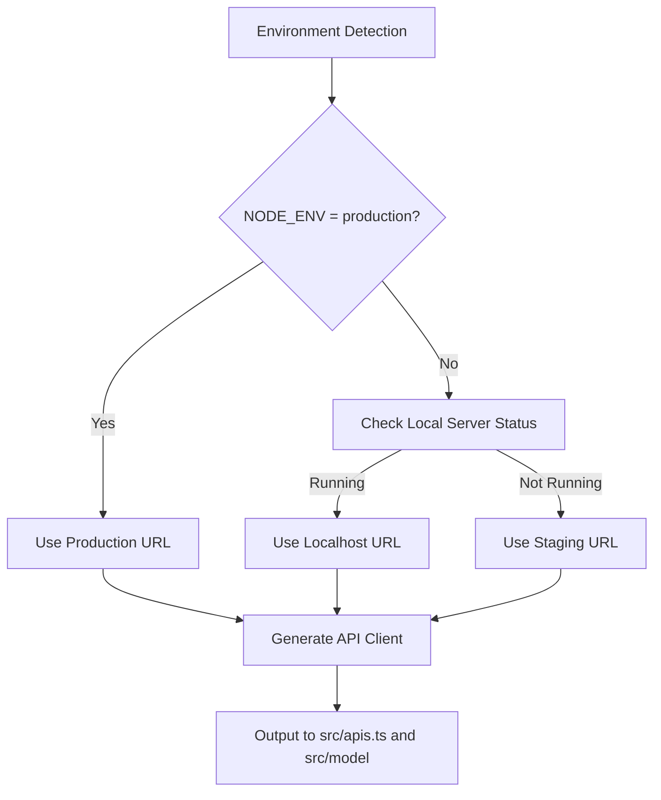
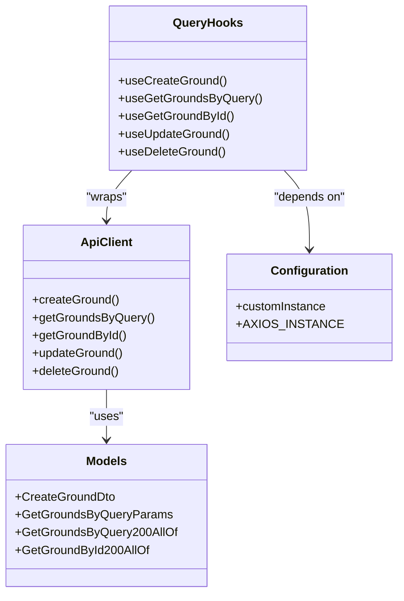
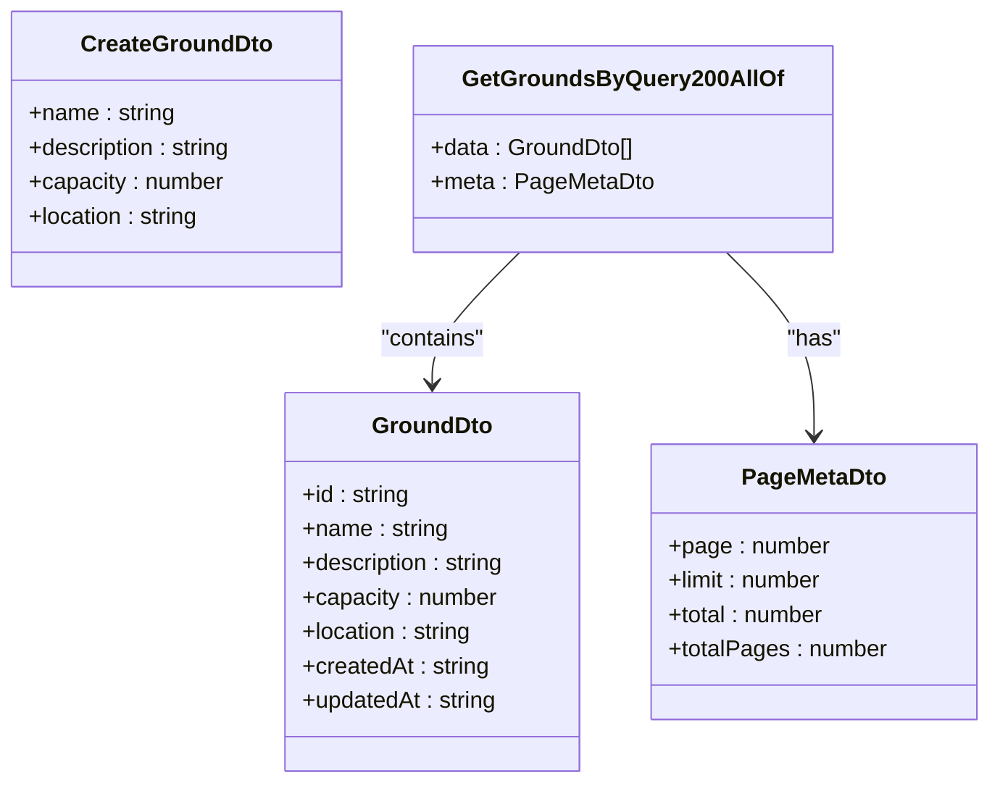

# API Client Generation

<cite>
**Referenced Files in This Document**   
- [orval.config.js](file://packages/api/orval.config.js)
- [apis.ts](file://packages/api/src/apis.ts)
- [index.ts](file://packages/api/src/index.ts)
- [customAxios.ts](file://packages/api/src/libs/customAxios.ts)
- [package.json](file://packages/api/package.json)
- [package.json](file://apps/admin/package.json)
</cite>

## Table of Contents
1. [Introduction](#introduction)
2. [Orval Configuration and Environment Management](#orval-configuration-and-environment-management)
3. [API Client Generation Process](#api-client-generation-process)
4. [Generated Code Structure](#generated-code-structure)
5. [Integration with React Query](#integration-with-react-query)
6. [TypeScript Interface Generation](#typescript-interface-generation)
7. [Benefits of Automated API Client Generation](#benefits-of-automated-api-client-generation)
8. [Updating API Clients and Version Management](#updating-api-clients-and-version-management)
9. [Usage in Applications](#usage-in-applications)
10. [Conclusion](#conclusion)

## Introduction
The prj-core system implements an automated API client generation process using Orval to create type-safe clients from OpenAPI specifications. This approach ensures consistency between frontend and backend interfaces by automatically generating TypeScript interfaces, API functions, and React Query hooks based on the OpenAPI contract. The generated API clients are consumed by both admin and mobile applications, providing a unified interface for data fetching and mutation operations.

**Section sources**
- [orval.config.js](file://packages/api/orval.config.js)

## Orval Configuration and Environment Management
The API client generation process is configured through a centralized Orval configuration file that supports multiple environments (development, staging, production). The configuration dynamically determines which API endpoint to use based on the current environment and server availability.

The `orval.config.js` file defines different API URLs for each environment:
- Development: `http://localhost:3006/api-json`
- Staging: `https://stg.cocdev.co.kr/api-json`
- Production: `https://cocdev.co.kr/api-json`

The configuration includes a sophisticated environment detection mechanism that first checks if the local development server is running. If the localhost server is available, it uses the development endpoint; otherwise, it falls back to the staging environment. This ensures developers can work with local API changes while automatically connecting to staging when the local server is not running.

The configuration also specifies key generation parameters:
- Output mode: "tags-split" to organize generated files by OpenAPI tags
- Client type: React Query for seamless integration with the data fetching library
- Custom mutator: Uses a custom Axios instance for consistent HTTP configuration
- Query hook options: Enables useQuery, useSuspenseQuery, and related hooks



**Diagram sources**
- [orval.config.js](file://packages/api/orval.config.js#L6-L75)

**Section sources**
- [orval.config.js](file://packages/api/orval.config.js#L1-L125)

## API Client Generation Process
The API client generation process is triggered through npm scripts defined in the package.json file. The primary command `pnpm codegen` executes the Orval configuration to generate the API client from the OpenAPI specification.

The generation process follows these steps:
1. Retrieve the OpenAPI specification from the designated endpoint based on the current environment
2. Parse the specification to extract endpoints, request/response schemas, and authentication requirements
3. Generate TypeScript interfaces for all data models in the `src/model` directory
4. Create API functions for each endpoint in the `src/apis.ts` file
5. Implement React Query hooks for data fetching and mutation operations
6. Export all generated code through the main index.ts file

The process is designed to be idempotent and can be run repeatedly as backend APIs evolve. When changes are made to the backend, running the code generation command updates the client to reflect the latest API contract.

**Section sources**
- [orval.config.js](file://packages/api/orval.config.js)
- [package.json](file://packages/api/package.json)

## Generated Code Structure
The generated API client has a well-organized structure that separates concerns and provides clear access to different aspects of the API.

### API Functions
The `apis.ts` file contains functions for each API endpoint, following a consistent pattern:
- Direct API functions (e.g., `createGround`, `getGroundsByQuery`)
- Mutation options generators (e.g., `getCreateGroundMutationOptions`)
- React Query hooks (e.g., `useCreateGround`, `useGetGroundsByQuery`)

Each endpoint generates multiple variants of React Query hooks to support different use cases:
- Standard hooks for regular data fetching
- Suspense-enabled hooks for React Suspense integration
- Type-safe variants with proper error and data typing

### Model Interfaces
The `src/model` directory contains TypeScript interfaces for all data structures defined in the OpenAPI specification. These include:
- Request DTOs (Data Transfer Objects)
- Response entities
- Parameter interfaces
- Enumerated types

The interfaces are automatically kept in sync with the backend, ensuring type safety throughout the application.



**Diagram sources**
- [apis.ts](file://packages/api/src/apis.ts#L1-L800)
- [index.ts](file://packages/api/src/index.ts)

**Section sources**
- [apis.ts](file://packages/api/src/apis.ts)
- [index.ts](file://packages/api/src/index.ts)

## Integration with React Query
The generated API clients are tightly integrated with React Query, providing a seamless data fetching experience for both admin and mobile applications.

The configuration enables several React Query features:
- Standard `useQuery` hooks for data fetching
- `useMutation` hooks for data modifications
- Suspense-compatible hooks (`useSuspenseQuery`) for simplified loading states
- Proper TypeScript typing for query results, errors, and parameters

Each generated hook follows React Query best practices:
- Automatic query key generation based on endpoint and parameters
- Proper dependency tracking for cache invalidation
- Type-safe result objects with data, error, loading states
- Configurable options for caching, refetching, and error handling

The integration allows components to consume API data with minimal boilerplate:

```typescript
// Example usage pattern
const { data, isLoading, error } = useGetGroundsByQuery({
  page: 1,
  limit: 10
});

const mutation = useCreateGround();
mutation.mutate(createGroundDto);
```

**Section sources**
- [apis.ts](file://packages/api/src/apis.ts)
- [orval.config.js](file://packages/api/orval.config.js#L104-L115)

## TypeScript Interface Generation
The API client generation process automatically creates comprehensive TypeScript interfaces from the OpenAPI specification, ensuring type safety across the entire application stack.

Key aspects of interface generation:
- Request and response bodies are converted to TypeScript interfaces
- Path, query, and header parameters are strongly typed
- Enumerated values are preserved as TypeScript enums or union types
- Required and optional fields are accurately represented
- Nested objects and arrays are properly typed

The generated interfaces follow a consistent naming convention:
- `Create{Entity}Dto` for creation request bodies
- `Update{Entity}Dto` for update request bodies
- `Get{Entity}ByQuery200AllOf` for successful response types
- `{Entity}Params` for query parameters

This automatic type generation eliminates the need for manual type definitions and ensures that frontend code is always aligned with the backend API contract.



**Diagram sources**
- [apis.ts](file://packages/api/src/apis.ts#L37-L169)
- [model](file://packages/api/src/model)

**Section sources**
- [apis.ts](file://packages/api/src/apis.ts)
- [model](file://packages/api/src/model)

## Benefits of Automated API Client Generation
The automated API client generation approach provides several significant benefits:

### Type Safety
The generated clients provide complete type safety, eliminating runtime errors caused by API contract mismatches. TypeScript ensures that:
- Request parameters match the expected schema
- Response data is properly typed
- Required fields cannot be omitted
- Invalid field names are caught at compile time

### Consistency
The approach ensures perfect consistency between frontend and backend:
- No manual translation of API contracts
- Automatic synchronization when APIs change
- Single source of truth for API definitions

### Reduced Development Time
Developers can focus on business logic rather than boilerplate code:
- No need to manually write API client code
- Immediate access to new endpoints after generation
- Automatic updates when APIs evolve

### Error Reduction
The automated process eliminates common errors:
- Typos in endpoint URLs
- Incorrect parameter names
- Mismatched data types
- Forgotten authentication requirements

### Improved Maintainability
The codebase is easier to maintain because:
- API changes are propagated automatically
- Documentation is generated from the same source
- Breaking changes are immediately apparent

**Section sources**
- [orval.config.js](file://packages/api/orval.config.js)
- [apis.ts](file://packages/api/src/apis.ts)

## Updating API Clients and Version Management
The process for updating API clients when backend endpoints change is straightforward and well-defined.

### Update Process
1. Make changes to the backend API and ensure the OpenAPI specification is updated
2. Run the code generation command: `pnpm run codegen`
3. Review the generated changes in git
4. Test the updated API client in the application

The generation process is designed to be non-destructive and idempotent, meaning it can be run repeatedly without causing issues.

### Version Management
The system manages API versions through several mechanisms:
- Environment-specific endpoints for development, staging, and production
- Semantic versioning of the API client package
- Backward compatibility considerations in the OpenAPI specification
- Clear separation between breaking and non-breaking changes

When breaking changes are introduced:
1. Update the major version of the API client package
2. Communicate changes to frontend teams
3. Provide migration guidance
4. Maintain backward compatibility when possible

The use of workspace dependencies in package.json (e.g., `"@cocrepo/api": "workspace:*"`) ensures that all applications use the same version of the API client within the monorepo.

**Section sources**
- [orval.config.js](file://packages/api/orval.config.js)
- [package.json](file://packages/api/package.json)
- [package.json](file://apps/admin/package.json)

## Usage in Applications
The generated API client is consumed by both admin and mobile applications within the prj-core system.

### Installation and Import
Applications import the API client as a package dependency:
```json
{
  "dependencies": {
    "@cocrepo/api": "workspace:*"
  }
}
```

The client can be imported and used in components:
```typescript
import { useGetGroundsByQuery } from "@cocrepo/api";

function GroundList() {
  const { data, isLoading } = useGetGroundsByQuery();
  // Render grounds list
}
```

### Authentication Integration
The custom Axios instance (`customInstance`) handles authentication automatically, including:
- Token injection in headers
- Token refresh logic
- Error handling for authentication failures
- Consistent error responses

### Error Handling
The generated client provides comprehensive error handling:
- Type-safe error objects
- HTTP status code information
- Error message extraction
- Consistent error response structure

Applications can handle errors uniformly across all API calls.

**Section sources**
- [package.json](file://apps/admin/package.json)
- [customAxios.ts](file://packages/api/src/libs/customAxios.ts)
- [index.ts](file://packages/api/src/index.ts)

## Conclusion
The API client generation process in the prj-core system provides a robust, type-safe, and maintainable approach to frontend-backend integration. By leveraging Orval to generate clients from OpenAPI specifications, the system ensures consistency, reduces errors, and accelerates development. The integration with React Query provides a seamless data fetching experience, while the automated type generation eliminates manual type definition. The environment-aware configuration and clear update process make it easy to manage API evolution across development, staging, and production environments. This approach represents a best practice for modern full-stack development, ensuring that frontend and backend remain perfectly synchronized.