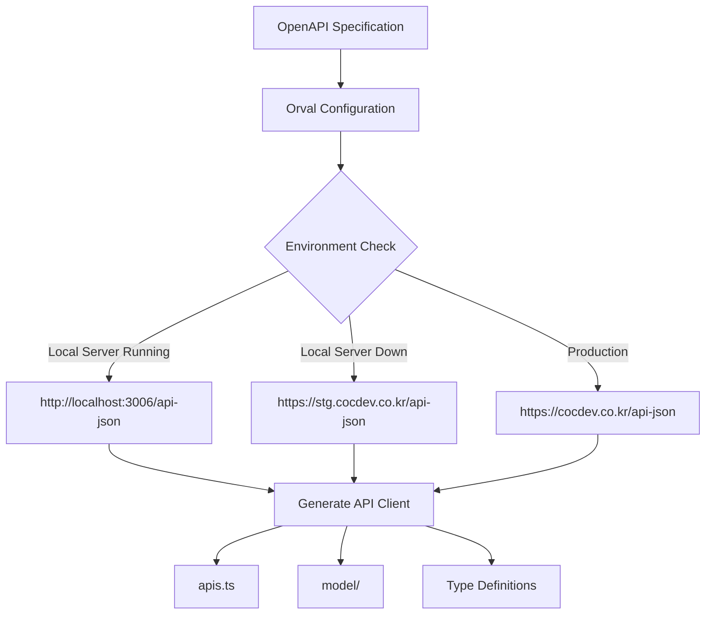
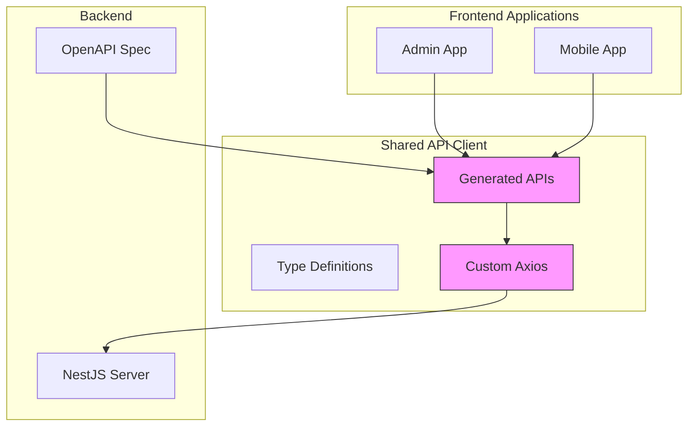
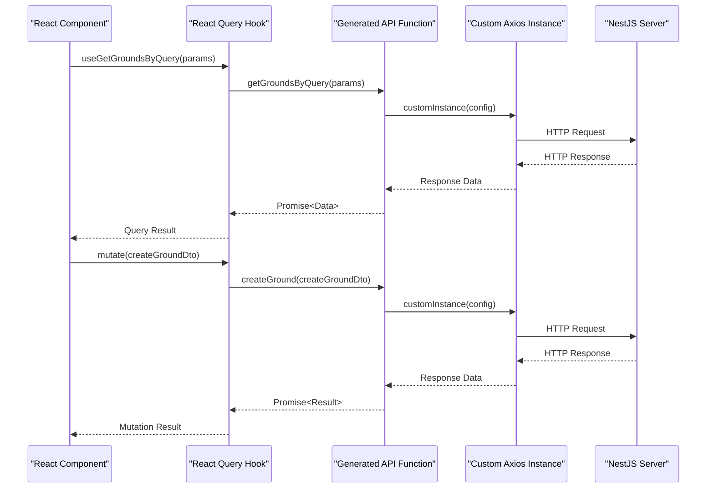
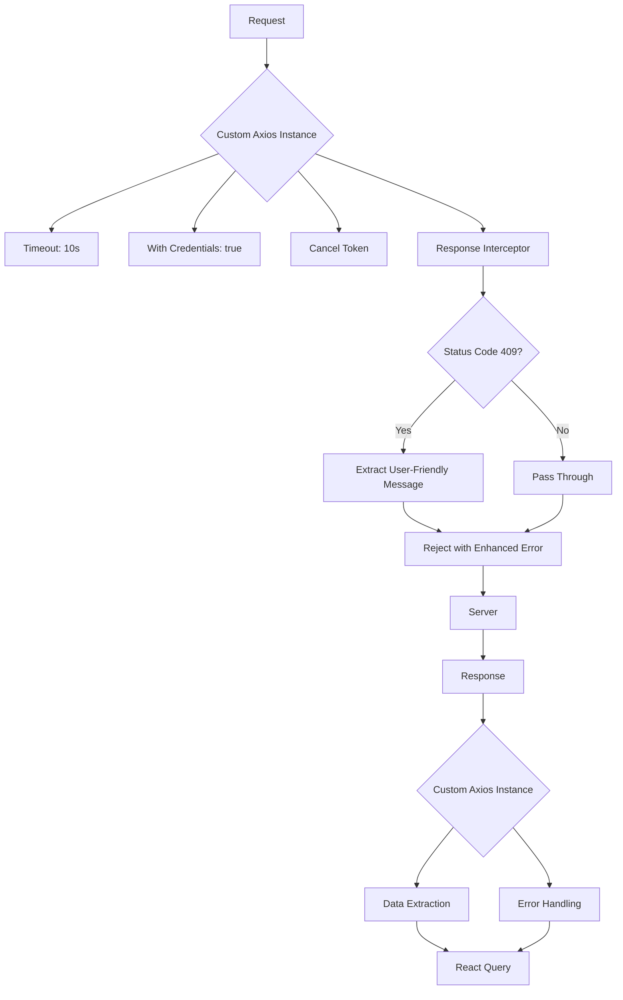

# Frontend-Backend Communication

<cite>
**Referenced Files in This Document**   
- [orval.config.js](file://packages/api-client/orval.config.js)
- [customAxios.ts](file://packages/api-client/src/libs/customAxios.ts)
- [apis.ts](file://packages/api-client/src/apis.ts)
- [main.ts](file://apps/server/src/main.ts)
- [setNestApp.ts](file://apps/server/src/setNestApp.ts)
- [package.json](file://apps/admin/package.json)
</cite>

## Table of Contents
1. [Introduction](#introduction)
2. [API Client Generation Process](#api-client-generation-process)
3. [Frontend-Backend Communication Architecture](#frontend-backend-communication-architecture)
4. [HTTP Request Flow](#http-request-flow)
5. [Configuration and Interceptors](#configuration-and-interceptors)
6. [Data Fetching Patterns](#data-fetching-patterns)
7. [Technical Decision Analysis](#technical-decision-analysis)
8. [Conclusion](#conclusion)

## Introduction
The prj-core system implements a robust frontend-backend communication pattern using a generated API client approach. This documentation details how both the admin and mobile applications consume the NestJS server API through the shared-api-client package. The system leverages Orval to generate type-safe API clients from OpenAPI specifications, ensuring consistency and type safety across the entire stack. The communication pattern follows a modern approach using React Query hooks for data fetching and state management, providing an efficient and reliable way to interact with the backend services.

## API Client Generation Process

The API client generation process in the prj-core system is centered around Orval, a powerful tool that generates type-safe API clients from OpenAPI specifications. The configuration is defined in the `orval.config.js` file, which implements a dynamic environment detection system.

The configuration supports three environments:
- **Development**: Uses `http://localhost:3006/api-json`
- **Staging**: Uses `https://stg.cocdev.co.kr/api-json`
- **Production**: Uses `https://cocdev.co.kr/api-json`

A key feature of the configuration is its intelligent fallback mechanism. When running in development mode, it first checks if the localhost server is running. If the server is available, it uses the local API endpoint; otherwise, it automatically falls back to the staging server. This ensures developers can work seamlessly whether they're running the server locally or need to connect to the staging environment.

The Orval configuration generates React Query-based clients with several important settings:
- Output is split by OpenAPI tags for better organization
- Uses a custom Axios instance for HTTP requests
- Generates both regular and suspense-enabled query hooks
- Creates type definitions for all API models in the `src/model` directory



**Diagram sources**
- [orval.config.js](file://packages/api-client/orval.config.js)

**Section sources**
- [orval.config.js](file://packages/api-client/orval.config.js)

## Frontend-Backend Communication Architecture

The communication architecture in prj-core follows a layered approach that ensures type safety and consistency across the entire stack. At the core of this architecture is the shared-api-client package, which serves as the single source of truth for API interactions.

The architecture consists of several key components:
1. **Generated API Client**: The `apis.ts` file contains all the generated API functions and React Query hooks
2. **Custom Axios Instance**: A configured Axios instance with interceptors and default settings
3. **React Query**: Provides data fetching, caching, and state management capabilities
4. **Type Definitions**: Automatically generated TypeScript interfaces for all API models

The admin application (React-based) and mobile application (React Native-based) both consume the same shared-api-client package, ensuring consistency in API interactions across platforms. This shared approach reduces duplication and ensures that both applications have the same understanding of the API contract.

The generated API client exports several types of functions for each endpoint:
- Direct API functions (e.g., `getGroundsByQuery`)
- Query hook creators (e.g., `useGetGroundsByQuery`)
- Mutation hook creators (e.g., `useCreateGround`)
- Suspense-enabled query hooks (e.g., `useGetGroundsByQuerySuspense`)

This comprehensive approach provides flexibility for different use cases while maintaining type safety throughout.



**Diagram sources**
- [apis.ts](file://packages/api-client/src/apis.ts)
- [customAxios.ts](file://packages/api-client/src/libs/customAxios.ts)

**Section sources**
- [apis.ts](file://packages/api-client/src/apis.ts)
- [package.json](file://apps/admin/package.json)

## HTTP Request Flow

The HTTP request flow in the prj-core system follows a well-defined pattern from the React components through the React Query hooks to the server controllers. This flow ensures type safety, proper error handling, and efficient data management.

For data queries (read operations), the flow is as follows:
1. A React component calls a React Query hook (e.g., `useGetGroundsByQuery`)
2. The hook uses the generated query function to make an HTTP request
3. The request passes through the custom Axios instance with configured interceptors
4. The request is sent to the NestJS server with appropriate headers and authentication
5. The server processes the request and returns a response
6. The response is handled by React Query, which manages caching and state
7. The component receives the data through the hook's return value

For mutations (write operations), the flow is similar but uses mutation hooks:
1. A React component calls a mutation hook (e.g., `useCreateGround`)
2. The component triggers the mutation with the required data
3. The mutation passes through the custom Axios instance
4. The request is sent to the server
5. The server processes the mutation and returns a response
6. React Query handles the response and updates the cache as needed
7. The component receives the mutation result

The generated hooks provide several variants to accommodate different use cases:
- Regular hooks for standard data fetching
- Suspense-enabled hooks for React Suspense integration
- Infinite query hooks for pagination scenarios

This comprehensive approach allows developers to choose the appropriate pattern based on their specific requirements.



**Diagram sources**
- [apis.ts](file://packages/api-client/src/apis.ts)
- [customAxios.ts](file://packages/api-client/src/libs/customAxios.ts)

**Section sources**
- [apis.ts](file://packages/api-client/src/apis.ts)

## Configuration and Interceptors

The prj-core system implements a sophisticated configuration and interceptor system to handle authentication, error handling, and request/response processing. The core of this system is the custom Axios instance defined in `customAxios.ts`.

The custom Axios instance is configured with several important settings:
- **Timeout**: 10 seconds to prevent hanging requests
- **With Credentials**: Enabled to include cookies in cross-origin requests
- **No Base URL**: The baseURL is omitted because Orval generates complete URLs

The system implements a response interceptor to handle specific error cases, particularly HTTP 409 (Conflict) errors. When a 409 error is encountered, the interceptor extracts a user-friendly error message from the response data and adds it to the error object. This ensures that error messages are consistent and user-friendly across the application.

The interceptor also handles request cancellation through Axios's CancelToken mechanism. Each request is assigned a cancel token, allowing requests to be cancelled when components unmount or when new requests supersede previous ones. This prevents race conditions and memory leaks.

Authentication is handled through cookie-based JWT tokens. The NestJS server is configured to accept JWT tokens via cookies, and the Axios instance is configured to include credentials in requests. This eliminates the need for manual token management in the frontend applications.

The server-side configuration in `main.ts` and `setNestApp.ts` complements the frontend configuration by:
- Enabling CORS with credentials support
- Setting up cookie parsing middleware
- Configuring global guards for JWT authentication
- Implementing global interceptors for request context and response formatting

This end-to-end configuration ensures a seamless authentication experience while maintaining security best practices.



**Diagram sources**
- [customAxios.ts](file://packages/api-client/src/libs/customAxios.ts)
- [main.ts](file://apps/server/src/main.ts)
- [setNestApp.ts](file://apps/server/src/setNestApp.ts)

**Section sources**
- [customAxios.ts](file://packages/api-client/src/libs/customAxios.ts)
- [main.ts](file://apps/server/src/main.ts)
- [setNestApp.ts](file://apps/server/src/setNestApp.ts)

## Data Fetching Patterns

The prj-core system implements standardized data fetching patterns for both read (queries) and write (mutations) operations using the generated React Query hooks. These patterns ensure consistency across the application and leverage the full capabilities of React Query.

For read operations, the typical pattern involves using the generated query hooks:

```typescript
// Example of a query pattern
const { data, isLoading, error } = useGetGroundsByQuery({
  page: 1,
  limit: 10,
  sort: 'createdAt',
  order: 'desc'
});
```

The query hooks return an object with properties including:
- `data`: The fetched data
- `isLoading`: Loading state
- `error`: Any error that occurred
- `refetch`: Function to manually refetch data
- Additional React Query state properties

For write operations, the pattern uses mutation hooks:

```typescript
// Example of a mutation pattern
const mutation = useCreateGround();

const handleCreate = async () => {
  try {
    const result = await mutation.mutateAsync(createGroundDto);
    // Handle success
  } catch (error) {
    // Handle error
  }
};
```

Mutation hooks return an object with properties including:
- `mutate`: Function to trigger the mutation
- `mutateAsync`: Promise-based version of mutate
- `isLoading`: Mutation execution state
- `error`: Any error that occurred
- `data`: Result data (for successful mutations)

The system also supports more advanced patterns:
- **Suspense mode**: Using suspense-enabled hooks for simpler loading state management
- **Infinite queries**: For paginated data with infinite scrolling
- **Optimistic updates**: Updating the UI before the server response
- **Cache invalidation**: Automatically refetching related data after mutations

These patterns are consistently applied across both the admin and mobile applications, ensuring a uniform developer experience and predictable behavior.

**Section sources**
- [apis.ts](file://packages/api-client/src/apis.ts)

## Technical Decision Analysis

The decision to use a generated API client in the prj-core system was driven by several key factors that prioritize type safety, consistency, and maintainability.

**Benefits of Generated API Client:**

1. **Type Safety**: The generated client provides complete type safety across the entire stack. TypeScript interfaces are automatically generated from the OpenAPI specification, ensuring that frontend code matches the backend API contract. This eliminates runtime errors due to mismatched data structures.

2. **Consistency**: By generating the client from a single source of truth (the OpenAPI spec), all applications consume the API in a consistent manner. This is particularly important in a multi-platform environment with both admin and mobile applications.

3. **Maintainability**: When API endpoints change, updating the client is as simple as regenerating it from the updated OpenAPI specification. This eliminates the need for manual updates and reduces the risk of errors.

4. **Developer Experience**: The generated hooks follow consistent patterns, reducing the learning curve for new developers. The comprehensive documentation in the generated code also improves discoverability.

5. **Reduced Boilerplate**: The generation process eliminates the need to write repetitive API call code, focusing development effort on business logic rather than infrastructure.

**Comparison with Manual Implementation:**

A manual implementation would require:
- Writing and maintaining API call functions for each endpoint
- Manually creating TypeScript interfaces for request and response types
- Implementing error handling patterns for each call
- Ensuring consistency across multiple applications

This approach would be more error-prone and time-consuming, with a higher risk of inconsistencies between the frontend and backend.

The chosen approach with Orval and React Query provides a robust foundation that scales well as the application grows, making it easier to add new endpoints and maintain existing ones.

**Section sources**
- [orval.config.js](file://packages/api-client/orval.config.js)
- [apis.ts](file://packages/api-client/src/apis.ts)

## Conclusion

The frontend-backend communication pattern in the prj-core system represents a modern, type-safe approach to API integration. By leveraging Orval to generate React Query-based API clients from OpenAPI specifications, the system achieves a high degree of type safety, consistency, and maintainability.

The architecture effectively connects the React-based admin application and React Native-based mobile application to the NestJS backend through a shared API client package. This shared approach ensures that both applications have the same understanding of the API contract while reducing duplication.

The HTTP request flow is well-defined, moving from React components through React Query hooks to the generated API functions and custom Axios instance, ultimately reaching the NestJS server. This flow is enhanced by comprehensive configuration and interceptors that handle authentication, error handling, and request/response processing.

The use of generated API clients provides significant advantages over manual implementation, including improved type safety, consistency across platforms, and reduced maintenance overhead. As the system evolves, this approach will continue to provide benefits by making it easier to update and extend the API surface.

Overall, the prj-core communication pattern demonstrates a thoughtful balance between automation and flexibility, providing developers with powerful tools while maintaining the ability to handle complex scenarios through the underlying React Query and Axios capabilities.