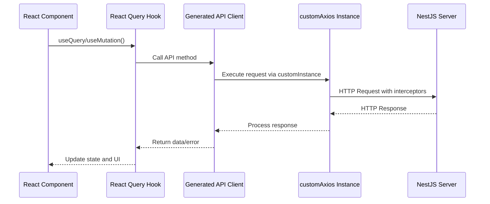
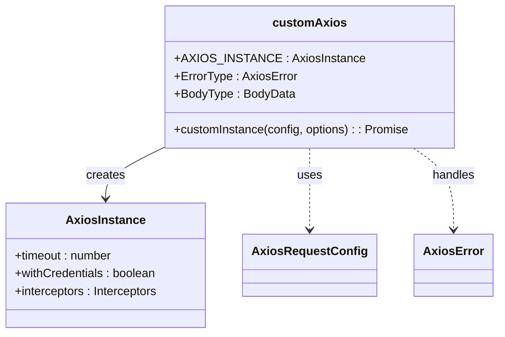
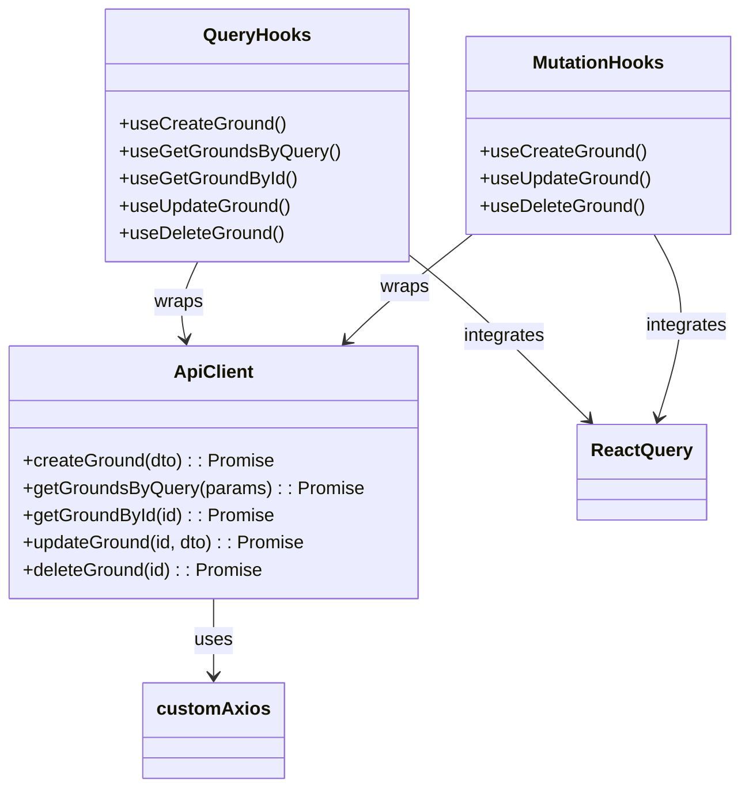
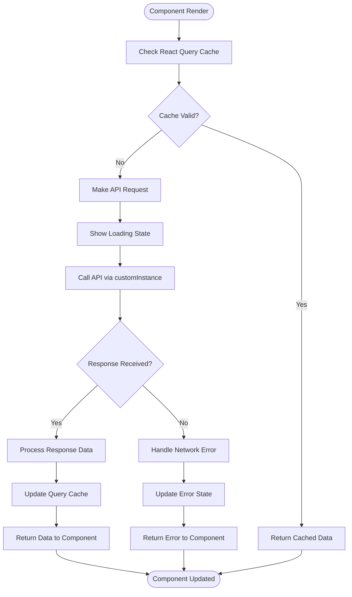
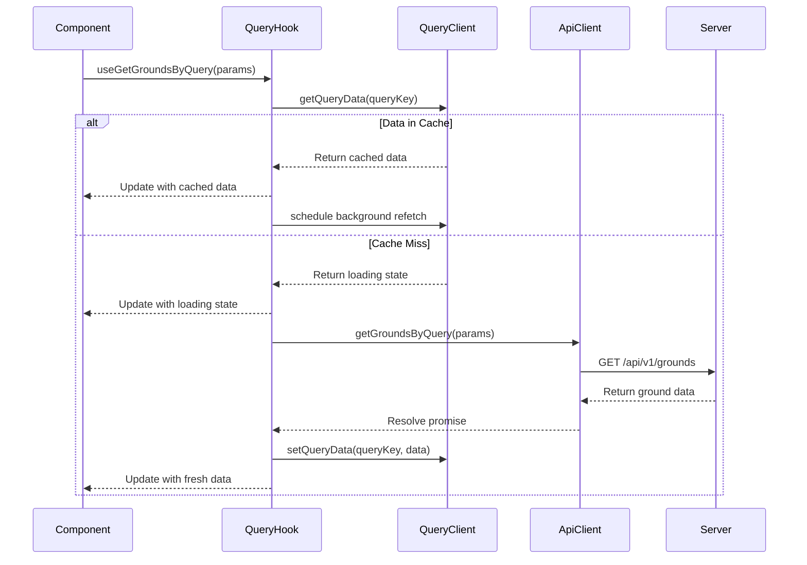
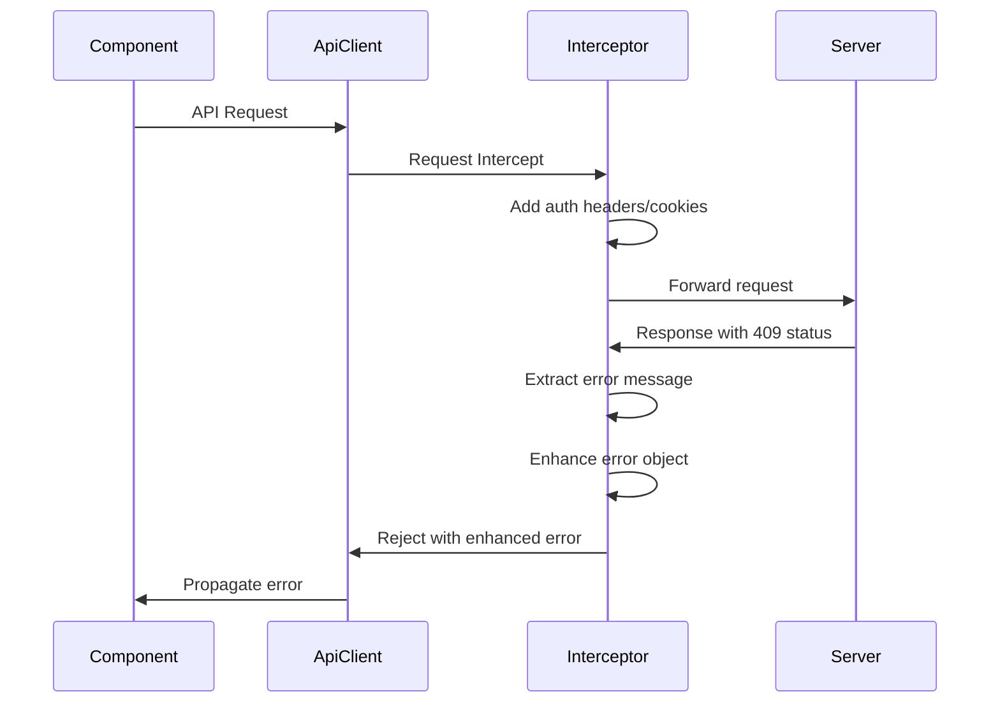
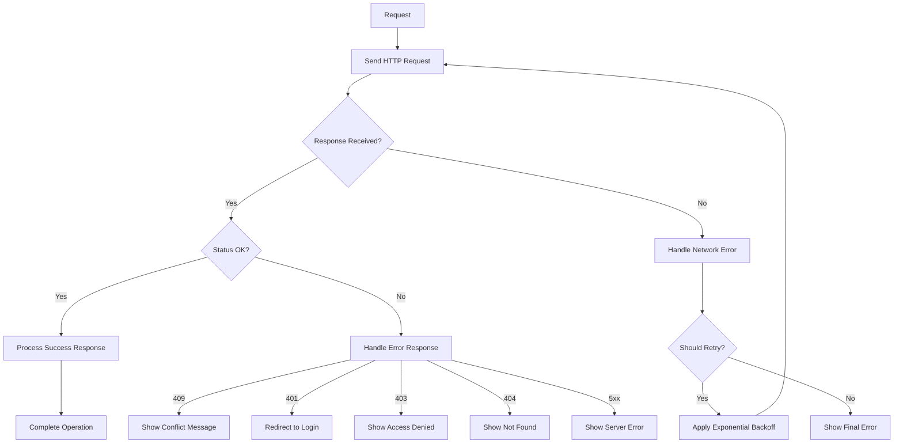

# HTTP Request Flow

<cite>
**Referenced Files in This Document**   
- [customAxios.ts](file://packages/api/src/libs/customAxios.ts)
- [apis.ts](file://packages/api/src/apis.ts)
- [main.tsx](file://apps/admin/src/main.tsx)
- [App.tsx](file://apps/admin/src/App.tsx)
</cite>

## Table of Contents
1. [Introduction](#introduction)
2. [Core Components](#core-components)
3. [HTTP Request Flow Architecture](#http-request-flow-architecture)
4. [Custom Axios Configuration](#custom-axios-configuration)
5. [Generated API Client Integration](#generated-api-client-integration)
6. [React Query Usage Patterns](#react-query-usage-patterns)
7. [Query and Mutation Implementation](#query-and-mutation-implementation)
8. [Authentication and Interceptor Handling](#authentication-and-interceptor-handling)
9. [Error Handling and Network Recovery](#error-handling-and-network-recovery)
10. [Performance Optimization Strategies](#performance-optimization-strategies)
11. [Common Issues and Solutions](#common-issues-and-solutions)

## Introduction
This document details the HTTP request flow in the prj-core system, tracing the journey from React components in both admin and mobile applications through React Query hooks to the shared API client and ultimately to the NestJS server controllers. The system leverages a generated API client based on OpenAPI specifications, integrated with React Query for efficient data fetching, caching, and state management.

The architecture follows a clean separation of concerns, with the shared-api-client package providing a consistent interface across both frontend applications. This ensures type safety, reduces boilerplate code, and maintains consistency in API interactions between the admin and mobile interfaces.

## Core Components

The HTTP request flow in prj-core involves several key components working together to provide a robust data fetching and state management solution. These components include the customAxios instance, the generated API client, React Query hooks, and the NestJS server controllers.

The flow begins in React components within the admin and mobile applications, where developers use React Query hooks to fetch or mutate data. These hooks interact with the generated API client, which in turn uses the customAxios instance to make HTTP requests to the NestJS backend. The response data flows back through the same chain, with React Query managing caching, loading states, and error handling.

**Section sources**
- [customAxios.ts](file://packages/api/src/libs/customAxios.ts#L1-L56)
- [apis.ts](file://packages/api/src/apis.ts#L1-L800)

## HTTP Request Flow Architecture

**Diagram sources**
- [customAxios.ts](file://packages/api/src/libs/customAxios.ts#L1-L56)
- [apis.ts](file://packages/api/src/apis.ts#L1-L800)

## Custom Axios Configuration

The customAxios configuration in prj-core provides a centralized HTTP client with consistent settings and interceptors. The AXIOS_INSTANCE is created with a 10-second timeout and credentials enabled for cookie-based authentication. A response interceptor handles 409 conflict errors by extracting user-friendly error messages from the response data.

The customInstance function wraps the axios instance and adds request cancellation capabilities, allowing queries to be cancelled when components unmount or when new requests supersede previous ones. This prevents race conditions and unnecessary state updates.

**Diagram sources**
- [customAxios.ts](file://packages/api/src/libs/customAxios.ts#L1-L56)

**Section sources**
- [customAxios.ts](file://packages/api/src/libs/customAxios.ts#L1-L56)

## Generated API Client Integration

The generated API client (apis.ts) serves as the bridge between React Query and the customAxios instance. It is automatically generated using Orval from OpenAPI specifications, ensuring type safety and consistency across the codebase. The client exports both direct API functions and React Query hooks for each endpoint.

For each API endpoint, the generated client provides:
- A direct function for making requests (e.g., getGroundsByQuery)
- A query key generator function (e.g., getGetGroundsByQueryQueryKey)
- A query options generator function (e.g., getGetGroundsByQueryQueryOptions)
- A React Query hook (e.g., useGetGroundsByQuery)
- Mutation equivalents for write operations

This comprehensive approach allows developers to use the API client in various ways depending on their needs, from direct function calls to fully-featured React Query hooks with built-in caching and error handling.

**Diagram sources**
- [apis.ts](file://packages/api/src/apis.ts#L1-L800)

**Section sources**
- [apis.ts](file://packages/api/src/apis.ts#L1-L800)

## React Query Usage Patterns

The prj-core system implements React Query patterns for both data fetching (queries) and data modification (mutations). For read operations, components use the generated useQuery hooks which automatically handle loading states, error states, and caching. The query keys are automatically generated based on the endpoint and parameters, enabling automatic cache invalidation and data refetching.

For write operations, the system uses mutation hooks that provide methods to trigger mutations, access mutation state (loading, error, success), and implement optimistic updates. The mutation functions accept parameters that match the API endpoint requirements, with type safety enforced by the generated client.

The integration between the generated API client and React Query ensures consistent patterns across all API interactions, reducing the cognitive load on developers and minimizing the potential for errors.

**Diagram sources**
- [apis.ts](file://packages/api/src/apis.ts#L1-L800)
- [customAxios.ts](file://packages/api/src/libs/customAxios.ts#L1-L56)

## Query and Mutation Implementation

The query implementation in prj-core follows React Query's best practices with automatic query key generation, stale-while-revalidate caching strategy, and background refetching. Queries are automatically deduplicated based on their query keys, and data is cached in memory with configurable time-to-live settings.

Mutation implementation includes support for optimistic updates, where the UI is updated immediately before the server response is received. This creates a responsive user experience while still maintaining data consistency. The mutation hooks provide callbacks for handling success, error, and completion scenarios, allowing for custom side effects like showing notifications or navigating to different routes.

Both queries and mutations support request cancellation through AbortSignal, preventing memory leaks and race conditions when components unmount or when new requests supersede previous ones.

**Diagram sources**
- [apis.ts](file://packages/api/src/apis.ts#L1-L800)
- [customAxios.ts](file://packages/api/src/libs/customAxios.ts#L1-L56)

## Authentication and Interceptor Handling

The authentication flow in prj-core is handled through the customAxios instance with credentials enabled, allowing cookies to be automatically included in requests. The response interceptor specifically handles 409 conflict errors by extracting user-friendly error messages from the response data and enhancing the error object with these messages.

For token-based authentication, the system likely uses HTTP-only cookies set by the server, which are automatically included in requests due to the withCredentials flag. This approach provides better security compared to storing tokens in local storage.

The interceptor pattern allows for centralized handling of authentication-related concerns, such as token refresh and session expiration, without requiring each component to handle these scenarios individually.

**Diagram sources**
- [customAxios.ts](file://packages/api/src/libs/customAxios.ts#L1-L56)

## Error Handling and Network Recovery

The error handling strategy in prj-core combines React Query's built-in error handling with custom interceptors for specific error types. The 409 conflict interceptor demonstrates how specific HTTP status codes can be handled globally with user-friendly error messages.

React Query provides automatic retry mechanisms with configurable backoff strategies for transient network errors. This allows the application to recover from temporary connectivity issues without user intervention. The query and mutation hooks expose error states that components can use to display appropriate error messages and recovery options.

For critical operations, the system can implement custom error boundaries and fallback UIs to maintain application stability even when API requests fail.

**Diagram sources**
- [customAxios.ts](file://packages/api/src/libs/customAxios.ts#L1-L56)
- [apis.ts](file://packages/api/src/apis.ts#L1-L800)

## Performance Optimization Strategies

The prj-core system employs several performance optimization strategies for data fetching and caching. The React Query client implements a stale-while-revalidate strategy, where cached data is immediately displayed while a background request updates the cache. This provides a fast user experience while ensuring data freshness.

Query deduplication prevents multiple identical requests from being sent simultaneously, reducing server load and network usage. The automatic garbage collection removes unused query data after a configurable period, preventing memory leaks in long-running applications.

For large datasets, the system supports pagination and infinite queries through the useSuspenseInfiniteQuery hook, which loads data in chunks as the user scrolls. This approach minimizes initial load times and reduces memory usage.

Stale time and cache time configurations are set appropriately for different types of data, with frequently changing data having shorter stale times and relatively static data having longer cache durations.

## Common Issues and Solutions

Common issues in the HTTP request flow include authentication token expiration, network connectivity problems, and request cancellation during component unmounting. The system addresses token expiration through the use of refresh tokens and interceptor-based renewal mechanisms.

Network recovery is handled through React Query's retry mechanisms with exponential backoff, allowing the application to automatically recover from temporary connectivity issues. Request cancellation is implemented through the AbortSignal pattern, preventing state updates on unmounted components.

For optimistic updates, the system implements rollback mechanisms that restore the previous state if a mutation fails, maintaining data consistency while providing a responsive user experience.

Additional considerations include handling rate limiting, managing concurrent requests, and implementing proper loading states to provide feedback during longer operations.