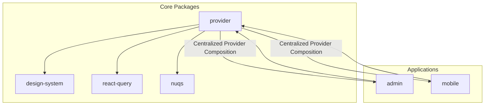
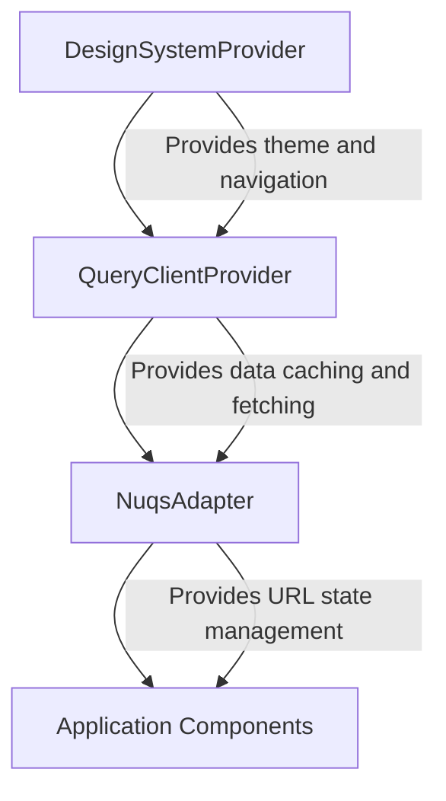
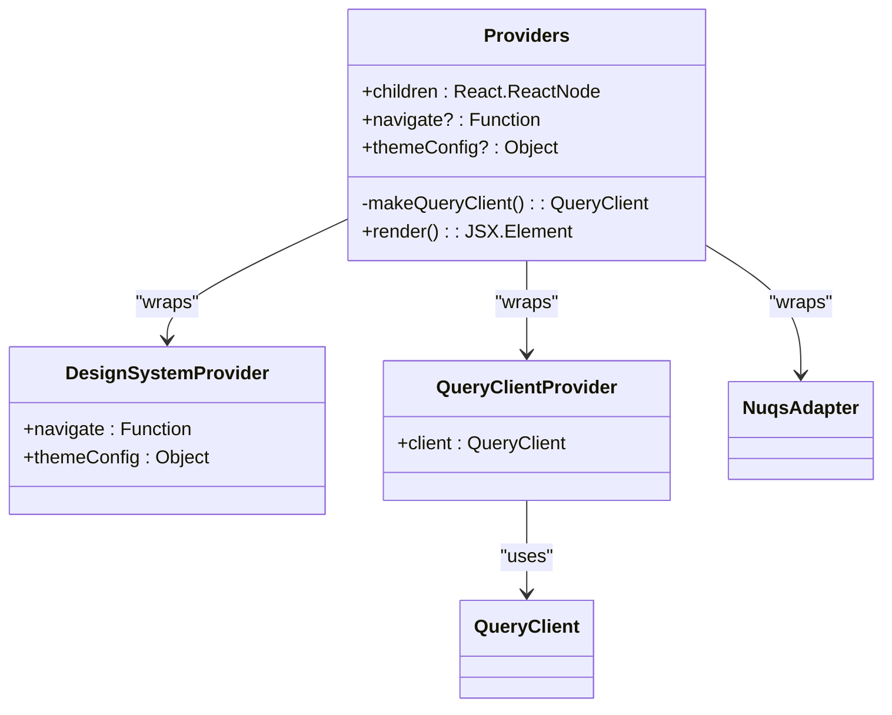
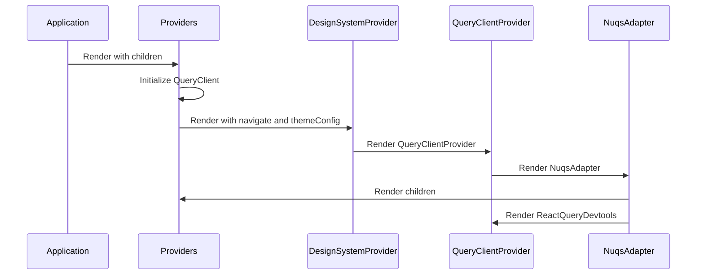
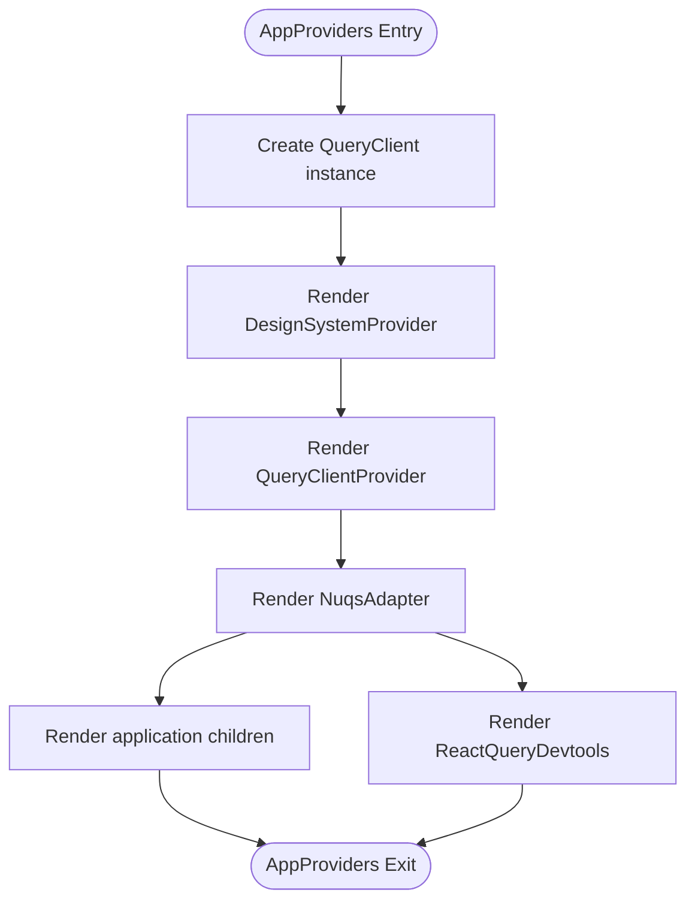
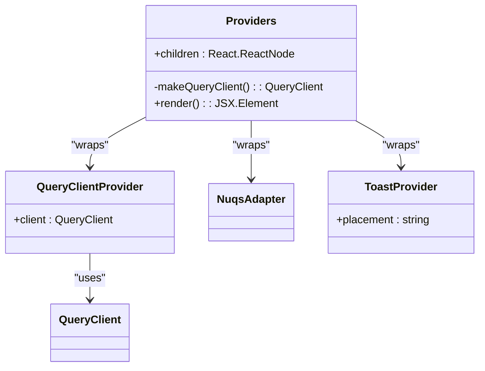
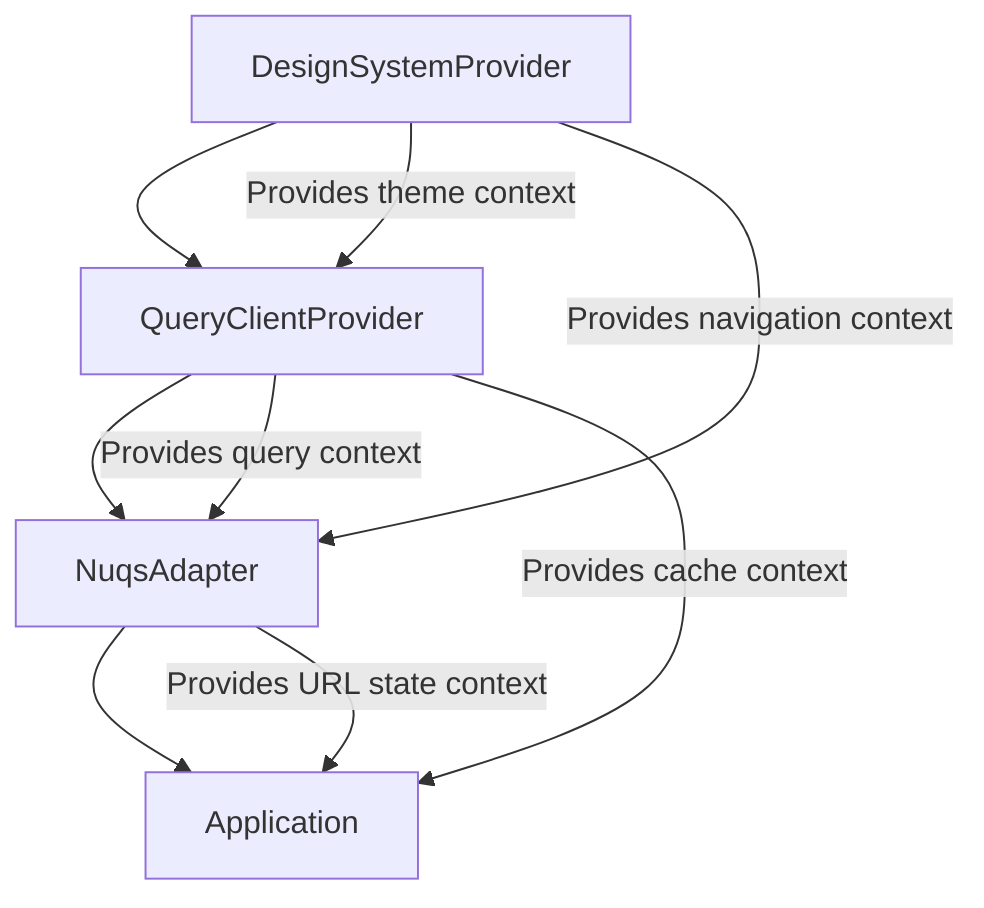

# App Providers Orchestration

<cite>
**Referenced Files in This Document**   
- [Providers.tsx](file://packages/provider/src/Providers.tsx)
- [Providers.tsx](file://apps/admin/src/providers/Providers.tsx)
- [README.md](file://packages/provider/README.md)
</cite>

## Table of Contents
1. [Introduction](#introduction)
2. [Project Structure](#project-structure)
3. [Core Components](#core-components)
4. [Architecture Overview](#architecture-overview)
5. [Detailed Component Analysis](#detailed-component-analysis)
6. [Dependency Analysis](#dependency-analysis)
7. [Performance Considerations](#performance-considerations)
8. [Troubleshooting Guide](#troubleshooting-guide)
9. [Conclusion](#conclusion)

## Introduction
The AppProviders component serves as the root provider orchestrator in the prj-core monorepo, providing a standardized way to compose multiple context providers across applications. This documentation details the technical implementation, initialization sequencing, and architectural patterns used in the provider orchestration system. The solution ensures consistent setup of application context layers including data fetching, UI libraries, and design system configurations across both admin and mobile applications.

## Project Structure
The provider orchestration system is implemented as a shared package within the monorepo, with application-specific adaptations in individual apps. The core implementation resides in the packages/provider directory, while specific applications like admin and mobile implement their own variations based on their requirements.

**Diagram sources**
- [Providers.tsx](file://packages/provider/src/Providers.tsx)
- [README.md](file://packages/provider/README.md)

**Section sources**
- [Providers.tsx](file://packages/provider/src/Providers.tsx)
- [README.md](file://packages/provider/README.md)

## Core Components
The AppProviders system composes multiple context providers in a specific dependency order to ensure proper initialization sequencing. The core components include the DesignSystemProvider for theme and navigation integration, QueryClientProvider for data management, and NuqsAdapter for URL state synchronization. These providers are stacked to create a consistent application context layer across all applications in the monorepo.

**Section sources**
- [Providers.tsx](file://packages/provider/src/Providers.tsx)
- [README.md](file://packages/provider/README.md)

## Architecture Overview
The provider orchestration architecture follows a layered approach where providers are composed in a specific order based on their dependencies and responsibilities. The DesignSystemProvider forms the outermost layer, followed by the QueryClientProvider for data management, and finally the NuqsAdapter for URL state synchronization. This ordering ensures that each provider can access the context it depends on while maintaining separation of concerns.

**Diagram sources**
- [Providers.tsx](file://packages/provider/src/Providers.tsx)
- [README.md](file://packages/provider/README.md)

## Detailed Component Analysis

### Provider Composition Analysis
The AppProviders component implements a centralized provider composition pattern that combines multiple context providers into a single wrapper. This approach ensures consistent setup across all applications while allowing for configuration through props.

#### Provider Stacking Implementation

**Diagram sources**
- [Providers.tsx](file://packages/provider/src/Providers.tsx)

#### Provider Initialization Sequence

**Diagram sources**
- [Providers.tsx](file://packages/provider/src/Providers.tsx)

#### Provider Dependency Flow

**Diagram sources**
- [Providers.tsx](file://packages/provider/src/Providers.tsx)

**Section sources**
- [Providers.tsx](file://packages/provider/src/Providers.tsx)
- [README.md](file://packages/provider/README.md)

### Application-Specific Implementation
The provider orchestration system is implemented differently in various applications based on their specific requirements. The admin application uses a simplified version that excludes the DesignSystemProvider, while the core package provides a more comprehensive implementation.

#### Admin Application Provider Implementation

**Diagram sources**
- [Providers.tsx](file://apps/admin/src/providers/Providers.tsx)

**Section sources**
- [Providers.tsx](file://apps/admin/src/providers/Providers.tsx)

## Dependency Analysis
The provider orchestration system has well-defined dependencies that ensure proper initialization sequencing and functionality. The dependency chain flows from the outermost provider to the innermost, with each provider able to access the context of its ancestors.

**Diagram sources**
- [Providers.tsx](file://packages/provider/src/Providers.tsx)
- [README.md](file://packages/provider/README.md)

**Section sources**
- [Providers.tsx](file://packages/provider/src/Providers.tsx)
- [README.md](file://packages/provider/README.md)

## Performance Considerations
The provider orchestration system is designed with performance in mind, minimizing unnecessary re-renders and optimizing the initialization process. The use of a single QueryClient instance across the application reduces memory overhead, while the ordered provider composition ensures that context is available when needed without requiring additional initialization steps.

The implementation avoids deep provider nesting where possible and leverages React's context consumer pattern to ensure that components only re-render when their specific context values change. The ReactQueryDevtools are included only in development mode, preventing any performance impact in production environments.

## Troubleshooting Guide
When encountering issues with the provider orchestration system, consider the following common problems and solutions:

1. **Context not available**: Ensure providers are composed in the correct order, with dependent providers nested within their dependencies.
2. **Type errors with navigate prop**: Verify that the navigate function passed to DesignSystemProvider matches the expected signature.
3. **Theme configuration not applying**: Check that themeConfig object structure matches the expected format for the DesignSystemProvider.
4. **QueryClient issues**: Ensure that makeQueryClient function returns a properly configured QueryClient instance.
5. **URL state not synchronizing**: Verify that NuqsAdapter is properly nested within the provider chain and that URL parameters are correctly formatted.

**Section sources**
- [Providers.tsx](file://packages/provider/src/Providers.tsx)
- [README.md](file://packages/provider/README.md)

## Conclusion
The AppProviders orchestration system provides a robust and consistent way to compose multiple context providers across applications in the prj-core monorepo. By standardizing the provider composition pattern and initialization sequence, it ensures that all applications have access to the necessary context layers in a predictable and maintainable way. The architecture supports both centralized configuration through the shared package and application-specific adaptations, striking a balance between consistency and flexibility. This approach facilitates easier testing through provider mocking and enables dependency injection at the application root level.