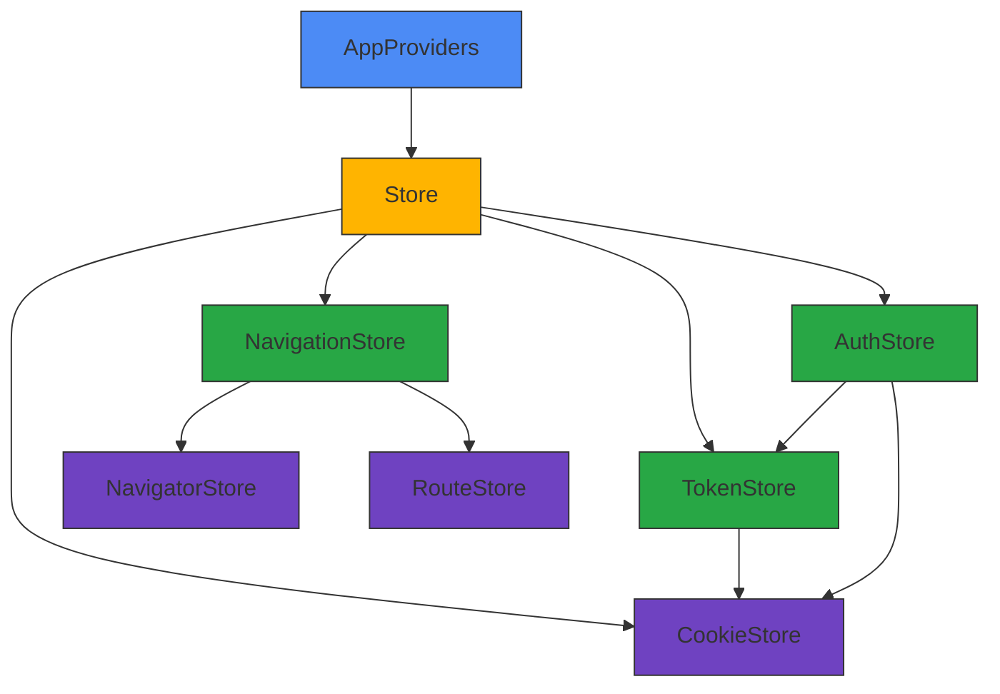
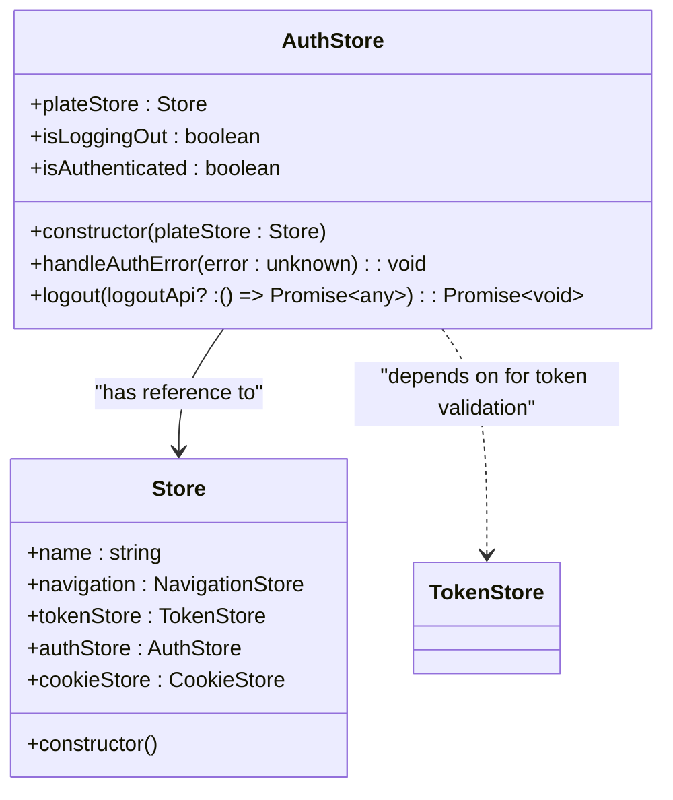
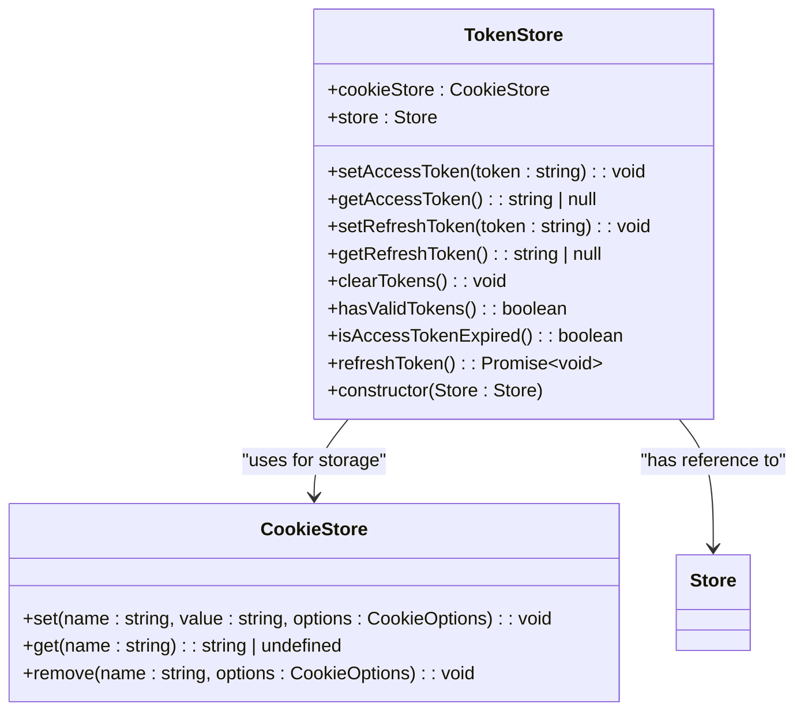
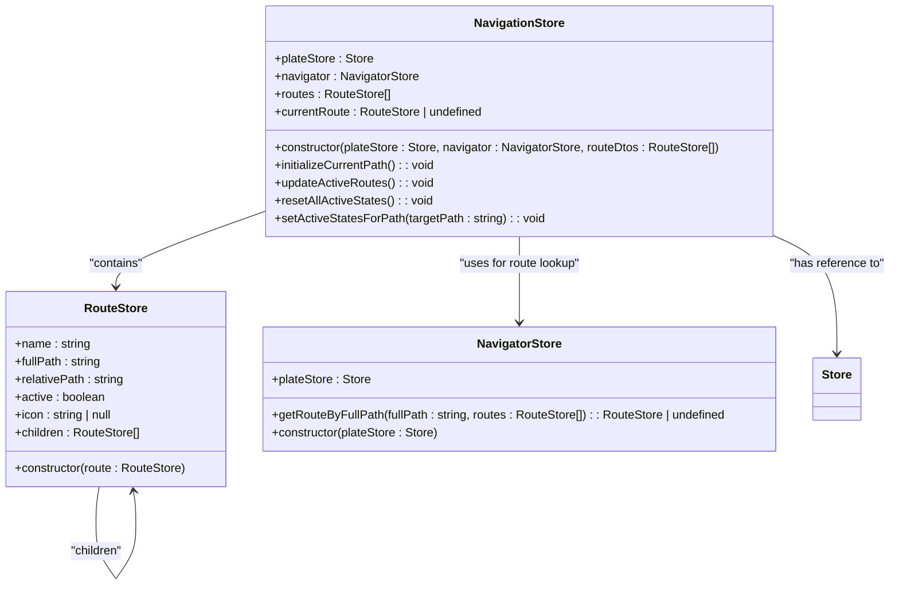
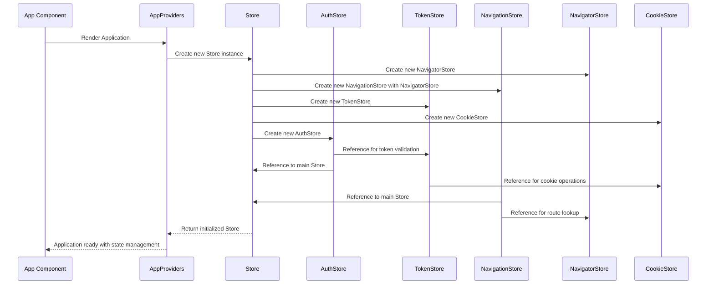
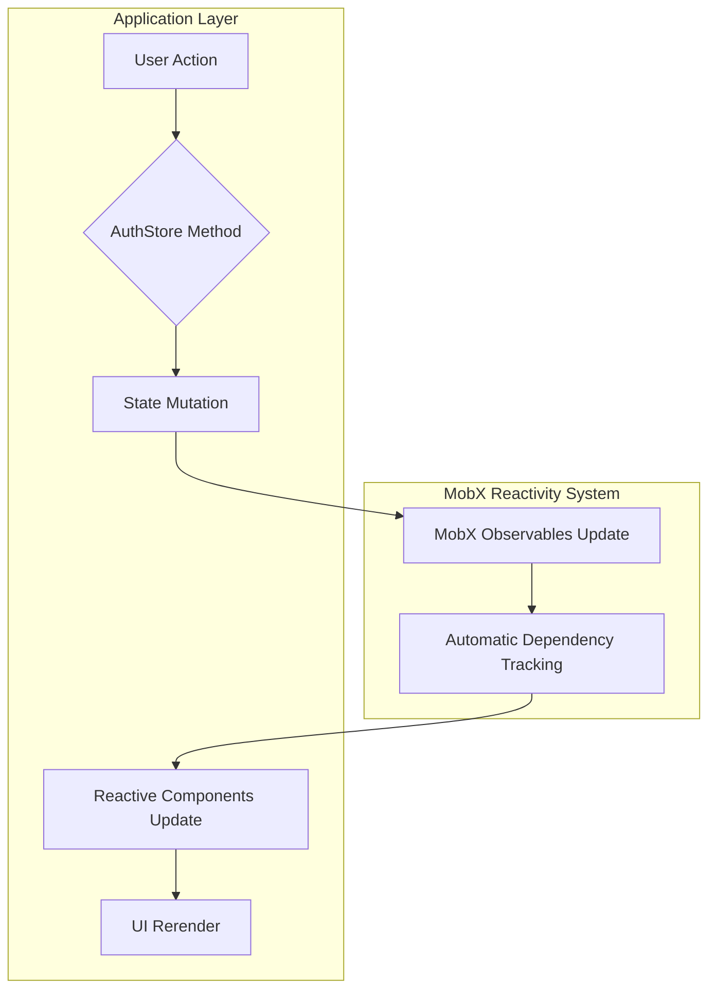
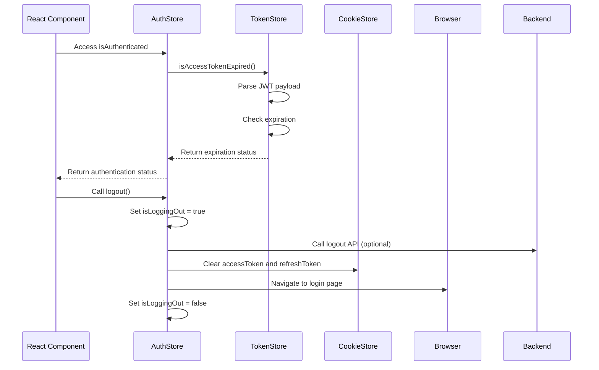

# Global State Management

<cite>
**Referenced Files in This Document**   
- [authStore.ts](file://packages/store/src/stores/authStore.ts)
- [tokenStore.ts](file://packages/store/src/stores/tokenStore.ts)
- [navigationStore.ts](file://packages/store/src/stores/navigationStore.ts)
- [Store.ts](file://packages/store/src/stores/Store.ts)
- [navigatorStore.ts](file://packages/store/src/stores/navigatorStore.ts)
- [routeStore.ts](file://packages/store/src/stores/routeStore.ts)
- [cookieStore.ts](file://packages/store/src/stores/cookieStore.ts)
</cite>

## Table of Contents
1. [Introduction](#introduction)
2. [Core State Management Architecture](#core-state-management-architecture)
3. [MobX Store Implementation](#mobx-store-implementation)
4. [AppProviders Component Orchestration](#appproviders-component-orchestration)
5. [Store Initialization Sequence](#store-initialization-sequence)
6. [Data Flow and Reactivity Patterns](#data-flow-and-reactivity-patterns)
7. [State Consumption Patterns](#state-consumption-patterns)
8. [Authentication State Propagation](#authentication-state-propagation)
9. [Technical Decision Analysis](#technical-decision-analysis)
10. [Conclusion](#conclusion)

## Introduction
The global state management system in prj-core implements a comprehensive solution for managing application state across multiple frontend applications. This system leverages MobX for reactive state management and the provider pattern for dependency injection, creating a scalable architecture that handles authentication, navigation, and token management. The core of this system is the AppProviders component that orchestrates various context providers, ensuring consistent state management across both admin and mobile applications.

## Core State Management Architecture

**Diagram sources**
- [Store.ts](file://packages/store/src/stores/Store.ts)
- [authStore.ts](file://packages/store/src/stores/authStore.ts)
- [tokenStore.ts](file://packages/store/src/stores/tokenStore.ts)
- [navigationStore.ts](file://packages/store/src/stores/navigationStore.ts)

**Section sources**
- [Store.ts](file://packages/store/src/stores/Store.ts)
- [authStore.ts](file://packages/store/src/stores/authStore.ts)

## MobX Store Implementation

### AuthStore
The AuthStore manages authentication state and related operations, providing a reactive interface for authentication status and handling logout procedures. It maintains a reference to the main Store instance and tracks logout state.

**Diagram sources**
- [authStore.ts](file://packages/store/src/stores/authStore.ts)
- [Store.ts](file://packages/store/src/stores/Store.ts)

**Section sources**
- [authStore.ts](file://packages/store/src/stores/authStore.ts)

### TokenStore
The TokenStore handles JWT token management, including storage, retrieval, and validation. It uses cookie-based storage with secure settings and provides methods to check token validity and expiration.

**Diagram sources**
- [tokenStore.ts](file://packages/store/src/stores/tokenStore.ts)
- [cookieStore.ts](file://packages/store/src/stores/cookieStore.ts)

**Section sources**
- [tokenStore.ts](file://packages/store/src/stores/tokenStore.ts)

### NavigationStore
The NavigationStore manages application routing state, tracking the current route and maintaining active states for navigation items. It works with RouteStore instances to represent the application's navigation structure.

**Diagram sources**
- [navigationStore.ts](file://packages/store/src/stores/navigationStore.ts)
- [routeStore.ts](file://packages/store/src/stores/routeStore.ts)
- [navigatorStore.ts](file://packages/store/src/stores/navigatorStore.ts)

**Section sources**
- [navigationStore.ts](file://packages/store/src/stores/navigationStore.ts)
- [routeStore.ts](file://packages/store/src/stores/routeStore.ts)
- [navigatorStore.ts](file://packages/store/src/stores/navigatorStore.ts)

## AppProviders Component Orchestration
The AppProviders component serves as the central orchestrator for all context providers in the application. It initializes the main Store instance which in turn creates and manages all individual stores (AuthStore, TokenStore, NavigationStore, etc.). This component ensures that all providers are properly initialized and available to the entire application tree.

The provider pattern implemented here enables dependency injection, making the state management system easily testable by allowing mock stores to be injected during testing. The AppProviders component wraps the entire application, providing a single entry point for state initialization and ensuring consistent state management across all application components.

**Section sources**
- [Store.ts](file://packages/store/src/stores/Store.ts)

## Store Initialization Sequence

**Diagram sources**
- [Store.ts](file://packages/store/src/stores/Store.ts)
- [authStore.ts](file://packages/store/src/stores/authStore.ts)
- [tokenStore.ts](file://packages/store/src/stores/tokenStore.ts)
- [navigationStore.ts](file://packages/store/src/stores/navigationStore.ts)
- [navigatorStore.ts](file://packages/store/src/stores/navigatorStore.ts)
- [cookieStore.ts](file://packages/store/src/stores/cookieStore.ts)

**Section sources**
- [Store.ts](file://packages/store/src/stores/Store.ts)

## Data Flow and Reactivity Patterns
The state management system employs MobX's reactivity model to automatically track dependencies and update components when state changes. When an authentication state changes, the flow follows a specific pattern:

The stores use `makeAutoObservable` to automatically make all properties and methods observable, eliminating the need for manual decorators. This creates a transparent reactivity system where components that access store properties automatically become observers and will re-render when those properties change.

**Section sources**
- [authStore.ts](file://packages/store/src/stores/authStore.ts)
- [tokenStore.ts](file://packages/store/src/stores/tokenStore.ts)
- [navigationStore.ts](file://packages/store/src/stores/navigationStore.ts)

## State Consumption Patterns
Components consume state from the providers through the main Store instance. The reactivity pattern ensures that components automatically update when relevant state changes. For authentication state, components can access the `isAuthenticated` getter which depends on the token store's expiration check.

The dependency chain flows from the main Store down to specific stores, with each store potentially depending on others. For example, the AuthStore depends on the TokenStore to determine authentication status, while the NavigationStore depends on the NavigatorStore for route resolution.

**Section sources**
- [Store.ts](file://packages/store/src/stores/Store.ts)
- [authStore.ts](file://packages/store/src/stores/authStore.ts)

## Authentication State Propagation
Authentication state changes propagate through the system via a well-defined flow. When a user logs out, the AuthStore handles the process by first setting the `isLoggingOut` flag, then calling the logout API if provided, clearing client-side storage, and finally navigating to the login page.

The authentication error handling is implemented through commented-out Axios interceptors in the AuthStore, suggesting a planned mechanism to automatically redirect users when receiving 401 responses. The `isAuthenticated` getter provides a reactive way to check authentication status by delegating to the TokenStore's `isAccessTokenExpired` method.

**Diagram sources**
- [authStore.ts](file://packages/store/src/stores/authStore.ts)
- [tokenStore.ts](file://packages/store/src/stores/tokenStore.ts)
- [cookieStore.ts](file://packages/store/src/stores/cookieStore.ts)

**Section sources**
- [authStore.ts](file://packages/store/src/stores/authStore.ts)

## Technical Decision Analysis
The decision to use MobX over other state management solutions like Redux or Context API alone was likely driven by several factors:

1. **Reactivity Model**: MobX provides transparent reactivity, reducing boilerplate code compared to Redux's explicit action/reducer patterns.
2. **Performance**: MobX's fine-grained reactivity updates only the components that need to render, avoiding the prop-drilling issues of Context API.
3. **Developer Experience**: The observable pattern is more intuitive than Redux's functional programming approach, especially for developers familiar with OOP.
4. **Scalability**: The store pattern allows for organized, scalable state management as the application grows.

The provider pattern was chosen for dependency injection and testing benefits. By injecting the Store instance, components can be easily tested with mock stores, and the entire state management system can be replaced or modified without changing component implementations.

The use of cookie-based token storage with secure flags (secure, sameSite: strict) enhances security by preventing XSS attacks and ensuring tokens are only sent over HTTPS connections.

**Section sources**
- [Store.ts](file://packages/store/src/stores/Store.ts)
- [authStore.ts](file://packages/store/src/stores/authStore.ts)
- [tokenStore.ts](file://packages/store/src/stores/tokenStore.ts)

## Conclusion
The global state management system in prj-core provides a robust, scalable solution for managing application state across multiple frontend applications. By combining MobX's reactivity model with the provider pattern for dependency injection, the system achieves a balance of performance, maintainability, and developer experience. The AppProviders component effectively orchestrates the initialization and dependency relationships between various state management stores, ensuring consistent behavior across the application. The architecture supports easy testing and future enhancements while maintaining strong security practices for authentication state management.