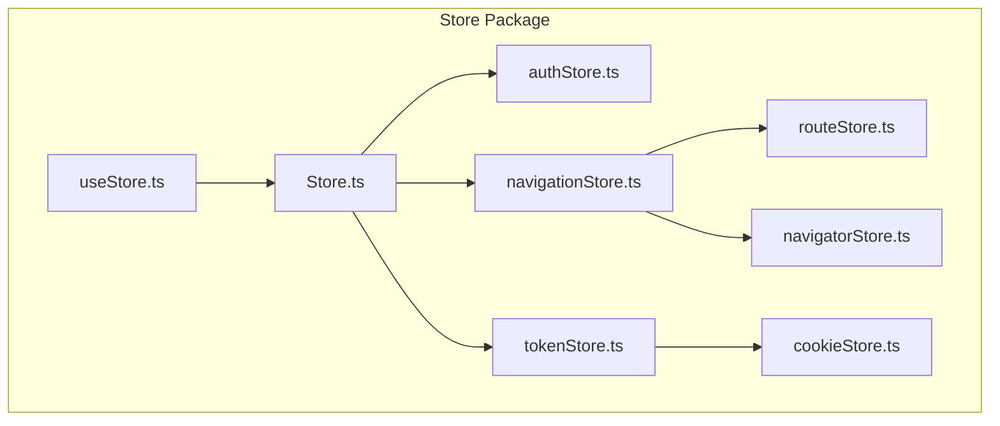
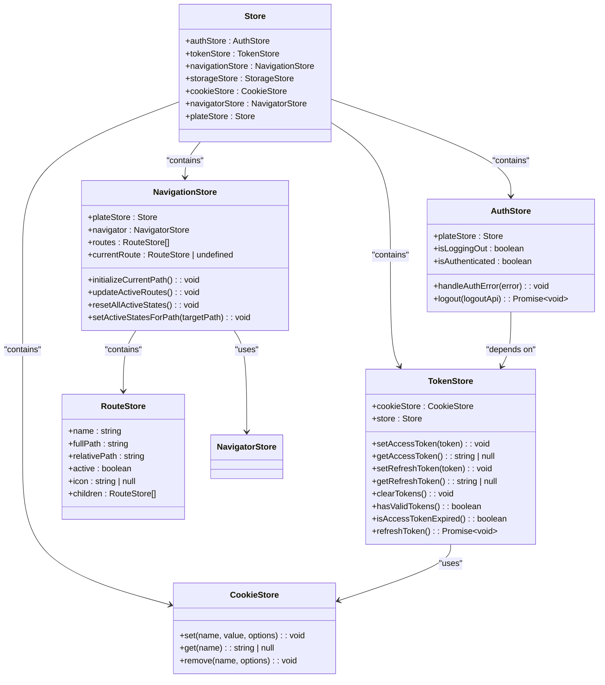
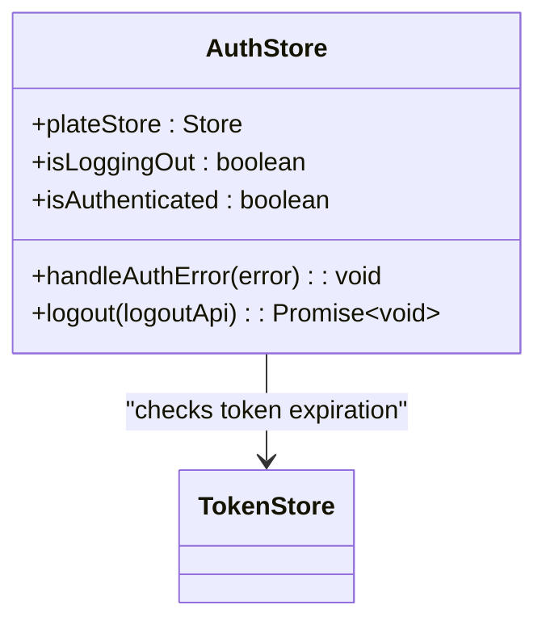
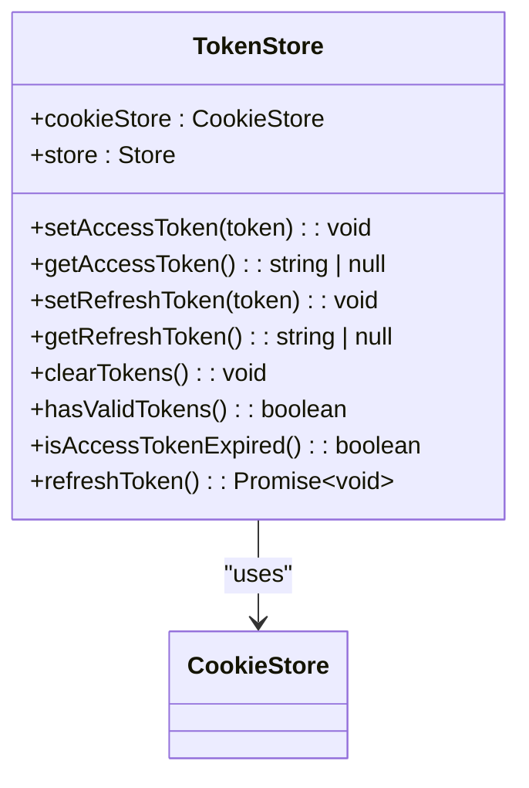
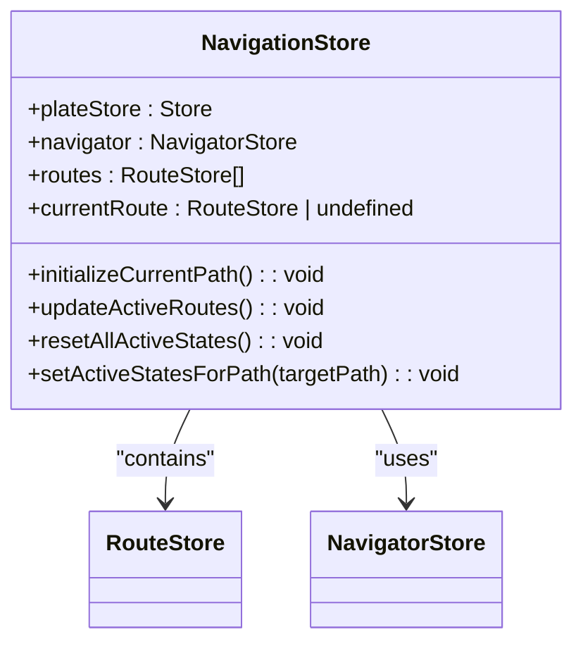
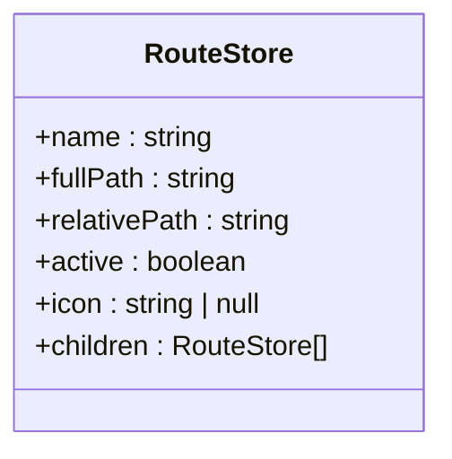
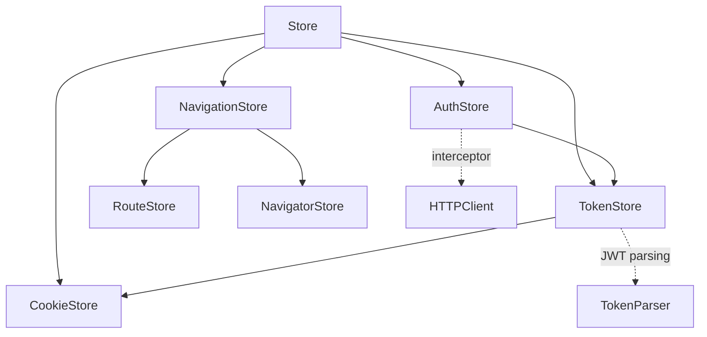

# MobX State Stores

<cite>
**Referenced Files in This Document**   
- [authStore.ts](file://packages/store/src/stores/authStore.ts)
- [tokenStore.ts](file://packages/store/src/stores/tokenStore.ts)
- [navigationStore.ts](file://packages/store/src/stores/navigationStore.ts)
- [routeStore.ts](file://packages/store/src/stores/routeStore.ts)
- [cookieStore.ts](file://packages/store/src/stores/cookieStore.ts)
- [Store.ts](file://packages/store/src/stores/Store.ts)
- [useStore.ts](file://packages/store/src/stores/useStore.ts)
- [navigatorStore.ts](file://packages/store/src/stores/navigatorStore.ts)
</cite>

## Table of Contents
1. [Introduction](#introduction)
2. [Project Structure](#project-structure)
3. [Core Components](#core-components)
4. [Architecture Overview](#architecture-overview)
5. [Detailed Component Analysis](#detailed-component-analysis)
6. [Dependency Analysis](#dependency-analysis)
7. [Performance Considerations](#performance-considerations)
8. [Troubleshooting Guide](#troubleshooting-guide)
9. [Conclusion](#conclusion)

## Introduction
This document provides comprehensive documentation for the MobX store implementations in prj-core, focusing on the state management architecture for authentication, token handling, navigation, and routing. The documentation details the observables, actions, and computed properties within each store, explains the reactivity patterns used, and describes how state changes trigger UI updates. It also covers persistence mechanisms, error handling strategies, and the technical decisions behind using MobX decorators for observable state management.

## Project Structure

**Diagram sources**
- [Store.ts](file://packages/store/src/stores/Store.ts)
- [authStore.ts](file://packages/store/src/stores/authStore.ts)
- [tokenStore.ts](file://packages/store/src/stores/tokenStore.ts)
- [navigationStore.ts](file://packages/store/src/stores/navigationStore.ts)
- [routeStore.ts](file://packages/store/src/stores/routeStore.ts)
- [cookieStore.ts](file://packages/store/src/stores/cookieStore.ts)
- [useStore.ts](file://packages/store/src/stores/useStore.ts)
- [navigatorStore.ts](file://packages/store/src/stores/navigatorStore.ts)

**Section sources**
- [Store.ts](file://packages/store/src/stores/Store.ts)
- [authStore.ts](file://packages/store/src/stores/authStore.ts)
- [tokenStore.ts](file://packages/store/src/stores/tokenStore.ts)

## Core Components

The MobX store implementation in prj-core consists of several key components that work together to manage application state. The core stores include AuthStore for authentication state, TokenStore for token management, NavigationStore for navigation state, and RouteStore for route information. These stores are interconnected through a central Store class that serves as the root store, providing access to all other stores. The implementation leverages MobX's reactivity system to automatically update UI components when state changes occur.

**Section sources**
- [authStore.ts](file://packages/store/src/stores/authStore.ts)
- [tokenStore.ts](file://packages/store/src/stores/tokenStore.ts)
- [navigationStore.ts](file://packages/store/src/stores/navigationStore.ts)
- [routeStore.ts](file://packages/store/src/stores/routeStore.ts)

## Architecture Overview

**Diagram sources**
- [Store.ts](file://packages/store/src/stores/Store.ts)
- [authStore.ts](file://packages/store/src/stores/authStore.ts)
- [tokenStore.ts](file://packages/store/src/stores/tokenStore.ts)
- [navigationStore.ts](file://packages/store/src/stores/navigationStore.ts)
- [routeStore.ts](file://packages/store/src/stores/routeStore.ts)
- [cookieStore.ts](file://packages/store/src/stores/cookieStore.ts)
- [navigatorStore.ts](file://packages/store/src/stores/navigatorStore.ts)

## Detailed Component Analysis

### AuthStore Analysis

The AuthStore manages authentication state and related operations within the application. It maintains a reference to the root store and tracks whether a logout operation is in progress.

**Diagram sources**
- [authStore.ts](file://packages/store/src/stores/authStore.ts)
- [tokenStore.ts](file://packages/store/src/stores/tokenStore.ts)

**Section sources**
- [authStore.ts](file://packages/store/src/stores/authStore.ts)

### TokenStore Analysis

The TokenStore handles token persistence and validation, using cookies for storage to ensure tokens persist across application restarts and browser sessions.

**Diagram sources**
- [tokenStore.ts](file://packages/store/src/stores/tokenStore.ts)
- [cookieStore.ts](file://packages/store/src/stores/cookieStore.ts)

**Section sources**
- [tokenStore.ts](file://packages/store/src/stores/tokenStore.ts)
- [cookieStore.ts](file://packages/store/src/stores/cookieStore.ts)

### NavigationStore Analysis

The NavigationStore manages navigation state, including the current route and active route highlighting. It works with RouteStore instances to maintain the navigation hierarchy.

**Diagram sources**
- [navigationStore.ts](file://packages/store/src/stores/navigationStore.ts)
- [routeStore.ts](file://packages/store/src/stores/routeStore.ts)
- [navigatorStore.ts](file://packages/store/src/stores/navigatorStore.ts)

**Section sources**
- [navigationStore.ts](file://packages/store/src/stores/navigationStore.ts)
- [routeStore.ts](file://packages/store/src/stores/routeStore.ts)
- [navigatorStore.ts](file://packages/store/src/stores/navigatorStore.ts)

### RouteStore Analysis

The RouteStore represents individual routes in the application, maintaining information about the route's name, path, and active state.

**Diagram sources**
- [routeStore.ts](file://packages/store/src/stores/routeStore.ts)

**Section sources**
- [routeStore.ts](file://packages/store/src/stores/routeStore.ts)

## Dependency Analysis

**Diagram sources**
- [Store.ts](file://packages/store/src/stores/Store.ts)
- [authStore.ts](file://packages/store/src/stores/authStore.ts)
- [tokenStore.ts](file://packages/store/src/stores/tokenStore.ts)
- [navigationStore.ts](file://packages/store/src/stores/navigationStore.ts)
- [routeStore.ts](file://packages/store/src/stores/routeStore.ts)
- [cookieStore.ts](file://packages/store/src/stores/cookieStore.ts)
- [navigatorStore.ts](file://packages/store/src/stores/navigatorStore.ts)

**Section sources**
- [Store.ts](file://packages/store/src/stores/Store.ts)
- [authStore.ts](file://packages/store/src/stores/authStore.ts)
- [tokenStore.ts](file://packages/store/src/stores/tokenStore.ts)
- [navigationStore.ts](file://packages/store/src/stores/navigationStore.ts)

## Performance Considerations

The MobX store implementation in prj-core follows performance best practices by using makeAutoObservable to automatically detect and track observable properties, actions, and computed values. The stores are designed to minimize unnecessary re-renders by only exposing the minimal required state to components. The navigation store efficiently updates active route states through a recursive algorithm that sets active states for parent routes when child routes are active. Token validation is performed client-side by parsing JWT tokens to check expiration, avoiding unnecessary network requests for token validation.

## Troubleshooting Guide

When troubleshooting issues with the MobX store implementation, consider the following common scenarios:

1. **Authentication state not updating**: Verify that the token store's isAccessTokenExpired method correctly parses the JWT token and compares the expiration timestamp with the current time.

2. **Navigation state not reflecting current route**: Check that the initializeCurrentPath method in NavigationStore correctly sets the current route based on the window location pathname.

3. **Token persistence issues**: Ensure that the cookie store is properly setting cookies with the correct attributes (secure, sameSite) for the application's deployment environment.

4. **Logout functionality not working**: Verify that the logout method properly clears tokens from cookies and redirects to the login page, even if the backend logout API call fails.

5. **Route highlighting not working**: Confirm that the updateActiveRoutes method correctly traverses the route hierarchy to set active states on parent routes when child routes are active.

**Section sources**
- [authStore.ts](file://packages/store/src/stores/authStore.ts)
- [tokenStore.ts](file://packages/store/src/stores/tokenStore.ts)
- [navigationStore.ts](file://packages/store/src/stores/navigationStore.ts)
- [cookieStore.ts](file://packages/store/src/stores/cookieStore.ts)

## Conclusion

The MobX store implementation in prj-core provides a robust state management solution for handling authentication, token management, and navigation state. By leveraging MobX's reactivity system, the stores automatically update dependent components when state changes occur, reducing the need for manual state management. The use of cookies for token storage ensures persistence across application restarts, while the hierarchical route store structure enables complex navigation patterns with proper active state management. The architecture demonstrates a clean separation of concerns between different state domains while maintaining necessary inter-store dependencies for cohesive application behavior.