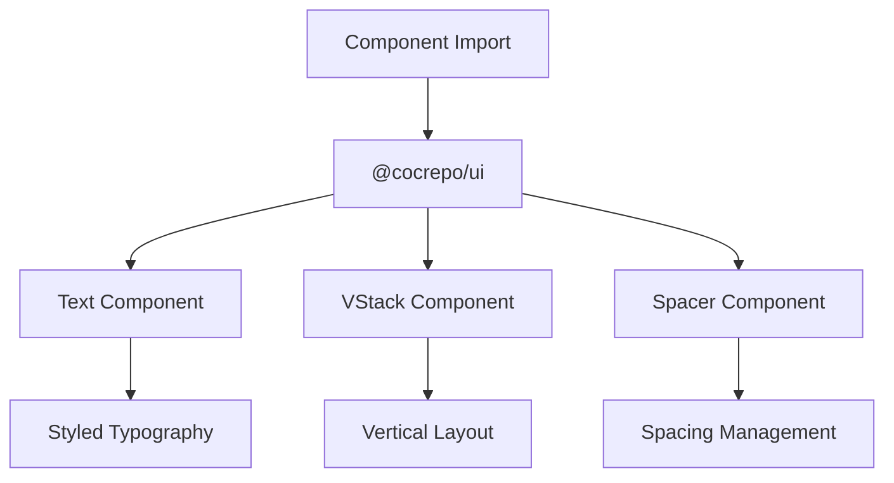

# Component Consumption Patterns

<cite>
**Referenced Files in This Document**   
- [package.json](file://apps/admin/package.json)
- [App.tsx](file://apps/admin/src/App.tsx)
- [index.tsx](file://apps/admin/src/routes/admin/dashboard/index.tsx)
- [package.json](file://apps/mobile/package.json)
- [shared-frontend](file://packages/shared-frontend)
- [ui](file://packages/shared-frontend/src/components/ui)
</cite>

## Table of Contents
1. [Introduction](#introduction)
2. [Shared Component Architecture](#shared-component-architecture)
3. [Admin Application Component Consumption](#admin-application-component-consumption)
4. [Mobile Application Component Adaptation](#mobile-application-component-adaptation)
5. [Module Resolution in Monorepo](#module-resolution-in-monorepo)
6. [Cross-Platform Component Usage Patterns](#cross-platform-component-usage-patterns)
7. [Platform-Specific Prop Management](#platform-specific-prop-management)
8. [Conclusion](#conclusion)

## Introduction
This document details the patterns used for consuming shared components across the admin and mobile applications within the monorepo architecture. It examines how both applications leverage the shared-frontend package to maintain consistency in UI components while adapting to their respective rendering environments. The analysis covers import mechanisms, component usage, and platform-specific adaptations that enable code reuse across web and mobile platforms.

## Shared Component Architecture
The shared-frontend package serves as the central repository for UI components used across multiple applications in the monorepo. This package contains a comprehensive collection of reusable components organized into logical categories such as layout, form, inputs, and ui. The architecture enables both the admin (web) and mobile (React Native) applications to consume identical component implementations through standardized import patterns, promoting design consistency and reducing duplication.

**Section sources**
- [shared-frontend](file://packages/shared-frontend)

## Admin Application Component Consumption
The admin application consumes shared components through direct imports using the package name rather than relative paths. Components from the shared-frontend package are imported using the `@cocrepo/ui` namespace, which provides access to UI elements such as Text, VStack, Spacer, and other layout components. These components are utilized in route implementations to create consistent user interfaces across the application.

For example, the dashboard component imports and uses shared components to create a structured layout with proper spacing and typography. The import pattern demonstrates the use of named imports from the shared package, allowing the admin application to leverage pre-styled components that adhere to the design system.

**Diagram sources**
- [index.tsx](file://apps/admin/src/routes/admin/dashboard/index.tsx)

**Section sources**
- [package.json](file://apps/admin/package.json)
- [index.tsx](file://apps/admin/src/routes/admin/dashboard/index.tsx)

## Mobile Application Component Adaptation
The mobile application adapts web components from the shared-frontend package for React Native usage through platform-specific implementations and wrappers. While the import patterns remain consistent with the admin application, the underlying component implementations may include conditional logic or platform detection to handle differences between web and native environments.

The adaptation process involves creating wrappers that translate web-specific properties and behaviors to their React Native equivalents, ensuring that components function correctly across both platforms. This approach allows the mobile application to use the same component API as the admin application while accounting for platform-specific requirements and limitations.

**Section sources**
- [package.json](file://apps/mobile/package.json)

## Module Resolution in Monorepo
The monorepo utilizes workspace dependencies to enable importing components using package names rather than relative paths. This module resolution setup is configured through the pnpm-workspace.yaml file and package.json workspaces configuration, allowing packages to reference each other using their published names with the "workspace:*" version specifier.

When a component is imported using `@cocrepo/ui`, the module resolution system locates the corresponding package in the monorepo and establishes a direct link, enabling seamless development and automatic updates when shared components are modified. This approach eliminates the need for publishing packages to a registry during development and ensures that both applications always use the latest version of shared components.

**Diagram sources**
- [package.json](file://apps/admin/package.json)
- [package.json](file://apps/mobile/package.json)

**Section sources**
- [package.json](file://apps/admin/package.json)
- [package.json](file://apps/mobile/package.json)

## Cross-Platform Component Usage Patterns
Both the admin and mobile applications demonstrate identical component usage patterns despite operating in different rendering environments. The shared-frontend package enables this consistency by providing a unified API for components that abstracts away platform-specific implementation details.

Components are designed with cross-platform compatibility in mind, using conditional logic and platform detection to adapt behavior as needed. This allows developers to write code that works identically across both applications, reducing cognitive load and minimizing the risk of inconsistencies in user experience.

The usage pattern follows a consistent approach:
1. Import components using the package name
2. Use components with standardized props
3. Rely on internal platform detection for rendering differences
4. Maintain identical component APIs across platforms

**Section sources**
- [index.tsx](file://apps/admin/src/routes/admin/dashboard/index.tsx)

## Platform-Specific Prop Management
Component props are managed through conditional logic and platform detection to handle differences between web and mobile environments. The shared components include logic that detects the current platform and adjusts behavior accordingly, ensuring optimal performance and user experience on each platform.

For example, touch handling, gesture recognition, and accessibility features may differ between web and mobile, requiring platform-specific implementations. These differences are encapsulated within the shared components, exposing a consistent API to consuming applications while handling platform variations internally.

The prop management strategy includes:
- Default props that work across platforms
- Platform-specific overrides when necessary
- Conditional rendering based on environment detection
- Unified event handling APIs that translate to platform-appropriate events

**Section sources**
- [shared-frontend](file://packages/shared-frontend)

## Conclusion
The component consumption patterns across the admin and mobile applications demonstrate an effective approach to code sharing in a monorepo architecture. By leveraging the shared-frontend package and standardized import patterns, both applications maintain UI consistency while adapting to their respective platforms. The module resolution system enables seamless development workflows, and the component design accommodates platform differences through internal conditional logic, providing a unified API for developers. This architecture promotes code reuse, reduces maintenance overhead, and ensures a consistent user experience across all applications.