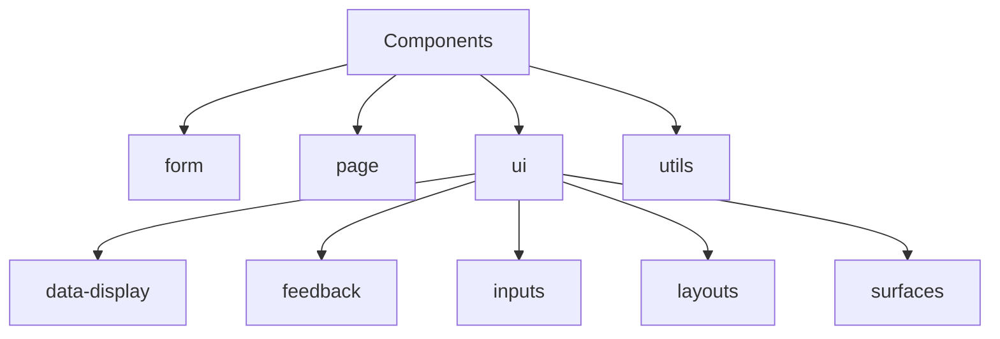
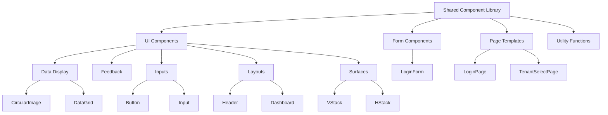
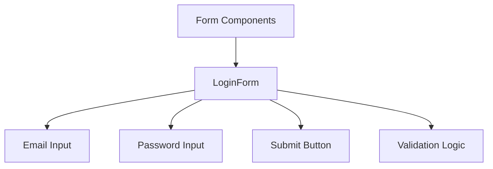
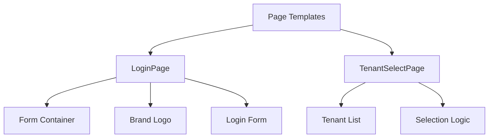
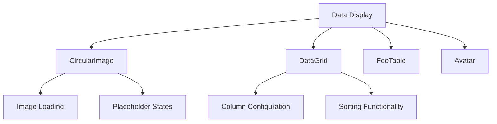
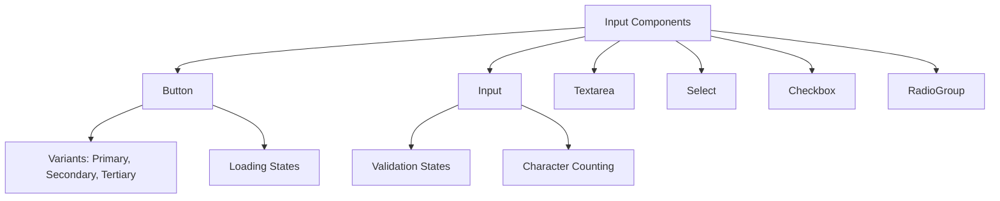
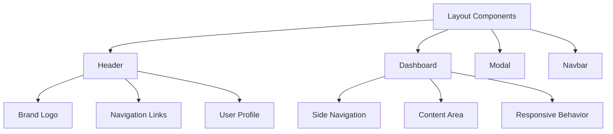
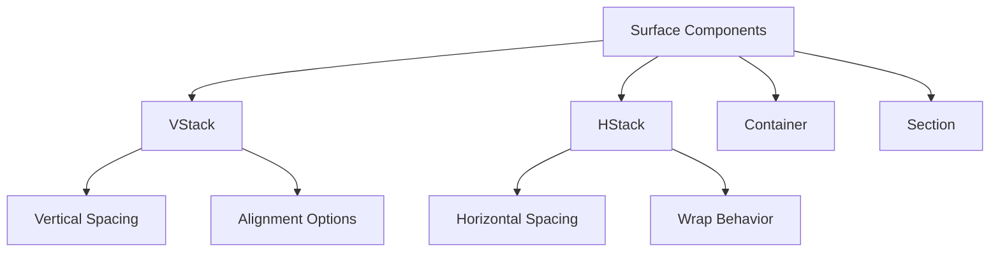
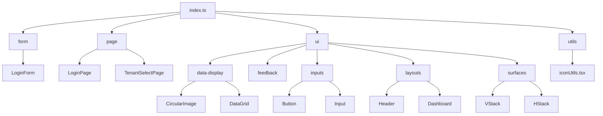

# Shared Component Architecture

<cite>
**Referenced Files in This Document**   
- [index.ts](file://packages/ui/src/components/index.ts)
- [LoginForm.tsx](file://packages/ui/src/components/form/LoginForm.tsx)
- [LoginPage.tsx](file://packages/ui/src/components/page/LoginPage.tsx)
- [CircularImage.tsx](file://packages/ui/src/components/ui/data-display/CircularImage/CircularImage.tsx)
- [DataGrid.tsx](file://packages/ui/src/components/ui/data-display/DataGrid/DataGrid.tsx)
- [Button.tsx](file://packages/ui/src/components/ui/inputs/Button/Button.tsx)
- [Input.tsx](file://packages/ui/src/components/ui/inputs/Input/Input.tsx)
- [Header.tsx](file://packages/ui/src/components/ui/layouts/Header/Header.tsx)
- [Dashboard.tsx](file://packages/ui/src/components/ui/layouts/Dashboard/Dashboard.tsx)
- [VStack.tsx](file://packages/ui/src/components/ui/surfaces/VStack/VStack.tsx)
- [iconUtils.tsx](file://packages/ui/src/utils/iconUtils.tsx)
</cite>

## Table of Contents
1. [Introduction](#introduction)
2. [Project Structure](#project-structure)
3. [Core Components](#core-components)
4. [Architecture Overview](#architecture-overview)
5. [Detailed Component Analysis](#detailed-component-analysis)
6. [Dependency Analysis](#dependency-analysis)
7. [Performance Considerations](#performance-considerations)
8. [Troubleshooting Guide](#troubleshooting-guide)
9. [Conclusion](#conclusion)

## Introduction
The shared component library, located in the `packages/ui` directory, provides a comprehensive set of reusable UI components for both the admin web application and mobile app. This document details the architecture of this component library, focusing on its organizational structure, categorization system, and the provider patterns used for global state management and configuration.

## Project Structure

The component library follows a well-organized directory structure that categorizes components by their functionality and usage patterns. The main components are organized into four primary categories: form, page, ui, and utility functions.

**Diagram sources**
- [index.ts](file://packages/ui/src/components/index.ts)
- [components directory structure](file://packages/ui/src/components/)

**Section sources**
- [index.ts](file://packages/ui/src/components/index.ts)

## Core Components

The component library is structured around several core categories that reflect different aspects of UI development. The form category contains components specifically designed for data input and submission, such as the LoginForm component. The page category includes complete page templates like LoginPage and TenantSelectPage that serve as ready-to-use screens for common application flows.

The ui category is further subdivided into specialized subcategories including data-display components for presenting information, feedback components for user notifications, inputs for various form controls, layouts for page structure, and surfaces for basic container elements. This hierarchical organization enables developers to quickly locate appropriate components based on their specific use case.

**Section sources**
- [LoginForm.tsx](file://packages/ui/src/components/form/LoginForm.tsx)
- [LoginPage.tsx](file://packages/ui/src/components/page/LoginPage.tsx)
- [CircularImage.tsx](file://packages/ui/src/components/ui/data-display/CircularImage/CircularImage.tsx)
- [DataGrid.tsx](file://packages/ui/src/components/ui/data-display/DataGrid/DataGrid.tsx)
- [Button.tsx](file://packages/ui/src/components/ui/inputs/Button/Button.tsx)

## Architecture Overview

The component library architecture is designed to support both the admin web application and mobile app through a shared codebase. The architecture follows a modular approach with clear separation of concerns, enabling easy maintenance and extension of components.

**Diagram sources**
- [components directory structure](file://packages/ui/src/components/)
- [index.ts](file://packages/ui/src/components/index.ts)

## Detailed Component Analysis

### Component Categorization System

The component library employs a systematic categorization approach that organizes components based on their primary function and usage context. This organization enhances discoverability and promotes consistent usage patterns across different applications.

#### Form Components
Form components are dedicated to data input and submission workflows. These components typically include validation logic and are designed to work together in form contexts.

**Diagram sources**
- [LoginForm.tsx](file://packages/ui/src/components/form/LoginForm.tsx)

#### Page Templates
Page templates provide complete screen implementations for common application flows. These components serve as starting points for specific views and can be customized as needed.

**Diagram sources**
- [LoginPage.tsx](file://packages/ui/src/components/page/LoginPage.tsx)
- [TenantSelectPage.tsx](file://packages/ui/src/components/page/TenantSelectPage.tsx)

#### UI Components
UI components are further organized into specialized subcategories based on their visual and functional characteristics.

##### Data Display Components
These components focus on presenting information in a clear and visually appealing manner.

**Diagram sources**
- [CircularImage.tsx](file://packages/ui/src/components/ui/data-display/CircularImage/CircularImage.tsx)
- [DataGrid.tsx](file://packages/ui/src/components/ui/data-display/DataGrid/DataGrid.tsx)

##### Input Components
Input components provide various controls for user interaction and data entry.

**Diagram sources**
- [Button.tsx](file://packages/ui/src/components/ui/inputs/Button/Button.tsx)
- [Input.tsx](file://packages/ui/src/components/ui/inputs/Input/Input.tsx)

##### Layout Components
Layout components help structure the overall page organization and navigation.

**Diagram sources**
- [Header.tsx](file://packages/ui/src/components/ui/layouts/Header/Header.tsx)
- [Dashboard.tsx](file://packages/ui/src/components/ui/layouts/Dashboard/Dashboard.tsx)

##### Surface Components
Surface components provide basic container elements for organizing content.

**Diagram sources**
- [VStack.tsx](file://packages/ui/src/components/ui/surfaces/VStack/VStack.tsx)
- [HStack.tsx](file://packages/ui/src/components/ui/surfaces/HStack/HStack.tsx)

**Section sources**
- [components directory structure](file://packages/ui/src/components/)

## Dependency Analysis

The component library has a well-defined dependency structure that ensures components can be used independently while maintaining consistency across the system.

**Diagram sources**
- [index.ts](file://packages/ui/src/components/index.ts)
- [components directory structure](file://packages/ui/src/components/)

**Section sources**
- [index.ts](file://packages/ui/src/components/index.ts)

## Performance Considerations

The component library is designed with performance in mind, utilizing several optimization strategies:

1. **Tree-shaking support**: The export structure in index.ts enables bundlers to eliminate unused components during the build process.
2. **Lazy loading patterns**: Components are organized in a way that supports code splitting and lazy loading when needed.
3. **Memoization**: Frequently used components implement React.memo to prevent unnecessary re-renders.
4. **Efficient styling**: The component library leverages utility-first CSS principles to minimize style bloat.

## Troubleshooting Guide

When working with the shared component library, consider the following common issues and solutions:

1. **Component not found**: Ensure you're importing from the correct path. All components should be imported from the main package entry point.
2. **Styling issues**: Verify that the required peer dependencies are installed and properly configured.
3. **Type errors**: Make sure you have the correct TypeScript configuration and dependencies.
4. **Performance problems**: Check for unnecessary re-renders and consider implementing memoization for complex components.

**Section sources**
- [index.ts](file://packages/ui/src/components/index.ts)
- [iconUtils.tsx](file://packages/ui/src/utils/iconUtils.tsx)

## Conclusion

The shared component library provides a robust foundation for building consistent user interfaces across both the admin web application and mobile app. Its well-organized structure, clear categorization system, and comprehensive set of components enable rapid development while maintaining design consistency. The library's architecture supports scalability and extensibility, making it easy to add new components while maintaining backward compatibility. By following the established patterns and conventions, developers can efficiently build high-quality user interfaces that provide a cohesive experience across different platforms.