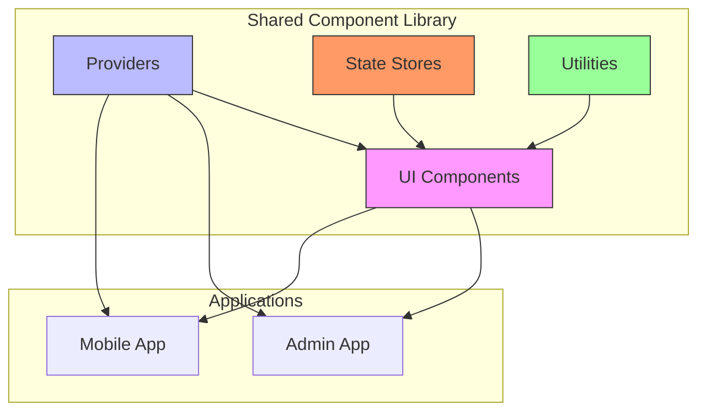
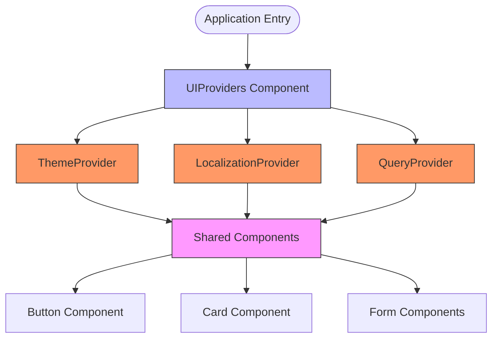
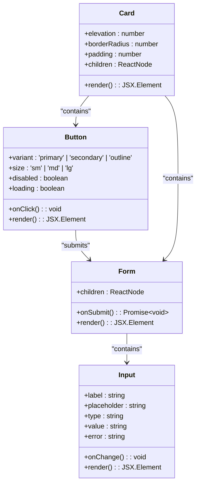

# Shared Component Consumption

<cite>
**Referenced Files in This Document**   
- [Button.tsx](file://packages/ui/src/components/ui/Button/Button.tsx)
- [Card.tsx](file://packages/ui/src/components/ui/Card/Card.tsx)
- [Form.tsx](file://packages/ui/src/components/form/Form.tsx)
- [UIProviders.tsx](file://packages/shared-frontend/src/provider/UIProviders/UIProviders.tsx)
- [App.tsx](file://apps/admin/src/App.tsx)
- [AppProviders.tsx](file://packages/shared-frontend/src/provider/AppProviders/AppProviders.tsx)
- [login.tsx](file://apps/mobile/src/app/login.tsx)
- [dashboard.tsx](file://apps/admin/src/routes/admin/dashboard.tsx)
</cite>

## Table of Contents
1. [Introduction](#introduction)
2. [Component Library Architecture](#component-library-architecture)
3. [Consumption in Admin Application](#consumption-in-admin-application)
4. [Consumption in Mobile Application](#consumption-in-mobile-application)
5. [UIProviders Configuration](#uiproviders-configuration)
6. [Component Implementation Examples](#component-implementation-examples)
7. [Cross-Platform Challenges and Solutions](#cross-platform-challenges-and-solutions)
8. [Conclusion](#conclusion)

## Introduction
This document details how shared components from the shared-frontend package are consumed by both the admin and mobile applications within the prj-core repository. The architecture enables UI consistency across platforms while accommodating the specific requirements of React and React Native environments. The shared component library serves as a central source of truth for UI elements, ensuring design system coherence and reducing duplication across applications.

## Component Library Architecture
The shared component library architecture is designed to provide a unified UI experience across different frontend applications. The core components are organized in a modular structure within the packages/ui and packages/shared-frontend directories, allowing for easy consumption and maintenance. The architecture follows a provider pattern for global configuration and state management, enabling consistent theming, localization, and other application-wide settings.

**Diagram sources**
- [packages/ui/src/components/ui/Button/Button.tsx](file://packages/ui/src/components/ui/Button/Button.tsx)
- [packages/shared-frontend/src/provider/UIProviders/UIProviders.tsx](file://packages/shared-frontend/src/provider/UIProviders/UIProviders.tsx)

**Section sources**
- [packages/ui/src/components/ui/Button/Button.tsx](file://packages/ui/src/components/ui/Button/Button.tsx)
- [packages/shared-frontend/src/provider/AppProviders.tsx](file://packages/shared-frontend/src/provider/AppProviders/AppProviders.tsx)

## Consumption in Admin Application
The admin application consumes shared components through a well-defined import structure that ensures consistency and ease of use. Components are imported from the shared-frontend package and integrated into the application's React-based UI. The admin application leverages the shared component library to maintain UI consistency across its various routes and views, including authentication and dashboard interfaces.

The App component in the admin application serves as the entry point and wraps the entire application with necessary providers that configure the shared components with global settings such as theme and localization.

**Section sources**
- [apps/admin/src/App.tsx](file://apps/admin/src/App.tsx)
- [apps/admin/src/routes/admin/dashboard.tsx](file://apps/admin/src/routes/admin/dashboard.tsx)

## Consumption in Mobile Application
The mobile application consumes shared components in a React Native environment, requiring specific adaptations for the mobile platform. The component library is designed to handle platform-specific differences through conditional rendering and platform detection mechanisms. This allows the same component interfaces to be used across both web and mobile applications while rendering appropriately for each platform.

The mobile application's structure includes platform-specific adaptations in its component usage, particularly in layout and navigation patterns that differ from the admin application's web-based approach.

**Section sources**
- [apps/mobile/src/app/login.tsx](file://apps/mobile/src/app/login.tsx)
- [apps/mobile/src/app/_layout.tsx](file://apps/mobile/src/app/_layout.tsx)

## UIProviders Configuration
The UIProviders component plays a crucial role in configuring shared components with global settings such as theme, localization, and other application-wide configurations. This provider pattern ensures that all shared components have access to consistent state and settings, enabling a cohesive user experience across both applications.

The UIProviders component wraps the application and makes configuration available to all shared components through React's context API. This approach allows components to adapt their appearance and behavior based on the current theme, language, and other global settings without requiring explicit props to be passed through multiple levels of the component tree.

**Diagram sources**
- [packages/shared-frontend/src/provider/UIProviders/UIProviders.tsx](file://packages/shared-frontend/src/provider/UIProviders/UIProviders.tsx)
- [packages/shared-frontend/src/provider/AppProviders.tsx](file://packages/shared-frontend/src/provider/AppProviders.tsx)

**Section sources**
- [packages/shared-frontend/src/provider/UIProviders/UIProviders.tsx](file://packages/shared-frontend/src/provider/UIProviders/UIProviders.tsx)
- [packages/shared-frontend/src/provider/AppProviders/AppProviders.tsx](file://packages/shared-frontend/src/provider/AppProviders/AppProviders.tsx)

## Component Implementation Examples
The shared component library provides concrete implementations of common UI elements such as Button, Card, and Form components that are used consistently across both the admin and mobile applications. These components are designed with flexibility in mind, allowing for various configurations while maintaining a consistent design language.

### Button Component Usage
The Button component is implemented as a versatile UI element that can be configured with different variants, sizes, and states. Both applications use the same Button interface, with platform-specific styling applied based on the runtime environment.

### Card Component Usage
The Card component provides a container for related content and actions, with consistent padding, elevation, and border radius across applications. The implementation handles platform differences in shadow rendering and touch targets between web and mobile environments.

### Form Components Usage
Form components, including inputs, labels, and validation, are implemented to provide a consistent user experience across platforms. The shared library handles form state management and validation logic, while adapting the visual presentation to each platform's conventions.

**Diagram sources**
- [packages/ui/src/components/ui/Button/Button.tsx](file://packages/ui/src/components/ui/Button/Button.tsx)
- [packages/ui/src/components/ui/Card/Card.tsx](file://packages/ui/src/components/ui/Card/Card.tsx)
- [packages/ui/src/components/form/Form.tsx](file://packages/ui/src/components/form/Form.tsx)

**Section sources**
- [packages/ui/src/components/ui/Button/Button.tsx](file://packages/ui/src/components/ui/Button/Button.tsx)
- [packages/ui/src/components/ui/Card/Card.tsx](file://packages/ui/src/components/ui/Card/Card.tsx)
- [packages/ui/src/components/form/Form.tsx](file://packages/ui/src/components/form/Form.tsx)

## Cross-Platform Challenges and Solutions
Maintaining a shared component library across different frontend frameworks presents several challenges, particularly when supporting both React and React Native environments. The architecture employs several strategies to address these challenges and ensure a consistent developer and user experience.

### Platform Detection and Conditional Rendering
The component library uses platform detection to apply appropriate styling and behavior based on the runtime environment. This allows components to leverage native platform conventions while maintaining a consistent API surface for developers.

### Responsive Design Patterns
Components are designed with responsive principles in mind, adapting their layout and interaction patterns based on screen size and device capabilities. This ensures optimal user experience across desktop, tablet, and mobile devices.

### Themed Styling System
The styling system is built around a theme configuration that can be customized for each application while maintaining core design principles. This allows for brand consistency within each application while ensuring UI coherence across the shared component library.

### Type Safety and Interface Consistency
The component library leverages TypeScript to ensure type safety and interface consistency across all components. This reduces runtime errors and provides better developer experience through improved tooling support.

**Section sources**
- [packages/shared-frontend/src/provider/UIProviders/UIProviders.tsx](file://packages/shared-frontend/src/provider/UIProviders/UIProviders.tsx)
- [packages/ui/src/components/ui/Button/Button.tsx](file://packages/ui/src/components/ui/Button/Button.tsx)
- [packages/ui/src/components/ui/Card/Card.tsx](file://packages/ui/src/components/ui/Card/Card.tsx)

## Conclusion
The shared component library architecture successfully enables UI consistency across the admin and mobile applications while accommodating the specific requirements of each platform. By leveraging a provider pattern for global configuration and implementing platform-aware components, the architecture provides a robust foundation for maintaining a cohesive design system. The use of TypeScript ensures type safety and interface consistency, while the modular structure allows for easy maintenance and extension of the component library. This approach reduces duplication, improves development efficiency, and ensures a consistent user experience across all applications in the ecosystem.