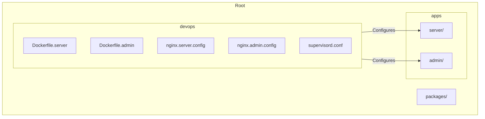
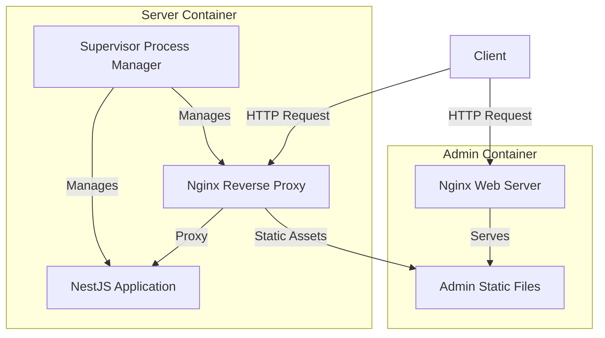
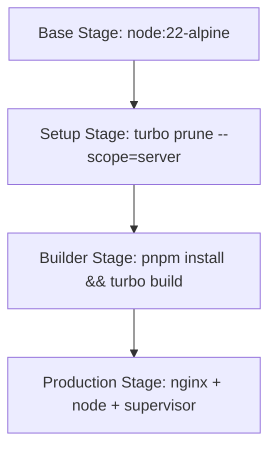
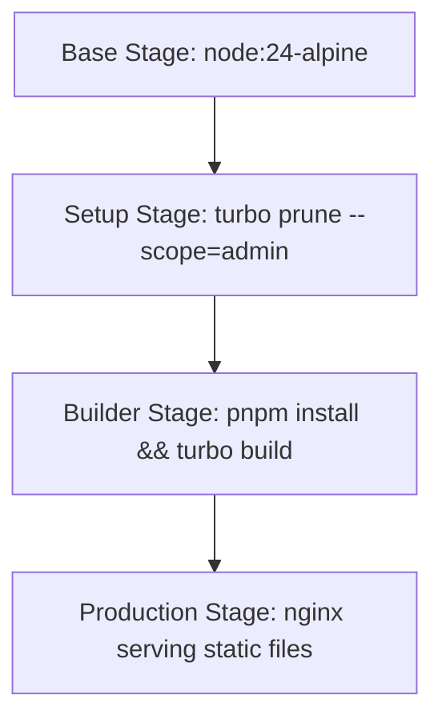
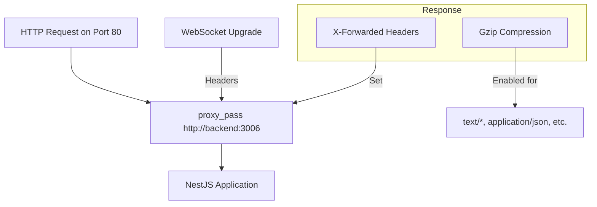
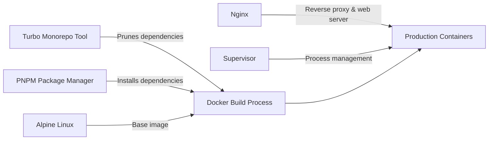

# Container Orchestration with Docker Compose

<cite>
**Referenced Files in This Document**   
- [Dockerfile.server](file://devops/Dockerfile.server)
- [Dockerfile.admin](file://devops/Dockerfile.admin)
- [nginx.server.config](file://devops/nginx.server.config)
- [nginx.admin.config](file://devops/nginx.admin.config)
- [supervisord.conf](file://devops/supervisord.conf)
- [README.md](file://README.md)
- [package.json](file://package.json)
</cite>

## Table of Contents
1. [Introduction](#introduction)
2. [Project Structure](#project-structure)
3. [Core Components](#core-components)
4. [Architecture Overview](#architecture-overview)
5. [Detailed Component Analysis](#detailed-component-analysis)
6. [Dependency Analysis](#dependency-analysis)
7. [Performance Considerations](#performance-considerations)
8. [Troubleshooting Guide](#troubleshooting-guide)
9. [Conclusion](#conclusion)

## Introduction
This document provides comprehensive documentation for the container orchestration strategy in prj-core using Docker Compose. The system is designed to deploy a NestJS server, admin frontend application, and supporting services in a production-ready configuration. The orchestration setup leverages multi-stage Docker builds, Nginx reverse proxying, and process supervision to ensure efficient, scalable, and reliable deployment across development, staging, and production environments.

## Project Structure
The project follows a monorepo architecture with multiple applications and shared packages. The container orchestration components are located in the `devops/` directory, which contains Dockerfiles and configuration files for both the server and admin applications. The structure supports independent building and deployment of services while maintaining shared configuration and tooling through the monorepo setup.

**Diagram sources**
- [Dockerfile.server](file://devops/Dockerfile.server)
- [Dockerfile.admin](file://devops/Dockerfile.admin)
- [nginx.server.config](file://devops/nginx.server.config)
- [nginx.admin.config](file://devops/nginx.admin.config)

**Section sources**
- [Dockerfile.server](file://devops/Dockerfile.server)
- [Dockerfile.admin](file://devops/Dockerfile.admin)

## Core Components
The container orchestration strategy in prj-core consists of several core components that work together to deploy and manage the application services. These include multi-stage Docker builds for both the NestJS server and admin frontend, Nginx configuration for reverse proxying and static file serving, and supervisor for process management in the server container. The build process leverages Turbo for monorepo optimization, ensuring only relevant dependencies are included in each service's container.

**Section sources**
- [Dockerfile.server](file://devops/Dockerfile.server)
- [Dockerfile.admin](file://devops/Dockerfile.admin)
- [supervisord.conf](file://devops/supervisord.conf)

## Architecture Overview
The container orchestration architecture follows a multi-stage build pattern with specialized containers for different purposes. The NestJS server runs in a container that uses supervisor to manage both the Node.js application and Nginx processes, enabling reverse proxy functionality within a single container. The admin frontend is built as static files and served by a lightweight Nginx container. This separation of concerns allows for independent scaling and deployment of frontend and backend services.

**Diagram sources**
- [Dockerfile.server](file://devops/Dockerfile.server)
- [Dockerfile.admin](file://devops/Dockerfile.admin)
- [nginx.server.config](file://devops/nginx.server.config)
- [supervisord.conf](file://devops/supervisord.conf)

## Detailed Component Analysis

### Server Container Analysis
The server container implements a multi-stage build process optimized for production deployment. The base stage sets up Node.js with PNPM and essential system dependencies. The setup stage uses Turbo to prune the monorepo, extracting only the dependencies needed for the server application. The builder stage installs dependencies and builds the application, while the production stage combines Nginx and the Node.js application under supervisor process management.

**Diagram sources**
- [Dockerfile.server](file://devops/Dockerfile.server)

**Section sources**
- [Dockerfile.server](file://devops/Dockerfile.server)

### Admin Container Analysis
The admin container follows a similar multi-stage build pattern but is optimized for serving static frontend assets. The build process extracts only the admin application dependencies using Turbo, installs them, and builds the static files. The production stage uses an Nginx Alpine image to serve these static files, with custom configuration for routing and error handling.

**Diagram sources**
- [Dockerfile.admin](file://devops/Dockerfile.admin)

**Section sources**
- [Dockerfile.admin](file://devops/Dockerfile.admin)

### Nginx Configuration Analysis
The Nginx configuration for the server container sets up reverse proxying from port 80 to the NestJS application on port 3006. It includes WebSocket support, Gzip compression, and proper header forwarding to ensure the application receives accurate client information. The configuration is optimized for performance with worker connections set to 1024 and Gzip compression enabled for text-based content types.

**Diagram sources**
- [nginx.server.config](file://devops/nginx.server.config)

**Section sources**
- [nginx.server.config](file://devops/nginx.server.config)

## Dependency Analysis
The container orchestration strategy leverages several key dependencies and tools to optimize the build and deployment process. The primary dependency is Turbo, which enables monorepo-aware builds by pruning unnecessary files and dependencies. PNPM is used as the package manager for its efficiency and deterministic installations. The build process also depends on Alpine Linux for its small footprint, Nginx for web serving and reverse proxying, and supervisor for process management in the server container.

**Diagram sources**
- [Dockerfile.server](file://devops/Dockerfile.server)
- [Dockerfile.admin](file://devops/Dockerfile.admin)
- [package.json](file://package.json)

**Section sources**
- [Dockerfile.server](file://devops/Dockerfile.server)
- [Dockerfile.admin](file://devops/Dockerfile.admin)
- [package.json](file://package.json)

## Performance Considerations
The container orchestration strategy incorporates several performance optimizations. The multi-stage build process minimizes image size by excluding development dependencies and unnecessary files. The use of Alpine Linux as the base image further reduces the footprint. Caching is implemented in the build process through PNPM store mounting, accelerating subsequent builds. Runtime performance is enhanced through Nginx's Gzip compression and efficient static file serving, while the supervisor process manager ensures high availability by automatically restarting failed processes.

## Troubleshooting Guide
When troubleshooting the container orchestration setup, several key areas should be examined. Build issues may stem from Turbo pruning incorrectly or PNPM installation failures, which can be addressed by verifying the monorepo structure and network connectivity. Runtime issues with the server container may involve Nginx configuration errors or Node.js application startup failures, which can be diagnosed through the supervisor logs. Connectivity issues may require checking the port mappings and reverse proxy configuration in the Nginx settings.

**Section sources**
- [Dockerfile.server](file://devops/Dockerfile.server)
- [Dockerfile.admin](file://devops/Dockerfile.admin)
- [supervisord.conf](file://devops/supervisord.conf)

## Conclusion
The container orchestration strategy in prj-core effectively leverages Docker and related tools to create a robust, production-ready deployment system. By utilizing multi-stage builds, monorepo optimization with Turbo, and specialized container configurations for different services, the system achieves a balance between efficiency, maintainability, and scalability. The architecture supports independent deployment of frontend and backend services while maintaining a cohesive configuration management approach through shared devops assets.