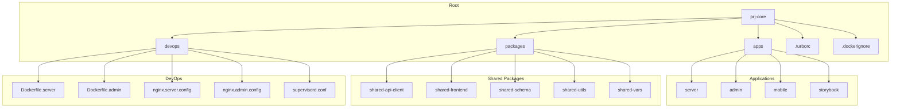
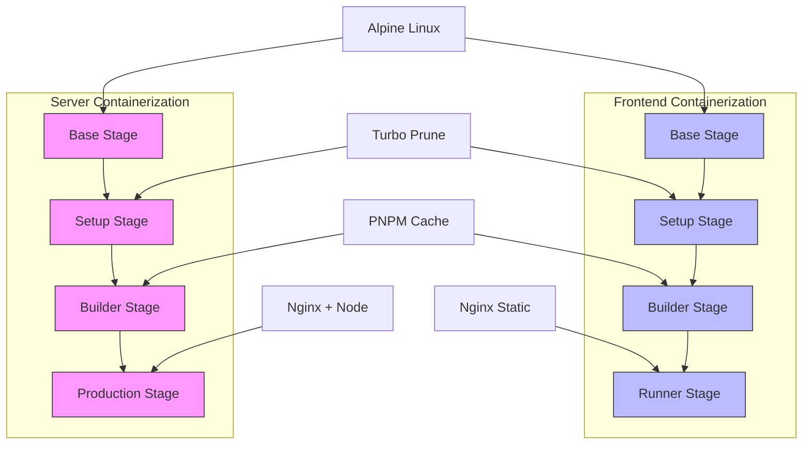
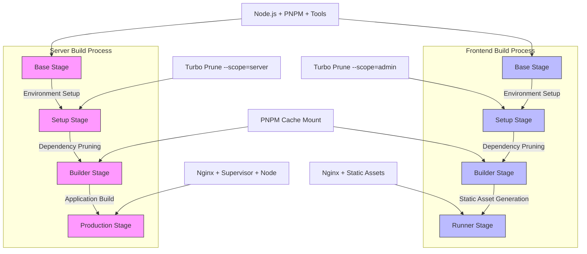
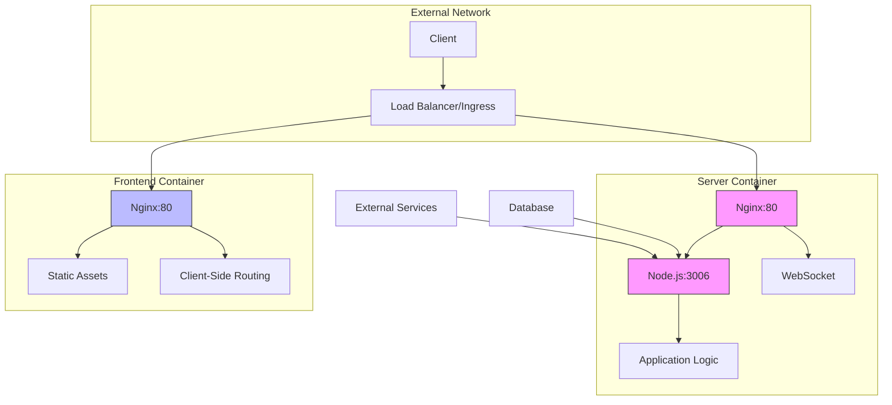
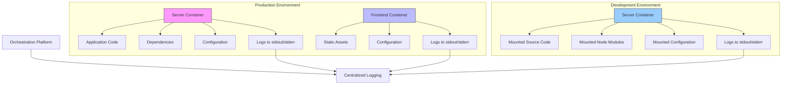
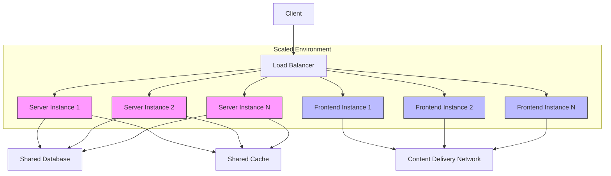
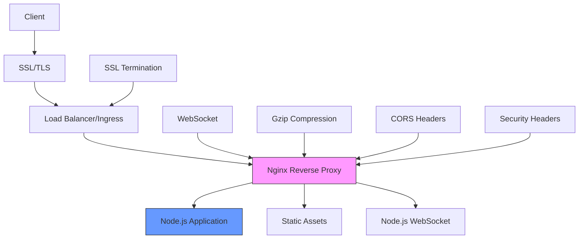

# Deployment Topology

<cite>
**Referenced Files in This Document**   
- [Dockerfile.server](file://devops/Dockerfile.server)
- [Dockerfile.admin](file://devops/Dockerfile.admin)
- [nginx.server.config](file://devops/nginx.server.config)
- [nginx.admin.config](file://devops/nginx.admin.config)
- [supervisord.conf](file://devops/supervisord.conf)
- [main.ts](file://apps/server/src/main.ts)
- [app.config.ts](file://apps/server/src/shared/config/app.config.ts)
- [aws.config.ts](file://apps/server/src/shared/config/aws.config.ts)
- [smtp.config.ts](file://apps/server/src/shared/config/smtp.config.ts)
- [config.type.ts](file://apps/server/src/shared/config/config.type.ts)
- [package.json](file://apps/server/package.json)
- [Jenkinsfile.server](file://devops/Jenkinsfile.server)
- [Jenkinsfile.admin](file://devops/Jenkinsfile.admin)
- [.turborc](file://.turborc)
- [.dockerignore](file://.dockerignore)
</cite>

## Table of Contents
1. [Introduction](#introduction)
2. [Project Structure](#project-structure)
3. [Containerization Strategy](#containerization-strategy)
4. [Docker Configuration for NestJS Server](#docker-configuration-for-nestjs-server)
5. [Multi-Stage Build Process](#multi-stage-build-process)
6. [Port Exposure and Network Configuration](#port-exposure-and-network-configuration)
7. [Environment Variable Management](#environment-variable-management)
8. [Volume Mounting Strategy](#volume-mounting-strategy)
9. [Service Orchestration and Startup Order](#service-orchestration-and-startup-order)
10. [Environment-Specific Configuration](#environment-specific-configuration)
11. [Scalability Considerations](#scalability-considerations)
12. [Frontend-Backend Integration](#frontend-backend-integration)
13. [Reverse Proxy and SSL Termination](#reverse-proxy-and-ssl-termination)
14. [Conclusion](#conclusion)

## Introduction

The prj-core deployment topology utilizes Docker containerization to provide a consistent, scalable, and maintainable environment for the application across development, staging, and production environments. The architecture consists of multiple services including a NestJS backend server, frontend applications, and supporting infrastructure components. This document details the Docker-based deployment strategy, focusing on the containerization approach, build processes, network configuration, and orchestration mechanisms that enable efficient deployment and operation of the application.

The deployment topology leverages multi-stage Docker builds to optimize image size and build efficiency, using Alpine Linux as the base operating system for minimal footprint. The architecture employs a monorepo structure managed by Turbo, which enables efficient dependency management and incremental builds. The server application is containerized with a sophisticated multi-stage build process that optimizes dependency installation and application compilation, while the frontend applications are built as static assets served through Nginx containers.

**Section sources**
- [Dockerfile.server](file://devops/Dockerfile.server#L1-L110)
- [Dockerfile.admin](file://devops/Dockerfile.admin#L1-L89)

## Project Structure

The prj-core repository follows a monorepo architecture with a well-defined structure that separates different application components and shared resources. The project is organized into two main directories: `apps` and `packages`. The `apps` directory contains the primary applications including the NestJS server, admin frontend, mobile application, and Storybook components. The `packages` directory houses shared libraries and utilities that can be consumed across multiple applications.

The server application is implemented using NestJS, a progressive Node.js framework that provides a robust architecture for building efficient and scalable server-side applications. The frontend applications are built using modern JavaScript frameworks and tools, with the admin interface utilizing React-based technologies. Shared functionality is extracted into reusable packages such as `shared-api-client`, `shared-frontend`, `shared-schema`, and `shared-utils`, promoting code reuse and consistency across the codebase.

This structure enables independent development and deployment of different components while maintaining shared standards and reducing duplication. The use of a monorepo facilitates coordinated changes across multiple components and simplifies dependency management through tools like Turbo and PNPM workspaces.



**Diagram sources**
- [Dockerfile.server](file://devops/Dockerfile.server#L1-L110)
- [Dockerfile.admin](file://devops/Dockerfile.admin#L1-L89)
- [nginx.server.config](file://devops/nginx.server.config#L1-L74)
- [nginx.admin.config](file://devops/nginx.admin.config#L1-L16)

**Section sources**
- [Dockerfile.server](file://devops/Dockerfile.server#L1-L110)
- [Dockerfile.admin](file://devops/Dockerfile.admin#L1-L89)

## Containerization Strategy

The prj-core deployment topology implements a sophisticated containerization strategy that optimizes both build efficiency and runtime performance. The architecture employs separate Dockerfiles for different components, with specialized build processes tailored to the specific requirements of each application. The server application uses a multi-stage build process with three distinct stages: base, builder, and production, while the frontend applications follow a similar pattern optimized for static asset generation.

The containerization strategy leverages Alpine Linux as the base operating system for all containers, providing a minimal footprint and improved security posture. The base images include essential system dependencies such as libc6-compat for Node.js native module compatibility, along with development tools like PNPM, Nest CLI, and Turbo. This approach ensures that all containers have a consistent foundation while minimizing image size and attack surface.

For the server application, the containerization strategy includes the installation of Nginx and Supervisor to enable reverse proxy functionality and process management within a single container. This allows the server to handle both API requests through the NestJS application and static asset serving through Nginx, while Supervisor ensures both processes run reliably. The frontend applications, in contrast, are containerized as static assets served by Nginx, following a more traditional web server pattern.

The strategy also incorporates build optimization techniques such as layer caching, dependency pruning, and selective file copying to minimize build times and image sizes. By using Turbo's `prune` command with the `--scope` parameter, the build process extracts only the dependencies required for a specific application, significantly reducing the amount of data that needs to be processed during container creation.



**Diagram sources**
- [Dockerfile.server](file://devops/Dockerfile.server#L1-L110)
- [Dockerfile.admin](file://devops/Dockerfile.admin#L1-L89)

**Section sources**
- [Dockerfile.server](file://devops/Dockerfile.server#L1-L110)
- [Dockerfile.admin](file://devops/Dockerfile.admin#L1-L89)

## Docker Configuration for NestJS Server

The Docker configuration for the NestJS server application is defined in the `Dockerfile.server` file and implements a comprehensive multi-stage build process optimized for production deployment. The configuration begins with a base stage that establishes the fundamental environment, including Node.js 22 on Alpine Linux, PNPM package manager, and essential system dependencies. This base image serves as the foundation for all subsequent build stages, ensuring consistency across the build process.

The server configuration includes the installation of additional tools such as the Nest CLI and Turbo, which are required for building and managing the monorepo application. The base stage also configures PNPM to use a global store, enabling efficient caching of dependencies across builds. System dependencies like libc6-compat, nginx, and supervisor are installed to support the application's runtime requirements, with the apk cache being cleaned to minimize image size.

A key aspect of the server configuration is the use of Turbo's `prune` command in the setup stage, which analyzes the monorepo structure and extracts only the files and dependencies necessary for the server application. This optimization significantly reduces the amount of data that needs to be processed during the build, improving build times and reducing the attack surface of the final image. The configuration also includes proper .dockerignore settings to exclude unnecessary files like node_modules, dist directories, and Git history from being copied into the build context.

The production stage of the server configuration combines the built application with Nginx and Supervisor to create a robust runtime environment. Nginx serves as a reverse proxy, handling incoming HTTP requests and forwarding them to the Node.js application, while Supervisor manages the lifecycle of both the Nginx and Node.js processes, ensuring high availability and automatic restart on failure.

**Section sources**
- [Dockerfile.server](file://devops/Dockerfile.server#L1-L110)
- [.dockerignore](file://.dockerignore#L1-L11)

## Multi-Stage Build Process

The multi-stage build process for the prj-core applications is a sophisticated mechanism designed to optimize both build efficiency and final image size. The process consists of multiple stages, each with a specific purpose, allowing for the separation of build-time dependencies from runtime requirements. This approach results in smaller, more secure production images while maintaining fast build times through effective caching.

For the server application, the build process comprises four distinct stages: base, setup, builder, and production. The base stage establishes the fundamental environment with Node.js, PNPM, and system dependencies. The setup stage uses Turbo's `prune` command to analyze the monorepo and extract only the files and dependencies required for the server application, creating an optimized project structure. The builder stage installs dependencies and compiles the application, leveraging PNPM's cache mount feature to dramatically improve build performance across iterations. Finally, the production stage combines the built application with Nginx and Supervisor in a minimal runtime environment.

The frontend application follows a similar multi-stage pattern but with a different final stage optimized for static asset serving. After the base and setup stages, the builder stage compiles the React application into static HTML, CSS, and JavaScript files. The runner stage then uses an Nginx base image to serve these static assets, resulting in a lightweight container optimized for high-performance web serving.

A key optimization in the build process is the use of PNPM's cache mount feature, which allows dependency installations to be cached between builds. This significantly reduces build times, especially in CI/CD environments where builds are performed frequently. The process also leverages layer caching, where each Docker build stage is cached independently, enabling incremental builds when only specific parts of the application change.



**Diagram sources**
- [Dockerfile.server](file://devops/Dockerfile.server#L1-L110)
- [Dockerfile.admin](file://devops/Dockerfile.admin#L1-L89)

**Section sources**
- [Dockerfile.server](file://devops/Dockerfile.server#L1-L110)
- [Dockerfile.admin](file://devops/Dockerfile.admin#L1-L89)

## Port Exposure and Network Configuration

The port exposure and network configuration in the prj-core deployment topology is designed to provide secure and efficient communication between services and external clients. The server container exposes two ports: port 80 for HTTP traffic handled by Nginx and port 3006 for direct access to the Node.js application. This dual-port configuration enables Nginx to act as a reverse proxy, handling incoming requests on port 80 and forwarding them to the Node.js application on port 3006, while also allowing direct access to the application for specific use cases.

The network configuration is implemented through Nginx configuration files that define upstream servers, server blocks, and location directives. The `nginx.server.config` file defines an upstream block named "backend" that points to the Node.js application running on localhost:3006. This configuration enables Nginx to proxy requests to the application while providing additional features such as SSL termination, request logging, and security headers.

For the frontend application, the network configuration is simpler, with Nginx listening on port 80 and serving static assets from the `/usr/share/nginx/html` directory. The configuration includes a try_files directive that enables client-side routing by serving the index.html file for any request that doesn't match a static asset, allowing the React application to handle routing.

The deployment topology also includes configuration for WebSocket support, with appropriate headers set in the Nginx configuration to enable the Upgrade mechanism required for WebSocket connections. This allows the application to support real-time features such as live updates and notifications.

In a production environment, this network configuration would typically be combined with a load balancer or ingress controller that distributes traffic across multiple instances of the server and frontend containers, providing high availability and scalability.



**Diagram sources**
- [nginx.server.config](file://devops/nginx.server.config#L1-L74)
- [nginx.admin.config](file://devops/nginx.admin.config#L1-L16)
- [Dockerfile.server](file://devops/Dockerfile.server#L102-L103)

**Section sources**
- [nginx.server.config](file://devops/nginx.server.config#L1-L74)
- [nginx.admin.config](file://devops/nginx.admin.config#L1-L16)
- [Dockerfile.server](file://devops/Dockerfile.server#L102-L103)

## Environment Variable Management

The environment variable management system in the prj-core application is a comprehensive configuration framework that enables flexible and secure management of application settings across different environments. The system is built on NestJS's ConfigModule, which provides a structured approach to configuration management through dedicated configuration files for different aspects of the application.

Configuration is organized into multiple files, each responsible for a specific domain: `app.config.ts` for general application settings, `auth.config.ts` for authentication-related configuration, `aws.config.ts` for AWS service integration, `smtp.config.ts` for email services, and `database.config.ts` for database connectivity. Each configuration file uses NestJS's `registerAs` function to create a configuration token that can be injected into other parts of the application.

A key feature of the environment variable management system is the use of validation to ensure configuration integrity. Each configuration file defines a validator class with decorators from the class-validator package that specify the expected type and constraints for each environment variable. For example, the `app.config.ts` file validates that `NODE_ENV` is one of the allowed values (development, production, test), `APP_PORT` is a number, and `FRONTEND_DOMAIN` and `BACKEND_DOMAIN` are valid URLs.

The validation process is implemented through the `ValidationUtil.validateConfig` method, which uses class-transformer and class-validator to validate the environment variables against the defined schema. This ensures that the application fails fast if required configuration is missing or invalid, rather than failing at runtime with obscure errors.

Environment variables are accessed through NestJS's dependency injection system, allowing components to inject the appropriate configuration token and access settings in a type-safe manner. This approach provides excellent IDE support and compile-time checking, reducing the risk of configuration-related bugs.

The system also supports environment-specific configuration through the use of different .env files, with the `.turborc` file specifying that environment files matching the pattern `**/.env.*local` should be treated as global dependencies, ensuring they are properly handled during the build process.

**Section sources**
- [app.config.ts](file://apps/server/src/shared/config/app.config.ts#L1-L56)
- [aws.config.ts](file://apps/server/src/shared/config/aws.config.ts#L1-L29)
- [smtp.config.ts](file://apps/server/src/shared/config/smtp.config.ts#L1-L33)
- [config.type.ts](file://apps/server/src/shared/config/config.type.ts#L1-L108)
- [.turborc](file://.turborc#L1-L4)

## Volume Mounting Strategy

The volume mounting strategy in the prj-core deployment topology is designed to support both development and production use cases while maintaining security and performance. In the production environment, the strategy relies primarily on copying files into the container image during the build process, minimizing the need for runtime volume mounts and improving security by reducing the attack surface.

For the server application, the build process copies the entire application code, dependencies, and configuration files into the container image. This approach ensures that the application is self-contained and can run without external dependencies. The only runtime volume mounts are for log files, with Nginx logs directed to standard output and error streams through the supervisor configuration, enabling centralized logging in container orchestration platforms.

The frontend application follows a similar pattern, with all static assets copied into the Nginx container during the build process. This eliminates the need for runtime volume mounts and ensures that the application can serve content efficiently from memory.

In development environments, the volume mounting strategy would typically be different, with source code mounted directly into the container to enable hot reloading and rapid development cycles. However, this is not reflected in the production Dockerfiles, which are optimized for immutable infrastructure principles.

The supervisor configuration in the server container directs both Nginx and Node.js logs to standard output and error streams, which is a best practice for containerized applications. This allows container orchestration platforms like Kubernetes or Docker Compose to collect and manage logs centrally, without the need for additional log shipping agents.



**Diagram sources**
- [Dockerfile.server](file://devops/Dockerfile.server#L1-L110)
- [Dockerfile.admin](file://devops/Dockerfile.admin#L1-L89)
- [supervisord.conf](file://devops/supervisord.conf#L1-L22)

**Section sources**
- [Dockerfile.server](file://devops/Dockerfile.server#L1-L110)
- [Dockerfile.admin](file://devops/Dockerfile.admin#L1-L89)
- [supervisord.conf](file://devops/supervisord.conf#L1-L22)

## Service Orchestration and Startup Order

The service orchestration and startup order in the prj-core deployment topology is managed through Supervisor, a process control system that ensures reliable operation of multiple processes within a single container. This approach is particularly important for the server container, which runs both the Nginx reverse proxy and the Node.js application, requiring coordinated startup and monitoring.

Supervisor is configured through the `supervisord.conf` file, which defines two programs: nginx and node-app. The nginx program runs the Nginx web server with the "daemon off" option, ensuring it runs in the foreground and can be properly monitored by Supervisor. The node-app program runs the compiled NestJS application from the dist directory.

The configuration specifies that both programs should autostart and autorestart, ensuring high availability. If either process crashes, Supervisor will automatically restart it, minimizing downtime. The nodaemon=true setting in the supervisord section ensures that Supervisor itself runs in the foreground, which is required for proper operation in a Docker container.

The startup order is implicitly managed by Supervisor, which starts both programs according to their configuration. Since Nginx acts as a reverse proxy to the Node.js application, it's important that the Node.js application is ready to accept connections before Nginx starts routing traffic to it. This is typically handled by the application's health checks and readiness probes in a container orchestration platform.

In a production environment with multiple containers, the orchestration would typically be handled by a container orchestration platform like Kubernetes or Docker Compose, which can manage the startup order of different containers and ensure that dependent services are available before starting applications that rely on them.

The current configuration represents a single-container approach where multiple processes are managed within one container, which can simplify deployment but may not follow the single-responsibility principle of container design. In a more distributed architecture, Nginx might run in a separate container dedicated to reverse proxy and load balancing functions.

```mermaid
graph TD
A[Container Start] --> B[Supervisord]
B --> C[Start nginx]
B --> D[Start node-app]
C --> E[nginx -g "daemon off;"]
D --> F[node /app/apps/server/dist/main]
E --> G[Nginx Running]
F --> H[Node.js Application Running]
G --> I[Proxy Requests to Node.js]
H --> J[Handle API Requests]
K[Process Failure] --> B
B --> L[Restart Failed Process]
style B fill:#f9f,stroke:#333
style C fill:#f96,stroke:#333
style D fill:#69f,stroke:#333
```

**Diagram sources**
- [supervisord.conf](file://devops/supervisord.conf#L1-L22)
- [Dockerfile.server](file://devops/Dockerfile.server#L108-L109)

**Section sources**
- [supervisord.conf](file://devops/supervisord.conf#L1-L22)
- [Dockerfile.server](file://devops/Dockerfile.server#L108-L109)

## Environment-Specific Configuration

The environment-specific configuration system in the prj-core application enables seamless deployment across development, staging, and production environments through a combination of environment variables, configuration files, and build-time optimizations. The system is designed to provide the right configuration for each environment while maintaining security and consistency.

Configuration is primarily managed through environment variables, with different values provided for each environment. The `.turborc` file specifies that environment files matching the pattern `**/.env.*local` should be treated as global dependencies, ensuring they are properly handled during the build process. This allows developers to have local environment overrides without committing sensitive information to version control.

The application code includes specific environment detection through the `isStaging()` and `isProduction()` functions in the shared-utils package, which determine the current environment based on the environment name. These functions enable conditional logic in the application, such as different logging levels, feature flags, or service endpoints based on the deployment environment.

The Jenkins pipeline configuration files (`Jenkinsfile.server` and `Jenkinsfile.admin`) demonstrate how the build process is adapted for different environments. The pipeline builds Docker images with environment-specific tags, pushing them to different container registries based on the target environment (e.g., harbor.cocdev.co.kr/stg-server for staging). This ensures that images built for different environments are properly versioned and stored in appropriate registries.

The Nginx configuration files also reflect environment-specific considerations. The server configuration includes settings appropriate for production use, such as Gzip compression to reduce bandwidth usage and improve performance. The configuration is designed to be consistent across environments, with differences primarily in the upstream server addresses and SSL settings.

The multi-stage build process itself is environment-agnostic, producing consistent images regardless of the build environment. However, the build arguments (such as PNPM_VERSION) can be overridden to accommodate different requirements in different environments.

**Section sources**
- [Environment.ts](file://packages/toolkit/src/Environment.ts#L51-L89)
- [Jenkinsfile.server](file://devops/Jenkinsfile.server#L45-L111)
- [Jenkinsfile.admin](file://devops/Jenkinsfile.admin#L45-L111)
- [.turborc](file://.turborc#L1-L4)

## Scalability Considerations

The prj-core deployment topology incorporates several scalability considerations that enable the application to handle increased load and support horizontal scaling. The architecture is designed to be stateless, allowing multiple instances of the server and frontend containers to run simultaneously behind a load balancer, distributing traffic across the available instances.

The server application's configuration supports horizontal scaling through its use of externalized state management. While the current configuration does not explicitly show database connection pooling settings, the presence of a `maxConnections` parameter in the database configuration type suggests that connection management is considered in the design. In a scaled environment, the application would connect to a shared database instance or cluster, with connection pooling to efficiently manage database resources.

The use of Nginx as a reverse proxy in the server container provides several scalability benefits. Nginx is highly efficient at handling concurrent connections and can serve as a buffer between clients and the Node.js application, protecting the application from sudden traffic spikes. The configuration includes Gzip compression, which reduces bandwidth usage and improves response times, particularly for clients with slower connections.

For the frontend application, the static asset serving model is inherently scalable, as Nginx can efficiently serve cached content with minimal resource usage. Multiple instances of the frontend container can be deployed behind a load balancer, with requests distributed across the instances based on load or other criteria.

The monorepo structure and Turbo build system also contribute to scalability by enabling efficient development and deployment workflows. Turbo's incremental builds ensure that only changed components are rebuilt, reducing build times as the application grows in complexity. This allows development teams to scale without experiencing diminishing returns in build and deployment efficiency.

In a production environment, the application would likely be deployed using a container orchestration platform like Kubernetes, which could automatically scale the number of server and frontend instances based on metrics such as CPU usage, memory consumption, or request rate.



**Diagram sources**
- [Dockerfile.server](file://devops/Dockerfile.server#L1-L110)
- [Dockerfile.admin](file://devops/Dockerfile.admin#L1-L89)
- [nginx.server.config](file://devops/nginx.server.config#L1-L74)

**Section sources**
- [Dockerfile.server](file://devops/Dockerfile.server#L1-L110)
- [Dockerfile.admin](file://devops/Dockerfile.admin#L1-L89)
- [nginx.server.config](file://devops/nginx.server.config#L1-L74)

## Frontend-Backend Integration

The frontend-backend integration in the prj-core application is designed to provide a seamless user experience while maintaining clear separation of concerns between the client and server components. The integration is facilitated through a well-defined API contract, with the backend exposing RESTful endpoints that the frontend consumes to retrieve and manipulate data.

The server application is configured to handle CORS (Cross-Origin Resource Sharing) requests, with the `main.ts` file enabling CORS for all origins during development. This allows the frontend application, which may be served from a different domain or port during development, to make requests to the backend API without being blocked by browser security policies. In production, this would typically be restricted to specific domains for security reasons.

The integration is further enhanced by the use of Swagger for API documentation, which is automatically generated from the NestJS application and available at the `/api` endpoint. This provides a comprehensive reference for frontend developers, detailing all available endpoints, request/response formats, and authentication requirements.

The server's configuration includes support for cookie-based JWT authentication, with the Swagger configuration specifically documenting the use of the access token cookie. This enables the frontend to maintain user sessions securely, with authentication tokens automatically included in requests by the browser.

The Nginx reverse proxy configuration in the server container facilitates integration by providing a single entry point for API requests, handling SSL termination, and providing additional security features such as request filtering and rate limiting. This allows the frontend to communicate with the backend through standard HTTP/HTTPS protocols without needing to be aware of the underlying infrastructure.

The shared-api-client package in the monorepo provides TypeScript types and API clients that can be used by both frontend and backend components, ensuring consistency in data structures and reducing the risk of integration errors.

**Section sources**
- [main.ts](file://apps/server/src/main.ts#L1-L88)
- [nginx.server.config](file://devops/nginx.server.config#L1-L74)
- [shared-api-client](file://packages/shared-api-client)

## Reverse Proxy and SSL Termination

The reverse proxy and SSL termination strategy in the prj-core deployment topology is implemented through Nginx, which serves as a gateway between external clients and the internal application services. The Nginx configuration provides several critical functions including request routing, SSL termination, security hardening, and performance optimization.

In the server container, Nginx is configured as a reverse proxy that listens on port 80 and forwards requests to the Node.js application running on port 3006. The configuration includes an upstream block that defines the backend server, allowing Nginx to proxy requests to the application while providing additional features such as load balancing (if multiple backend instances were configured) and health checking.

The reverse proxy configuration includes several security and performance headers that enhance the application's security posture and user experience. These include headers for CORS, which are particularly important for the frontend-backend integration, and headers that control caching behavior. The configuration also includes support for WebSocket connections, with appropriate headers set to enable the Upgrade mechanism required for WebSocket communication.

For SSL termination, while the current configuration does not explicitly show SSL settings, the presence of the `X-Forwarded-Proto` header suggests that the application is designed to work behind a TLS-terminating proxy. In a production environment, SSL termination would typically occur at the load balancer or ingress controller level, with Nginx receiving requests over HTTP and the TLS encryption being handled externally.

The configuration includes Gzip compression to reduce bandwidth usage and improve page load times, particularly for text-based content such as HTML, CSS, JavaScript, and JSON responses. This optimization is particularly important for mobile users or those with limited bandwidth.

In a production environment, this reverse proxy configuration would typically be enhanced with additional security features such as rate limiting, request filtering, and protection against common web vulnerabilities.



**Diagram sources**
- [nginx.server.config](file://devops/nginx.server.config#L1-L74)
- [Dockerfile.server](file://devops/Dockerfile.server#L93-L94)

**Section sources**
- [nginx.server.config](file://devops/nginx.server.config#L1-L74)
- [Dockerfile.server](file://devops/Dockerfile.server#L93-L94)

## Conclusion

The prj-core deployment topology demonstrates a sophisticated and well-considered approach to containerized application deployment, leveraging Docker and related technologies to create a scalable, maintainable, and efficient infrastructure. The architecture combines the benefits of a monorepo structure with specialized Docker configurations for different components, enabling both development agility and production reliability.

The multi-stage build process, optimized through Turbo's dependency pruning and PNPM's caching mechanisms, ensures fast and efficient builds while producing minimal runtime images. The use of Alpine Linux as the base operating system contributes to security and performance, while the inclusion of Nginx and Supervisor in the server container provides robust reverse proxy and process management capabilities.

The configuration system, built on NestJS's ConfigModule and enhanced with comprehensive validation, ensures that the application can adapt to different environments while maintaining configuration integrity. The environment-specific considerations, evident in the Jenkins pipeline configurations and environment detection utilities, demonstrate a mature approach to deployment across development, staging, and production environments.

While the current implementation focuses on single-container deployments for the server and frontend applications, the architecture is designed to support horizontal scaling and integration with container orchestration platforms. The stateless nature of the applications, combined with externalized data storage and caching, enables the system to scale to meet increasing demand.

The frontend-backend integration is well-designed, with clear API contracts, proper CORS handling, and shared types that promote consistency across the codebase. The reverse proxy configuration provides a solid foundation for security, performance, and reliability, with room for enhancement in production environments.

Overall, the prj-core deployment topology represents a modern, production-ready approach to application deployment that balances developer productivity with operational excellence, providing a strong foundation for the application's continued growth and evolution.

**Section sources**
- [Dockerfile.server](file://devops/Dockerfile.server#L1-L110)
- [Dockerfile.admin](file://devops/Dockerfile.admin#L1-L89)
- [nginx.server.config](file://devops/nginx.server.config#L1-L74)
- [nginx.admin.config](file://devops/nginx.admin.config#L1-L16)
- [supervisord.conf](file://devops/supervisord.conf#L1-L22)