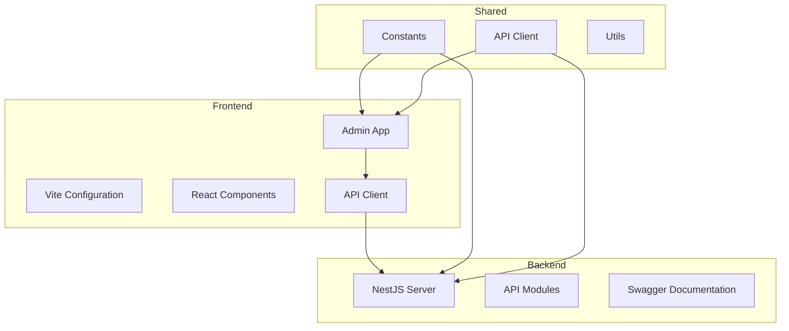
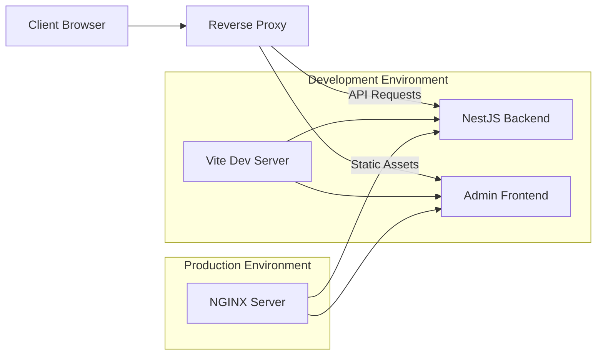
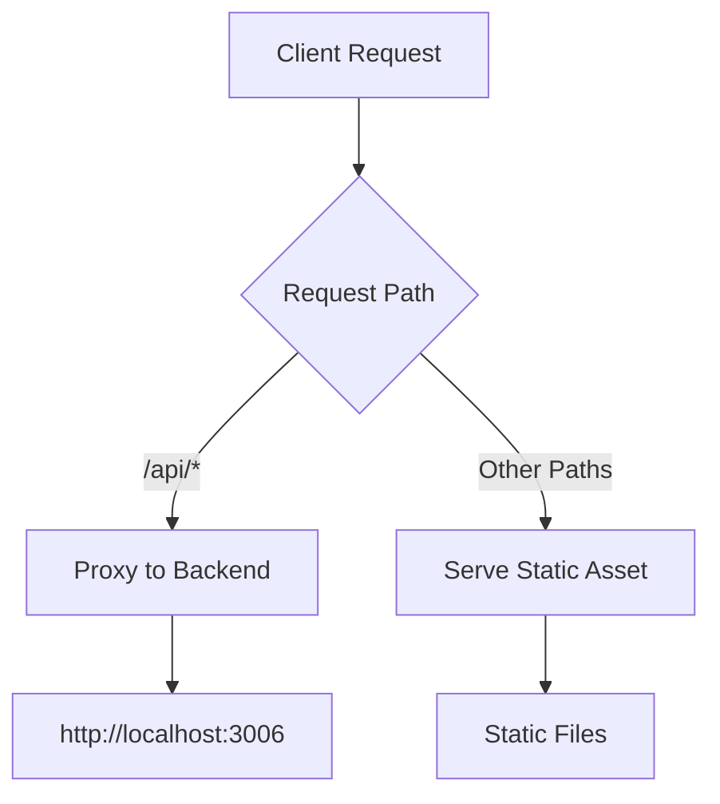
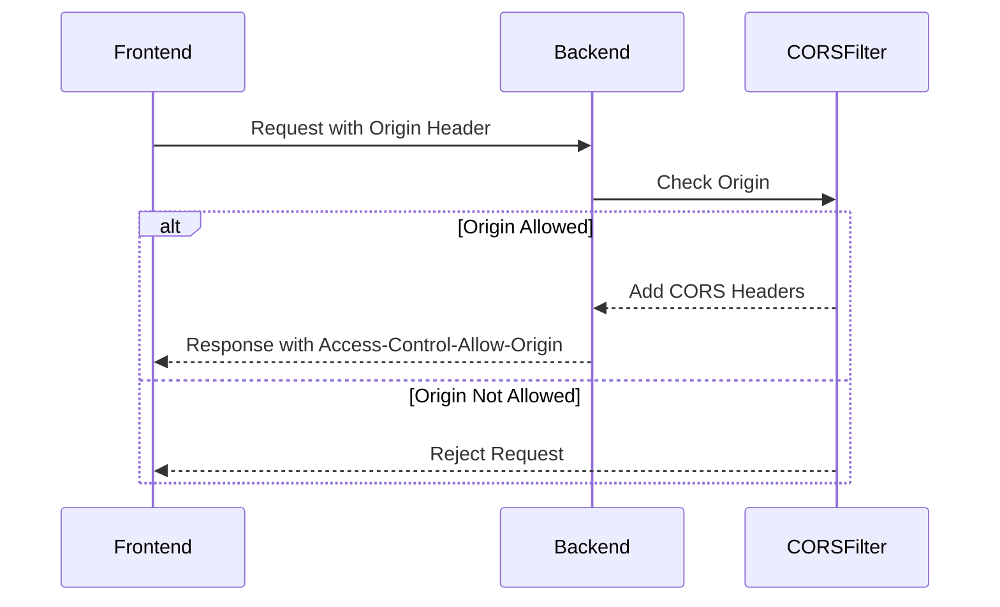
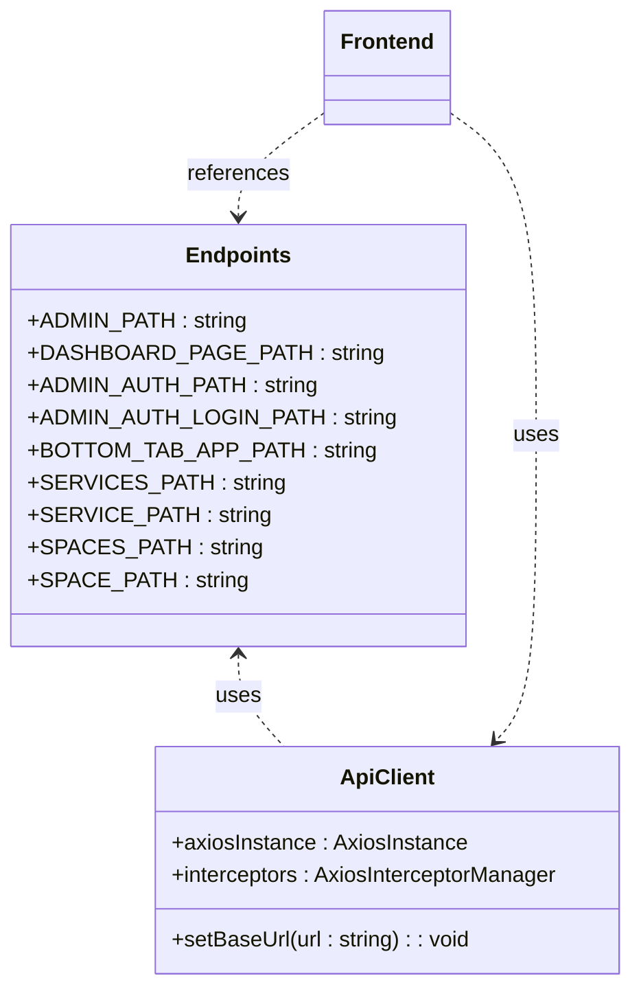
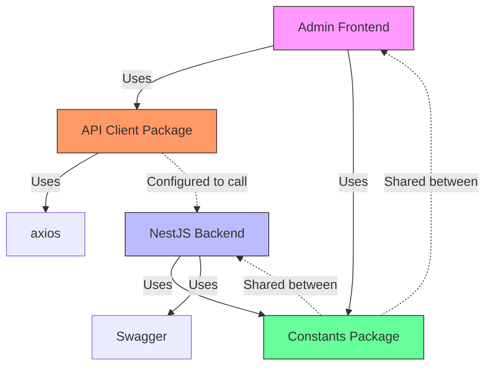

# Frontend-Backend Integration in Deployment

<cite>
**Referenced Files in This Document**   
- [vite.config.ts](file://apps/admin/vite.config.ts)
- [main.ts](file://apps/server/src/main.ts)
- [setNestApp.ts](file://apps/server/src/setNestApp.ts)
- [app.module.ts](file://apps/server/src/module/app.module.ts)
- [endpoints.ts](file://packages/constants/src/endpoints.ts)
- [index.html](file://apps/admin/index.html)
- [main.tsx](file://apps/admin/src/main.tsx)
- [App.tsx](file://apps/admin/src/App.tsx)
- [customAxios.ts](file://packages/api-client/src/libs/customAxios.ts)
- [apis.ts](file://packages/api-client/src/apis.ts)
</cite>

## Table of Contents
1. [Introduction](#introduction)
2. [Project Structure](#project-structure)
3. [Core Components](#core-components)
4. [Architecture Overview](#architecture-overview)
5. [Detailed Component Analysis](#detailed-component-analysis)
6. [Dependency Analysis](#dependency-analysis)
7. [Performance Considerations](#performance-considerations)
8. [Troubleshooting Guide](#troubleshooting-guide)
9. [Conclusion](#conclusion)

## Introduction
This document provides comprehensive architectural documentation for the frontend-backend integration within the prj-core deployment topology. It explains how the admin frontend application is served and integrated with the backend API server through reverse proxy configuration, detailing the routing mechanism, CORS configuration, SSL handling, asset serving strategy, and environment-specific configuration management.

## Project Structure

The prj-core repository follows a monorepo architecture with multiple applications and shared packages. The key components for frontend-backend integration are the admin frontend application and the NestJS backend server.

**Diagram sources**
- [apps/admin](file://apps/admin)
- [apps/server](file://apps/server)
- [packages/constants](file://packages/constants)
- [packages/api-client](file://packages/api-client)

**Section sources**
- [project_structure](file://project_structure)

## Core Components

The frontend-backend integration in prj-core relies on several core components that work together to provide a seamless user experience. The admin frontend is built with React and Vite, while the backend is implemented using NestJS. The integration is facilitated through a proxy configuration in the Vite development server and proper CORS settings in the NestJS application.

The system uses shared packages for constants and API clients, ensuring consistency across both frontend and backend. The deployment topology includes proper routing of API requests to the backend server while serving static frontend assets directly.

**Section sources**
- [vite.config.ts](file://apps/admin/vite.config.ts)
- [main.ts](file://apps/server/src/main.ts)
- [endpoints.ts](file://packages/constants/src/endpoints.ts)

## Architecture Overview

The frontend-backend integration architecture in prj-core follows a modern web application pattern with clear separation of concerns. During development, the Vite development server acts as a reverse proxy, forwarding API requests to the NestJS backend while serving static assets. In production, this proxy functionality is typically handled by a dedicated reverse proxy server like NGINX.

**Diagram sources**
- [vite.config.ts](file://apps/admin/vite.config.ts)
- [main.ts](file://apps/server/src/main.ts)

## Detailed Component Analysis

### Frontend Proxy Configuration
The admin frontend application uses Vite as its build tool and development server. The Vite configuration includes a proxy setup that routes API requests to the backend server during development.

**Diagram sources**
- [vite.config.ts](file://apps/admin/vite.config.ts#L20-L26)

**Section sources**
- [vite.config.ts](file://apps/admin/vite.config.ts#L1-L36)

### Backend CORS Configuration
The NestJS backend server is configured to handle Cross-Origin Resource Sharing (CORS) properly, allowing the frontend application to make requests from different origins.

**Diagram sources**
- [main.ts](file://apps/server/src/main.ts#L37-L42)

**Section sources**
- [main.ts](file://apps/server/src/main.ts#L1-L88)
- [setNestApp.ts](file://apps/server/src/setNestApp.ts#L1-L49)

### API Endpoint Management
The system uses a centralized approach to manage API endpoints and routes, with shared constants that are used by both frontend and backend components.

**Diagram sources**
- [endpoints.ts](file://packages/constants/src/endpoints.ts#L1-L103)
- [customAxios.ts](file://packages/api-client/src/libs/customAxios.ts)

**Section sources**
- [endpoints.ts](file://packages/constants/src/endpoints.ts#L1-L103)
- [customAxios.ts](file://packages/api-client/src/libs/customAxios.ts)

## Dependency Analysis

The frontend-backend integration in prj-core has a well-defined dependency structure that ensures proper separation of concerns while maintaining necessary connections between components.

**Diagram sources**
- [package.json](file://apps/admin/package.json)
- [package.json](file://apps/server/package.json)
- [endpoints.ts](file://packages/constants/src/endpoints.ts)

**Section sources**
- [apps/admin/package.json](file://apps/admin/package.json#L1-L69)
- [apps/server/package.json](file://apps/server/package.json)

## Performance Considerations

The frontend-backend integration in prj-core incorporates several performance optimizations to ensure a responsive user experience.

### Asset Serving Strategy
The admin frontend application is configured to optimize asset delivery through proper caching headers and efficient bundling. During development, Vite's esbuild-powered bundler provides fast hot module replacement. In production, the build process generates optimized static assets with proper cache-busting filenames.

### API Request Optimization
The API client implementation includes request/response interceptors for logging, error handling, and authentication token management. The use of axios interceptors allows for centralized handling of common concerns across all API requests.

### Environment-Specific Configuration
The system handles environment-specific configurations through a combination of build-time and runtime mechanisms. The Vite development server uses a proxy configuration that can be adjusted for different environments, while the API client can be configured with different base URLs depending on the deployment target.

**Section sources**
- [vite.config.ts](file://apps/admin/vite.config.ts#L31-L33)
- [customAxios.ts](file://packages/api-client/src/libs/customAxios.ts)
- [main.ts](file://apps/server/src/main.ts#L77-L78)

## Troubleshooting Guide

When troubleshooting frontend-backend integration issues in the prj-core deployment, consider the following common scenarios:

1. **CORS Errors**: Verify that the NestJS backend has the correct CORS configuration. The `origin: true` setting in development allows requests from any origin, but in production, specific origins should be specified.

2. **Proxy Configuration Issues**: Check the Vite proxy configuration in `vite.config.ts` to ensure API requests are being forwarded to the correct backend address and port.

3. **API Endpoint Mismatches**: Ensure that the API client is using the correct base URL and that endpoint paths match between frontend and backend.

4. **Authentication Problems**: Verify that JWT tokens are being properly set in HttpOnly cookies and that the frontend is correctly handling authentication state.

5. **Environment Configuration**: Confirm that environment variables are properly set for both frontend and backend applications, particularly for API base URLs and port numbers.

**Section sources**
- [main.ts](file://apps/server/src/main.ts#L37-L42)
- [vite.config.ts](file://apps/admin/vite.config.ts#L20-L26)
- [setNestApp.ts](file://apps/server/src/setNestApp.ts#L38-L38)

## Conclusion

The frontend-backend integration in the prj-core deployment topology is well-architected with clear separation of concerns and robust configuration for both development and production environments. The use of Vite's proxy feature during development simplifies the development workflow by allowing the frontend to make API requests to the backend without CORS issues. The NestJS backend is properly configured to handle CORS in production, and shared packages ensure consistency in endpoint definitions across the application.

The architecture supports efficient asset serving, proper API routing, and environment-specific configuration management. With the current setup, the admin frontend application can seamlessly integrate with the backend API server, providing a cohesive user experience while maintaining the benefits of a decoupled frontend-backend architecture.