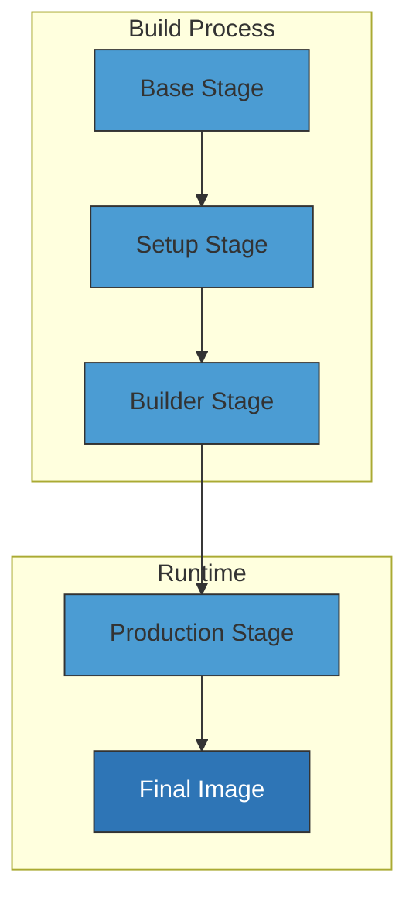
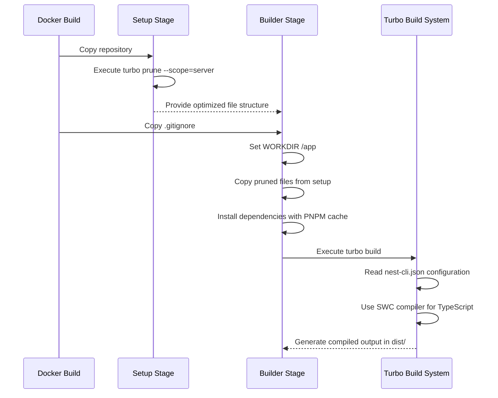
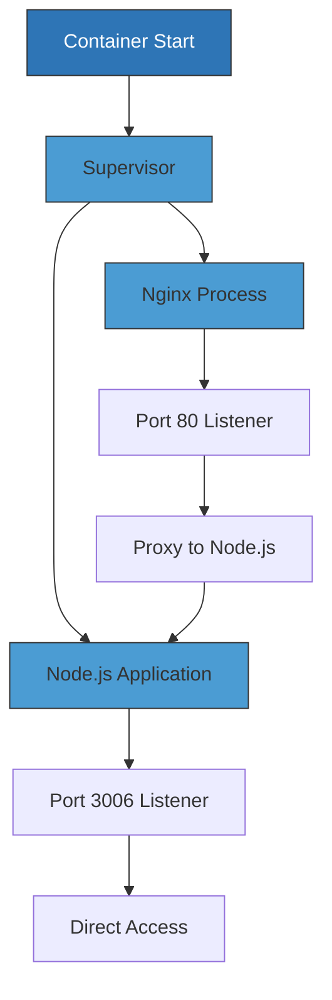
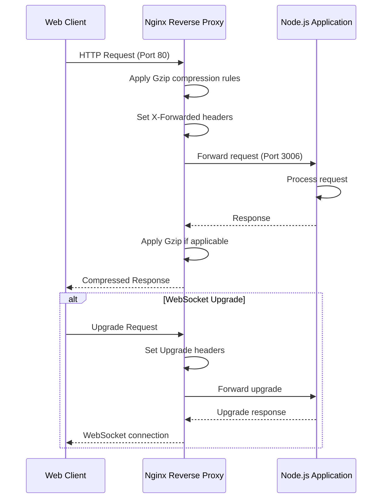

# Server Application Containerization

<cite>
**Referenced Files in This Document**   
- [Dockerfile.server](file://devops/Dockerfile.server)
- [nginx.server.config](file://devops/nginx.server.config)
- [supervisord.conf](file://devops/supervisord.conf)
- [main.ts](file://apps/server/src/main.ts)
- [package.json](file://apps/server/package.json)
- [nest-cli.json](file://apps/server/nest-cli.json)
- [turbo.json](file://turbo.json)
- [.dockerignore](file://.dockerignore)
</cite>

## Table of Contents
1. [Introduction](#introduction)
2. [Multi-Stage Build Strategy](#multi-stage-build-strategy)
3. [Base Stage Configuration](#base-stage-configuration)
4. [Setup Stage Optimization](#setup-stage-optimization)
5. [Builder Stage Implementation](#builder-stage-implementation)
6. [Production Stage Configuration](#production-stage-configuration)
7. [Dependency Management](#dependency-management)
8. [Artifact Copying and Layering](#artifact-copying-and-layering)
9. [Network Configuration](#network-configuration)
10. [Working Directory and File Structure](#working-directory-and-file-structure)
11. [Entrypoint and Process Management](#entrypoint-and-process-management)
12. [Environment Variable Handling](#environment-variable-handling)
13. [Security Considerations](#security-considerations)
14. [Image Size Optimization](#image-size-optimization)
15. [Nginx Reverse Proxy Configuration](#nginx-reverse-proxy-configuration)
16. [Supervisor Process Management](#supervisor-process-management)
17. [Integration with NestJS Application Lifecycle](#integration-with-nestjs-application-lifecycle)
18. [Deployment Environment Support](#deployment-environment-support)
19. [Best Practices for Dockerfile Maintenance](#best-practices-for-dockerfile-maintenance)
20. [Troubleshooting Common Issues](#troubleshooting-common-issues)

## Introduction
This document provides comprehensive documentation for the NestJS server application containerization process as defined in the Dockerfile.server configuration. The containerization strategy employs a multi-stage build approach to optimize image size, build efficiency, and runtime performance. The process is designed for a monorepo architecture using Turbo for build orchestration, PNPM for package management, and Alpine Linux for minimal base images. The final container runs both an Nginx reverse proxy and the Node.js application simultaneously using Supervisor, providing a robust production-ready deployment solution.

**Section sources**
- [Dockerfile.server](file://devops/Dockerfile.server#L1-L110)

## Multi-Stage Build Strategy
The Docker build process implements a sophisticated multi-stage strategy with four distinct phases: base, setup, builder, and production. This approach separates concerns across different build stages, enabling optimization at each step while maintaining security and efficiency. The base stage establishes the fundamental environment with Node.js, PNPM, and system dependencies. The setup stage analyzes the monorepo structure to create a minimal dependency tree specific to the server application. The builder stage compiles the application using Turbo, leveraging caching for improved build times. Finally, the production stage creates a lean runtime environment by copying only necessary artifacts from previous stages, resulting in a significantly smaller final image size.

**Diagram sources**
- [Dockerfile.server](file://devops/Dockerfile.server#L1-L110)

**Section sources**
- [Dockerfile.server](file://devops/Dockerfile.server#L1-L110)

## Base Stage Configuration
The base stage establishes the foundational environment for the container build process using Node.js 22 on Alpine Linux. This lightweight Linux distribution minimizes image size while providing essential system libraries. The stage configures PNPM as the package manager through Node.js Corepack, ensuring consistent dependency resolution across environments. Key system dependencies including libc6-compat (for Node.js native module compatibility), nginx (as a reverse proxy), and supervisor (for process management) are installed via Alpine's package manager. Global tools such as Nest CLI and Turbo are installed to support the build process. The working directory is set to /app, establishing the application root for subsequent stages.

**Section sources**
- [Dockerfile.server](file://devops/Dockerfile.server#L1-L32)

## Setup Stage Optimization
The setup stage implements a critical optimization technique specific to monorepo architectures by using Turbo's prune functionality to create a minimal, application-specific dependency tree. This stage copies the entire repository and executes "turbo prune --scope=server --docker" to analyze the dependency graph and extract only the files and packages required for the server application. This process eliminates unnecessary files from other applications in the monorepo (such as admin and mobile), significantly reducing the context that needs to be processed in subsequent stages. The result is a focused project structure that contains only the server application and its direct dependencies, improving build performance and reducing potential security vulnerabilities.

**Section sources**
- [Dockerfile.server](file://devops/Dockerfile.server#L34-L45)
- [turbo.json](file://turbo.json#L54-L67)

## Builder Stage Implementation
The builder stage executes the application compilation process in an optimized environment. It inherits the base configuration and incorporates the pruned project structure from the setup stage. Dependency installation is performed with PNPM, leveraging a cache mount (--mount=type=cache) to dramatically improve build times by reusing previously downloaded packages. The build process is orchestrated by Turbo, which reads the turbo.json configuration to determine the build order and dependencies. The "turbo build" command compiles the NestJS application according to the configuration in nest-cli.json, which specifies SWC (Speedy Web Compiler) as the compilation tool for improved build performance. The resulting compiled JavaScript files are placed in the dist directory as specified in the TypeScript configuration.

**Diagram sources**
- [Dockerfile.server](file://devops/Dockerfile.server#L47-L77)
- [nest-cli.json](file://apps/server/nest-cli.json#L1-L16)
- [turbo.json](file://turbo.json#L54-L67)

**Section sources**
- [Dockerfile.server](file://devops/Dockerfile.server#L47-L77)
- [nest-cli.json](file://apps/server/nest-cli.json#L1-L16)
- [turbo.json](file://turbo.json#L54-L67)

## Production Stage Configuration
The production stage creates the final runtime environment using Node.js 24 on Alpine Linux, which may represent a newer LTS version for improved performance and security. This stage copies the compiled application artifacts from the builder stage, including the entire /app directory structure. The Nginx web server configuration (nginx.server.config) is copied to override the default settings, establishing the reverse proxy rules for routing requests to the Node.js application. The Supervisor configuration (supervisord.conf) is also copied to manage the lifecycle of both Nginx and the Node.js application. Directory permissions are properly configured for Nginx log and cache directories, and the container exposes ports 80 (HTTP) and 3006 (direct Node.js access) to allow external connectivity.

**Section sources**
- [Dockerfile.server](file://devops/Dockerfile.server#L78-L109)
- [nginx.server.config](file://devops/nginx.server.config#L1-L74)
- [supervisord.conf](file://devops/supervisord.conf#L1-L23)

## Dependency Management
The containerization process implements a sophisticated dependency management strategy optimized for monorepo architectures. PNPM is used as the package manager due to its efficient disk usage and deterministic installations. The build process leverages Turbo's dependency graph analysis to ensure that only necessary packages are included in the build context. The .dockerignore file excludes node_modules directories across the entire repository, forcing a clean installation within the container and preventing potential compatibility issues. The turbo.json configuration explicitly defines inter-package dependencies, ensuring that shared libraries like @cocrepo/schema and @cocrepo/toolkit are built before the server application. This approach guarantees consistent dependency resolution and enables parallel builds where possible.

**Section sources**
- [Dockerfile.server](file://devops/Dockerfile.server#L62-L66)
- [.dockerignore](file://.dockerignore#L1-L11)
- [turbo.json](file://turbo.json#L54-L67)
- [package.json](file://apps/server/package.json#L23-L70)

## Artifact Copying and Layering
The multi-stage build process employs strategic artifact copying to optimize image size and build efficiency. Each stage only copies the necessary files from previous stages, creating distinct layers that can be cached independently. The builder stage copies the pruned project structure from the setup stage using "COPY --from=setup /app/out/full/ ./", which transfers only the minimal required files. The production stage then copies the entire compiled application from the builder stage with "COPY --from=builder /app/ .", including the dist directory with compiled JavaScript, package.json, and other runtime assets. This layering approach ensures that changes to source code only invalidate the builder stage cache, while dependency changes affect both builder and setup stages, optimizing rebuild times in CI/CD pipelines.

**Section sources**
- [Dockerfile.server](file://devops/Dockerfile.server#L58-L60)
- [Dockerfile.server](file://devops/Dockerfile.server#L89-L90)

## Network Configuration
The container exposes two network ports to facilitate different access patterns: port 80 for HTTP traffic through the Nginx reverse proxy, and port 3006 for direct access to the Node.js application. The EXPOSE instruction in the Dockerfile declares these ports to the Docker daemon, enabling proper port mapping when the container is run. The Nginx configuration routes incoming requests on port 80 to the Node.js application running on port 3006 via the upstream backend definition. This dual-port strategy allows for health checks directly to the Node.js process while serving regular traffic through the reverse proxy, which provides additional features like compression, header management, and WebSocket support.

**Section sources**
- [Dockerfile.server](file://devops/Dockerfile.server#L102-L103)
- [nginx.server.config](file://devops/nginx.server.config#L22-L26)

## Working Directory and File Structure
The container establishes /app as the working directory throughout the build and runtime stages, maintaining consistency across the process. During the build phase, this directory contains the complete source code, dependencies, and build tools. In the production stage, it houses the compiled application artifacts, configuration files, and runtime dependencies. The final container structure includes the compiled JavaScript files in /app/dist, the package.json manifest, and various configuration files for Nginx and Supervisor. The Nginx server uses its default document root at /usr/share/nginx/html, though this is not utilized since all requests are proxied to the Node.js application. Log files are written to /var/log/nginx with proper permissions configured for the nginx user.

**Section sources**
- [Dockerfile.server](file://devops/Dockerfile.server#L31-L32)
- [Dockerfile.server](file://devops/Dockerfile.server#L86-L87)
- [nginx.server.config](file://devops/nginx.server.config#L1-L74)

## Entrypoint and Process Management
The container uses Supervisor as a process manager to run multiple processes simultaneously within a single container. The CMD instruction executes Supervisor with the configuration file at /etc/supervisor/supervisord.conf, which defines two managed programs: nginx and the Node.js application. Supervisor starts both processes in the foreground, ensuring that the container remains running as long as either process is active. The nginx process runs with the "daemon off" directive to prevent it from forking into the background, allowing Supervisor to monitor its lifecycle. The Node.js application executes the compiled main.js file from the dist directory. This approach provides robust process management with automatic restart capabilities and consolidated logging to stdout and stderr.

**Diagram sources**
- [Dockerfile.server](file://devops/Dockerfile.server#L108-L109)
- [supervisord.conf](file://devops/supervisord.conf#L1-L23)

**Section sources**
- [Dockerfile.server](file://devops/Dockerfile.server#L108-L109)
- [supervisord.conf](file://devops/supervisord.conf#L1-L23)

## Environment Variable Handling
The containerization process supports environment variable configuration for flexible deployment across different environments. The turbo.json configuration specifies NODE_ENV as a global environment variable, allowing the build process to adapt based on the execution context. The application itself can access environment variables through the @nestjs/config module, with configuration files in the shared/config directory. During runtime, environment variables can be injected through Docker's -e flag or Docker Compose configuration, enabling customization of database connections, API keys, and feature flags without rebuilding the image. The main.ts file demonstrates environment awareness by logging the current NODE_ENV value and checking DOCKER_ENV to determine containerized execution.

**Section sources**
- [turbo.json](file://turbo.json#L11-L12)
- [main.ts](file://apps/server/src/main.ts#L82-L83)
- [shared/config](file://apps/server/src/shared/config)

## Security Considerations
The containerization process incorporates several security best practices to minimize attack surface and protect the application. The use of Alpine Linux as the base image reduces the number of potential vulnerabilities by including only essential packages. The build process runs as a non-root user by default, though the production stage requires root privileges to manage Nginx and Supervisor. The .dockerignore file prevents sensitive files like .git and markdown documentation from being included in the image. The multi-stage build ensures that build tools, source maps, and development dependencies are not present in the final image. Network exposure is limited to only the necessary ports, and the reverse proxy configuration includes proper header management to prevent information leakage.

**Section sources**
- [Dockerfile.server](file://devops/Dockerfile.server#L5-L110)
- [.dockerignore](file://.dockerignore#L1-L11)
- [nginx.server.config](file://devops/nginx.server.config#L44-L51)

## Image Size Optimization
The containerization strategy employs multiple techniques to minimize the final image size. The multi-stage build process ensures that only runtime dependencies and compiled artifacts are included in the final image, excluding build tools, source code, and development dependencies. Alpine Linux provides a minimal base image of approximately 5MB compared to hundreds of MB for standard distributions. The use of PNPM with a shared store reduces duplicate package installations. The .dockerignore file prevents unnecessary files from being copied into the build context. The apk package manager uses --no-cache to avoid storing package indexes, and the cache is explicitly cleaned after installation. These optimizations result in a production image that is significantly smaller than a traditional Node.js Docker image.

**Section sources**
- [Dockerfile.server](file://devops/Dockerfile.server#L23-L24)
- [Dockerfile.server](file://devops/Dockerfile.server#L84-L85)
- [.dockerignore](file://.dockerignore#L1-L11)

## Nginx Reverse Proxy Configuration
The Nginx configuration serves as a reverse proxy between external clients and the NestJS application, providing several benefits including performance optimization, security, and protocol support. The configuration defines an upstream server pointing to the Node.js application on port 3006, allowing Nginx to forward requests. Key features include Gzip compression to reduce response sizes, proper header forwarding to preserve client information (X-Real-IP, X-Forwarded-For), and WebSocket support through the Upgrade and Connection headers. The worker_connections directive limits concurrent connections to prevent resource exhaustion. This reverse proxy layer acts as a buffer between the internet and the application, absorbing malicious requests and providing an additional security boundary.

**Diagram sources**
- [nginx.server.config](file://devops/nginx.server.config#L1-L74)

**Section sources**
- [nginx.server.config](file://devops/nginx.server.config#L1-L74)

## Supervisor Process Management
Supervisor provides robust process management for the container, ensuring high availability and proper logging. The configuration file defines two programs: nginx and the Node.js application, both configured to start automatically and restart on failure. The nodaemon=true directive ensures Supervisor runs in the foreground, which is required for Docker containers to remain active. Logging is configured to redirect both stdout and stderr to the Docker logging system, enabling centralized log collection and monitoring. The user=root setting allows Supervisor to manage system services like Nginx that require elevated privileges. This process management approach provides resilience against crashes and ensures that both the web server and application server are always available.

**Section sources**
- [supervisord.conf](file://devops/supervisord.conf#L1-L23)

## Integration with NestJS Application Lifecycle
The containerization process is tightly integrated with the NestJS application lifecycle through several mechanisms. The main.ts file contains environment-specific logging that indicates when the application is running in a Docker container. The build process respects the nest-cli.json configuration, which specifies SWC as the compiler for faster builds. The application's configuration system (@nestjs/config) allows for environment variable injection at runtime, enabling different behaviors across development, staging, and production environments. The health check endpoint can be accessed through the Nginx proxy, allowing orchestration systems to monitor application status. The graceful shutdown process is preserved through Supervisor's signal handling, ensuring proper cleanup of database connections and other resources.

**Section sources**
- [main.ts](file://apps/server/src/main.ts#L1-L88)
- [nest-cli.json](file://apps/server/nest-cli.json#L1-L16)
- [Dockerfile.server](file://devops/Dockerfile.server#L108-L109)

## Deployment Environment Support
The containerization strategy supports multiple deployment environments through configuration rather than code changes. The Jenkinsfile.server demonstrates CI/CD integration, building images with version tags and pushing them to a private Harbor registry. Environment-specific behavior is controlled through environment variables, allowing the same image to adapt to different contexts. The use of Node.js 24 in the production stage while building with Node.js 22 suggests support for different runtime requirements across environments. The multi-stage build can be adapted for different deployment targets by modifying the final stage, such as using a different base image or configuration for development versus production.

**Section sources**
- [Jenkinsfile.server](file://devops/Jenkinsfile.server#L1-L111)
- [Dockerfile.server](file://devops/Dockerfile.server#L81-L82)

## Best Practices for Dockerfile Maintenance
Maintaining the Dockerfile requires adherence to several best practices to ensure reliability and security. The multi-stage build should be preserved to continue benefiting from image size optimization. The PNPM version should be periodically updated to incorporate security patches and performance improvements. The Alpine Linux base image should be regularly updated to address vulnerabilities. The .dockerignore file should be reviewed when new file types are added to the project. The turbo.json configuration should be kept in sync with any changes to the monorepo structure or build requirements. Comments in the Dockerfile should be maintained to explain the purpose of each instruction, especially complex ones like the Turbo prune command.

**Section sources**
- [Dockerfile.server](file://devops/Dockerfile.server#L1-L110)
- [.dockerignore](file://.dockerignore#L1-L11)
- [turbo.json](file://turbo.json#L1-L167)

## Troubleshooting Common Issues
Common containerization issues can be addressed through systematic troubleshooting. Build failures related to Turbo pruning may indicate incorrect scope configuration or missing dependencies in turbo.json. Performance issues during dependency installation can often be resolved by verifying the PNPM cache mount is working correctly. Runtime errors related to missing permissions typically require adjusting the chown commands for Nginx directories. Connection issues between Nginx and the Node.js application should be verified by checking the upstream server configuration and ensuring the Node.js process is listening on the expected port. Logging issues can be diagnosed by examining the Supervisor configuration and verifying that both stdout and stderr are properly redirected. Image size bloat should be investigated by analyzing the Docker layers to identify unexpectedly large components.

**Section sources**
- [Dockerfile.server](file://devops/Dockerfile.server#L1-L110)
- [supervisord.conf](file://devops/supervisord.conf#L1-L23)
- [nginx.server.config](file://devops/nginx.server.config#L1-L74)