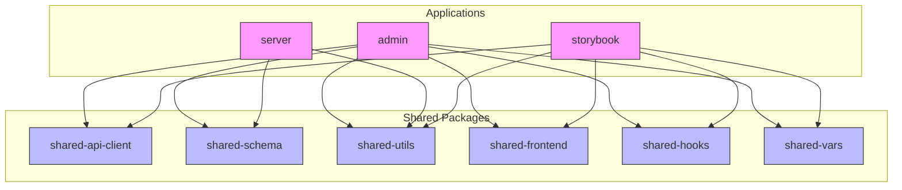
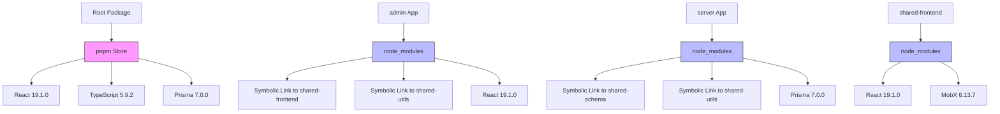
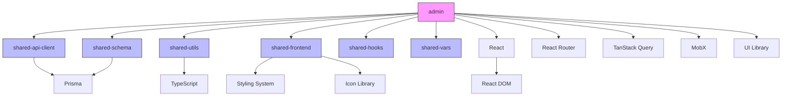
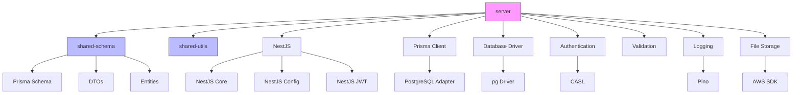
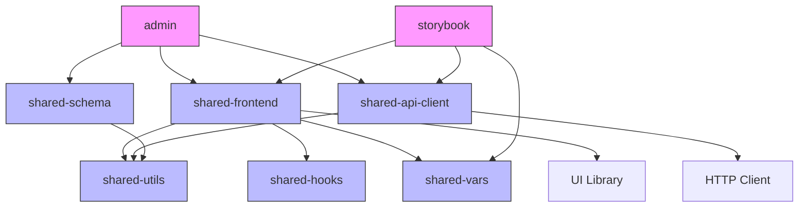

# Dependency Management Strategy

<cite>
**Referenced Files in This Document**   
- [package.json](file://package.json)
- [pnpm-workspace.yaml](file://pnpm-workspace.yaml)
- [turbo.json](file://turbo.json)
- [apps/admin/package.json](file://apps/admin/package.json)
- [apps/server/package.json](file://apps/server/package.json)
- [apps/storybook/package.json](file://apps/storybook/package.json)
- [packages/shared-api-client/package.json](file://packages/shared-api-client/package.json)
- [packages/shared-schema/package.json](file://packages/shared-schema/package.json)
- [packages/shared-utils/package.json](file://packages/shared-utils/package.json)
- [packages/shared-frontend/package.json](file://packages/shared-frontend/package.json)
</cite>

## Table of Contents
1. [Introduction](#introduction)
2. [Project Structure and Monorepo Organization](#project-structure-and-monorepo-organization)
3. [Dependency Organization: Internal vs External](#dependency-organization-internal-vs-external)
4. [Versioning Strategy for Shared Packages](#versioning-strategy-for-shared-packages)
5. [pnpm Dependency Hoisting and Workspace Resolution](#pnpm-dependency-hoisting-and-workspace-resolution)
6. [Dependency Update Process](#dependency-update-process)
7. [Dependency Graph Examples](#dependency-graph-examples)
8. [Breaking Change Management](#breaking-change-management)
9. [Guidelines for Adding New Dependencies](#guidelines-for-adding-new-dependencies)
10. [Conclusion](#conclusion)

## Introduction

The prj-core monorepo employs a sophisticated dependency management strategy that enables efficient code sharing, consistent versioning, and streamlined development workflows across multiple applications and shared packages. This document details the architectural approach to dependency management, focusing on the separation between internal shared packages and external third-party dependencies, versioning practices, and the role of pnpm and Turbo in orchestrating the monorepo ecosystem.

The monorepo follows a clear organizational pattern with applications in the `apps/` directory and reusable packages in the `packages/` directory. This structure enables code reuse while maintaining clear boundaries between concerns. The dependency strategy is designed to maximize consistency, minimize duplication, and ensure predictable builds across the entire codebase.

**Section sources**
- [package.json](file://package.json)
- [pnpm-workspace.yaml](file://pnpm-workspace.yaml)

## Project Structure and Monorepo Organization

The prj-core monorepo is organized into two primary directories: `apps/` for application code and `packages/` for shared libraries. This separation of concerns allows teams to develop applications independently while leveraging common functionality from shared packages.

The `apps/` directory contains three main applications:
- `admin`: A React-based administrative interface
- `server`: A NestJS backend API server
- `storybook`: A component documentation and testing environment

The `packages/` directory contains several shared packages that provide reusable functionality across applications:
- `shared-api-client`: Generated API client code from OpenAPI specifications
- `shared-schema`: Prisma schema, DTOs, and entity definitions
- `shared-utils`: Common utility functions and helpers
- `shared-frontend`: Shared React components and UI elements
- `shared-hooks`: Custom React hooks
- `shared-vars`: Shared configuration variables and endpoints

This structure enables a clean separation between application-specific code and shared functionality, promoting code reuse and consistency across the organization.



**Diagram sources**
- [package.json](file://package.json)
- [pnpm-workspace.yaml](file://pnpm-workspace.yaml)

**Section sources**
- [package.json](file://package.json)
- [pnpm-workspace.yaml](file://pnpm-workspace.yaml)

## Dependency Organization: Internal vs External

The dependency management strategy in prj-core clearly distinguishes between internal workspace dependencies and external third-party dependencies. This separation is enforced through pnpm's workspace protocol and catalog system, ensuring consistent versions across the monorepo.

Internal dependencies are referenced using the `workspace:` protocol in package.json files, which creates a direct link to the package within the monorepo. For example, the server application references the shared-schema package with `"@cocrepo/schema": "workspace:^0.3.0"`. This syntax indicates that the package should be resolved from the local workspace with a caret version range, allowing for patch and minor updates within the specified major version.

External dependencies are managed through pnpm's catalog system, which is defined in the `pnpm-workspace.yaml` file. The catalog provides a centralized location for defining versions of third-party packages, ensuring consistency across all applications and packages. Dependencies reference the catalog using the `catalog:` keyword, such as `"react": "catalog:"` in the admin application's package.json.

This approach provides several benefits:
- **Consistency**: All projects use the same version of third-party dependencies
- **Centralized management**: Version updates only need to be made in one location
- **Reduced duplication**: pnpm hoists common dependencies to the root node_modules
- **Improved security**: Easier to audit and update dependencies across the entire codebase

The catalog system also enables teams to quickly identify which versions of libraries are approved for use, reducing the risk of version fragmentation and compatibility issues.

**Section sources**
- [pnpm-workspace.yaml](file://pnpm-workspace.yaml)
- [apps/admin/package.json](file://apps/admin/package.json)
- [apps/server/package.json](file://apps/server/package.json)
- [packages/shared-api-client/package.json](file://packages/shared-api-client/package.json)

## Versioning Strategy for Shared Packages

The prj-core monorepo implements a comprehensive versioning strategy for shared packages that follows semantic versioning principles while accommodating the unique requirements of a monorepo environment.

Shared packages in the `packages/` directory follow semantic versioning (SemVer) with the format `MAJOR.MINOR.PATCH`. The versioning strategy is designed to communicate the nature and impact of changes:

- **MAJOR version**: Incremented for breaking changes that are not backward compatible
- **MINOR version**: Incremented for new features that are backward compatible
- **PATCH version**: Incremented for bug fixes and minor improvements that are backward compatible

The monorepo provides npm scripts to facilitate version management:
- `version:patch`: Bumps the patch version for all packages
- `version:minor`: Bumps the minor version for all packages  
- `version:major`: Bumps the major version for all packages

These scripts use `pnpm -r --filter './packages/**' exec npm version` to apply version changes across all packages in the workspace. The `--no-git-tag-version` flag prevents automatic Git tagging, allowing teams to manage version control separately.

For individual package releases, the `release:pkg` script automates the process of versioning, building, publishing, and updating dependent applications. This ensures that the entire release workflow is consistent and repeatable.

The versioning strategy also incorporates workspace protocols in package.json files, such as `workspace:^0.3.0`, which allows for automatic resolution of the latest compatible version within the workspace. This enables applications to receive non-breaking updates to shared packages without requiring manual version updates.

When publishing packages to a registry, the `publish:packages` script handles the publication of all packages in the workspace. The use of `--no-git-checks` allows publishing without requiring a clean Git state, providing flexibility in deployment workflows.

**Section sources**
- [package.json](file://package.json)
- [packages/shared-schema/package.json](file://packages/shared-schema/package.json)
- [packages/shared-utils/package.json](file://packages/shared-utils/package.json)
- [packages/shared-frontend/package.json](file://packages/shared-frontend/package.json)

## pnpm Dependency Hoisting and Workspace Resolution

The prj-core monorepo leverages pnpm as its package manager, which implements a unique approach to dependency hoisting and resolution that differs significantly from traditional npm or yarn workflows.

pnpm uses a content-addressable store to store packages, which eliminates duplication and ensures that identical dependencies are only stored once on disk. This approach significantly reduces disk usage and improves installation performance, especially in monorepo environments with many shared dependencies.

Dependency hoisting in pnpm follows a strict algorithm that prioritizes flattening dependencies while maintaining compatibility. Dependencies are hoisted to the highest level possible in the dependency tree, typically to the root node_modules directory. This reduces duplication and ensures that all packages use the same version of shared dependencies when possible.

The workspace protocol (`workspace:`) is a key feature that enables efficient development in the monorepo. When a package references another package in the workspace using `workspace:^1.3.0`, pnpm creates a symbolic link to the local package rather than installing it from a registry. This enables real-time development where changes to a shared package are immediately available to dependent applications without requiring a separate publish step.

The `pnpm-workspace.yaml` file defines the workspace structure with the following configuration:
```yaml
packages:
  - apps/*
  - packages/*
```

This configuration tells pnpm to include all packages in the apps and packages directories as part of the workspace, enabling cross-package linking and dependency resolution.

pnpm also supports the `catalog:` feature, which provides a centralized way to manage versions of third-party dependencies. This ensures that all packages and applications use consistent versions of external libraries, reducing the risk of version conflicts and making it easier to update dependencies across the entire codebase.

The monorepo also configures special handling for certain dependencies through the `ignoredBuiltDependencies` and `onlyBuiltDependencies` settings in pnpm-workspace.yaml. For example, `msw` is listed in `ignoredBuiltDependencies`, indicating that it should not be included in the built output, while `@nestjs/core` and `nestjs-pino` are listed in `onlyBuiltDependencies`, indicating they should be treated specially during the build process.



**Diagram sources**
- [pnpm-workspace.yaml](file://pnpm-workspace.yaml)
- [package.json](file://package.json)

**Section sources**
- [pnpm-workspace.yaml](file://pnpm-workspace.yaml)
- [package.json](file://package.json)

## Dependency Update Process

The prj-core monorepo implements a structured process for updating dependencies that ensures consistency, minimizes breaking changes, and maintains the integrity of the codebase.

For shared packages, the update process follows these steps:
1. Make changes to the shared package
2. Update the version using the appropriate npm script (`version:patch`, `version:minor`, or `version:major`)
3. Build the package
4. Publish the package to the registry
5. Update dependent applications to use the new version

The monorepo provides automated scripts to streamline this process. The `release:patch`, `release:minor`, and `release:major` scripts combine version bumping, building, publishing, and application updates into a single command. For example:
```bash
pnpm release:patch
```
This command executes:
```bash
pnpm version:patch && pnpm build:packages && pnpm publish:packages && pnpm update:app-deps
```

The `update:app-deps` script (referencing `scripts/update-app-deps.js`) is responsible for updating the versions of shared packages in application package.json files. This ensures that all applications are using compatible versions of shared dependencies after a release.

For third-party dependencies managed through the catalog system, updates are made by modifying the version in the `pnpm-workspace.yaml` file. For example, to update React from 19.1.0 to 19.2.0:
```yaml
catalog:
  react: 19.2.0
```

After updating the catalog, running `pnpm install` will update all references to the new version across the monorepo.

The monorepo also supports dry-run publishing with the `publish:dry` script, which simulates the publishing process without actually publishing to the registry. This allows teams to verify that the release process will work correctly before executing it in production.

For individual package updates, the `publish:pkg` and `publish:pkg:dry` scripts provide targeted publishing capabilities. These scripts are useful when only a specific package needs to be updated, rather than all packages in the workspace.

The Turbo build system integrates with this update process by caching build results and only rebuilding packages that have changed or whose dependencies have changed. The `turbo.json` configuration defines the dependency graph between packages, ensuring that packages are built in the correct order. For example, the server application depends on both `@cocrepo/schema` and `@cocrepo/toolkit`, so these packages are built before the server.

**Section sources**
- [package.json](file://package.json)
- [turbo.json](file://turbo.json)
- [scripts/update-app-deps.js](file://scripts/update-app-deps.js)

## Dependency Graph Examples

The prj-core monorepo contains several distinct dependency graphs that illustrate the relationships between applications and shared packages. These graphs demonstrate the flow of dependencies and the reuse of shared functionality across the codebase.

### Admin Application Dependency Graph

The admin application has a rich set of dependencies that enable its functionality as a comprehensive administrative interface:



**Diagram sources**
- [apps/admin/package.json](file://apps/admin/package.json)
- [packages/shared-api-client/package.json](file://packages/shared-api-client/package.json)
- [packages/shared-schema/package.json](file://packages/shared-schema/package.json)

### Server Application Dependency Graph

The server application has a different dependency profile, focused on backend functionality and database operations:



**Diagram sources**
- [apps/server/package.json](file://apps/server/package.json)
- [packages/shared-schema/package.json](file://packages/shared-schema/package.json)
- [packages/shared-utils/package.json](file://packages/shared-utils/package.json)

### Shared Package Dependency Hierarchy

The shared packages themselves form a dependency hierarchy, with some packages depending on others:



**Diagram sources**
- [packages/shared-frontend/package.json](file://packages/shared-frontend/package.json)
- [packages/shared-utils/package.json](file://packages/shared-utils/package.json)
- [packages/shared-hooks/package.json](file://packages/shared-hooks/package.json)
- [packages/shared-vars/package.json](file://packages/shared-vars/package.json)
- [apps/admin/package.json](file://apps/admin/package.json)
- [apps/storybook/package.json](file://apps/storybook/package.json)

## Breaking Change Management

The prj-core monorepo implements a comprehensive strategy for managing breaking changes across the codebase, recognizing that such changes can have significant impacts on dependent applications and teams.

### Semantic Versioning and Major Version Bumps

The primary mechanism for signaling breaking changes is through semantic versioning. When a shared package introduces a breaking change, the MAJOR version number is incremented according to SemVer principles. This signals to consumers that the change is not backward compatible and may require code modifications to adopt.

The monorepo provides the `version:major` script to facilitate major version bumps:
```bash
pnpm version:major
```

This command updates the version in all packages to the next major version, creating a clear marker for the breaking change.

### Deprecation Periods

Before introducing breaking changes, the recommended practice is to first deprecate the old functionality while maintaining backward compatibility. This is done by:
1. Marking deprecated functions, properties, or components with appropriate documentation
2. Providing migration guidance in comments and documentation
3. Maintaining the old functionality for a reasonable period
4. Eventually removing the deprecated functionality in a subsequent major version

### Automated Testing and Impact Analysis

The monorepo leverages Turbo to identify the impact of changes on dependent packages and applications. The `turbo.json` configuration defines the dependency graph, allowing Turbo to determine which packages need to be tested when a shared package is modified.

When a breaking change is introduced, the following testing strategy is employed:
1. Run unit tests for the modified package
2. Run integration tests for directly dependent packages
3. Run end-to-end tests for applications that depend on the package
4. Verify bundle sizes and performance characteristics

The `test` and `test:e2e` tasks in `turbo.json` are configured to ensure comprehensive test coverage across the dependency graph.

### Communication and Documentation

Breaking changes are accompanied by clear communication and documentation:
- Update the package's README with migration instructions
- Add release notes detailing the changes and migration steps
- Notify dependent teams through appropriate channels
- Provide examples of how to update code to work with the new version

### Gradual Rollout

For significant breaking changes, a gradual rollout strategy may be employed:
1. Release the new version with feature flags or opt-in functionality
2. Allow teams to migrate at their own pace
3. Monitor for issues and provide support
4. Eventually make the new version the default
5. Remove the old functionality after a sufficient deprecation period

The workspace protocol in pnpm facilitates this gradual rollout by allowing different applications to use different versions of a shared package during the transition period.

**Section sources**
- [package.json](file://package.json)
- [turbo.json](file://turbo.json)
- [packages/shared-schema/package.json](file://packages/shared-schema/package.json)

## Guidelines for Adding New Dependencies

The prj-core monorepo follows strict guidelines for adding new dependencies to ensure consistency, maintainability, and optimal performance across the codebase.

### Internal Dependencies (Shared Packages)

When functionality is needed that could be reused across multiple applications, it should be implemented as a shared package in the `packages/` directory. The process for adding new shared functionality is:

1. **Evaluate reusability**: Determine if the functionality will be used in multiple applications
2. **Choose the appropriate package**: Select an existing shared package or create a new one
3. **Implement the functionality**: Follow the coding standards and patterns of the target package
4. **Add appropriate tests**: Ensure comprehensive test coverage
5. **Document the API**: Provide clear documentation for consumers
6. **Publish the package**: Use the appropriate versioning and publishing workflow

For example, utility functions should be added to `shared-utils`, React components to `shared-frontend`, and custom hooks to `shared-hooks`.

### External Dependencies

When adding third-party dependencies, follow these guidelines:

1. **Check for existing alternatives**: Verify that a similar dependency is not already in use
2. **Prefer catalog dependencies**: Use dependencies that are already in the pnpm catalog when possible
3. **Evaluate bundle impact**: Consider the size and performance implications of the dependency
4. **Assess maintenance status**: Prefer well-maintained, actively developed packages
5. **Check security vulnerabilities**: Use tools to identify known security issues
6. **Document the rationale**: Add comments explaining why the dependency is needed

To add a new third-party dependency to the catalog:
1. Add the dependency and version to `pnpm-workspace.yaml`
2. Reference it in the appropriate package.json files using `catalog:`
3. Run `pnpm install` to update the lockfile

### Dependency Anti-Patterns to Avoid

Certain patterns should be avoided when managing dependencies:

- **Direct dependencies on transitive dependencies**: Always declare direct dependencies explicitly
- **Version pinning without reason**: Avoid pinning to specific versions unless necessary for compatibility
- **Duplicate functionality**: Don't add a new dependency if existing code provides the same functionality
- **Overly broad dependencies**: Prefer focused, single-purpose packages over large libraries with many features
- **Unused dependencies**: Regularly audit and remove dependencies that are no longer needed

### Review and Approval Process

All significant dependency changes should go through a review process:
1. Create a pull request with the dependency changes
2. Include justification for the change
3. Document any migration steps needed
4. Obtain approval from relevant stakeholders
5. Test thoroughly before merging

The monorepo's automated tooling, including Turbo and pnpm, helps enforce these guidelines by providing visibility into dependency relationships and impacts.

**Section sources**
- [pnpm-workspace.yaml](file://pnpm-workspace.yaml)
- [package.json](file://package.json)
- [turbo.json](file://turbo.json)

## Conclusion

The dependency management strategy in the prj-core monorepo represents a sophisticated and well-considered approach to managing code dependencies in a complex multi-application environment. By leveraging pnpm's workspace capabilities, Turbo's build orchestration, and a clear organizational structure, the monorepo achieves a balance between code reuse, maintainability, and development efficiency.

Key strengths of the strategy include:
- **Consistent versioning** through the catalog system and semantic versioning
- **Efficient dependency resolution** via pnpm's hoisting and symbolic linking
- **Clear separation of concerns** between applications and shared packages
- **Automated workflows** for versioning, building, and publishing
- **Comprehensive impact analysis** through Turbo's dependency graph

The strategy effectively addresses the challenges of monorepo development by providing mechanisms for managing breaking changes, ensuring dependency consistency, and facilitating code reuse. The combination of pnpm, Turbo, and well-defined processes creates a robust foundation for sustainable development at scale.

As the monorepo continues to evolve, maintaining adherence to these principles will be essential for preserving the benefits of the current architecture while accommodating new requirements and use cases.